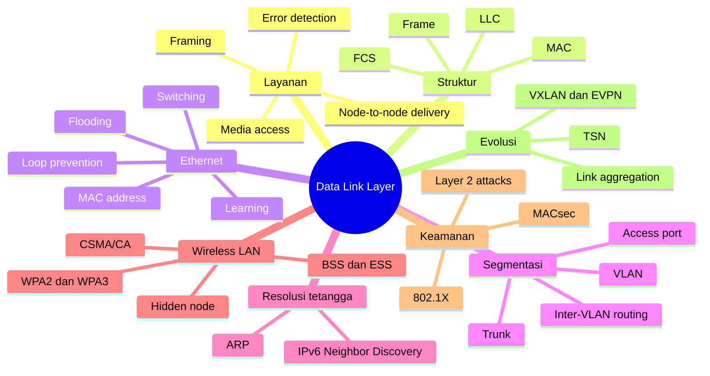
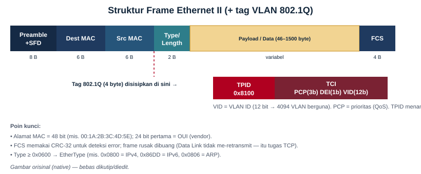
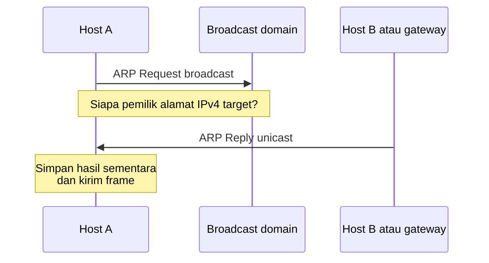

# Bab 4 — Data Link Layer

| Pemetaan | Keterangan |
|---|---|
| **CPMK** | CPMK-1 (memahami konsep dasar model OSI dan TCP/IP serta fungsi setiap lapisan) |
| **Sub-CPMK** | Sub-CPMK-3 (menjelaskan fungsi dan cara kerja Physical Layer dan Data Link Layer) |
| **Kemampuan akhir (RPS Minggu 4)** | Menjelaskan framing, pengalamatan MAC, deteksi kesalahan, switching, ARP, VLAN, dan mekanisme akses media Ethernet serta IEEE 802.11 |
| **Rujukan inti** | Tanenbaum, Feamster, dan Wetherall, *Computer Networks*; Forouzan, *Data Communications and Networking*; Kurose dan Ross, *Computer Networking: A Top-Down Approach*; IEEE 802.1, IEEE 802.3, IEEE 802.11, dan RFC 826 |

---

## Peta Konsep

---

## 4.1 Kedudukan Data Link Layer

Physical Layer membawa bit sebagai sinyal, tetapi tidak menentukan batas pesan, identitas pengirim lokal, atau tindakan ketika beberapa perangkat berbagi media. Data Link Layer memberikan struktur terhadap aliran bit tersebut dengan membentuk **frame** dan menyediakan komunikasi pada satu tautan atau jaringan lokal.

Dalam model OSI, Data Link Layer berada di antara Physical Layer dan Network Layer. Lapisan ini menerima paket dari Network Layer, menambahkan informasi kendali lokal, lalu menyerahkannya kepada Physical Layer untuk dikirim. Pada penerima, Data Link Layer memulihkan frame, memeriksa integritas, menilai alamat tujuan, dan menyerahkan payload kepada protokol lapisan atas yang sesuai.

Data Link Layer sering disebut menyediakan pengiriman **node-to-node** atau **hop-to-hop**. Istilah tersebut perlu dipahami secara tepat. Frame Ethernet biasanya berlaku pada satu domain Layer 2. Jika paket harus melewati router, router menghapus frame masuk, memproses paket Layer 3, dan membuat frame baru untuk tautan berikutnya. Dengan demikian, alamat link tidak lazim dipertahankan dari host asal sampai server Internet.

Tanggung jawab utama Data Link Layer mencakup:

1. **framing**, yaitu menandai awal dan akhir unit transmisi;
2. **pengalamatan lokal**, agar frame dapat diarahkan pada domain link;
3. **identifikasi protokol lapisan atas**, sehingga payload dapat diserahkan dengan benar;
4. **deteksi kesalahan**, misalnya menggunakan cyclic redundancy check;
5. **pengendalian akses media**, khususnya ketika media digunakan bersama;
6. **switching dan bridging**, untuk meneruskan frame di antara segmen LAN;
7. **segmentasi logis**, seperti VLAN;
8. **fungsi kendali link tertentu**, seperti agregasi, autentikasi, dan perlindungan frame.

Tidak semua teknologi menerapkan fungsi tersebut dengan cara identik. Ethernet kabel modern umumnya tidak melakukan retransmisi frame yang rusak pada Layer 2, sedangkan IEEE 802.11 menggunakan acknowledgment dan retransmisi karena media radio lebih rentan terhadap kehilangan. Model menjelaskan kategori fungsi; detail ditentukan standar teknologi.

## 4.2 Sublayer LLC dan MAC

Keluarga IEEE 802 secara konseptual membagi Data Link Layer menjadi **Logical Link Control (LLC)** dan **Media Access Control (MAC)**.

Sublayer LLC memberikan antarmuka yang lebih seragam kepada Network Layer dan secara historis membantu mengidentifikasi protokol lapisan atas serta mengelola kontrol logis tertentu. Dalam Ethernet II yang dominan pada jaringan IP, field EtherType di frame digunakan langsung untuk mengidentifikasi payload, sehingga pembahasan LLC sering tidak tampak pada operasi sehari-hari.

Sublayer MAC menangani alamat link, format frame, akses media, serta fungsi yang spesifik terhadap teknologi. Ethernet dan Wi-Fi sama-sama berada dalam keluarga IEEE 802, tetapi mekanisme MAC-nya berbeda karena karakter media berbeda. Ethernet full-duplex tidak memerlukan kontensi seperti media bersama, sedangkan Wi-Fi menggunakan koordinasi akses berbasis CSMA/CA.

Pemisahan LLC dan MAC tidak berarti selalu terdapat dua modul perangkat lunak yang terpisah. Ia merupakan pemisahan tanggung jawab. Implementasi pada NIC, driver, switch ASIC, firmware access point, dan sistem operasi dapat menggabungkan atau membagi fungsi sesuai kebutuhan.

## 4.3 Framing

Aliran bit tidak memiliki batas alami yang menjelaskan di mana satu pesan berakhir. **Framing** membentuk unit yang dapat dikenali, dialamatkan, diperiksa, dan diteruskan. Frame biasanya memiliki header, payload, dan trailer.

Beberapa pendekatan framing yang penting secara konseptual adalah:

- **penghitungan panjang**, yaitu header menyatakan jumlah byte frame;
- **byte-oriented framing**, menggunakan byte khusus sebagai penanda dan *byte stuffing* jika penanda muncul di data;
- **bit-oriented framing**, menggunakan pola bit khusus dan *bit stuffing* untuk mencegah pola data menyerupai penanda;
- **pelanggaran kode fisik**, menggunakan simbol yang tidak dipakai untuk data sebagai batas tertentu.

Ethernet menggunakan struktur frame dan aturan Physical Layer untuk mengenali transmisi. HDLC merupakan contoh protokol bit-oriented yang menggunakan flag dan bit stuffing. PPP menggunakan mekanisme framing sesuai media dan formatnya. Tujuan semua pendekatan sama: penerima harus menentukan unit data secara andal.

Framing juga membatasi ukuran unit. Frame yang terlalu kecil menghasilkan overhead relatif besar, sedangkan frame sangat besar memperpanjang waktu tunggu, meningkatkan dampak satu kesalahan, dan dapat tidak kompatibel dengan media atau perangkat. Maximum Transmission Unit (MTU) menghubungkan batas Data Link dengan ukuran paket IP dan segmentasi transport.

## 4.4 Deteksi dan Koreksi Kesalahan

Kesalahan bit dapat disebabkan noise, interferensi, kabel buruk, transceiver, sinkronisasi, atau gangguan lain. Data Link Layer menggunakan redundansi untuk mendeteksi atau, pada beberapa sistem, memperbaiki kesalahan.

### 4.4.1 Parity

Parity menambahkan satu bit agar jumlah bit 1 menjadi genap atau ganjil. Mekanisme ini sederhana dan dapat mendeteksi sejumlah pola kesalahan, tetapi tidak cukup kuat untuk frame jaringan modern. Dua bit yang berubah dapat tidak terdeteksi oleh parity tunggal.

### 4.4.2 Checksum

Checksum menjumlahkan unit data menurut aturan tertentu dan mengirim hasilnya. Penerima menghitung ulang untuk mendeteksi perbedaan. Checksum digunakan pada berbagai lapisan, tetapi kemampuan deteksinya bergantung algoritma.

### 4.4.3 Cyclic Redundancy Check

CRC memperlakukan bit sebagai polinomial biner dan menghitung sisa pembagian terhadap generator polynomial. Pengirim menambahkan sisa tersebut; penerima melakukan pemeriksaan dengan aturan sama. CRC dirancang untuk mendeteksi pola kesalahan tertentu dengan kuat, termasuk burst error hingga karakteristik yang ditentukan polynomial.

Ethernet menggunakan Frame Check Sequence berbasis CRC-32. FCS mendeteksi perubahan selama pengiriman, tetapi bukan autentikasi kriptografis. Penyerang yang dapat mengubah frame dan menghitung ulang CRC tidak dicegah oleh FCS. Integritas terhadap serangan membutuhkan mekanisme keamanan seperti MACsec atau protokol lapisan atas.

### 4.4.4 Deteksi bukan koreksi

Ethernet biasa membuang frame yang FCS-nya salah. Layer 2 tidak meminta retransmisi frame tersebut. Pemulihan dapat dilakukan oleh TCP atau aplikasi. Wi-Fi menggunakan acknowledgment dan retransmisi MAC karena karakter radio membuat kehilangan lokal lebih umum dan perbaikan dekat sumber dapat lebih efisien.

Forward Error Correction menambahkan redundansi agar sejumlah kesalahan dapat diperbaiki tanpa retransmisi. FEC sering ditempatkan pada PHY, tetapi konsep kode koreksi dapat muncul di beberapa lapisan. Penempatan fungsi ditentukan ruang lingkup kesalahan, delay, dan biaya.

## 4.5 Struktur Frame Ethernet

Ethernet merupakan teknologi LAN kabel yang paling luas digunakan. Format **Ethernet II** umum untuk membawa protokol IP.

*Gambar 4.1 — Struktur frame Ethernet II dan posisi tag IEEE 802.1Q. Preamble serta Start Frame Delimiter mendahului frame pada media.*

| Field | Ukuran umum | Fungsi |
|---|---:|---|
| Preamble | 7 byte | Membantu sinkronisasi penerima |
| Start Frame Delimiter | 1 byte | Menandai awal frame |
| Destination MAC | 6 byte | Alamat tujuan lokal |
| Source MAC | 6 byte | Alamat sumber lokal |
| EtherType/Length | 2 byte | Menunjukkan protokol payload atau panjang menurut format |
| Payload | 46–1500 byte pada frame standar | Membawa PDU lapisan atas dan padding jika diperlukan |
| Frame Check Sequence | 4 byte | Deteksi kesalahan CRC |

Ukuran frame Ethernet standar dari Destination MAC sampai FCS adalah 64 sampai 1.518 byte tanpa tag VLAN. Tag 802.1Q menambah empat byte. Preamble dan SFD biasanya tidak dihitung sebagai bagian ukuran frame MAC, sedangkan interpacket gap bukan field frame.

Payload yang lebih pendek dari minimum memerlukan padding agar frame mencapai ukuran minimum. Sejarah ukuran minimum berkaitan dengan deteksi collision pada Ethernet half-duplex. Pada Ethernet switched full-duplex modern, collision tidak lagi menjadi mekanisme operasi normal, tetapi format frame dipertahankan untuk interoperabilitas.

Jumbo frame adalah frame yang payload-nya melebihi MTU Ethernet standar menurut implementasi. Tidak ada satu ukuran jumbo universal untuk semua vendor dan perangkat. Penggunaannya memerlukan konsistensi end-to-end pada domain yang relevan. Ketidakcocokan MTU dapat menimbulkan drop atau masalah Path MTU.

## 4.6 Alamat MAC secara Lebih Tepat

Alamat MAC Ethernet umumnya memiliki panjang 48 bit dan ditulis sebagai enam oktet heksadesimal, misalnya `02:1A:2B:3C:4D:5E`. Alamat tersebut bukan selalu identitas permanen yang “dibakar” ke kartu jaringan.

Bit Individual/Group pada oktet pertama membedakan alamat individual dan kelompok. Bit Universal/Local menunjukkan apakah alamat dikelola secara universal atau lokal. *Organizationally Unique Identifier* merupakan bagian dari mekanisme alokasi pengenal untuk organisasi, tetapi awalan tidak selalu dapat dipakai untuk menyimpulkan pembuat perangkat secara pasti.

Sistem operasi, mesin virtual, container, hypervisor, dan perangkat Wi-Fi dapat menggunakan alamat yang dihasilkan secara lokal. Randomisasi MAC membantu mengurangi pelacakan perangkat pada pemindaian atau asosiasi tertentu. Administrator juga dapat mengubah alamat melalui perangkat lunak. Oleh sebab itu, MAC address bukan bukti identitas manusia atau perangkat yang kuat.

Tiga kategori tujuan adalah:

- **unicast**, ditujukan kepada satu antarmuka;
- **multicast**, ditujukan kepada kelompok;
- **broadcast**, ditujukan kepada seluruh anggota broadcast domain dengan `FF:FF:FF:FF:FF:FF` pada Ethernet.

Switch memproses alamat tujuan untuk menentukan port keluaran. Router tidak meneruskan broadcast Ethernet ke subnet lain secara normal. Inilah alasan broadcast domain dibatasi oleh fungsi Layer 3 atau VLAN.

## 4.7 Bridge dan Switch

Bridge menghubungkan segmen LAN dan meneruskan frame berdasarkan alamat MAC. Switch Ethernet pada dasarnya merupakan bridge multiport berkecepatan tinggi. Perangkat mempelajari lokasi alamat sumber, lalu menggunakan informasi tersebut saat memproses tujuan.

Proses switching dasar terdiri atas:

1. menerima frame pada port masuk;
2. mempelajari Source MAC dan mengasosiasikannya dengan port serta VLAN;
3. mencari Destination MAC pada forwarding database;
4. meneruskan, memfilter, atau melakukan flooding sesuai hasil;
5. memperbarui umur entri agar informasi lama dapat dihapus.

Jika Destination MAC dikenal dan berada pada port lain, frame diteruskan ke port tersebut. Jika tujuan berada pada port masuk, frame difilter karena tidak perlu dikirim kembali. Jika tujuan unicast belum dikenal, switch melakukan **unknown-unicast flooding** ke port yang sesuai dalam VLAN, kecuali dibatasi kebijakan. Broadcast juga diflood dalam broadcast domain. Multicast dapat diflood atau dioptimalkan menggunakan mekanisme seperti snooping.

Tabel MAC sering disebut CAM table, meskipun implementasi perangkat keras dapat berbeda. Entri dapat dipelajari dinamis, dikonfigurasi statis, atau berasal dari control plane tertentu. Entri memiliki aging time agar perpindahan perangkat dapat dipelajari ulang.

## 4.8 Collision Domain dan Broadcast Domain

Pada hub atau media Ethernet bersama lama, semua perangkat berada dalam satu collision domain. Dua transmisi simultan dapat bertabrakan dan CSMA/CD digunakan untuk mendeteksi serta mengulang setelah backoff.

Switch memisahkan collision domain per port. Pada full-duplex, pengiriman dan penerimaan berlangsung pada jalur yang sesuai sehingga collision Ethernet klasik tidak terjadi. Konfigurasi duplex mismatch pada teknologi lama dapat menghasilkan performa buruk dan error yang tampak seperti congestion.

**Broadcast domain** adalah wilayah di mana frame broadcast Layer 2 diteruskan. Satu VLAN biasanya membentuk satu broadcast domain. Banyak switch dapat menjadi bagian dari VLAN yang sama, sehingga broadcast domain tidak selalu sama dengan satu perangkat fisik.

Memperbesar broadcast domain meningkatkan jumlah perangkat yang menerima broadcast, memperluas dampak loop dan serangan Layer 2, serta memperumit penelusuran gangguan. Namun, terlalu banyak segmentasi juga menambah kebutuhan routing dan kebijakan. Batas harus mengikuti skala, keamanan, pola komunikasi, serta kemampuan operasi.

## 4.9 Metode Penerusan Switch

**Store-and-forward** menerima seluruh frame dan memeriksa FCS sebelum meneruskan. Metode ini mencegah frame rusak diteruskan, tetapi menambah delay sebesar waktu penerimaan frame dan pemrosesan.

**Cut-through** mulai meneruskan setelah informasi tujuan cukup dibaca. Delay dapat lebih rendah, tetapi frame yang kemudian terbukti rusak mungkin sudah diteruskan. Variasi seperti fragment-free menunggu bagian awal untuk menghindari pola collision fragment historis.

Pada perangkat modern, arsitektur switching lebih kompleks daripada tiga label tersebut. Buffering, queue, ASIC pipeline, oversubscription, cut-through antarkecepatan, dan fungsi keamanan memengaruhi perilaku. Pemilihan tidak hanya berdasarkan latency; integritas, telemetry, dan kemampuan perangkat perlu dipertimbangkan.

## 4.10 Loop Layer 2 dan Broadcast Storm

Redundansi fisik antar-switch diperlukan untuk ketahanan, tetapi tautan Layer 2 paralel dapat membentuk loop. Frame Ethernet tidak memiliki TTL seperti paket IP. Broadcast, multicast tertentu, dan unknown unicast dapat berputar serta digandakan tanpa batas, menyebabkan broadcast storm.

Loop juga membuat tabel MAC tidak stabil. Switch dapat mempelajari alamat yang sama berpindah-pindah di antara port, disebut MAC flapping. Akibatnya, forwarding menjadi tidak konsisten dan CPU perangkat dapat terbebani.

Loop dapat muncul karena salah sambung, trunk yang tidak direncanakan, bridge perangkat pengguna, virtual switch, atau kegagalan konfigurasi. Storm-control dapat membatasi volume jenis lalu lintas tertentu, tetapi tidak menggantikan desain bebas loop dan protokol kontrol.

## 4.11 Spanning Tree Protocol

Spanning Tree Protocol membentuk topologi logis bebas loop dengan memilih jalur tertentu dan menempatkan jalur redundan pada keadaan tidak meneruskan data. Jika jalur aktif gagal, topologi dihitung ulang.

Konsep dasarnya meliputi:

- **root bridge**, yaitu bridge referensi yang dipilih berdasarkan Bridge ID;
- **root port**, jalur terbaik dari switch non-root menuju root;
- **designated port**, port yang meneruskan pada segmen tertentu;
- **alternate/discarding port**, jalur redundan yang sementara tidak meneruskan data pengguna;
- **BPDU**, pesan kontrol untuk membangun dan memelihara pohon.

Rapid Spanning Tree mempercepat konvergensi dibanding STP klasik melalui state dan handshake yang disempurnakan. Multiple Spanning Tree memungkinkan beberapa VLAN dipetakan ke instance spanning tree sehingga jalur dapat digunakan lebih efisien.

Penempatan root bridge harus dirancang, bukan dibiarkan bergantung pada alamat perangkat. Root idealnya berada di lokasi topologi yang mendukung jalur dan redundansi. Fitur perlindungan seperti BPDU Guard, Root Guard, Loop Guard, dan BPDU Filter memiliki fungsi berbeda; salah penggunaan dapat justru membuat loop atau memutus jaringan.

## 4.12 Link Aggregation

Link aggregation menggabungkan beberapa link fisik menjadi satu logical link untuk kapasitas agregat dan redundansi. IEEE 802.1AX mendefinisikan Link Aggregation, sedangkan LACP membantu negosiasi serta pemeliharaan anggota agregasi.

Agregasi tidak berarti satu aliran otomatis menggunakan jumlah seluruh link. Switch biasanya memilih anggota berdasarkan hash field seperti MAC, IP, atau port agar urutan frame dalam satu flow tetap terjaga. Satu flow besar dapat terbatas pada satu anggota, sedangkan banyak flow dapat tersebar.

Kedua ujung harus memiliki konfigurasi konsisten. Kesalahan mode statis dan LACP, VLAN allowed list, native VLAN, MTU, kecepatan, atau parameter anggota dapat menghasilkan link parsial. Multi-chassis link aggregation menambah ketahanan terhadap kegagalan satu switch, tetapi implementasinya bersifat vendor atau arsitektur tertentu dan memerlukan analisis split-brain.

## 4.13 Flow Control dan Buffering

Ethernet full-duplex memiliki mekanisme PAUSE untuk meminta pengirim berhenti sementara. Data Center Bridging menambahkan Priority-based Flow Control agar pause dapat diterapkan pada kelas prioritas tertentu.

Flow control dapat mencegah drop sementara, tetapi bukan kapasitas tambahan. Pause dapat menyebarkan congestion ke perangkat lain dan menyebabkan head-of-line blocking. Pada jaringan lossless yang tidak dirancang baik, ketergantungan buffer serta pause dapat memicu deadlock.

Buffer switch menyerap burst ketika laju masuk sementara melebihi laju keluar. Buffer terlalu kecil menghasilkan drop lebih cepat; buffer sangat besar dapat meningkatkan latency atau bufferbloat. Pengelolaan antrean, QoS, dan desain kapasitas harus dipertimbangkan bersama.

## 4.14 ARP: Resolusi Alamat IPv4 pada Link Lokal

Address Resolution Protocol, didefinisikan dalam [RFC 826](https://www.rfc-editor.org/info/rfc826), memetakan alamat protokol jaringan ke alamat link pada jaringan yang mendukung. Pada Ethernet IPv4, ARP digunakan untuk menemukan MAC address dari next hop.

Jika tujuan IPv4 berada pada subnet yang sama, host mencari MAC tujuan. Jika tujuan berada di subnet lain, host tidak mencari MAC server jauh; ia mencari MAC default gateway. Paket IP tetap diarahkan ke alamat IP akhir, tetapi frame Ethernet diarahkan ke next hop lokal.

Hasil disimpan dalam ARP cache selama waktu tertentu. Entri dapat diperbarui, kedaluwarsa, atau dikonfigurasi statis. Detail state serta timer berbeda menurut sistem operasi.

ARP Request biasanya broadcast karena peminta belum mengetahui MAC target. ARP Reply umumnya unicast. Gratuitous ARP dapat digunakan untuk mengumumkan pemetaan, mendeteksi duplikasi, atau mendukung failover, tetapi juga dapat disalahgunakan.

## 4.15 Risiko ARP dan Perlindungannya

ARP tidak memiliki autentikasi bawaan. Penyerang pada broadcast domain dapat mengirim ARP Reply palsu untuk mengasosiasikan alamat gateway dengan MAC penyerang. Serangan ini dapat menghasilkan man-in-the-middle atau denial of service.

Kontrol yang dapat digunakan meliputi segmentasi, port security, DHCP Snooping, Dynamic ARP Inspection, binding statis untuk kasus terbatas, autentikasi akses, dan enkripsi end-to-end. DAI bergantung pada sumber binding yang benar dan konfigurasi trusted port. Mengaktifkannya tanpa perencanaan dapat memblokir host dengan alamat statis atau jalur DHCP yang tidak dikenali.

Deteksi dapat melihat perubahan pemetaan, duplikasi alamat, dan anomali ARP. Namun, perpindahan sah akibat failover atau virtualisasi juga dapat mengubah MAC. Respons harus membedakan perubahan legitimate dari serangan.

## 4.16 IPv6 Neighbor Discovery Bukan ARP

IPv6 tidak menggunakan ARP. Neighbor Discovery menggunakan ICMPv6 untuk fungsi seperti resolusi alamat link, router discovery, prefix discovery, neighbor unreachability detection, dan duplicate address detection.

Neighbor Solicitation dan Neighbor Advertisement menggunakan multicast, bukan broadcast Ethernet global dengan pola ARP yang sama. Walaupun fungsi resolusi tampak serupa, ND memiliki state dan fitur lebih luas.

Pernyataan “ARP versi IPv6” dapat membantu intuisi awal tetapi terlalu menyederhanakan. Firewall dan keamanan IPv6 harus mengizinkan ICMPv6 yang diperlukan. Memblokir seluruh ICMPv6 dapat merusak fungsi dasar jaringan.

Neighbor Discovery juga memiliki ancaman spoofing dan rogue router. Kontrol seperti RA Guard, DHCPv6 Guard, segmentasi, serta Secure Neighbor Discovery pada konteks tertentu dapat dipertimbangkan. Dukungan dan keterbatasan perangkat harus diverifikasi.

## 4.17 VLAN sebagai Segmentasi Logis

Virtual LAN memisahkan satu infrastruktur bridge menjadi beberapa broadcast domain logis. VLAN bukan pengganti subnet, firewall, atau autentikasi, tetapi menjadi komponen penting dalam segmentasi.

IEEE 802.1Q mencakup bridges, bridged networks, dan VLAN. Tag 802.1Q menambahkan empat byte setelah Source MAC pada frame Ethernet.

| Komponen tag | Ukuran | Fungsi |
|---|---:|---|
| TPID | 16 bit | Menunjukkan frame bertag, umum `0x8100` untuk C-tag |
| PCP | 3 bit | Prioritas Layer 2 |
| DEI | 1 bit | Indikasi kelayakan dibuang pada congestion |
| VID | 12 bit | VLAN Identifier |

VID 0 digunakan untuk priority tagging tanpa keanggotaan VLAN biasa, sedangkan 4095 dicadangkan. Rentang 1–4094 tersedia secara numerik, tetapi vendor atau desain dapat mencadangkan sebagian. VLAN 1 sering menjadi default pada perangkat, namun penggunaan default yang luas dapat meningkatkan risiko salah konfigurasi.

Tag tidak mengenkripsi atau mengautentikasi frame. Ia hanya menandai klasifikasi VLAN dan prioritas. Perangkat yang dapat menyisipkan tag tidak otomatis berhak masuk ke VLAN; switch harus menerapkan aturan port dan filtering.

## 4.18 Access Port, Trunk, dan Native VLAN

**Access port** membawa trafik satu VLAN untuk endpoint biasa. Frame dari endpoint umumnya tidak bertag; switch mengasosiasikannya dengan Port VLAN ID. Pada keluaran menuju endpoint, tag dilepas menurut konfigurasi.

**Trunk port** membawa beberapa VLAN di antara switch, router, firewall, hypervisor, atau access point. VLAN yang diizinkan harus dibatasi sesuai kebutuhan. Mengizinkan seluruh VLAN tanpa alasan memperluas dampak kesalahan dan serangan.

**Native VLAN** adalah VLAN yang dapat dibawa tanpa tag pada trunk dalam implementasi tertentu. Native VLAN mismatch menyebabkan frame untagged ditempatkan pada VLAN berbeda di kedua ujung dan dapat menimbulkan kebocoran atau gangguan. Praktik aman bergantung platform, tetapi konsistensi, pembatasan VLAN, dan penghindaran penggunaan native VLAN untuk trafik sensitif merupakan prinsip umum.

Konfigurasi access dan trunk adalah konsep operasional vendor, sedangkan IEEE 802.1Q mendefinisikan perilaku bridge serta tagging. Sintaks perintah berbeda. Dokumentasi sebaiknya mencatat tujuan dan state, bukan hanya menyalin konfigurasi.

## 4.19 Inter-VLAN Routing

Host pada VLAN berbeda berada dalam broadcast domain berbeda dan biasanya menggunakan subnet IP berbeda. Komunikasi di antara keduanya memerlukan fungsi Layer 3.

Pada **router-on-a-stick**, satu interface fisik router memiliki subinterface bertag untuk beberapa VLAN. Pendekatan ini cocok pada skala kecil atau laboratorium, tetapi link tunggal dapat menjadi bottleneck dan titik kegagalan.

Pada switch multilayer, Switched Virtual Interface menyediakan gateway Layer 3 bagi VLAN. Routing dilakukan pada perangkat yang sama dengan switching. Desain perlu menerapkan ACL, firewall, atau kebijakan sesuai tingkat kepercayaan; routing yang aktif tanpa pembatasan dapat menghapus manfaat isolasi keamanan.

Default gateway host harus berada pada subnet yang benar. Kesalahan umum mencakup VLAN benar tetapi subnet salah, DHCP scope tertukar, trunk tidak mengizinkan VLAN, SVI down karena tidak ada port aktif, atau ACL memblokir trafik.

## 4.20 QinQ dan Provider Bridging

Provider Bridging dapat menambahkan tag layanan di luar customer VLAN tag, sering disebut QinQ. Tujuannya membawa VLAN pelanggan melalui jaringan penyedia tanpa mencampur ruang pengenal secara langsung.

Tag bertumpuk meningkatkan ukuran frame dan memerlukan dukungan MTU. Ia juga menambah kompleksitas operasi, OAM, serta keamanan. Provider tidak boleh berasumsi customer tag tepercaya. Batas tanggung jawab dan filtering harus jelas.

QinQ memperluas segmentasi tetapi tidak menghapus batas skala bridging. Jaringan operator modern dapat menggunakan teknologi Layer 2 VPN, MPLS, EVPN, atau overlay lain sesuai kebutuhan.

## 4.21 VLAN Hopping dan Salah Konfigurasi

VLAN hopping merujuk pada teknik memperoleh akses lintas VLAN melalui kelemahan konfigurasi atau perilaku tagging. Dua contoh historis adalah switch spoofing dan double tagging.

Mitigasi umum meliputi:

- menetapkan port pengguna secara eksplisit sebagai access, bukan dynamic trunk;
- menonaktifkan negosiasi trunk yang tidak diperlukan;
- membatasi allowed VLAN;
- menggunakan native VLAN yang tidak membawa trafik pengguna sensitif;
- menonaktifkan dan memisahkan port tidak terpakai;
- memantau perubahan trunk dan MAC;
- menerapkan kontrol akses berdasarkan identitas dan kebijakan Layer 3.

VLAN bukan boundary keamanan yang cukup jika endpoint, switch management, atau jalur trunk tidak terlindungi. Segmentasi harus dikombinasikan dengan autentikasi, filtering, hardening, dan monitoring.

## 4.22 IEEE 802.1X: Kontrol Akses Berbasis Port

IEEE 802.1X menyediakan Port-Based Network Access Control. Tiga peran utamanya adalah:

- **supplicant**, perangkat atau perangkat lunak peminta akses;
- **authenticator**, switch atau access point yang mengendalikan port;
- **authentication server**, umumnya layanan AAA yang memvalidasi identitas.

Supplicant dan authenticator bertukar EAP over LAN. Authenticator meneruskan informasi autentikasi ke server, sering menggunakan RADIUS dalam implementasi enterprise. Setelah berhasil, kebijakan dapat menetapkan VLAN, ACL, atau atribut lain.

802.1X tidak otomatis membuat endpoint aman. Kredensial, sertifikat, supplicant, server, fallback, dan kebijakan harus dikelola. MAC Authentication Bypass digunakan untuk perangkat yang tidak mendukung supplicant, tetapi MAC mudah dipalsukan sehingga tingkat kepercayaannya lebih rendah.

Desain harus menentukan perilaku ketika server autentikasi tidak tersedia. Fail-open meningkatkan ketersediaan tetapi mengurangi keamanan; fail-closed meningkatkan kontrol tetapi dapat memutus operasi. Perangkat kritis memerlukan analisis risiko dan jalur pemulihan.

## 4.23 MACsec

IEEE 802.1AE MAC Security menyediakan kerahasiaan, integritas, dan keaslian data pada koneksi LAN yang dilindungi. MACsec bekerja pada Layer 2 dan umumnya melindungi hop atau cakupan LAN tertentu, berbeda dari TLS yang melindungi sesi aplikasi atau IPsec yang bekerja pada Layer 3.

MACsec menambahkan overhead dan memerlukan pengelolaan kunci. MACsec Key Agreement terkait dengan ekosistem IEEE 802.1X dapat membantu pembentukan Security Association. Dukungan perangkat, cipher suite, replay protection, MTU, dan titik terminasi harus diperiksa.

Karena perlindungan berakhir pada endpoint MACsec, data dapat kembali tidak terenkripsi setelah terminasi. Model kepercayaan harus menggambarkan setiap segmen. MACsec bukan pengganti enkripsi aplikasi end-to-end untuk data sensitif.

## 4.24 Wi-Fi sebagai Teknologi Data Link

IEEE 802.11 mendefinisikan PHY dan MAC untuk wireless LAN. Media radio bersifat bersama, half-duplex pada kanal yang digunakan, serta memiliki karakter propagasi yang membuat Ethernet CSMA/CD tidak sesuai.

**Station** adalah perangkat 802.11. **Access point** menyediakan fungsi koordinasi dan akses ke distribution system. **Basic Service Set** adalah kelompok station yang berkomunikasi dalam satu konteks BSS. **BSSID** mengidentifikasi BSS dan biasanya berkaitan dengan MAC radio AP. **SSID** adalah nama jaringan yang dapat digunakan oleh beberapa BSS dalam satu Extended Service Set.

Satu SSID dapat dipancarkan banyak AP untuk roaming. Sebaliknya, satu AP fisik dapat memiliki beberapa BSSID untuk beberapa SSID. Menyamakan SSID dengan satu access point akan menimbulkan kesalahan analisis.

Frame 802.11 dapat memiliki hingga empat field alamat karena harus mewakili transmitter, receiver, source, destination, dan distribution system dalam kombinasi tertentu. Capture nirkabel lebih kompleks daripada Ethernet dan bergantung mode radio serta kanal.

## 4.25 CSMA/CA

Wi-Fi menggunakan Carrier Sense Multiple Access with Collision Avoidance. Station memeriksa media, menunggu interval tertentu, dan memilih random backoff sebelum mengirim. Jika media sibuk, penghitung berhenti dan dilanjutkan ketika media kembali memenuhi syarat.

Penerima mengirim acknowledgment untuk frame unicast tertentu. Jika ACK tidak diterima, pengirim dapat mengulang sesuai batas. Karena radio tidak mudah mendeteksi collision sambil memancarkan dan tidak semua station saling mendengar, avoidance dan acknowledgment lebih praktis daripada collision detection.

RTS/CTS dapat membantu masalah hidden node dengan memesan media secara virtual melalui Network Allocation Vector. Namun, RTS/CTS menambah overhead dan tidak selalu diaktifkan untuk semua frame.

Laju PHY tinggi tidak berarti airtime kecil pada semua kondisi. Frame management, control, contention, acknowledgment, retransmisi, dan client lambat menggunakan airtime. Fairness sering lebih terkait airtime daripada jumlah byte.

## 4.26 Hidden Node, Exposed Node, dan Interferensi

**Hidden node** terjadi ketika dua station tidak saling mendengar tetapi keduanya dapat mencapai AP. Mereka dapat mengirim bersamaan dan menyebabkan collision di AP. Penempatan AP, daya, cell size, RTS/CTS, serta desain kanal memengaruhi masalah.

**Exposed node** terjadi ketika station menunda transmisi karena mendengar sinyal lain, padahal pengiriman mungkin dapat berlangsung tanpa mengganggu penerima yang berbeda. Mekanisme akses media konservatif menukar sebagian efisiensi dengan pengurangan collision.

Co-channel contention berbeda dari adjacent-channel interference. Dua BSS pada kanal sama dapat berbagi airtime melalui mekanisme 802.11, sedangkan kanal tumpang tindih dapat saling mengganggu tanpa koordinasi baik. Perangkat non-Wi-Fi juga dapat menambah energi pada spektrum.

Solusi bukan sekadar menambah AP. Terlalu banyak AP dengan daya tinggi dapat meningkatkan contention. Desain memerlukan survei, channel plan, power plan, kapasitas, client capability, dan monitoring.

## 4.27 Keamanan Wi-Fi

WPA2 menggunakan AES-CCMP pada konfigurasi yang aman, sedangkan WPA3-Personal menggunakan Simultaneous Authentication of Equals. SAE meningkatkan ketahanan terhadap serangan kamus offline dibanding pre-shared key handshake lama, tetapi kata sandi lemah, evil twin, phishing, endpoint compromise, dan salah konfigurasi tetap menjadi risiko.

WPA3-Enterprise dan 802.1X mendukung autentikasi enterprise dengan metode EAP. Penggunaan sertifikat membantu autentikasi kuat jika validasi server dikonfigurasi benar. Pengguna yang menerima sertifikat server apa pun tetap rentan evil twin.

Protected Management Frames melindungi frame management tertentu dari spoofing atau pemutusan palsu. Tidak seluruh radio management menjadi rahasia. Kebijakan harus mempertimbangkan dukungan client lama dan risiko mode transisi.

SSID tersembunyi bukan kontrol keamanan yang kuat karena nama dapat diketahui dari pertukaran lain. MAC filtering juga lemah sebagai autentikasi karena alamat mudah diamati dan dipalsukan.

## 4.28 Roaming dan Mobilitas Layer 2

Ketika client berpindah antarap, ia melakukan scanning, memilih kandidat, mengautentikasi, dan berasosiasi. Delay roaming dipengaruhi keamanan, penemuan, kualitas radio, client, dan desain jaringan.

Fitur seperti 802.11k membantu informasi neighbor, 802.11v membantu network-assisted management, dan 802.11r mempercepat transisi BSS pada konfigurasi tertentu. Dukungan client serta interaksi keamanan harus diuji; mengaktifkan semua fitur tidak otomatis memperbaiki roaming.

Client membuat keputusan roaming pada banyak implementasi. AP tidak selalu dapat memaksa perpindahan dengan halus. Sticky client dapat bertahan pada AP lemah. Optimasi melibatkan cell overlap, minimum data rate, transmit power, band steering, dan kebijakan, tetapi perubahan agresif dapat memutus perangkat IoT atau client lama.

## 4.29 Multicast dan Broadcast pada LAN

Broadcast Layer 2 dikirim ke seluruh anggota VLAN. Multicast ditujukan kepada group, tetapi switch yang tidak mengetahui keanggotaan dapat memperlakukannya seperti flooding.

IGMP Snooping untuk IPv4 dan MLD Snooping untuk IPv6 memungkinkan switch mengamati pesan keanggotaan agar multicast diteruskan hanya ke port yang membutuhkan. Snooping bekerja pada batas Layer 2/3 dan memerlukan querier serta topologi yang benar.

Pada Wi-Fi, broadcast dan multicast dapat dikirim pada basic rate serta tidak memperoleh ACK per client seperti unicast. Trafik berlebihan dapat menghabiskan airtime. Beberapa sistem mengubah multicast tertentu menjadi unicast, tetapi skalabilitas dan perilaku aplikasi perlu diuji.

Storm-control membatasi broadcast, multicast, atau unknown unicast pada port. Ambang yang terlalu rendah dapat memblokir trafik sah; terlalu tinggi tidak melindungi. Baseline dan monitoring diperlukan.

## 4.30 Keamanan Switch dan Serangan Layer 2

Serangan Layer 2 mencakup MAC flooding, ARP spoofing, DHCP starvation atau rogue DHCP, VLAN hopping, STP manipulation, dan penyalahgunaan discovery protocol.

Kontrol yang relevan meliputi:

- port security dan pembatasan MAC;
- 802.1X;
- DHCP Snooping;
- Dynamic ARP Inspection;
- IP Source Guard;
- BPDU Guard dan Root Guard;
- storm-control;
- segmentasi management plane;
- autentikasi administrasi, logging, dan konfigurasi aman.

Kontrol saling bergantung. DAI memerlukan binding; IP Source Guard memerlukan data sumber yang benar; BPDU Guard harus diterapkan pada port edge, bukan sembarang trunk. Template tanpa pemahaman topologi dapat menyebabkan outage.

Discovery protocol seperti LLDP berguna untuk operasi tetapi mengungkap informasi perangkat. Batasi sesuai kebutuhan dan jangan menganggap menonaktifkannya menghilangkan seluruh fingerprinting.

## 4.31 Penelusuran Gangguan Switching dan VLAN

Diagnosis Layer 2 harus menghubungkan port fisik, VLAN, tabel MAC, spanning tree, agregasi, dan paket Layer 3.

Prosedur umum:

1. tentukan host, port, VLAN, waktu, dan arah komunikasi;
2. verifikasi status fisik, speed, duplex, error, dan flapping;
3. periksa mode access/trunk, PVID/native VLAN, serta allowed VLAN;
4. lihat apakah Source MAC dipelajari pada port dan VLAN yang benar;
5. cari MAC flapping atau duplicate address;
6. periksa state STP dan perubahan topologi;
7. validasi LACP dan anggota agregasi;
8. uji ARP/ND serta default gateway;
9. periksa ACL, 802.1X, port security, DHCP Snooping, dan DAI;
10. gunakan capture pada titik yang berwenang bila bukti lain belum cukup.

MAC table yang kosong tidak selalu berarti switch rusak; host mungkin belum mengirim. Ping yang gagal tidak membuktikan VLAN salah; firewall atau IP dapat menjadi penyebab. Capture pada trunk memperlihatkan tag, tetapi capture pada access port endpoint biasanya tidak.

Perubahan sementara seperti menonaktifkan STP, membuka seluruh VLAN, atau mematikan keamanan dapat menciptakan insiden yang lebih besar. Gunakan hipotesis, satu perubahan pada satu waktu, dan rencana rollback.

## 4.32 Studi Kasus: Segmentasi Jaringan Kampus

Sebuah kampus memiliki pengguna mahasiswa, dosen, administrasi, laboratorium, kamera, telepon IP, access point, server, dan tamu. Menempatkan semua perangkat pada satu VLAN menghasilkan broadcast domain besar, kebijakan kabur, serta dampak gangguan luas.

Rancangan awal dapat membagi fungsi menjadi VLAN pengguna, administrasi, laboratorium, IoT/kamera, voice, server, management, dan guest. Pembagian tidak harus satu VLAN per unit organisasi. Kebutuhan komunikasi, keamanan, skala, lokasi, dan operasi harus menjadi dasar.

Access port ditempatkan pada VLAN endpoint. Port ke access point dapat berupa trunk jika beberapa SSID dipetakan ke VLAN berbeda. Uplink antar-switch membawa allowed VLAN yang diperlukan saja. Native VLAN dan management tidak digunakan sembarangan.

Inter-VLAN routing dilakukan pada switch multilayer atau firewall. Guest hanya diizinkan ke Internet. Kamera hanya berkomunikasi dengan recorder, NTP, DNS, dan layanan manajemen yang diperlukan. Management plane hanya dapat diakses dari jaringan administrator. Laboratorium eksperimen dipisahkan agar tidak mengganggu layanan produksi.

Redundansi antar-switch menggunakan jalur yang dirancang dengan STP atau arsitektur Layer 3. Root bridge ditempatkan sengaja. LACP digunakan untuk kapasitas agregat, dengan pemahaman bahwa satu flow tidak selalu memakai seluruh link.

802.1X mengautentikasi pengguna dan dapat menetapkan kebijakan dinamis. Perangkat yang tidak mendukung memerlukan prosedur onboarding serta kontrol lebih terbatas. DHCP Snooping dan DAI diterapkan setelah binding dan trusted port divalidasi.

Wi-Fi menggunakan SSID secukupnya karena setiap SSID menambah management overhead. Kapasitas dan roaming diuji pada client nyata. VLAN bukan satu-satunya keamanan; firewall, endpoint protection, identitas, logging, dan monitoring melengkapi.

Dokumentasi mencatat switch, port, VLAN, subnet, gateway, trunk, STP, LAG, kebijakan, dan ketergantungan fisik. Tanpa sumber kebenaran, perubahan kecil bertahun-tahun akan menghasilkan penyimpangan konfigurasi.

## 4.33 VXLAN dan EVPN

VLAN Identifier 12 bit membatasi ruang segmentasi dan bridging tradisional tidak selalu cocok untuk pusat data virtual berskala besar. [RFC 7348](https://www.rfc-editor.org/info/rfc7348) mendeskripsikan Virtual eXtensible Local Area Network untuk overlay Layer 2 di atas jaringan Layer 3.

VXLAN menggunakan *VXLAN Network Identifier* 24 bit sehingga menyediakan ruang segmentasi jauh lebih besar. VXLAN Tunnel Endpoint mengenkapsulasi frame bagian dalam ke UDP/IP untuk dikirim melalui underlay. Overhead tambahan mengurangi MTU efektif; underlay harus mendukung ukuran yang sesuai.

Flood-and-learn berbasis multicast merupakan satu cara distribusi reachability, tetapi pusat data modern sering menggunakan EVPN sebagai control plane. [RFC 8365](https://www.rfc-editor.org/info/rfc8365) menjelaskan penggunaan Ethernet VPN sebagai solusi Network Virtualization Overlay dengan beberapa pilihan encapsulation termasuk VXLAN.

EVPN mendistribusikan informasi MAC/IP melalui control plane sehingga mengurangi flooding dan mendukung multihoming. Implementasi tetap kompleks: route type, route target, anycast gateway, underlay routing, MTU, dan failure handling harus konsisten.

VXLAN tidak “menggantikan VLAN” secara mutlak. VLAN masih digunakan pada attachment lokal, sedangkan VNI memberi segmentasi overlay. Mapping VLAN–VNI bergantung desain.

## 4.34 Time-Sensitive Networking

Time-Sensitive Networking adalah keluarga standar IEEE 802.1 yang menambahkan kemampuan untuk layanan deterministik melalui jaringan IEEE 802. IEEE menyatakan tujuan TSN mencakup transport paket dengan bounded low latency, variasi delay rendah, dan loss sangat rendah.

TSN bukan satu protokol. Komponennya mencakup sinkronisasi waktu, traffic shaping, scheduling, resource reservation, frame preemption, redundancy, serta konfigurasi. Profil memilih subset dan parameter untuk industri tertentu.

Deterministik tidak berarti tanpa delay atau tanpa error. Artinya perilaku memiliki batas yang dapat dianalisis dalam asumsi konfigurasi, beban, sinkronisasi, dan kegagalan tertentu. Mengaktifkan priority field saja tidak menghasilkan TSN.

Jaringan industri memerlukan integrasi IT dan operational technology dengan siklus hidup panjang. Keamanan, safety, konfigurasi, conformance, dan interoperabilitas sama pentingnya dengan latency. Profil resmi dan pengujian harus digunakan, bukan klaim umum “TSN-ready”.

## 4.35 Multi-Link Operation pada Wi-Fi 7

IEEE 802.11be-2024 atau Wi-Fi 7 memperkenalkan Multi-Link Operation. Satu Multi-Link Device dapat mengelola beberapa link radio. Tujuannya dapat berupa peningkatan throughput agregat, latency, atau reliability, bergantung mode, kemampuan perangkat, dan kondisi spektrum.

MLO menantang asumsi sederhana bahwa satu association identik dengan satu radio link. Fungsi MAC perlu mengoordinasikan trafik, state, dan urutan melalui beberapa link. Keuntungan aktual tidak sama pada semua client dan deployment.

MLO tidak menghapus contention. Setiap link tetap beroperasi pada kanal dengan perangkat serta interferensi. Perencanaan 2,4/5/6 GHz, regulasi, channel width, backhaul, keamanan, dan client mix tetap diperlukan.

Bagian ini tidak mencantumkan angka latency pemasaran. Pengukuran harus menyebut perangkat, firmware, mode MLO, kanal, beban, interferensi, dan metode.

## 4.36 Miskonsepsi yang Perlu Dihindari

1. **“Data Link Layer hanya Ethernet.”** Wi-Fi, PPP, dan teknologi link lain memiliki fungsi Data Link.
2. **“MAC address selalu permanen dan unik.”** Alamat dapat lokal, acak, virtual, atau dipalsukan.
3. **“Switch mengirim semua frame ke semua port.”** Switch meneruskan berdasarkan tabel; flooding hanya terjadi pada kondisi tertentu.
4. **“Semua port switch berada dalam satu broadcast domain.”** VLAN dapat memisahkan broadcast domain.
5. **“Switch menghilangkan seluruh broadcast.”** Switch meneruskan broadcast dalam VLAN.
6. **“Redundansi link Layer 2 aman tanpa STP atau mekanisme setara.”** Loop dapat menyebabkan storm dan MAC flapping.
7. **“LACP menggandakan kecepatan satu flow.”** Distribusi umumnya berbasis hash antarflow.
8. **“ARP mencari MAC server di Internet.”** Host mencari MAC next hop lokal, biasanya gateway.
9. **“IPv6 memakai ARP versi baru.”** IPv6 menggunakan Neighbor Discovery berbasis ICMPv6.
10. **“VLAN adalah firewall.”** VLAN memisahkan domain Layer 2; kebijakan antar-VLAN memerlukan kontrol Layer 3/keamanan.
11. **“Tag VLAN mengenkripsi frame.”** Tag hanya membawa klasifikasi dan prioritas.
12. **“SSID sama dengan access point.”** Banyak AP dapat menggunakan SSID sama dan satu AP dapat memiliki banyak BSSID.
13. **“Wi-Fi dapat mendeteksi collision seperti Ethernet lama.”** Wi-Fi mengandalkan avoidance, ACK, dan retransmisi.
14. **“WPA3 menyelesaikan semua risiko Wi-Fi.”** Endpoint, validasi sertifikat, evil twin, kata sandi, dan konfigurasi tetap penting.
15. **“VXLAN menghapus kebutuhan underlay.”** Overlay bergantung pada IP underlay yang stabil, berkapasitas, dan memiliki MTU cukup.

## 4.37 Kerangka Analisis Data Link Layer

Gunakan pertanyaan berikut untuk menganalisis desain atau gangguan.

1. **Apa media dan teknologi link?** Ethernet, Wi-Fi, fiber PHY, atau tunnel memiliki karakter berbeda.
2. **Apa batas frame dan MTU?** Periksa tag serta encapsulation tambahan.
3. **Alamat lokal apa yang digunakan?** Bedakan source, destination, unicast, multicast, dan broadcast.
4. **Bagaimana switch belajar dan meneruskan?** Periksa forwarding database serta aging.
5. **Apa broadcast domain-nya?** Tentukan VLAN, port, trunk, dan boundary Layer 3.
6. **Apakah ada jalur redundan dan pencegahan loop?** Periksa STP, LAG, atau desain Layer 3.
7. **Bagaimana next hop ditemukan?** ARP untuk IPv4 dan ND untuk IPv6.
8. **Siapa yang boleh mengakses port?** Periksa 802.1X, port security, DHCP Snooping, dan kebijakan.
9. **Bagaimana integritas dan kerahasiaan dilindungi?** FCS bukan kontrol kriptografis.
10. **Bagaimana Wi-Fi membagi airtime?** Perhatikan kanal, contention, retry, client, dan roaming.
11. **Apakah terdapat overlay?** Bedakan inner frame, VNI, VTEP, underlay, dan MTU.
12. **Bukti apa yang tersedia?** Counter, MAC table, logs, BPDU, ARP/ND cache, dan capture harus dikorelasikan.

Kerangka ini menjaga analisis tetap berorientasi fungsi serta bukti, bukan sekadar menghafal nomor standar atau perintah vendor.

---

## Ringkasan

- Data Link Layer membentuk frame dan menyediakan komunikasi pada satu tautan atau broadcast domain.
- Fungsi utamanya mencakup framing, pengalamatan lokal, identifikasi payload, deteksi kesalahan, akses media, switching, dan segmentasi.
- FCS Ethernet menggunakan CRC untuk mendeteksi kesalahan, bukan menyediakan autentikasi kriptografis.
- Alamat MAC 48 bit dapat bersifat universal atau lokal; randomisasi dan virtualisasi membuatnya tidak selalu permanen.
- Switch belajar dari Source MAC, mencari Destination MAC, dan melakukan forwarding, filtering, atau flooding.
- Setiap port full-duplex memisahkan collision domain, sedangkan VLAN memisahkan broadcast domain.
- Loop Layer 2 dapat menyebabkan broadcast storm dan MAC flapping; STP/RSTP/MSTP membentuk topologi bebas loop.
- Link aggregation memberi kapasitas agregat dan redundansi, tetapi satu flow tidak otomatis memakai seluruh link.
- ARP menemukan alamat link untuk next hop IPv4; IPv6 menggunakan Neighbor Discovery.
- IEEE 802.1Q mendefinisikan bridging dan VLAN; access port, trunk, tag, serta inter-VLAN routing harus dikonfigurasi konsisten.
- 802.1X mengendalikan akses berbasis port dan MACsec melindungi frame pada cakupan Layer 2 tertentu.
- Wi-Fi menggunakan CSMA/CA, acknowledgment, retransmisi, dan koordinasi airtime karena media radio bersama.
- WPA3 meningkatkan keamanan autentikasi, tetapi tidak menghapus risiko endpoint, evil twin, dan salah konfigurasi.
- VXLAN membangun overlay Layer 2 di atas IP, sedangkan EVPN menyediakan control plane untuk reachability dan multihoming.
- TSN merupakan keluarga standar untuk komunikasi Ethernet deterministik dengan sinkronisasi, scheduling, reservation, dan mekanisme lain.

## Istilah Kunci

| Istilah | Definisi ringkas |
|---|---|
| **Frame** | PDU Data Link Layer |
| **MAC address** | Alamat lokal yang digunakan teknologi MAC tertentu |
| **FCS** | Nilai CRC untuk deteksi kesalahan frame |
| **Bridge/switch** | Perangkat yang meneruskan frame antarsegmen LAN |
| **Forwarding database** | Pemetaan alamat MAC ke port dan VLAN |
| **Flooding** | Pengiriman frame ke beberapa port dalam domain yang sesuai |
| **Collision domain** | Wilayah tempat transmisi dapat bertabrakan pada media bersama |
| **Broadcast domain** | Wilayah penyebaran frame broadcast Layer 2 |
| **STP** | Protokol pembentuk topologi Layer 2 bebas loop |
| **LACP** | Protokol kontrol untuk link aggregation |
| **ARP** | Resolusi alamat protokol IPv4 ke alamat link lokal |
| **Neighbor Discovery** | Fungsi IPv6 untuk neighbor, router, prefix, dan reachability discovery |
| **VLAN** | Broadcast domain logis pada bridged network |
| **Trunk** | Link yang membawa beberapa VLAN |
| **802.1X** | Port-Based Network Access Control |
| **MACsec** | Perlindungan keamanan frame pada Layer 2 |
| **BSS/BSSID** | Konteks layanan dasar Wi-Fi beserta pengenalnya |
| **CSMA/CA** | Mekanisme kontensi Wi-Fi untuk mengurangi collision |
| **VTEP** | Endpoint yang melakukan encapsulation VXLAN |
| **TSN** | Keluarga mekanisme IEEE 802 untuk layanan deterministik |

## Latihan

### Level A — Ingatan dan Pemahaman

1. Jelaskan kedudukan Data Link Layer di antara Physical dan Network Layer.
2. Sebutkan fungsi utama LLC dan MAC.
3. Apa tujuan framing?
4. Bedakan parity, checksum, CRC, dan FEC.
5. Sebutkan field utama frame Ethernet II.
6. Bedakan unicast, multicast, dan broadcast MAC.
7. Jelaskan learning, forwarding, filtering, dan flooding pada switch.
8. Bedakan collision domain dan broadcast domain.
9. Apa fungsi ARP dan kapan host mencari MAC gateway?
10. Mengapa IPv6 tidak menggunakan ARP?
11. Jelaskan fungsi access port dan trunk.
12. Mengapa komunikasi antar-VLAN memerlukan Layer 3?

### Level B — Penerapan dan Analisis

13. Host A dan B berada pada subnet sama. Gambarkan ARP Request, ARP Reply, dan frame data berikutnya.
14. Ulangi soal tersebut ketika B berada pada subnet berbeda. Alamat MAC siapa yang dicari A?
15. Sebuah switch menerima frame dari MAC A pada port 1 menuju MAC B yang belum dikenal. Jelaskan perubahan tabel dan port keluaran.
16. Dua switch memiliki dua trunk paralel tanpa STP atau LAG. Analisis akibat broadcast pertama yang masuk.
17. Hitung ukuran frame Ethernet bertag VLAN dengan payload 1.500 byte dari Destination MAC sampai FCS.
18. VLAN 20 dapat lewat Switch A tetapi hilang di Switch B. Susun urutan pemeriksaan access port, trunk, allowed VLAN, STP, dan tabel MAC.
19. Jelaskan dampak native VLAN mismatch.
20. Empat link 10 Gb/s membentuk LACP. Mengapa satu transfer TCP mungkin tetap sekitar kapasitas satu link?
21. Bandingkan FCS dengan MACsec dari sisi ancaman yang dideteksi atau dicegah.
22. Pengguna memiliki RSSI tinggi tetapi Wi-Fi lambat. Susun hipotesis Layer 2 yang melibatkan airtime, retry, contention, dan basic rate.

### Level C — Evaluasi dan Sintesis

23. Rancang VLAN kampus untuk mahasiswa, administrasi, laboratorium, IoT, server, management, voice, dan guest. Jelaskan aturan inter-VLAN.
24. Evaluasi apakah satu VLAN besar atau banyak VLAN kecil lebih tepat untuk kampus. Bahas broadcast, routing, operasi, keamanan, dan failure domain.
25. Rancang penempatan root bridge dan link redundancy untuk tiga gedung. Jelaskan state normal serta skenario kegagalan.
26. Susun desain 802.1X bagi pengguna dan perangkat IoT yang tidak memiliki supplicant. Jelaskan risiko fallback.
27. Analisis rantai kepercayaan WPA3-Enterprise ketika pengguna tidak memvalidasi sertifikat authentication server.
28. Bandingkan VLAN, QinQ, dan VXLAN untuk segmentasi penyewa dari sisi pengenal, skala, MTU, *control plane*, dan operasi.
29. Jelaskan cara EVPN dapat mengurangi flooding dibanding flood-and-learn VXLAN.
30. Rancang praktikum aman untuk menunjukkan ARP spoofing dan Dynamic ARP Inspection pada lingkungan terisolasi tanpa menyentuh jaringan produksi.
31. Analisis kebutuhan TSN untuk sistem kendali industri. Jelaskan mengapa priority tagging saja tidak cukup.
32. Buat prosedur penelusuran gangguan ketika MAC address yang sama berpindah cepat di antara dua trunk.

## Kegiatan Pembelajaran yang Disarankan

1. **Dekonstruksi frame.** Mahasiswa membaca capture Ethernet dan mengidentifikasi alamat, EtherType, VLAN tag, payload, serta FCS jika tersedia.
2. **Simulasi switch.** Gunakan kartu alamat dan port untuk mempraktikkan learning, filtering, unknown-unicast flooding, broadcast, dan aging.
3. **Eksperimen loop terisolasi.** Simulasikan loop serta STP di emulator atau switch laboratorium terpisah dengan storm-control dan rencana pemulihan.
4. **Laboratorium VLAN.** Konfigurasikan access, trunk, allowed VLAN, native VLAN, SVI, dan inter-VLAN policy; dokumentasikan state yang diharapkan.
5. **Analisis ARP dan ND.** Bandingkan capture IPv4 ARP dengan IPv6 Neighbor Solicitation/Advertisement.
6. **Kontrol akses.** Bangun skenario 802.1X sederhana atau simulasi alur supplicant–authenticator–server.
7. **Survei airtime Wi-Fi.** Ukur retry, channel utilization, basic rate, dan jumlah SSID tanpa merekam isi komunikasi pengguna.
8. **Desain overlay.** Gambarkan inner frame, VXLAN header, UDP/IP underlay, VTEP, dan mapping VLAN–VNI.
9. **Audit keamanan Layer 2.** Tinjau port edge, trunk, BPDU Guard, DHCP Snooping, DAI, management VLAN, dan logging pada konfigurasi contoh.

## Rujukan Bab 4

### Buku teks

- Forouzan, B. A. *Data Communications and Networking*. Gunakan edisi yang ditetapkan dalam RPS atau edisi terbaru yang tersedia secara sah.
- Kurose, J. F., dan Ross, K. W. *Computer Networking: A Top-Down Approach*. Bagian Link Layer dan LAN.
- Tanenbaum, A. S., Feamster, N., dan Wetherall, D. J. *Computer Networks*. Edisi ke-6. Pearson, 2021, bagian Data Link dan MAC.

### Standar dan sumber primer

- [IEEE 802.1Q — Bridges and Bridged Networks](https://www.ieee802.org/1/pages/802.1Q.html), termasuk VLAN dan bridging.
- IEEE 802.1AX, *Link Aggregation*.
- IEEE 802.1X, *Port-Based Network Access Control*.
- IEEE 802.1AE, *Media Access Control Security*.
- IEEE 802.3, *Ethernet*.
- [IEEE 802.11 Working Group](https://www.ieee802.org/11/), standar wireless LAN termasuk IEEE 802.11be-2024.
- [IEEE 802.1 Time-Sensitive Networking Task Group](https://www.ieee802.org/1/pages/tsn.html).
- [RFC 826 — An Ethernet Address Resolution Protocol](https://www.rfc-editor.org/info/rfc826).
- [RFC 4861 — Neighbor Discovery for IP version 6](https://www.rfc-editor.org/info/rfc4861).
- [RFC 7348 — Virtual eXtensible Local Area Network](https://www.rfc-editor.org/info/rfc7348).
- [RFC 8365 — Network Virtualization Overlay Solution Using EVPN](https://www.rfc-editor.org/info/rfc8365).

---

> **Catatan akademik:** Periksa revisi standar, errata, serta dokumentasi perangkat sebelum menggunakan nilai timer, ukuran frame, fitur keamanan, atau perilaku vendor sebagai dasar implementasi. Data Link Layer menyediakan segmentasi dan kendali lokal, tetapi keamanan end-to-end tetap memerlukan kebijakan serta perlindungan pada lapisan lain.
