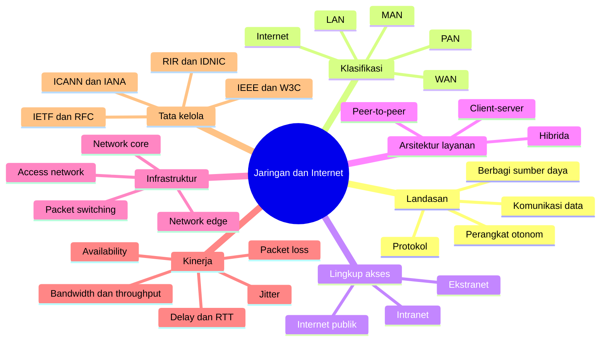
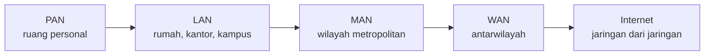
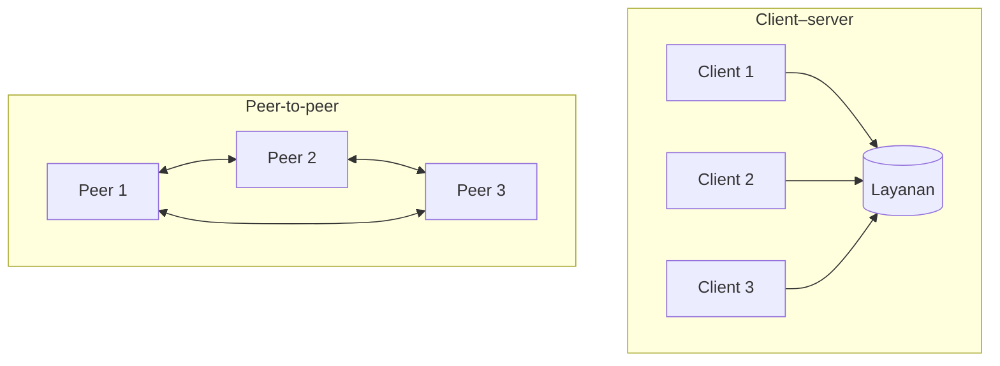
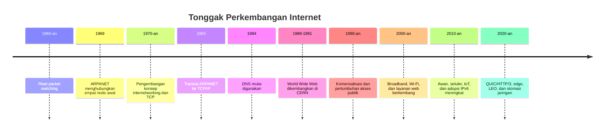

# Bab 1 — Pengantar Jaringan Komputer dan Internet

| Pemetaan | Keterangan |
|---|---|
| **CPMK** | CPMK-1 (memahami konsep dasar OSI dan TCP/IP serta konsep jaringan dan Internet) |
| **Sub-CPMK** | Sub-CPMK-1 (menjelaskan konsep dasar jaringan komputer dan Internet) |
| **Kemampuan akhir (RPS Minggu 1)** | Menjelaskan LAN, MAN, WAN, intranet, ekstranet, dan Internet; menguraikan sejarah Internet; serta mengenali organisasi yang berperan dalam pengembangan dan tata kelola Internet |
| **Rujukan inti** | Tanenbaum, Feamster, dan Wetherall, *Computer Networks*, Bab 1; Kurose dan Ross, *Computer Networking: A Top-Down Approach*, Bab 1; Forouzan, *TCP/IP Protocol Suite*, Bab 1; serta dokumen RFC yang relevan |

---

## Peta Konsep

---

## 1.1 Jaringan sebagai Infrastruktur Kehidupan Digital

Jaringan komputer telah berkembang dari sarana untuk menghubungkan sejumlah kecil komputer menjadi infrastruktur dasar bagi pendidikan, pemerintahan, industri, transportasi, layanan kesehatan, dan kehidupan sosial. Ketika seseorang membuka sistem pembelajaran daring, melakukan pembayaran digital, mengirimkan berkas melalui penyimpanan awan, mengikuti konferensi video, atau memantau perangkat Internet of Things (IoT), ia sedang memanfaatkan serangkaian jaringan yang bekerja secara terpadu. Sebagian jaringan tersebut berada di rumah atau kampus, sebagian dikelola oleh penyedia layanan Internet, dan sebagian lagi merupakan infrastruktur pusat data yang tersebar di berbagai wilayah.

Kehadiran jaringan sering kali baru disadari ketika layanan mengalami gangguan. Pengguna pada umumnya hanya melihat gejala seperti “Internet lambat”, “situs tidak dapat dibuka”, atau “panggilan video terputus-putus”. Bagi seorang profesional teknologi informasi, gejala tersebut harus diterjemahkan menjadi pertanyaan teknis yang lebih terukur. Apakah perangkat memperoleh alamat jaringan yang benar? Apakah koneksi lokal berfungsi? Apakah terjadi kemacetan pada jalur keluar? Apakah layanan penamaan domain gagal? Apakah server tujuan sedang tidak tersedia? Apakah kebijakan keamanan memblokir lalu lintas? Kemampuan menguraikan masalah besar menjadi komponen-komponen yang dapat diuji merupakan salah satu alasan utama mempelajari konsep jaringan secara sistematis.

Bab ini memberikan landasan untuk pembahasan pada bab-bab berikutnya. Tujuannya bukan sekadar menghafal istilah LAN, WAN, atau Internet, melainkan membangun cara berpikir jaringan. Mahasiswa diharapkan mampu melihat komunikasi digital sebagai proses yang melibatkan perangkat akhir, media transmisi, perangkat perantara, protokol, pengalamatan, jalur pengiriman, serta layanan aplikasi. Dengan sudut pandang ini, sebuah jaringan tidak lagi dipahami hanya sebagai sekumpulan kabel dan perangkat, tetapi sebagai sistem terdistribusi yang harus memenuhi persyaratan kinerja, keamanan, keandalan, pengelolaan, dan kemampuan berkembang.

Dalam praktik rekayasa, rancangan jaringan selalu berangkat dari kebutuhan manusia dan organisasi. Laboratorium pendidikan memerlukan segmentasi yang memudahkan pengelolaan kelas. Rumah sakit memerlukan ketersediaan dan perlindungan data yang kuat. Pabrik memerlukan komunikasi berlatensi rendah dan dapat diprediksi. Perusahaan rintisan mungkin lebih menekankan kelincahan dan skalabilitas. Dengan demikian, teknologi yang dianggap tepat pada satu konteks belum tentu tepat pada konteks lain. Pemahaman konseptual diperlukan agar keputusan tidak semata-mata mengikuti merek perangkat, tren, atau kebiasaan lama.

## 1.2 Pengertian Jaringan Komputer

Secara umum, **jaringan komputer** adalah sekumpulan perangkat otonom yang saling terhubung melalui satu atau lebih media komunikasi untuk bertukar data dan berbagi sumber daya berdasarkan aturan komunikasi yang disepakati. Perangkat yang terhubung tidak terbatas pada komputer meja atau laptop. Telepon cerdas, server, kamera pengawas, mesin industri, kendaraan, sensor lingkungan, printer, perangkat medis, dan pengendali listrik juga dapat menjadi bagian dari jaringan.

Istilah **otonom** penting karena setiap perangkat tetap memiliki fungsi dan kendali komputasinya sendiri. Sebuah komputer tidak kehilangan identitasnya ketika bergabung ke jaringan. Hal ini membedakan jaringan komputer dari sistem komputasi yang komponennya berada di bawah kendali sangat erat sebagai satu mesin, seperti sistem multiprosesor tertentu. Meskipun batas antara jaringan dan sistem terdistribusi semakin tipis, konsep otonomi membantu menjelaskan bahwa komunikasi terjadi antarsistem yang masing-masing memiliki sumber daya, status, dan kemungkinan kegagalan sendiri.

Definisi tersebut memuat empat unsur pokok.

1. **Perangkat akhir (*end system* atau *host*)** merupakan sumber atau tujuan data. Laptop mahasiswa, server web, telepon IP, dan sensor suhu adalah contoh perangkat akhir.
2. **Media komunikasi** membawa sinyal dari satu titik ke titik lain. Media dapat berupa kabel tembaga, serat optik, gelombang radio, gelombang mikro, atau tautan satelit.
3. **Perangkat perantara** meneruskan, mengendalikan, atau melindungi lalu lintas. Switch menghubungkan perangkat dalam jaringan lokal, router menghubungkan jaringan yang berbeda, sedangkan firewall menerapkan kebijakan keamanan terhadap komunikasi.
4. **Protokol** menentukan aturan komunikasi, termasuk format pesan, urutan pertukaran, cara mengenali pengirim dan penerima, serta tindakan ketika terjadi kesalahan.

Keempat unsur tersebut saling bergantung. Dua komputer yang dihubungkan dengan kabel belum tentu dapat berkomunikasi apabila tidak memiliki konfigurasi dan protokol yang kompatibel. Sebaliknya, protokol yang baik tidak akan menghasilkan layanan apabila media transmisi gagal atau perangkat perantara salah dikonfigurasi. Jaringan harus dipahami sebagai suatu sistem, bukan sebagai kumpulan komponen yang berdiri sendiri.

Analogi sistem jalan dapat membantu membentuk intuisi awal. Perangkat akhir dapat dianalogikan sebagai bangunan asal dan tujuan; paket data sebagai kendaraan yang membawa muatan; switch dan router sebagai persimpangan; alamat jaringan sebagai alamat lokasi; serta protokol sebagai aturan lalu lintas. Analogi ini berguna, tetapi tidak boleh diterapkan secara berlebihan. Paket tidak selalu mengikuti jalur yang sama, dapat disalin atau dibuang, dan dapat tiba dengan urutan berbeda. Selain itu, kapasitas jaringan dibagi oleh banyak aliran data secara dinamis, sehingga perilakunya lebih kompleks daripada jalan yang kosong dan statis.

### 1.2.1 Komunikasi data dan lima komponennya

Komunikasi data dapat dijelaskan melalui lima komponen: **pengirim**, **penerima**, **pesan**, **media transmisi**, dan **protokol**. Pengirim menghasilkan data; penerima menjadi tujuan data; pesan merupakan informasi yang dipertukarkan; media menyediakan saluran fisik atau nirkabel; sedangkan protokol mengatur bagaimana pertukaran dilakukan.

Sebagai contoh, ketika mahasiswa mengunggah tugas ke sistem pembelajaran, laptop bertindak sebagai pengirim dan server sebagai penerima. Berkas tugas merupakan bagian dari pesan. Wi-Fi, switch kampus, router, jaringan penyedia layanan, serta sambungan menuju pusat data membentuk jalur komunikasinya. Protokol seperti Wi-Fi atau Ethernet, IP, TCP, TLS, dan HTTP bekerja pada fungsi yang berbeda. Pengguna melihat satu tindakan sederhana, tetapi jaringan melaksanakan banyak proses: membentuk frame, menentukan alamat tujuan, memilih rute, memastikan keandalan pengiriman, mengenkripsi sesi, dan memberi respons aplikasi.

Komunikasi juga dapat dibedakan berdasarkan arah pertukaran data. Pada **simplex**, komunikasi berlangsung hanya satu arah. Pada **half-duplex**, kedua pihak dapat mengirim, tetapi tidak pada saat yang sama. Pada **full-duplex**, kedua pihak dapat mengirim dan menerima secara bersamaan. Istilah ini menjelaskan kemampuan kanal atau mekanisme akses, bukan sekadar perilaku aplikasi. Ethernet modern pada koneksi switch umumnya beroperasi secara full-duplex, sedangkan media nirkabel berbagi kanal dan memerlukan mekanisme koordinasi yang berbeda.

### 1.2.2 Data, sinyal, dan paket

Data adalah representasi informasi, sedangkan sinyal adalah bentuk fisik yang membawa representasi tersebut melalui media. Teks, citra, suara, dan video diubah menjadi bit. Bit kemudian direpresentasikan sebagai perubahan tegangan listrik, pulsa cahaya, atau karakteristik gelombang radio. Pada sisi penerima, proses kebalikannya dilakukan untuk memperoleh kembali data.

Data aplikasi yang besar tidak selalu dikirim sebagai satu kesatuan. Jaringan berbasis paket membaginya menjadi unit-unit yang lebih kecil. Setiap unit diberi informasi kendali, seperti alamat, nomor urut, atau penanda integritas, sesuai protokol yang digunakan. Pembagian ini memungkinkan banyak pengguna berbagi infrastruktur yang sama dan memberi jaringan fleksibilitas dalam meneruskan lalu lintas. Namun, pembagian tersebut juga menimbulkan *overhead*, antrean, kemungkinan kehilangan, dan kebutuhan penyusunan kembali pada sisi penerima.

## 1.3 Tujuan dan Manfaat Jaringan

Jaringan dibangun untuk memenuhi kebutuhan yang dapat dikelompokkan ke dalam beberapa tujuan utama. Tujuan pertama adalah **berbagi sumber daya**. Dalam organisasi, banyak pengguna dapat memanfaatkan printer, penyimpanan, aplikasi, basis data, dan koneksi Internet yang sama. Berbagi sumber daya menekan duplikasi biaya, tetapi juga memerlukan pengaturan hak akses dan kapasitas agar satu pengguna tidak mengganggu pengguna lain.

Tujuan kedua adalah **komunikasi dan kolaborasi**. Surat elektronik, pesan instan, konferensi video, papan kerja digital, sistem kontrol versi, dan layanan berbagi dokumen memungkinkan pekerjaan dilakukan lintas ruang dan waktu. Nilai jaringan dalam konteks ini bukan hanya kecepatan pengiriman data, tetapi juga kemampuannya mempertahankan konteks kerja bersama, identitas pengguna, serta konsistensi informasi.

Tujuan ketiga adalah **akses terhadap layanan jarak jauh**. Pengguna tidak harus memiliki seluruh perangkat lunak dan data di perangkat lokal. Layanan komputasi awan menyediakan sumber daya komputasi, penyimpanan, basis data, dan analitik melalui jaringan. Pendekatan ini memberikan elastisitas, tetapi menciptakan ketergantungan pada konektivitas dan penyedia layanan. Oleh karena itu, arsitek sistem perlu menilai risiko kegagalan koneksi, lokasi data, biaya perpindahan data, dan ketergantungan terhadap penyedia tertentu.

Tujuan keempat adalah **integrasi dan otomasi proses**. Dalam pabrik, sensor mengirimkan kondisi mesin kepada sistem pengendali. Dalam transportasi, kendaraan dan pusat operasi bertukar posisi serta status. Dalam kampus, sistem akademik dapat berinteraksi dengan autentikasi, pembayaran, perpustakaan, dan analitik pembelajaran. Jaringan memungkinkan integrasi tersebut, tetapi semakin banyak ketergantungan berarti semakin besar pula dampak kegagalan dan serangan.

Tujuan kelima adalah **peningkatan keandalan melalui redundansi**. Data dapat direplikasi ke beberapa lokasi, layanan dapat dijalankan pada lebih dari satu server, dan jalur alternatif dapat disiapkan. Redundansi tidak otomatis menghasilkan keandalan. Apabila seluruh jalur alternatif melewati sumber listrik atau ducting serat yang sama, kegagalan fisik tunggal masih dapat memutus semuanya. Redundansi harus dirancang berdasarkan analisis *failure domain*, bukan hanya jumlah perangkat.

Dari perspektif pengguna, jaringan yang baik terasa sederhana: layanan tersedia, respons memadai, dan akses terlindungi. Dari perspektif pengelola, kesederhanaan tersebut merupakan hasil perencanaan yang kompleks. Kapasitas harus dihitung, alamat harus dikelola, konfigurasi harus konsisten, perubahan harus terdokumentasi, dan anomali harus dapat diamati. Karena itu, manfaat jaringan selalu disertai biaya dan tanggung jawab pengelolaan.

## 1.4 Klasifikasi Jaringan Berdasarkan Cakupan

Klasifikasi berdasarkan cakupan membantu membangun gambaran umum, tetapi batas jaraknya tidak bersifat mutlak. Istilah PAN, LAN, MAN, dan WAN lebih tepat dipahami melalui kombinasi wilayah layanan, teknologi, kepemilikan, dan pola operasi daripada melalui angka jarak semata.

| Jenis | Cakupan umum | Pengelolaan dominan | Contoh teknologi atau penerapan |
|---|---|---|---|
| **PAN** (*Personal Area Network*) | Sekitar individu atau ruang sangat terbatas | Individu | Bluetooth, NFC, koneksi perangkat personal |
| **LAN** (*Local Area Network*) | Ruangan, rumah, gedung, atau kampus | Satu rumah tangga atau organisasi | Ethernet dan Wi-Fi |
| **MAN** (*Metropolitan Area Network*) | Kawasan perkotaan atau beberapa lokasi dalam satu wilayah | Operator atau organisasi besar | Metro Ethernet dan jaringan serat metropolitan |
| **WAN** (*Wide Area Network*) | Antarkota, antarprovinsi, antarnegara, atau global | Satu atau banyak operator | Tautan operator, VPN, SD-WAN, MPLS, dan satelit |
| **Internet** | Global | Terdistribusi di antara banyak organisasi | Interkoneksi jaringan dan *autonomous system* dengan keluarga protokol TCP/IP |

### 1.4.1 Personal Area Network

PAN menghubungkan perangkat yang berada sangat dekat dengan pengguna. Contohnya ialah hubungan antara telepon cerdas dan perangkat audio Bluetooth, jam pintar, sensor kesehatan, atau periferal komputer. PAN biasanya memiliki daya pancar rendah, cakupan terbatas, dan pola koneksi yang berorientasi pada perangkat personal. Meski kecil, PAN tetap menghadapi isu keamanan. Proses pemasangan perangkat, autentikasi, izin akses, dan pembaruan firmware menentukan apakah perangkat dapat digunakan secara aman.

### 1.4.2 Local Area Network

LAN mencakup area lokal seperti rumah, laboratorium, gedung kantor, atau kampus. Ciri penting LAN adalah adanya kendali administratif yang relatif terpadu. Organisasi dapat menentukan rancangan alamat, segmentasi, teknologi switch, kebijakan Wi-Fi, dan keamanan internal. Ethernet dan Wi-Fi merupakan teknologi yang paling umum. LAN tidak selalu berarti satu subnet atau satu broadcast domain; sebuah jaringan kampus dapat terdiri atas banyak VLAN dan subnet yang saling dihubungkan oleh router atau switch multilapis.

LAN biasanya menawarkan kapasitas tinggi dan latensi rendah dibandingkan WAN karena jarak fisik lebih pendek serta infrastruktur berada di bawah kendali lokal. Namun, kinerja tidak hanya ditentukan oleh jarak. Penempatan access point yang buruk, interferensi radio, loop pada Layer 2, salah konfigurasi, atau uplink yang terlalu kecil dapat membuat LAN berkinerja buruk meskipun perangkatnya modern.

### 1.4.3 Metropolitan Area Network

MAN menghubungkan beberapa lokasi dalam satu kawasan metropolitan. Perguruan tinggi yang memiliki kampus terpisah, pemerintah kota yang menghubungkan kantor-kantor dinas, atau perusahaan dengan cabang di satu kota dapat memanfaatkan jaringan metropolitan. Infrastruktur sering disediakan oleh operator melalui Metro Ethernet atau layanan serat. Dari sudut pandang pengguna, koneksi tersebut dapat terlihat seperti perpanjangan LAN, tetapi secara operasional terdapat batas tanggung jawab antara pelanggan dan penyedia.

### 1.4.4 Wide Area Network

WAN menghubungkan lokasi yang berjauhan dan biasanya melibatkan infrastruktur milik operator. Pilihan teknologi WAN bergantung pada kebutuhan kapasitas, jangkauan, biaya, ketersediaan, dan jaminan layanan. Organisasi dapat menggunakan leased line, layanan IP/MPLS, VPN melalui Internet, SD-WAN, jaringan seluler, atau satelit. Tidak ada satu teknologi yang unggul dalam semua keadaan. Tautan khusus dapat memberi prediktabilitas lebih baik, sedangkan Internet publik dengan enkripsi sering lebih ekonomis dan fleksibel.

WAN menuntut perhatian khusus terhadap latensi, kehilangan paket, variasi kualitas, dan kegagalan operator. Rancangan yang baik mempertimbangkan jalur cadangan, keragaman operator, kebijakan pemilihan rute, serta mekanisme pemulihan. Dua koneksi dari operator berbeda belum tentu benar-benar independen apabila keduanya menggunakan jalur serat fisik yang sama.

### 1.4.5 Internet sebagai jaringan dari jaringan

Internet bukan satu jaringan raksasa dengan satu pusat kendali. Internet adalah interkoneksi sangat besar dari jaringan-jaringan yang dikelola secara mandiri. Jaringan organisasi, operator seluler, penyedia akses, perusahaan konten, jaringan riset, dan pusat data terhubung melalui kesepakatan teknis dan bisnis. Setiap jaringan besar dapat beroperasi sebagai sebuah **autonomous system (AS)** dengan kebijakan routing sendiri. Pertukaran informasi keterjangkauan antarsistem dilakukan menggunakan Border Gateway Protocol (BGP), yang akan dibahas pada bagian routing tingkat lanjut.

Karakter terdistribusi ini merupakan sumber kekuatan sekaligus tantangan. Internet dapat terus berfungsi walaupun sebagian komponen gagal, tetapi keputusan satu operator dapat memengaruhi jaringan lain. Kesalahan pengumuman rute, kegagalan DNS, serangan penolakan layanan, atau gangguan kabel bawah laut dapat menimbulkan dampak lintas wilayah. Karena tidak ada satu pemilik tunggal, koordinasi, standardisasi terbuka, dan praktik operasional bersama menjadi sangat penting.

## 1.5 Klasifikasi Berdasarkan Lingkup Akses dan Administrasi

Istilah intranet, ekstranet, dan Internet sering disamakan dengan ukuran jaringan, padahal ketiganya terutama menjelaskan **lingkup akses dan batas administratif**.

**Intranet** adalah lingkungan jaringan dan layanan internal yang menggunakan teknologi Internet—seperti IP, DNS, HTTP, dan aplikasi web—tetapi aksesnya dibatasi bagi anggota organisasi. Portal pegawai, repositori internal, sistem keuangan, dan dasbor operasional merupakan contoh layanan intranet. Sebuah intranet dapat berada dalam satu gedung atau tersebar di banyak negara. Dengan demikian, intranet dapat menggunakan LAN maupun WAN.

**Ekstranet** memperluas sebagian layanan internal kepada pihak eksternal yang telah diberi otorisasi, seperti pemasok, mitra penelitian, auditor, atau pelanggan korporat. Ekstranet bukan berarti seluruh intranet dibuka. Prinsip yang sehat adalah memberikan akses minimum sesuai kebutuhan, memisahkan layanan yang dibagikan, serta mencatat aktivitas. Implementasinya dapat menggunakan portal berbasis identitas, VPN, API, atau pendekatan *zero trust*.

**Internet publik** menyediakan keterhubungan terbuka antarbanyak jaringan, tetapi “publik” tidak berarti setiap sumber daya dapat diakses tanpa kendali. Sebuah server dapat terhubung ke Internet sambil tetap menerapkan autentikasi, enkripsi, firewall, dan pembatasan layanan. Sebaliknya, layanan intranet juga tidak otomatis aman hanya karena tidak dipublikasikan. Ancaman dapat berasal dari akun yang disalahgunakan, perangkat internal yang terinfeksi, salah konfigurasi, atau koneksi pihak ketiga.

Perbedaan ketiganya dapat diringkas sebagai berikut.

| Aspek | Intranet | Ekstranet | Internet publik |
|---|---|---|---|
| Pengguna utama | Anggota internal | Internal dan pihak luar terpilih | Masyarakat atau pengguna Internet |
| Kendali akses | Ketat dan berbasis organisasi | Ketat berdasarkan relasi/kemitraan | Bergantung pada layanan |
| Contoh | Portal pegawai | Portal pemasok | Situs web publik |
| Risiko utama | Penyalahgunaan internal, akun bocor | Kepercayaan lintas organisasi | Paparan serangan berskala Internet |

## 1.6 Arsitektur Layanan: Client–Server, Peer-to-Peer, dan Hibrida

### 1.6.1 Client–server

Dalam arsitektur **client–server**, client meminta layanan dan server menyediakan layanan. Peramban bertindak sebagai client ketika meminta halaman dari server web. Aplikasi akademik bertindak sebagai client ketika mengirimkan kueri atau transaksi ke layanan basis data melalui komponen aplikasi. Server umumnya dirancang untuk melayani banyak client, beroperasi terus-menerus, dan dikelola secara terpusat.

Kelebihan model ini adalah konsistensi pengelolaan. Data, autentikasi, kebijakan, pencadangan, dan pembaruan dapat dikendalikan pada sisi layanan. Namun, sentralisasi dapat menciptakan titik kegagalan dan sasaran serangan yang bernilai tinggi. Istilah “server” juga tidak selalu menunjuk satu mesin fisik. Layanan modern dapat dijalankan pada klaster, mesin virtual, kontainer, atau fungsi awan yang tersebar. Pengguna melihat satu nama layanan, sedangkan di belakangnya terdapat penyeimbang beban dan banyak instance.

### 1.6.2 Peer-to-peer

Dalam arsitektur **peer-to-peer (P2P)**, setiap node dapat bertindak sebagai peminta sekaligus penyedia sumber daya. Distribusi berkas antarpengguna merupakan contoh klasik. Karena sumber daya dapat bertambah ketika jumlah peserta meningkat, P2P berpotensi memiliki skalabilitas yang baik. Tidak adanya satu server pusat juga dapat meningkatkan ketahanan terhadap kegagalan tertentu.

Sebaliknya, P2P menghadirkan tantangan dalam penemuan peer, konsistensi data, kepercayaan, keamanan, insentif partisipasi, dan pengelolaan node yang sering keluar-masuk. Pernyataan bahwa P2P “tidak memiliki server” juga tidak selalu benar. Sistem P2P dapat memakai server untuk registrasi, koordinasi awal, autentikasi, atau pencarian, sementara data utama dipertukarkan langsung antarpeserta.

### 1.6.3 Arsitektur hibrida

Banyak sistem nyata bersifat hibrida. Aplikasi komunikasi real-time dapat menggunakan server untuk autentikasi dan *signaling*, lalu mengupayakan aliran media langsung antarpeserta. Jika koneksi langsung tidak memungkinkan karena NAT atau kebijakan jaringan, media dapat diteruskan melalui server relai. Layanan kolaborasi juga dapat menyimpan data pusat sambil menggunakan replikasi lokal dan distribusi konten.

Pemilihan arsitektur harus mempertimbangkan pola beban, sensitivitas data, kebutuhan kendali, kemungkinan perangkat berada di balik NAT, biaya infrastruktur, dan target ketersediaan. Klasifikasi client–server versus P2P bukan label mutu. Keduanya merupakan pola desain dengan konsekuensi yang berbeda.

## 1.7 Struktur Internet: Edge, Jaringan Akses, dan Core

Untuk memahami Internet secara operasional, infrastruktur dapat dipandang melalui tiga bagian: **network edge**, **access network**, dan **network core**.

### 1.7.1 Network edge

*Network edge* berisi host dan aplikasi yang menghasilkan atau mengonsumsi data. Laptop, telepon, server, sensor, dan sistem awan berada pada bagian tepi. Istilah *edge* tidak berarti perangkatnya tidak penting. Sebagian besar fungsi yang terlihat pengguna justru berada di sini. Prinsip *end-to-end* dalam arsitektur Internet menyatakan bahwa fungsi tertentu sebaiknya ditempatkan pada sistem akhir apabila hanya sistem akhir yang dapat menerapkannya secara lengkap. Misalnya, jaringan dapat membantu mendeteksi kesalahan, tetapi kepastian bahwa berkas diterima sesuai kebutuhan aplikasi pada akhirnya harus diperiksa oleh pengirim dan penerima.

### 1.7.2 Jaringan akses

Jaringan akses menghubungkan perangkat akhir ke router pertama atau jaringan penyedia. Di rumah, akses dapat berupa fiber to the home, kabel, seluler, atau fixed wireless. Di kampus, perangkat terhubung melalui Ethernet dan Wi-Fi menuju jaringan distribusi. Di lokasi terpencil, akses dapat menggunakan radio titik-ke-titik atau satelit.

Jaringan akses sering menjadi sumber masalah yang langsung dirasakan pengguna. Kualitas sinyal Wi-Fi, kepadatan pengguna pada satu access point, kualitas kabel, kapasitas uplink, dan kebijakan akses dapat membatasi pengalaman meskipun backbone Internet dalam kondisi baik. Oleh sebab itu, pengukuran harus dilakukan dari beberapa titik agar pengelola tidak keliru menyimpulkan lokasi gangguan.

### 1.7.3 Network core

*Network core* terdiri atas router berkapasitas tinggi dan tautan yang meneruskan paket di antara jaringan. Router memeriksa informasi tujuan dan memilih antarmuka keluaran berdasarkan tabel penerusan. Pada tingkat lokal, keputusan dapat terlihat sederhana; pada skala Internet, rute dipengaruhi oleh topologi, kebijakan antarpengelola, kapasitas, dan gangguan.

Core tidak menyimpan seluruh “sesi aplikasi” dengan cara yang sama seperti server aplikasi. Tugas utamanya adalah meneruskan paket secara efisien. Pemisahan fungsi ini memungkinkan Internet mendukung aplikasi baru tanpa harus mengganti semua router setiap kali aplikasi diciptakan. Meski demikian, jaringan modern juga mengandung fungsi tambahan seperti firewall, load balancer, NAT, sistem deteksi intrusi, dan optimasi lalu lintas. Fungsi tersebut memberi manfaat, tetapi menambah kompleksitas dan dapat mengurangi transparansi ujung-ke-ujung.

## 1.8 Packet Switching dan Circuit Switching

Dua pendekatan dasar untuk menggunakan sumber daya komunikasi adalah **circuit switching** dan **packet switching**.

Pada circuit switching, sumber daya jalur dialokasikan untuk suatu komunikasi selama sesi berlangsung. Jaringan telepon klasik merupakan contoh yang mudah dipahami. Setelah sirkuit terbentuk, kapasitas tertentu tersedia secara relatif konsisten. Kelebihannya adalah prediktabilitas, sedangkan kelemahannya adalah sumber daya dapat menganggur ketika peserta tidak mengirim data.

Pada packet switching, data dibagi menjadi paket. Setiap paket berbagi tautan dengan paket milik aliran lain. Mekanisme ini disebut *statistical multiplexing* karena penggunaan kapasitas mengikuti aktivitas aktual pengguna. Ketika satu pengguna tidak mengirim, kapasitas dapat dimanfaatkan oleh pengguna lain. Internet menggunakan packet switching karena lalu lintas data cenderung bersifat tidak tetap dan muncul dalam ledakan (*bursty*).

Efisiensi tersebut memiliki konsekuensi. Jika paket datang lebih cepat daripada kemampuan tautan meneruskannya, paket harus menunggu di buffer. Antrean menambah delay. Jika buffer penuh, paket dibuang. Dengan demikian, packet switching tidak selalu memberikan waktu pengiriman yang tetap. Protokol transport, aplikasi, dan mekanisme kendali kemacetan bekerja untuk menyesuaikan diri terhadap kondisi yang berubah.

Proses penerusan paket pada router sering menggunakan pendekatan **store-and-forward**: router menerima paket sebelum meneruskannya ke tautan berikutnya. Untuk paket berukuran \(L\) bit pada tautan berkecepatan \(R\) bit per detik, waktu minimum untuk memasukkan seluruh paket ke tautan adalah:

$$
d_{trans} = \frac{L}{R}
$$

Sebagai contoh, paket berukuran 1.500 byte sama dengan 12.000 bit. Pada tautan 100 Mbps, transmission delay idealnya:

$$
\frac{12.000}{100.000.000} = 0{,}00012\ \text{detik} = 0{,}12\ \text{ms}
$$

Perhitungan ini belum memasukkan antrean, propagasi, pemrosesan, dan overhead lain. Contoh tersebut menunjukkan mengapa pernyataan “tautan 100 Mbps berarti data sampai dalam 0,12 ms” tidak tepat. Nilai 0,12 ms hanya menjelaskan waktu serialisasi paket pada satu tautan.

## 1.9 Protokol, Standar, dan Interoperabilitas

**Protokol** adalah seperangkat aturan yang menentukan format dan makna pesan, urutan pertukaran, serta tindakan ketika pesan dikirim, diterima, terlambat, rusak, atau tidak memperoleh respons. Komunikasi manusia juga menggunakan protokol sosial: sapaan, giliran berbicara, dan cara mengakhiri percakapan. Protokol jaringan harus lebih presisi karena perangkat tidak dapat mengandalkan konteks seluas manusia.

Sebuah protokol dapat mendefinisikan sintaks, semantik, dan waktu. **Sintaks** menjelaskan susunan bit atau field. **Semantik** menjelaskan arti setiap field dan tindakan yang berkaitan dengannya. **Timing** menjelaskan kapan pesan dikirim dan berapa lama pihak menunggu. Ketidaksesuaian salah satu aspek dapat menggagalkan komunikasi meskipun kabel dan perangkat berfungsi.

Standar memungkinkan produk dan layanan dari organisasi berbeda berinteraksi. Ethernet dari satu vendor harus dapat membawa frame menuju switch vendor lain selama keduanya menerapkan spesifikasi yang kompatibel. Implementasi HTTP pada peramban harus dapat berkomunikasi dengan server yang dibuat menggunakan bahasa pemrograman berbeda. Interoperabilitas inilah yang memungkinkan ekosistem Internet tumbuh tanpa satu produsen tunggal.

Namun, tidak semua dokumen teknis berstatus standar. Seri RFC mencakup dokumen Standards Track, Best Current Practice, Informational, Experimental, dan Historic. Karena itu, kalimat “sudah menjadi RFC” tidak otomatis berarti “wajib diterapkan sebagai Internet Standard”. Status dokumen, pembaruan, dokumen yang menggantikan, dan errata perlu diperiksa melalui [RFC Editor](https://www.rfc-editor.org/) atau [IETF Datatracker](https://datatracker.ietf.org/). IETF menjelaskan bahwa RFC merupakan keluaran inti proses standardisasinya dan memuat spesifikasi teknis maupun catatan organisasi yang mendasari Internet.

Bab 2 akan membahas bagaimana protokol disusun berlapis melalui model OSI dan TCP/IP. Untuk bab pengantar ini, pokok terpentingnya ialah bahwa jaringan dapat berfungsi pada skala global karena pihak-pihak yang berbeda bersedia menggunakan aturan terbuka yang sama.

## 1.10 Kinerja Jaringan: Dari Kapasitas hingga Pengalaman Pengguna

Istilah “cepat” terlalu umum untuk mendiagnosis atau merancang jaringan. Kinerja harus dijelaskan dengan metrik yang dapat diukur. Metrik utama meliputi bandwidth, throughput, delay, round-trip time, jitter, packet loss, dan availability.

| Metrik | Makna | Satuan umum | Pertanyaan yang dijawab |
|---|---|---|---|
| **Bandwidth** | Kapasitas nominal kanal atau tautan | bps, Mbps, Gbps | Berapa laju maksimum yang secara teoritis tersedia? |
| **Throughput** | Laju data yang benar-benar dipindahkan | bps, Mbps, Gbps | Berapa laju aktual yang dicapai? |
| **Goodput** | Laju muatan aplikasi yang berguna | bps, Mbps | Berapa banyak data aplikasi yang diterima tanpa menghitung header dan pengiriman ulang? |
| **Delay/latency** | Waktu tempuh data dari sumber ke tujuan | ms | Berapa lama data mencapai tujuan? |
| **RTT** | Waktu perjalanan pergi dan kembali | ms | Berapa lama satu siklus permintaan–respons dasar? |
| **Jitter** | Variasi delay antar-paket | ms | Seberapa konsisten waktu kedatangan paket? |
| **Packet loss** | Proporsi paket yang tidak sampai | persen | Seberapa banyak paket hilang? |
| **Availability** | Proporsi waktu layanan tersedia | persen | Seberapa sering layanan dapat digunakan? |

### 1.10.1 Bandwidth, throughput, dan goodput

Bandwidth adalah kapasitas, bukan jaminan laju aplikasi. Tautan 1 Gbps tidak berarti satu pengguna selalu memperoleh 1 Gbps. Kapasitas dapat dibagi, perangkat akhir dapat menjadi pembatas, server dapat lambat, protokol menambah overhead, dan jalur ujung-ke-ujung dapat memiliki tautan yang lebih kecil. Tautan dengan kapasitas terendah pada jalur sering disebut *bottleneck*.

Throughput mengukur laju aktual seluruh data yang berhasil lewat, termasuk sebagian overhead protokol. Goodput berfokus pada data aplikasi yang berguna. Jika sebuah berkas 100 MB memerlukan 10 detik untuk diterima, goodput rata-ratanya sekitar 10 MB/s atau 80 Mb/s, dengan mengabaikan perbedaan satuan desimal dan biner. Pengukuran harus menyebut interval, lokasi, protokol, serta kondisi pengujian agar dapat dibandingkan secara adil.

### 1.10.2 Empat komponen delay

Delay pada sebuah node dapat diuraikan menjadi empat komponen:

$$
d_{nodal}=d_{proc}+d_{queue}+d_{trans}+d_{prop}
$$

**Processing delay** adalah waktu yang diperlukan perangkat untuk memeriksa header, memvalidasi data, dan menentukan tindakan. Nilainya dipengaruhi kemampuan perangkat serta kompleksitas fungsi yang dijalankan. Inspeksi keamanan mendalam, enkripsi, atau translasi alamat dapat menambah pemrosesan.

**Queuing delay** adalah waktu menunggu dalam antrean sebelum paket dikirim. Nilainya paling dinamis. Saat beban ringan, antrean mungkin hampir tidak ada. Ketika laju kedatangan mendekati atau melampaui kapasitas keluaran, antrean dapat bertambah cepat. Inilah salah satu penyebab koneksi terasa responsif pada malam hari tetapi lambat pada jam sibuk.

**Transmission delay** adalah waktu untuk menempatkan seluruh bit paket ke media, yaitu \(L/R\). Delay ini bergantung pada ukuran paket dan laju transmisi, bukan pada jarak.

**Propagation delay** adalah waktu sinyal merambat melalui media, yaitu:

$$
d_{prop}=\frac{d}{s}
$$

dengan \(d\) sebagai jarak dan \(s\) sebagai kecepatan rambat sinyal pada media. Propagation delay dipengaruhi jarak fisik dan sifat media. Menambah bandwidth tidak menghilangkan delay propagasi. Karena itu, layanan interaktif dapat memperoleh manfaat dari pusat data regional, CDN, dan edge computing yang mendekatkan konten atau komputasi kepada pengguna.

### 1.10.3 Jitter dan packet loss

Jitter sangat penting bagi suara dan video real-time. Aplikasi dapat menampung paket sementara dalam *jitter buffer* agar pemutaran lebih stabil. Buffer yang terlalu kecil tidak mampu menyerap variasi; buffer yang terlalu besar menambah delay. Oleh karena itu, optimasi real-time selalu melibatkan kompromi.

Packet loss dapat terjadi karena buffer penuh, kualitas media buruk, interferensi, kerusakan perangkat, atau kebijakan. Dampaknya bergantung pada aplikasi dan protokol. TCP dapat mengirim ulang data yang hilang, tetapi pengiriman ulang menambah waktu. Aplikasi real-time mungkin memilih melewati data yang terlambat karena paket suara lama tidak lagi berguna ketika percakapan sudah berlanjut.

### 1.10.4 Availability dan reliabilitas

Availability sering dinyatakan sebagai persentase waktu layanan dapat digunakan. Nilai 99,9% terdengar tinggi, tetapi masih mengizinkan sekitar 8 jam 46 menit ketidaktersediaan dalam satu tahun. Nilai 99,99% mengurangi anggaran gangguan menjadi sekitar 52 menit per tahun. Angka harus dilengkapi definisi: layanan apa yang diukur, dari titik mana, dan apakah pemeliharaan terjadwal dihitung.

Reliabilitas berkaitan dengan kemampuan sistem beroperasi dengan benar selama interval tertentu. Availability dan reliabilitas berhubungan, tetapi tidak identik. Sistem yang sering gagal namun pulih sangat cepat dapat memiliki availability cukup tinggi tetapi reliabilitas rendah. Dalam operasi jaringan, metrik seperti *mean time between failures* dan *mean time to repair* membantu memahami pola tersebut.

## 1.11 Kualitas Layanan dan Kesesuaian terhadap Aplikasi

Tidak semua aplikasi memiliki kebutuhan jaringan yang sama. Transfer berkas membutuhkan integritas dan throughput, tetapi biasanya dapat menerima delay beberapa ratus milidetik. Panggilan suara memerlukan latency dan jitter rendah; kehilangan kecil kadang lebih dapat diterima daripada pengiriman ulang yang terlambat. Sistem kendali industri dapat memerlukan waktu respons yang konsisten. Pencadangan data dalam jumlah besar mengutamakan kapasitas dan dapat dijadwalkan di luar jam sibuk.

Konsep **Quality of Service (QoS)** digunakan untuk mengelompokkan dan memperlakukan lalu lintas sesuai kebutuhan. QoS tidak menciptakan kapasitas baru. Ia mengatur bagaimana kapasitas yang terbatas dibagi ketika terjadi persaingan. Prioritas yang diberikan kepada satu kelas lalu lintas berarti kelas lain mungkin menunggu lebih lama. Kebijakan QoS yang baik harus berangkat dari kebutuhan bisnis dan pengukuran, bukan dari asumsi bahwa semua paket “penting” harus diberi prioritas tertinggi.

Tabel berikut menggambarkan kecenderungan kebutuhan aplikasi. Nilai tepatnya bergantung pada implementasi dan konteks.

| Aplikasi | Throughput | Latency | Jitter | Toleransi loss |
|---|---|---|---|---|
| Surat elektronik | Rendah–sedang | Relatif longgar | Tidak kritis | Rendah; data harus utuh |
| Transfer berkas | Sedang–tinggi | Relatif longgar | Tidak kritis | Sangat rendah setelah koreksi protokol |
| Penelusuran web | Sedang | Penting untuk respons | Sedang | Rendah |
| Suara real-time | Rendah–sedang | Sangat penting | Sangat penting | Sedikit loss mungkin dapat ditoleransi |
| Video konferensi | Sedang–tinggi | Sangat penting | Sangat penting | Sedikit loss dapat ditoleransi dengan adaptasi |
| Pencadangan | Sangat tinggi secara agregat | Longgar | Tidak kritis | Sangat rendah |

## 1.12 Topologi Fisik dan Logis

**Topologi** menggambarkan cara komponen jaringan tersusun dan berhubungan. Topologi fisik menunjukkan susunan kabel, radio, port, dan perangkat. Topologi logis menunjukkan bagaimana data mengalir atau bagaimana hubungan Layer 2 dan Layer 3 dibentuk. Keduanya dapat berbeda. Jaringan dapat berbentuk bintang secara fisik karena seluruh kabel menuju switch, tetapi memiliki beberapa VLAN dan jalur routing secara logis.

Topologi dasar mencakup bus, ring, star, tree, dan mesh. Pada jaringan Ethernet modern, star dan tree lazim digunakan. Mesh menyediakan banyak jalur alternatif, tetapi biaya dan kompleksitasnya meningkat seiring jumlah hubungan. Jaringan nirkabel juga memiliki topologi yang dipengaruhi cakupan radio, interferensi, dan mobilitas.

Pemahaman topologi diperlukan untuk menganalisis dampak kegagalan. Jika seluruh access point bergantung pada satu switch, switch tersebut merupakan titik kegagalan. Jika dua uplink logis menggunakan kabel fisik yang sama, redundansi logis tidak melindungi dari kabel putus. Dokumentasi harus mencatat kedua perspektif agar tim tidak memperoleh rasa aman yang keliru.

Topologi juga berpengaruh terhadap skalabilitas dan pengelolaan. Arsitektur hierarkis membagi jaringan ke dalam lapisan akses, distribusi, dan inti. Pendekatan ini membantu membatasi domain kegagalan, menyederhanakan kebijakan, dan memungkinkan agregasi. Namun, hierarki bukan tujuan pada dirinya sendiri. Pada pusat data modern, pola leaf–spine sering dipakai untuk memberi jalur yang lebih seragam bagi lalu lintas timur–barat. Pemilihan topologi harus mengikuti pola komunikasi yang hendak didukung.

## 1.13 Persyaratan Jaringan yang Baik

Kualitas jaringan tidak dapat dinilai dari satu angka. Rancangan perlu menyeimbangkan beberapa persyaratan berikut.

### 1.13.1 Kinerja

Kinerja mencakup kapasitas, delay, jitter, dan loss. Perencanaan kinerja dimulai dari profil aplikasi, jumlah pengguna, pola waktu, serta pertumbuhan. Membeli perangkat dengan spesifikasi besar tanpa mengukur kebutuhan dapat menyebabkan pemborosan, sedangkan kapasitas yang terlalu kecil menghasilkan kemacetan.

### 1.13.2 Keandalan dan ketahanan

Jaringan harus mampu mempertahankan fungsi atau pulih ketika komponen gagal. Ketahanan diperoleh melalui redundansi, jalur alternatif, protokol konvergensi, pencadangan konfigurasi, pemantauan, suku cadang, serta prosedur penanganan insiden. Ketahanan juga mencakup manusia dan proses. Desain ganda tidak banyak membantu jika perubahan salah diterapkan serentak ke semua perangkat.

### 1.13.3 Keamanan

Keamanan jaringan bertujuan menjaga kerahasiaan, integritas, dan ketersediaan. Identitas harus diverifikasi, hak akses dibatasi, komunikasi sensitif dienkripsi, dan aktivitas penting dicatat. Segmentasi mengurangi ruang gerak penyerang, tetapi bukan pengganti keamanan endpoint dan aplikasi. Firewall tidak dapat memperbaiki kata sandi yang lemah atau aplikasi yang rentan.

Keamanan harus dirancang sejak awal. Menambahkan kontrol setelah sistem berjalan sering menghasilkan aturan yang rumit dan tidak konsisten. Namun, kontrol yang terlalu ketat tanpa mempertimbangkan kebutuhan pengguna dapat mendorong jalan pintas yang tidak aman. Pendekatan berbasis risiko diperlukan untuk menyeimbangkan perlindungan dan kegunaan.

### 1.13.4 Skalabilitas

Skalabilitas adalah kemampuan sistem melayani pertumbuhan tanpa penurunan yang tidak dapat diterima atau perubahan total arsitektur. Pertumbuhan dapat berupa jumlah pengguna, perangkat IoT, lokasi, aplikasi, rute, atau volume data. Skema alamat yang tidak terencana, domain Layer 2 terlalu besar, dan konfigurasi manual yang berulang sering menjadi hambatan skalabilitas.

### 1.13.5 Manageability dan observability

Jaringan yang dapat dikelola memiliki dokumentasi, penamaan, inventaris, standar konfigurasi, serta mekanisme perubahan yang jelas. *Observability* berarti tim dapat menyimpulkan keadaan internal dari log, metrik, aliran, dan jejak yang tersedia. Tanpa telemetri, pengelola hanya bereaksi terhadap keluhan pengguna.

Otomasi membantu konsistensi, tetapi otomasi yang salah dapat menyebarkan kesalahan dengan cepat. Sumber kebenaran, validasi, pengujian bertahap, dan mekanisme pengembalian diperlukan. Dengan kata lain, jaringan modern menuntut disiplin rekayasa perangkat lunak selain keterampilan konfigurasi perangkat.

### 1.13.6 Biaya dan keberlanjutan

Biaya mencakup lebih dari harga pembelian. Energi, lisensi, dukungan, ruang, pendinginan, pelatihan, suku cadang, dan waktu operasional adalah bagian dari total biaya kepemilikan. Perangkat yang sangat murah dapat menjadi mahal apabila sulit dipantau atau sering gagal. Sebaliknya, spesifikasi tertinggi belum tentu memberikan nilai terbaik.

Keberlanjutan juga semakin relevan. Konsolidasi, manajemen daya, pemilihan perangkat yang berumur pakai baik, serta perencanaan kapasitas yang wajar dapat mengurangi konsumsi energi dan limbah elektronik. Pertimbangan ini tidak terpisah dari keandalan dan biaya; ketiganya perlu dinilai bersama.

## 1.14 Sejarah Internet: Evolusi Gagasan dan Infrastruktur

Sejarah Internet bukan sekadar urutan tanggal, melainkan perkembangan gagasan tentang bagaimana komputer yang berbeda dapat saling terhubung secara tahan gangguan dan terbuka.

### 1.14.1 Dari circuit switching menuju packet switching

Jaringan telepon dirancang terutama untuk percakapan suara yang terus-menerus. Komunikasi komputer memiliki pola berbeda: periode aktif yang singkat dapat diselingi waktu diam. Gagasan packet switching memungkinkan kapasitas dibagi secara dinamis. Kontribusi terhadap gagasan ini muncul dari beberapa peneliti dan lembaga; sejarah teknologi jarang merupakan hasil satu individu saja.

### 1.14.2 ARPANET dan eksperimen jaringan

ARPANET mulai beroperasi pada 1969 dengan empat node awal di Amerika Serikat. Proyek ini menjadi tempat eksperimen penting dalam komunikasi paket dan penggunaan sumber daya komputasi jarak jauh. Menyebut ARPANET sebagai “Internet pertama” perlu kehati-hatian. ARPANET merupakan pendahulu penting, tetapi Internet dalam pengertian jaringan dari jaringan memerlukan arsitektur internetworking dan protokol yang memungkinkan jaringan heterogen terhubung.

### 1.14.3 TCP/IP dan lahirnya internetworking

Pada dekade 1970-an, Vinton Cerf dan Robert Kahn mengembangkan gagasan protokol untuk menghubungkan jaringan yang berbeda. TCP kemudian dipisahkan dari IP agar fungsi pengiriman ujung-ke-ujung dan pengantaran paket dapat berkembang secara lebih modular. Peralihan ARPANET ke TCP/IP pada 1 Januari 1983 lazim dipandang sebagai tonggak lahirnya Internet modern. Pentingnya bukan pada tanggal semata, melainkan pada tercapainya bahasa komunikasi bersama bagi jaringan heterogen.

### 1.14.4 DNS dan kemudahan penggunaan

Manusia lebih mudah mengingat nama daripada alamat numerik. Domain Name System (DNS) memperkenalkan sistem penamaan hierarkis dan terdistribusi. DNS tidak hanya menerjemahkan nama situs menjadi alamat IP; ia juga mendukung berbagai jenis data layanan. Ketergantungan Internet terhadap DNS membuat keamanan dan ketersediaannya sangat penting.

### 1.14.5 World Wide Web bukan Internet

Tim Berners-Lee mengembangkan fondasi World Wide Web di CERN pada akhir 1980-an dan awal 1990-an melalui konsep URL, HTTP, dan HTML. Web mempermudah publikasi serta navigasi informasi dan mendorong penggunaan Internet secara luas. Namun, **Web bukan Internet**. Internet adalah infrastruktur jaringan dan protokol; Web adalah salah satu layanan aplikasi di atasnya. Surat elektronik, SSH, DNS, panggilan Internet, dan banyak layanan lain dapat berjalan tanpa menjadi bagian dari Web.

### 1.14.6 Internet komersial, broadband, seluler, dan awan

Pada 1990-an, akses Internet meluas dari lingkungan penelitian menuju masyarakat dan bisnis. Pada 2000-an, broadband dan Wi-Fi mengubah Internet dari layanan yang digunakan sesekali menjadi konektivitas yang selalu tersedia. Pada 2010-an, telepon cerdas, komputasi awan, jejaring sosial, IoT, dan video daring meningkatkan skala serta kompleksitas lalu lintas.

Perkembangan ini mengubah arsitektur fisik Internet. Konten populer tidak selalu dikirim dari satu server pusat yang jauh. CDN menempatkan salinan konten di banyak lokasi, perusahaan awan membangun region dan zona, serta Internet exchange memfasilitasi pertukaran lalu lintas lokal. Karena itu, jalur data tidak dapat ditebak hanya dari nama perusahaan atau negara asal layanan.

## 1.15 Tata Kelola dan Organisasi Internet

Tidak ada satu lembaga yang “menguasai Internet”. Tata kelola Internet berlangsung melalui pembagian peran di antara lembaga standardisasi, koordinator sumber daya, operator, pemerintah, komunitas teknis, sektor swasta, dan masyarakat sipil.

| Organisasi/komunitas | Peran utama |
|---|---|
| **IETF** | Mengembangkan standar dan praktik teknis Internet melalui proses terbuka dan dokumen RFC |
| **IAB** | Memberi arahan arsitektural dan pengawasan pada sejumlah fungsi dalam ekosistem IETF |
| **ICANN** | Mengoordinasikan sistem pengenal unik Internet pada tingkat kebijakan dan kelembagaan |
| **IANA** | Mengoordinasikan pengenal global seperti parameter protokol, sumber daya nomor, dan zona akar DNS |
| **RIR** | Mengelola distribusi sumber daya nomor Internet pada wilayah masing-masing |
| **IEEE** | Menstandardisasi banyak teknologi LAN dan media, termasuk keluarga IEEE 802 |
| **W3C** | Mengembangkan standar terbuka untuk teknologi Web |
| **Operator dan IXP** | Mengoperasikan jaringan serta memfasilitasi pertukaran lalu lintas |

### 1.15.1 IETF dan RFC

Internet Engineering Task Force (IETF) mengembangkan spesifikasi teknis melalui kelompok kerja dan proses konsensus terbuka. Hasil utamanya diterbitkan sebagai RFC. Dokumentasi resmi IETF menegaskan bahwa RFC mencakup fondasi teknis seperti pengalamatan, routing, transport, TLS, QUIC, WebRTC, surel, dan DNS. Implementasi dilakukan secara sukarela oleh vendor, pengembang, serta operator, tetapi efek jaringan mendorong adopsi spesifikasi yang interoperabel.

RFC harus dibaca secara kritis. Nomor yang lebih besar tidak selalu menggantikan semua dokumen sebelumnya, dan satu protokol dapat ditentukan oleh beberapa RFC. Halaman metadata RFC Editor menunjukkan status, dokumen pembaru, dokumen yang diperbarui, serta errata. Kebiasaan memeriksa metadata ini penting dalam penulisan ilmiah maupun implementasi.

### 1.15.2 ICANN dan IANA

ICANN berperan dalam koordinasi sistem pengenal unik Internet. Fungsi IANA dijalankan oleh Public Technical Identifiers, afiliasi ICANN, untuk mengoordinasikan pengenal yang harus unik secara global. Menurut laman resmi [IANA](https://www.iana.org/about), fungsi tersebut mencakup registri parameter protokol, sumber daya nomor Internet, dan pengelolaan terkait zona akar DNS. IANA bukan operator yang mengatur seluruh lalu lintas Internet dan tidak menentukan rute paket pengguna.

### 1.15.3 Regional Internet Registry dan konteks Indonesia

Regional Internet Registry (RIR) mengelola distribusi alamat IP dan nomor AS pada wilayahnya. Lima RIR adalah APNIC, ARIN, RIPE NCC, LACNIC, dan AFRINIC. Asia-Pasifik dilayani oleh APNIC. Dalam konteks Indonesia, IDNIC yang berada dalam ekosistem APJII menjalankan fungsi National Internet Registry. Alokasi alamat publik harus dibedakan dari alamat privat yang digunakan di dalam organisasi. Pembahasan rinci mengenai IPv4, IPv6, prefix, dan subnet akan diberikan pada Bab 5 dan Bab 6.

### 1.15.4 IEEE dan W3C

IEEE mengembangkan banyak standar untuk teknologi lokal dan fisik, termasuk IEEE 802.3 untuk Ethernet serta IEEE 802.11 untuk jaringan lokal nirkabel. IETF lebih dominan pada protokol Internet, tetapi pembagian ini tidak boleh dipahami sebagai batas yang sepenuhnya terisolasi; teknologi dari berbagai organisasi harus bekerja bersama.

World Wide Web Consortium (W3C) berfokus pada standar Web seperti HTML dan CSS. Peran W3C kembali menegaskan perbedaan antara Web dan Internet. Standar web menentukan bagaimana konten dan antarmuka aplikasi disajikan, sedangkan protokol Internet menyediakan komunikasi yang mendasarinya.

## 1.16 Keamanan sebagai Sifat Sistem, Bukan Perangkat Tunggal

Jaringan memperluas kemampuan berbagi, tetapi sekaligus memperluas permukaan serangan. Setiap layanan, antarmuka, akun, perangkat, dan hubungan kepercayaan dapat menjadi jalur risiko. Pendekatan keamanan yang hanya mengandalkan firewall perimeter tidak lagi memadai untuk lingkungan yang mencakup komputasi awan, kerja jarak jauh, perangkat bergerak, mitra, dan IoT.

Tiga tujuan klasik keamanan ialah **kerahasiaan**, **integritas**, dan **ketersediaan**. Kerahasiaan mencegah informasi dibaca pihak yang tidak berwenang. Integritas menjaga data dan konfigurasi dari perubahan yang tidak sah. Ketersediaan memastikan layanan dapat digunakan ketika dibutuhkan. Ketiganya dapat saling berkonflik. Pemeriksaan keamanan yang terlalu berat dapat menambah delay atau menjadi titik kegagalan; akses yang terlalu longgar meningkatkan risiko; sistem yang sangat tersedia dapat memperluas permukaan pengelolaan.

Prinsip penting meliputi pertahanan berlapis, hak akses minimum, segmentasi, autentikasi kuat, enkripsi, pembaruan, pencatatan, dan pemulihan. Segmentasi membatasi pergerakan lateral, tetapi tetap memerlukan kebijakan yang benar. Enkripsi melindungi isi komunikasi, tetapi tidak menghilangkan kebutuhan memvalidasi identitas dan keamanan endpoint. Pemantauan dapat mendeteksi anomali, tetapi kualitas deteksi bergantung pada visibilitas serta baseline yang tepat.

Bagi mahasiswa, keamanan sebaiknya tidak diperlakukan sebagai bab tambahan setelah jaringan selesai dipelajari. Setiap keputusan—pemilihan media, skema alamat, layanan, routing, DNS, atau akses jarak jauh—memiliki konsekuensi keamanan. Cara berpikir ini akan membantu membangun sistem yang aman sejak desain, bukan sekadar menambahkan alat keamanan di akhir.

## 1.17 Studi Kasus: Jaringan Kampus sebagai Sistem Berlapis

Bayangkan sebuah kampus memiliki ruang kelas, laboratorium, perpustakaan, kantor administrasi, pusat data, kamera keamanan, dan akses tamu. Seluruh unit membutuhkan konektivitas, tetapi kebutuhannya berbeda.

Mahasiswa memerlukan akses ke sistem pembelajaran, repositori, dan Internet. Staf administrasi mengakses data yang lebih sensitif. Laboratorium mungkin menjalankan eksperimen yang menghasilkan lalu lintas besar atau konfigurasi tidak biasa. Kamera keamanan harus menjangkau server perekam tetapi tidak memerlukan akses bebas ke Internet. Tamu perlu konektivitas publik tanpa memperoleh akses ke sistem internal.

Jika semua perangkat ditempatkan pada satu jaringan datar, pengelolaan menjadi sulit dan domain gangguan terlalu luas. Rancangan yang lebih baik memisahkan kelompok melalui VLAN dan subnet, mengendalikan komunikasi antarkelompok, menyediakan autentikasi pengguna, serta mencatat peristiwa penting. Pemisahan harus mengikuti kebutuhan dan risiko, bukan sekadar struktur organisasi. Dua unit yang berbeda dapat memiliki kebutuhan keamanan sama, sementara satu unit dapat memerlukan beberapa zona.

Jalur fisik juga perlu dirancang. Access switch melayani perangkat; distribution/core menghubungkan gedung dan pusat data; koneksi operator menyediakan akses Internet; jalur cadangan mengurangi risiko kegagalan. Wi-Fi memerlukan survei cakupan dan kapasitas. Sistem kelistrikan, UPS, pendinginan, serta keamanan ruang perangkat menjadi bagian dari keandalan jaringan, meskipun tidak muncul dalam diagram logis.

Kinerja dipantau dari beberapa sisi. Penggunaan uplink menunjukkan kapasitas, data aliran membantu melihat pola komunikasi, log autentikasi mengungkap kegagalan akses, dan pengujian aktif mengukur RTT atau loss. Keluhan pengguna perlu dikorelasikan dengan waktu, lokasi, SSID, aplikasi, dan tujuan. Pernyataan “Internet kampus lambat” belum cukup sebagai diagnosis.

Studi kasus ini memperlihatkan hubungan antarbab. Model lapisan membantu melokalisasi masalah; physical layer menjelaskan media; data link membahas frame, switch, dan VLAN; network layer menangani IP dan routing; transport menjelaskan perilaku TCP/UDP; application layer membahas DNS dan HTTP. Subnetting serta routing menjadikan segmentasi dapat diterapkan. Bab pengantar berfungsi sebagai peta besar sebelum setiap bagian dipelajari lebih mendalam.

## 1.18 Teknologi dan Arah Perkembangan Internet

Bagian ini merupakan konteks, bukan pengganti prinsip dasar. Teknologi berubah, tetapi kebutuhan akan interoperabilitas, pengalamatan, routing, kinerja, keamanan, dan pengelolaan tetap berlaku.

### 1.18.1 Transisi IPv4 ke IPv6

Keterbatasan alamat IPv4 mendorong penggunaan NAT, transfer sumber daya alamat, dan mekanisme transisi. IPv6 menyediakan ruang alamat jauh lebih besar serta menyederhanakan beberapa aspek pengalamatan, tetapi migrasi tidak berlangsung sekaligus. Organisasi sering menjalankan dual-stack, memakai tunneling, atau menggunakan translasi seperti NAT64/464XLAT sesuai kebutuhan.

Adopsi IPv6 harus dinilai melalui pengukuran yang jelas. Google mengukur proporsi pengguna yang mengakses layanannya melalui IPv6, sedangkan APNIC dapat menggunakan metodologi eksperimen iklan dan kapabilitas pengguna. Karena populasi dan metode berbeda, hasilnya tidak harus sama. Pada 7 Juli 2026, halaman [Google IPv6 Statistics](https://www.google.com/intl/en/ipv6/statistics.html) yang terindeks menunjukkan sekitar 46,69%. Angka ini merupakan *snapshot* dan harus diverifikasi ulang sebelum dikutip dalam laporan karena berubah dari hari ke hari.

Makna pentingnya bukan mengejar satu angka, melainkan memahami bahwa insinyur jaringan saat ini perlu merancang dan memecahkan masalah dalam lingkungan IPv4 dan IPv6 secara bersamaan. Mengaktifkan IPv6 tanpa kebijakan, pemantauan, DNS, dan firewall yang setara dengan IPv4 dapat menciptakan jalur yang tidak terkelola.

### 1.18.2 QUIC dan HTTP/3

QUIC membawa fungsi transport aman di atas UDP dan menjadi fondasi HTTP/3. Pendekatan ini mengurangi beberapa hambatan evolusi yang dialami protokol transport di sistem operasi dan perangkat perantara. QUIC mengintegrasikan keamanan berbasis TLS dan mendukung pengelolaan aliran yang mengurangi *head-of-line blocking* antarsaluran aplikasi tertentu.

Namun, protokol baru tidak menghapus masalah dasar. Kemacetan, loss, jarak, kapasitas, dan konfigurasi tetap memengaruhi pengalaman. Perangkat keamanan dan alat observasi juga perlu menyesuaikan diri karena lebih banyak informasi transport terenkripsi. Topik ini akan dibahas kembali pada bab transport dan aplikasi.

### 1.18.3 Komputasi awan, CDN, dan edge computing

Komputasi awan memungkinkan organisasi memperoleh sumber daya secara elastis, sedangkan CDN mendistribusikan konten mendekati pengguna. Edge computing memindahkan sebagian pemrosesan ke lokasi yang lebih dekat dengan sumber data atau pengguna. Ketiganya dapat mengurangi delay atau meningkatkan skalabilitas, tetapi juga menambah ketergantungan pada jaringan, identitas, API, dan koordinasi lintas lokasi.

Istilah “dekat” harus dipahami secara jaringan, bukan hanya geografis. Dua pusat data yang berdekatan secara fisik dapat memiliki jalur jaringan tidak langsung. Pengukuran RTT, traceroute, dan data routing diperlukan untuk menilai kedekatan operasional.

### 1.18.4 Konektivitas satelit orbit rendah

Konstelasi satelit orbit rendah memperluas pilihan akses bagi wilayah yang sulit dijangkau serat atau jaringan terestrial. Karena orbitnya lebih rendah daripada satelit geostasioner, propagation delay dapat berkurang. Namun, kinerja aktual dipengaruhi kondisi radio, kepadatan pelanggan, gateway, jalur antarjaringan, cuaca, dan kebijakan layanan. Satelit merupakan pelengkap penting, bukan pengganti universal untuk serat, seluler, atau radio terestrial.

### 1.18.5 Otomasi, intent-based networking, dan kecerdasan buatan

Skala jaringan modern mendorong penggunaan otomatisasi untuk konfigurasi, validasi, inventaris, dan respons insiden. Pendekatan *intent-based networking* berupaya menerjemahkan tujuan tingkat tinggi menjadi konfigurasi serta memeriksa apakah kondisi jaringan sesuai tujuan. Pembelajaran mesin dapat membantu deteksi anomali, prediksi kapasitas, dan korelasi peristiwa.

Risiko utamanya adalah kepercayaan yang berlebihan. Model dapat menghasilkan alarm palsu, gagal mengenali perubahan pola, atau memberi rekomendasi tanpa konteks operasional. Otomasi harus memiliki batas kewenangan, validasi, audit, dan mekanisme rollback. Keputusan berdampak besar tetap memerlukan penalaran teknik dan akuntabilitas manusia.

## 1.19 Miskonsepsi yang Perlu Dihindari

1. **“Internet dan Web adalah hal yang sama.”** Internet adalah infrastruktur jaringan global; Web adalah salah satu aplikasi di atasnya.
2. **“Bandwidth sama dengan kecepatan.”** Bandwidth adalah kapasitas. Respons aplikasi juga dipengaruhi delay, loss, server, protokol, dan perangkat akhir.
3. **“Wi-Fi berarti Internet.”** Wi-Fi menyediakan akses lokal nirkabel. Perangkat dapat terhubung ke Wi-Fi tanpa memiliki jalur ke Internet.
4. **“Alamat IP menunjukkan identitas orang.”** Alamat IP menunjukkan titik pengalamatan pada konteks dan waktu tertentu. NAT, DHCP, VPN, proxy, mobilitas, serta perangkat bersama membuat atribusi memerlukan bukti tambahan.
5. **“Jaringan internal pasti aman.”** Ancaman dapat berasal dari perangkat internal, kredensial yang dicuri, salah konfigurasi, dan mitra.
6. **“Redundansi dua perangkat menghapus single point of failure.”** Kedua perangkat dapat bergantung pada listrik, kabel, konfigurasi, atau operator yang sama.
7. **“Menambah bandwidth selalu menyelesaikan kelambatan.”** Penambahan kapasitas membantu jika bottleneck memang berupa kapasitas. Ia tidak memperbaiki propagation delay, DNS yang gagal, server lambat, atau interferensi lokal.
8. **“Semua RFC adalah standar.”** RFC memiliki status berbeda dan dapat diperbarui atau digantikan.
9. **“P2P tidak memakai server.”** Banyak sistem P2P menggunakan server untuk koordinasi, autentikasi, atau relai.
10. **“Alat pemantauan menunjukkan seluruh kebenaran.”** Setiap alat memiliki titik pandang dan keterbatasan. Kesimpulan perlu korelasi beberapa sumber.

## 1.20 Kerangka Berpikir untuk Analisis Masalah Jaringan

Ketika menghadapi gangguan, gunakan pertanyaan yang bergerak dari gejala menuju bukti.

1. **Tentukan ruang lingkup.** Apakah masalah dialami satu perangkat, satu ruangan, satu VLAN, satu gedung, atau seluruh organisasi?
2. **Tentukan waktu.** Apakah gangguan terus-menerus, periodik, atau hanya terjadi pada jam sibuk?
3. **Pisahkan akses lokal dan layanan tujuan.** Apakah gateway lokal dapat dijangkau? Apakah hanya satu aplikasi yang gagal?
4. **Ukur, jangan hanya mendeskripsikan.** Catat RTT, loss, throughput, utilisasi, sinyal, dan log yang relevan.
5. **Bandingkan dengan baseline.** Angka 30 ms dapat normal atau buruk tergantung tujuan dan kondisi sebelumnya.
6. **Uji satu hipotesis pada satu waktu.** Perubahan serentak menyulitkan identifikasi penyebab.
7. **Perhatikan dependency.** Aplikasi web dapat bergantung pada DNS, identitas, sertifikat, API, basis data, dan jaringan pihak ketiga.
8. **Dokumentasikan hasil.** Bukti dan keputusan yang tercatat mempercepat penanganan kejadian berikutnya.

Kerangka ini tidak menggantikan metode troubleshooting per lapisan yang akan dipelajari, tetapi mencegah kesalahan umum berupa langsung mengganti perangkat atau menambah bandwidth tanpa diagnosis.

---

## Ringkasan

- Jaringan komputer merupakan sistem perangkat otonom yang menggunakan media dan protokol untuk bertukar data serta berbagi sumber daya.
- Komunikasi data melibatkan pengirim, penerima, pesan, media, dan protokol. Data direpresentasikan sebagai sinyal dan dikirim dalam unit yang sesuai dengan protokol.
- Berdasarkan cakupan, jaringan dapat dikelompokkan menjadi PAN, LAN, MAN, dan WAN. Internet merupakan interkoneksi global jaringan-jaringan yang dikelola secara mandiri.
- Intranet, ekstranet, dan Internet publik membedakan lingkup akses serta administrasi, bukan semata-mata ukuran geografis.
- Arsitektur layanan dapat berbentuk client–server, peer-to-peer, atau hibrida. Pemilihannya harus mengikuti kebutuhan kendali, skala, keamanan, dan pola komunikasi.
- Internet dapat dipandang sebagai gabungan network edge, jaringan akses, dan network core. Packet switching memungkinkan sumber daya dibagi secara dinamis, tetapi menimbulkan antrean dan kemungkinan loss.
- Bandwidth bukan sinonim kecepatan. Penilaian kinerja perlu mempertimbangkan throughput, goodput, processing delay, queuing delay, transmission delay, propagation delay, RTT, jitter, packet loss, dan availability.
- Jaringan yang baik harus menyeimbangkan kinerja, ketahanan, keamanan, skalabilitas, kemampuan dikelola, observability, biaya, dan keberlanjutan.
- ARPANET merupakan pendahulu penting; transisi ke TCP/IP pada 1983 menjadi tonggak Internet modern; dan Web adalah layanan aplikasi yang berbeda dari Internet.
- Tata kelola Internet bersifat terdistribusi. IETF, IANA, ICANN, RIR, IEEE, W3C, operator, dan komunitas memiliki peran berbeda.
- Tren seperti IPv6, QUIC/HTTP/3, awan, edge, satelit orbit rendah, dan otomasi mengubah implementasi, tetapi tidak menghapus prinsip dasar jaringan.

## Istilah Kunci

| Istilah | Definisi ringkas |
|---|---|
| **Host/end system** | Perangkat sumber atau tujuan komunikasi |
| **Protocol** | Aturan format, makna, urutan, dan tindakan dalam komunikasi |
| **Packet switching** | Pembagian data menjadi paket yang berbagi kapasitas jaringan |
| **Bandwidth** | Kapasitas nominal kanal |
| **Throughput** | Laju data aktual yang dipindahkan |
| **Goodput** | Laju muatan aplikasi berguna yang diterima |
| **Latency** | Waktu tempuh data dari sumber ke tujuan |
| **RTT** | Waktu perjalanan data pergi dan kembali |
| **Jitter** | Variasi delay antar-paket |
| **Packet loss** | Proporsi paket yang tidak mencapai tujuan |
| **Autonomous system** | Sekumpulan jaringan dan router di bawah kebijakan routing umum |
| **Intranet** | Jaringan/layanan internal berbasis teknologi Internet |
| **Ekstranet** | Bagian layanan internal yang dibuka secara terbatas kepada pihak luar tepercaya |
| **RFC** | Seri dokumen teknis dan organisasional dalam ekosistem Internet |

## Latihan

### Level A — Ingatan dan Pemahaman

1. Jelaskan pengertian jaringan komputer dengan menyebutkan empat unsur pokoknya.
2. Apa yang dimaksud dengan perangkat otonom dalam definisi jaringan?
3. Bedakan data, sinyal, dan paket.
4. Jelaskan perbedaan PAN, LAN, MAN, dan WAN tanpa hanya menggunakan ukuran jarak.
5. Apa perbedaan intranet, ekstranet, dan Internet publik?
6. Mengapa Wi-Fi tidak dapat disamakan dengan Internet?
7. Jelaskan perbedaan client, server, dan peer.
8. Apa perbedaan bandwidth, throughput, dan goodput?
9. Sebutkan empat komponen nodal delay.
10. Mengapa Web tidak sama dengan Internet?

### Level B — Penerapan dan Analisis

11. Sebuah paket berukuran 1.000 byte dikirim melalui tautan 10 Mbps. Hitung transmission delay ideal paket tersebut. Jelaskan komponen delay yang belum tercakup.
12. Sebuah kampus memiliki koneksi Internet 2 Gbps, tetapi pengguna di satu lantai hanya memperoleh throughput rendah. Susun sedikitnya lima hipotesis yang tidak langsung menyalahkan koneksi ISP.
13. Bandingkan kebutuhan jaringan untuk transfer berkas cadangan dan panggilan video. Metrik apa yang paling penting bagi masing-masing aplikasi?
14. Sebuah organisasi mempunyai dua koneksi Internet dari dua operator. Keduanya melewati tiang dan jalur ducting yang sama. Evaluasi kualitas redundansinya.
15. Jelaskan mengapa penambahan bandwidth tidak selalu mengurangi waktu akses ke server yang sangat jauh.
16. Sebuah layanan tersedia 99,9% selama satu tahun. Hitung perkiraan maksimum durasi ketidaktersediaannya. Bandingkan dengan target 99,99%.
17. Analisis kelebihan dan kelemahan client–server serta P2P untuk distribusi berkas berukuran besar kepada ribuan pengguna.
18. Berikan contoh ketika topologi fisik dan topologi logis pada jaringan kampus berbeda.

### Level C — Evaluasi dan Sintesis

19. Rancang klasifikasi kebutuhan jaringan kampus untuk mahasiswa, staf administrasi, tamu, kamera pengawas, dan laboratorium riset. Jelaskan alasan segmentasi dan aturan komunikasi utamanya.
20. Evaluasi pernyataan: “Jaringan internal tidak memerlukan enkripsi karena sudah dilindungi firewall.” Gunakan prinsip kerahasiaan, integritas, dan ketersediaan.
21. Diskusikan mengapa Internet dapat berkembang tanpa otoritas teknis pusat tunggal. Jelaskan manfaat serta risikonya.
22. Bandingkan circuit switching dan packet switching untuk layanan suara. Jelaskan mengapa suara modern tetap dapat berjalan pada jaringan paket.
23. Ambil satu keluhan nyata atau hipotetis berupa “Internet lambat”. Susun prosedur pengumpulan bukti, pengujian hipotesis, dan kriteria keberhasilan perbaikannya.
24. Kunjungi statistik IPv6 Google atau sumber pengukuran APNIC. Catat tanggal, definisi metrik, populasi yang diukur, dan nilai untuk Indonesia. Jelaskan mengapa angka dari dua sumber dapat berbeda.
25. Buat argumen mengenai penggunaan satelit orbit rendah sebagai koneksi utama atau cadangan bagi kampus di wilayah terpencil. Nilai kinerja, biaya, ketergantungan cuaca, pengelolaan, dan keamanan.
26. Jelaskan bagaimana otomatisasi jaringan dapat meningkatkan konsistensi sekaligus memperbesar dampak kesalahan. Usulkan kontrol teknis dan proses untuk mengurangi risiko tersebut.

## Kegiatan Pembelajaran yang Disarankan

1. **Observasi jaringan lokal.** Identifikasi perangkat akhir, perangkat perantara, jenis media, dan batas administrasi pada satu laboratorium. Hindari pemindaian aktif tanpa izin.
2. **Pengukuran sederhana.** Ukur RTT ke gateway lokal dan ke beberapa tujuan Internet pada waktu berbeda. Bandingkan hasil dan jelaskan keterbatasan metode.
3. **Analisis jalur.** Gunakan traceroute atau alat setara pada lingkungan yang diizinkan. Bedakan hop yang terlihat dari lokasi fisik sebenarnya dan jelaskan mengapa keduanya tidak selalu sama.
4. **Studi gangguan.** Pilih satu laporan insiden jaringan publik, lalu petakan dampak, dependency, penyebab, dan langkah pemulihannya.
5. **Debat arsitektur.** Bagi kelas menjadi kelompok client–server, P2P, dan hibrida untuk merancang layanan distribusi materi kuliah. Setiap kelompok harus menyatakan asumsi, risiko, dan metrik keberhasilan.

## Rujukan Bab 1

### Buku teks

- Forouzan, B. A. *TCP/IP Protocol Suite*. Edisi ke-4. McGraw-Hill, 2010.
- Kurose, J. F., dan Ross, K. W. *Computer Networking: A Top-Down Approach*. Gunakan edisi yang ditetapkan dalam RPS atau edisi terbaru yang tersedia secara sah.
- Tanenbaum, A. S., Feamster, N., dan Wetherall, D. J. *Computer Networks*. Edisi ke-6. Pearson, 2021.

### Standar dan sumber primer daring

- [RFC 1122 — Requirements for Internet Hosts: Communication Layers](https://www.rfc-editor.org/info/rfc1122), RFC Editor.
- [RFC 1123 — Requirements for Internet Hosts: Application and Support](https://www.rfc-editor.org/info/rfc1123), RFC Editor.
- [RFC 8200 — Internet Protocol, Version 6 (IPv6) Specification](https://www.rfc-editor.org/info/rfc8200), RFC Editor.
- [RFC 9000 — QUIC: A UDP-Based Multiplexed and Secure Transport](https://www.rfc-editor.org/info/rfc9000), RFC Editor.
- [RFC 9114 — HTTP/3](https://www.rfc-editor.org/info/rfc9114), RFC Editor.
- [IETF — About RFCs](https://www.ietf.org/process/rfcs/).
- [IANA — About Us](https://www.iana.org/about).
- [Google IPv6 Statistics](https://www.google.com/intl/en/ipv6/statistics.html). Angka pada laman ini berubah dan harus dicatat bersama tanggal akses.

---

> **Catatan akademik:** Angka adopsi dan kondisi teknologi yang sensitif terhadap waktu harus diperlakukan sebagai *snapshot*. Cantumkan tanggal akses, definisi metrik, populasi pengukuran, dan sumber primer ketika menggunakannya dalam laporan atau publikasi.
