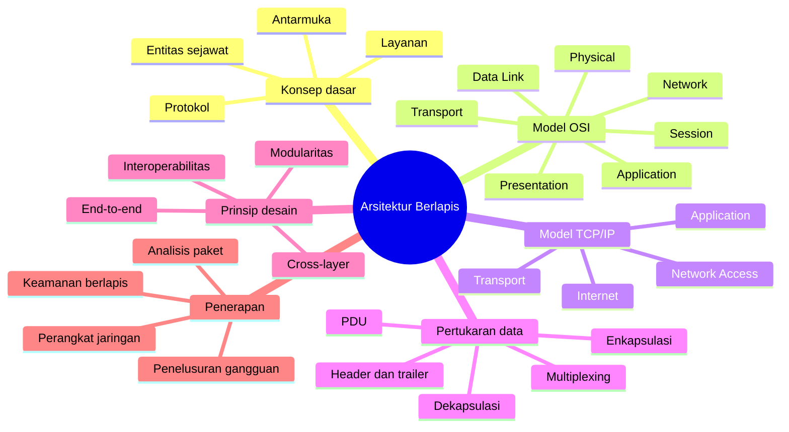
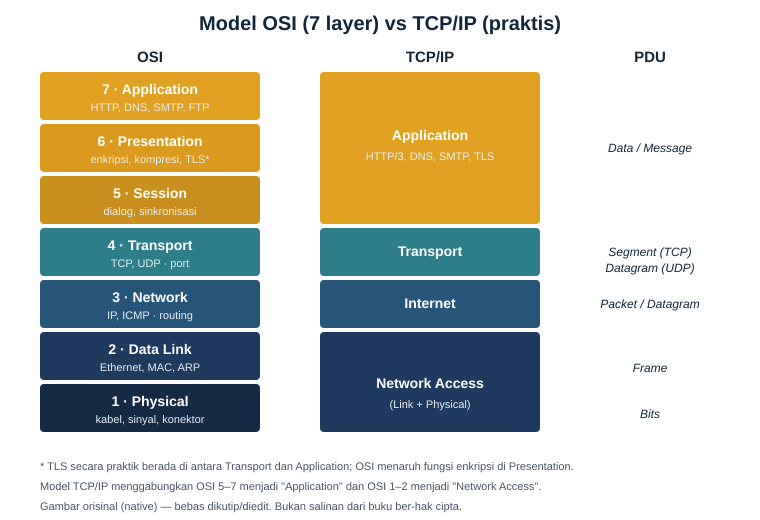
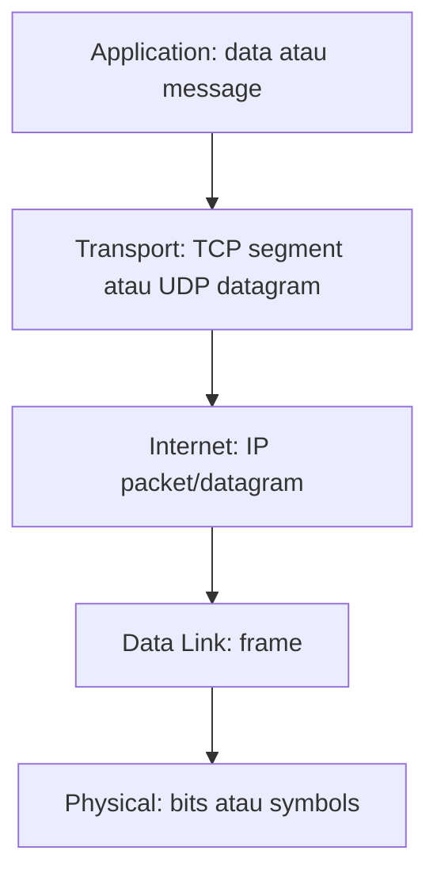
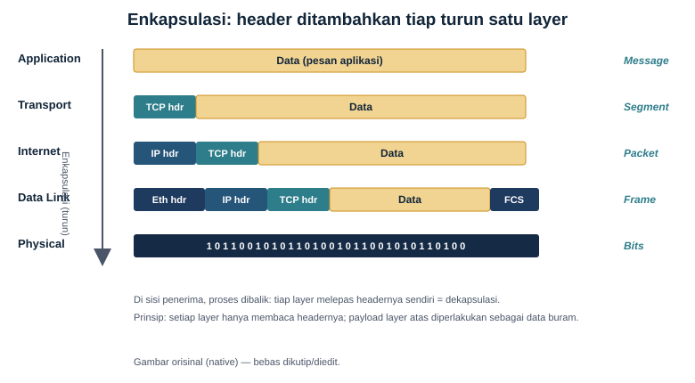
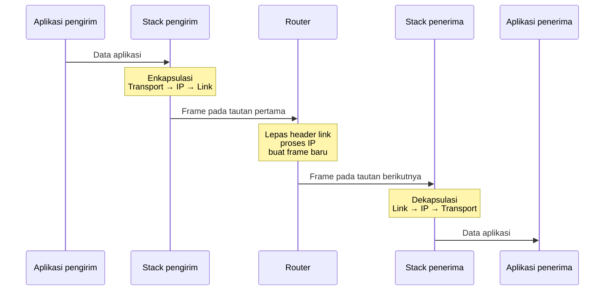

# Bab 2 — Model Referensi OSI dan TCP/IP

| Pemetaan | Keterangan |
|---|---|
| **CPMK** | CPMK-1 (memahami fungsi setiap lapisan OSI dan TCP/IP serta proses enkapsulasi dan dekapsulasi) |
| **Sub-CPMK** | Sub-CPMK-2 (menjelaskan model OSI dan TCP/IP, hubungan antarlapisan, serta proses pertukaran data) |
| **Kemampuan akhir (RPS Minggu 2)** | Menjelaskan cara kerja protokol jaringan, membandingkan model OSI dan TCP/IP, serta menganalisis enkapsulasi dan dekapsulasi data |
| **Rujukan inti** | Forouzan, *TCP/IP Protocol Suite*, Bab 2; Tanenbaum, Feamster, dan Wetherall, *Computer Networks*, Bab 1; Kurose dan Ross, *Computer Networking: A Top-Down Approach*, bagian lapisan protokol; ISO/IEC 7498-1; RFC 1122 dan RFC 1123 |

---

## Peta Konsep

---

## 2.1 Mengapa Komunikasi Jaringan Perlu Disusun Berlapis?

Komunikasi jaringan melibatkan masalah yang sangat beragam. Perangkat harus mengubah bit menjadi sinyal, mengatur penggunaan media, mengenali tujuan lokal, menentukan jalur antarsubnet, membedakan proses aplikasi, menangani kehilangan data, menyepakati format informasi, dan memberi layanan yang dapat digunakan manusia. Apabila seluruh fungsi tersebut dirancang sebagai satu mekanisme besar, sistem akan sulit dikembangkan, diuji, dan diperbaiki.

Pendekatan berlapis membagi masalah komunikasi menjadi sejumlah bagian yang memiliki tanggung jawab relatif jelas. Setiap lapisan menyediakan layanan kepada lapisan di atasnya dan menggunakan layanan lapisan di bawahnya. Pemisahan ini tidak berarti setiap lapisan bekerja sendiri. Komunikasi hanya berhasil apabila seluruh lapisan yang dibutuhkan bekerja sebagai satu rangkaian.

Analogi layanan pengiriman dapat membantu. Penulis dokumen berfokus pada isi, petugas administrasi menyiapkan alamat dan kemasan, perusahaan logistik menentukan rute, sedangkan kendaraan membawa barang melalui media fisik. Setiap pihak tidak harus memahami seluruh pekerjaan pihak lain. Penulis tidak perlu mengetahui mesin kendaraan, dan pengemudi tidak perlu memahami isi dokumen. Akan tetapi, antarmuka di antara mereka harus jelas: bentuk paket, alamat tujuan, batas ukuran, waktu penyerahan, dan prosedur jika pengiriman gagal.

Dalam jaringan, pemisahan tersebut menghasilkan beberapa manfaat utama.

1. **Modularitas.** Fungsi yang kompleks dibagi menjadi modul yang lebih kecil dan lebih mudah dipahami.
2. **Interoperabilitas.** Perangkat dan perangkat lunak dari pembuat berbeda dapat berkomunikasi apabila menerapkan protokol yang sama.
3. **Evolusi independen.** Teknologi pada satu lapisan dapat berubah tanpa mengharuskan seluruh sistem didesain ulang, selama layanan dan antarmukanya tetap kompatibel.
4. **Pengujian dan penelusuran gangguan.** Gejala dapat dilokalisasi berdasarkan fungsi lapisan, sehingga proses diagnosis lebih terarah.
5. **Penggunaan kembali.** Satu protokol lapisan bawah dapat mendukung banyak aplikasi, dan satu aplikasi dapat berjalan di atas beberapa teknologi akses.

Sebagai contoh, aplikasi web yang sama dapat digunakan melalui Ethernet, Wi-Fi, jaringan seluler, atau serat optik. HTTP tidak perlu memiliki versi terpisah untuk setiap media. IP menyediakan abstraksi pengantaran paket sehingga aplikasi tidak harus mengetahui karakter fisik jalur. Pada arah sebaliknya, Ethernet dapat membawa berbagai protokol lapisan atas melalui mekanisme identifikasi yang disepakati.

Pendekatan berlapis tetap memiliki biaya. Setiap lapisan menambahkan informasi kendali, pemrosesan, dan kemungkinan duplikasi fungsi. Batas lapisan juga tidak selalu bersih. Informasi kualitas jaringan kadang diperlukan aplikasi, perangkat keamanan memeriksa beberapa lapisan sekaligus, dan protokol modern dapat menggabungkan fungsi yang dalam model klasik ditempatkan terpisah. Oleh karena itu, model lapisan harus digunakan sebagai alat analisis, bukan sebagai gambaran fisik yang mutlak.

## 2.2 Tiga Konsep Pokok: Layanan, Antarmuka, dan Protokol

Istilah **layanan**, **antarmuka**, dan **protokol** sering dipertukarkan, padahal ketiganya menjelaskan hubungan yang berbeda.

### 2.2.1 Layanan

Layanan menjelaskan **apa yang diberikan oleh sebuah lapisan kepada lapisan di atasnya**. Lapisan transport, misalnya, dapat menyediakan komunikasi antaraplikasi. Bergantung pada protokolnya, layanan tersebut dapat berorientasi koneksi dan andal atau tanpa koneksi dengan overhead lebih rendah. Fokus layanan adalah kemampuan yang terlihat oleh pengguna lapisan, bukan rincian cara kemampuan itu diwujudkan.

Layanan dapat bersifat *connection-oriented* atau *connectionless*. Pada layanan berorientasi koneksi, pihak-pihak membentuk konteks komunikasi sebelum bertukar data. Pada layanan tanpa koneksi, setiap unit data dapat dikirim tanpa pembentukan sesi transport formal. Perbedaan ini tidak boleh disederhanakan menjadi “andal” dan “tidak andal” semata. Keandalan dapat dibangun pada lapisan atau aplikasi lain, dan suatu koneksi tidak menjamin aplikasi selalu berhasil.

### 2.2.2 Antarmuka

Antarmuka menjelaskan **bagaimana lapisan di atas mengakses layanan lapisan di bawah pada sistem yang sama**. Dalam implementasi, antarmuka dapat berbentuk pemanggilan fungsi, *socket API*, antrean, struktur data, driver, atau mekanisme kernel. Aplikasi menggunakan antarmuka socket untuk meminta sistem operasi mengirim atau menerima data melalui protokol transport.

Model referensi tidak selalu menentukan bentuk antarmuka pemrograman secara rinci. Ia menjelaskan batas tanggung jawab konseptual. Implementasi yang berbeda dapat menyediakan API berbeda selama perilaku protokol di jaringan tetap kompatibel.

### 2.2.3 Protokol

Protokol menjelaskan **aturan komunikasi antara entitas sejawat pada lapisan yang sama di sistem berbeda**. Aturan tersebut meliputi format pesan, makna field, urutan pertukaran, kondisi waktu, serta tindakan ketika terjadi kesalahan. TCP pada host pengirim secara logis berkomunikasi dengan TCP pada host penerima; IP berkomunikasi secara logis dengan IP; dan Ethernet pada satu antarmuka berinteraksi dengan entitas lapisan data link pada tautan lokal.

Komunikasi sejawat bersifat logis. Data TCP tidak melompat langsung dari lapisan transport pengirim ke lapisan transport penerima. Data turun melalui lapisan di bawahnya, melintasi media, kemudian naik kembali. Header memungkinkan entitas sejawat menafsirkan informasi yang menjadi tanggung jawabnya.

| Konsep | Pertanyaan utama | Hubungan |
|---|---|---|
| **Layanan** | Apa yang disediakan lapisan ini? | Lapisan bawah kepada lapisan atas |
| **Antarmuka** | Bagaimana layanan lokal diakses? | Antarlapisan pada sistem yang sama |
| **Protokol** | Bagaimana entitas sejawat berkomunikasi? | Lapisan yang sama pada sistem berbeda |

Pembedaan tersebut penting dalam rekayasa. Sebuah protokol dapat diganti tanpa mengubah layanan yang dilihat aplikasi. Sebaliknya, dua implementasi dapat menggunakan antarmuka internal berbeda tetapi tetap interoperabel karena format protokol pada jaringan sama.

## 2.3 Model Referensi OSI: Tujuan dan Kedudukannya

**Open Systems Interconnection (OSI) Basic Reference Model** dikembangkan untuk menyediakan kerangka bersama bagi standardisasi komunikasi sistem terbuka. Model ini dikenal melalui tujuh lapisan. ISO menjelaskan bahwa model tersebut memberikan dasar koordinasi pengembangan standar dan menempatkan standar yang ada dalam perspektif keseluruhan; model ini **bukan spesifikasi implementasi**. Pernyataan tersebut penting karena OSI sering keliru diperlakukan sebagai tumpukan perangkat lunak yang harus diwujudkan persis tujuh komponen.

Edisi awal ISO 7498 diterbitkan pada 1984 dan kemudian digantikan oleh ISO/IEC 7498-1:1994. Dengan demikian, menyebut “OSI 1984” berguna untuk konteks sejarah, tetapi rujukan normatif yang lebih tepat adalah edisi penggantinya. Model OSI tetap digunakan luas sebagai bahasa konseptual untuk menjelaskan lokasi fungsi, jenis gangguan, dan kemampuan perangkat.

Tujuh lapisan OSI dari bawah ke atas adalah Physical, Data Link, Network, Transport, Session, Presentation, dan Application. Urutan tersebut tidak seharusnya dihafal tanpa pemahaman. Pertanyaan yang lebih penting ialah: masalah apa yang diselesaikan setiap lapisan, informasi kendali apa yang digunakan, dan sejauh mana fungsi tersebut tampak dalam protokol Internet nyata?

*Gambar 2.1 — Pemetaan konseptual tujuh lapisan OSI terhadap model TCP/IP. Pemetaan bersifat pendekatan, bukan kesetaraan satu banding satu.*

## 2.4 Lapisan 1 — Physical

Lapisan **Physical** bertanggung jawab membawa bit melalui media. Fokusnya mencakup representasi bit sebagai sinyal, karakteristik elektrik atau optik, frekuensi radio, konektor, modulasi, pengodean garis, sinkronisasi, laju simbol, topologi fisik, serta parameter media.

Lapisan ini tidak menafsirkan alamat IP atau nomor port. Bagi lapisan Physical, aliran data pada dasarnya merupakan urutan simbol yang harus dikirimkan dan dipulihkan. Gangguan pada lapisan ini dapat berbentuk kabel putus, konektor buruk, redaman berlebihan, interferensi radio, ketidaksesuaian transceiver, atau daya optik di luar ambang.

Peralatan dan standar pada lapisan Physical tidak selalu berdiri sendiri. Spesifikasi Ethernet, misalnya, memiliki aspek Physical dan Data Link. Wi-Fi juga mencakup mekanisme radio serta kontrol akses media. Karena itu, menggolongkan satu standar hanya ke satu lapisan dapat menutupi kenyataan bahwa dokumen teknis sering merentang beberapa fungsi.

Indikator seperti *link up* memberikan bukti bahwa sebagian fungsi fisik bekerja, tetapi tidak membuktikan komunikasi end-to-end berhasil. Antarmuka dapat menyala sementara VLAN salah, alamat IP keliru, atau routing tidak tersedia. Sebaliknya, gangguan fisik intermiten dapat muncul sebagai kehilangan paket pada lapisan atas. Hubungan sebab-akibat lintas lapisan inilah yang membuat diagnosis memerlukan korelasi.

## 2.5 Lapisan 2 — Data Link

Lapisan **Data Link** menyediakan pengiriman unit data pada satu tautan atau domain lokal. Unit datanya lazim disebut **frame**. Fungsi utamanya mencakup pembentukan frame, pengalamatan lokal, pengendalian akses media, deteksi kesalahan, serta penerusan pada jaringan lokal.

Pada Ethernet, alamat MAC digunakan untuk mengidentifikasi antarmuka dalam konteks Layer 2. Switch mempelajari hubungan alamat sumber dengan port dan menggunakan tabel tersebut untuk meneruskan frame. Apabila alamat tujuan belum diketahui, switch dapat melakukan *flooding* dalam domain yang sesuai. Broadcast juga diteruskan dalam broadcast domain, sehingga ukuran dan desain domain Layer 2 memengaruhi kinerja dan risiko.

Frame biasanya memiliki header dan trailer. Header membawa informasi seperti alamat sumber, alamat tujuan, serta tipe protokol lapisan atas. Trailer dapat memuat Frame Check Sequence untuk mendeteksi perubahan bit selama transmisi. Deteksi kesalahan tidak selalu berarti koreksi atau pengiriman ulang pada lapisan ini. Tindakan setelah kesalahan bergantung pada teknologi dan protokol.

VLAN memungkinkan satu infrastruktur switch dipisahkan menjadi beberapa domain logis. Perangkat pada VLAN berbeda memerlukan fungsi Layer 3 untuk berkomunikasi. Hal ini menunjukkan bahwa batas logis tidak selalu mengikuti kabel fisik. Satu switch dapat membawa banyak VLAN, dan satu VLAN dapat merentang beberapa switch.

Istilah “Layer 2” sering digunakan terlalu luas. ARP, misalnya, kerap ditempatkan di Layer 2, Layer 2.5, atau batas antara Link dan Internet karena ia memetakan alamat protokol jaringan ke alamat tautan. Perbedaan klasifikasi tersebut tidak mengubah cara ARP bekerja. Dalam analisis teknis, penjelasan fungsi lebih bernilai daripada perdebatan label.

## 2.6 Lapisan 3 — Network

Lapisan **Network** menyediakan pengalamatan logis dan pengantaran paket melintasi beberapa jaringan. Dalam keluarga TCP/IP, fungsi ini terutama dijalankan oleh Internet Protocol. Unit datanya disebut **packet** atau **IP datagram**.

Router membaca informasi alamat tujuan IP dan memilih *next hop* berdasarkan tabel penerusan. Alamat Layer 3 dirancang agar dapat dikelompokkan secara hierarkis melalui prefix. Hierarki memungkinkan agregasi rute dan membatasi ukuran informasi routing. Konsep pengalamatan, subnet, dan routing akan dibahas lebih rinci pada bab berikutnya.

Layanan IP bersifat *best effort*. IP berusaha mengirimkan datagram, tetapi tidak menjamin setiap paket sampai, tiba satu kali, atau tiba berurutan. Jaminan tambahan dapat disediakan oleh protokol transport atau aplikasi. Sifat ini bukan kekurangan yang tidak disengaja; ia membantu mempertahankan inti jaringan yang umum dan relatif sederhana.

Setiap router biasanya mengurangi nilai TTL pada IPv4 atau Hop Limit pada IPv6. Jika nilainya mencapai batas, paket dibuang dan pesan diagnostik dapat dihasilkan. Mekanisme tersebut mencegah paket berputar tanpa batas akibat loop routing. Perubahan TTL/Hop Limit menunjukkan bahwa pernyataan “header IP tidak pernah berubah di perjalanan” tidak sepenuhnya benar.

ICMP mendukung pelaporan kesalahan dan diagnostik pada lapisan Internet. Walaupun pesan ICMP dibawa di dalam datagram IP, pemrosesannya dianggap bagian dari fungsi Internet layer. Ini merupakan contoh bahwa enkapsulasi fisik tidak selalu menentukan posisi konseptual protokol secara sederhana.

## 2.7 Lapisan 4 — Transport

Lapisan **Transport** menyediakan komunikasi logis antaraplikasi yang berjalan pada host berbeda. Jika Layer 3 mengantarkan paket ke host, Layer 4 membantu menyerahkan data kepada proses aplikasi yang tepat. Nomor port digunakan untuk multiplexing dan demultiplexing komunikasi.

TCP menyediakan layanan berorientasi koneksi, aliran byte andal, pengurutan, retransmisi, kontrol aliran, dan kontrol kemacetan. UDP menyediakan layanan datagram yang lebih sederhana, tanpa pembentukan koneksi dan tanpa mekanisme keandalan bawaan seperti TCP. Pilihan di antara keduanya bergantung pada kebutuhan aplikasi, bukan pada anggapan bahwa TCP selalu lebih baik.

Istilah PDU perlu digunakan cermat. Unit data TCP lazim disebut **segment**, sedangkan unit UDP disebut **UDP datagram**. Dalam percakapan umum, semua unit sering disebut paket. Penggunaan “paket” tidak selalu salah secara informal, tetapi terminologi yang lebih spesifik membantu diagnosis dan dokumentasi.

Lapisan transport juga menghadapi hubungan dengan ukuran data. TCP memecah aliran byte menjadi segment sesuai kondisi koneksi dan batas jalur. UDP mempertahankan batas pesan datagram, tetapi aplikasi harus mempertimbangkan ukuran agar tidak memicu fragmentasi atau kegagalan Path MTU. Lapisan tidak menghapus seluruh tanggung jawab aplikasi.

QUIC menunjukkan bahwa fungsi transport dapat diimplementasikan di ruang pengguna di atas UDP. Secara arsitektural, QUIC tetap merupakan protokol transport, meskipun paketnya dibawa oleh UDP. Hal ini menegaskan bahwa posisi model ditentukan oleh fungsi dan layanan, bukan hanya oleh protokol pembungkus.

## 2.8 Lapisan 5 — Session

Lapisan **Session** mengelola dialog atau sesi antara aplikasi. Fungsi konseptualnya meliputi pembentukan, pemeliharaan, sinkronisasi, dan pengakhiran sesi. Model OSI memisahkan fungsi ini agar aplikasi tidak harus mengatur seluruh mekanisme dialog sendiri.

Dalam tumpukan Internet, tidak terdapat satu protokol Session universal yang selalu terpisah. Fungsi sesi sering diwujudkan oleh protokol aplikasi, pustaka, framework, token, cookie, RPC, atau kemampuan transport. Sesi login pada aplikasi web, misalnya, bukan koneksi TCP itu sendiri. Koneksi TCP dapat berakhir sementara sesi aplikasi tetap berlaku melalui token. Sebaliknya, satu koneksi dapat membawa beberapa transaksi atau aliran.

Pembedaan ini penting dalam keamanan dan penelusuran gangguan. Pengguna dapat memiliki konektivitas Layer 4 yang baik tetapi sesi aplikasi gagal karena token kedaluwarsa, ketidaksesuaian waktu, atau state pada server. Menyebut semua kegagalan tersebut sebagai “masalah jaringan” akan memperlambat diagnosis.

Checkpoint dan pemulihan dialog juga termasuk gagasan Session. Pada transfer atau proses panjang, aplikasi dapat menyimpan posisi sehingga tidak harus mengulang dari awal setelah gangguan. Dalam sistem modern, fungsi tersebut sering menjadi bagian protokol aplikasi atau logika bisnis.

## 2.9 Lapisan 6 — Presentation

Lapisan **Presentation** menangani representasi data agar pihak-pihak memiliki pemahaman yang sama. Fungsi konseptualnya mencakup serialisasi, konversi format, pengodean karakter, kompresi, serta transformasi kriptografis.

Komputer dapat menyimpan nilai yang sama dengan representasi berbeda. Urutan byte, tipe data, format waktu, encoding teks, dan struktur objek harus disepakati. JSON, XML, CBOR, Protocol Buffers, JPEG, dan berbagai format media menjalankan sebagian fungsi representasi. Dalam model TCP/IP, fungsi tersebut biasanya dianggap bagian dari Application layer atau pustaka pendukung.

Enkripsi sering dipetakan ke Presentation layer dalam materi pengantar. Pemetaan ini berguna secara konseptual, tetapi tidak boleh dianggap aturan universal. IPsec bekerja pada lapisan Internet, MACsec melindungi komunikasi Layer 2, TLS berada di antara aplikasi dan transport dalam pemetaan tradisional, sedangkan enkripsi aplikasi dapat dilakukan sebelum data diserahkan ke jaringan. Pertanyaan yang tepat bukan hanya “enkripsi ada di layer berapa”, melainkan aset apa yang dilindungi, pada rentang mana, terhadap ancaman siapa, dan metadata apa yang masih terlihat.

Kompresi juga memerlukan konteks. Kompresi pada format aplikasi dapat mengurangi data, tetapi kompresi sebelum enkripsi biasanya lebih efektif daripada setelah enkripsi. Pada kondisi tertentu, interaksi kompresi dan data rahasia dapat menciptakan kebocoran melalui ukuran. Karena itu, fungsi Presentation memiliki konsekuensi keamanan, bukan sekadar masalah format.

## 2.10 Lapisan 7 — Application

Lapisan **Application** menyediakan protokol dan layanan jaringan yang digunakan proses aplikasi. HTTP mendukung pertukaran sumber daya web, DNS mendukung penamaan, SMTP menangani pengiriman surat elektronik, SSH menyediakan akses terminal aman, dan DHCP membantu konfigurasi jaringan.

Application layer bukan berarti seluruh aplikasi pengguna berada “di dalam jaringan”. Antarmuka grafis, logika bisnis, dan penyimpanan lokal tidak seluruhnya merupakan fungsi protokol aplikasi. Lapisan ini membahas bagian komunikasi yang memungkinkan aplikasi berinteraksi melalui jaringan.

Protokol aplikasi menentukan struktur pesan, makna permintaan dan respons, autentikasi tertentu, penanganan kesalahan, dan state yang diperlukan. Beberapa protokol menggunakan teks yang dapat dibaca, sementara yang lain menggunakan format biner. Banyak protokol aplikasi modern menggunakan TLS untuk kerahasiaan dan autentikasi saluran.

DNS memperlihatkan bahwa satu layanan aplikasi dapat menggunakan beberapa transport. Kueri tertentu lazim menggunakan UDP, sementara kondisi lain menggunakan TCP. DNS juga dapat dibawa melalui TLS atau HTTPS. Karena itu, tabel yang memasangkan satu protokol aplikasi dengan tepat satu protokol transport hanyalah penyederhanaan pembelajaran.

## 2.11 Model TCP/IP: Arsitektur yang Digunakan Internet

Model TCP/IP berakar pada keluarga protokol Internet yang dikembangkan untuk menghubungkan jaringan heterogen. Berbeda dari OSI yang terutama berfungsi sebagai model referensi, TCP/IP tumbuh bersama protokol yang diimplementasikan secara luas. RFC 1122 membahas persyaratan host untuk Link, Internet, dan Transport, sedangkan RFC 1123 membahas protokol aplikasi dan pendukung.

Jumlah lapisan TCP/IP dapat ditampilkan sebagai empat atau lima, bergantung pada kebutuhan pengajaran.

### Model empat lapisan

1. **Application** menggabungkan fungsi Application, Presentation, dan Session OSI.
2. **Transport** menyediakan komunikasi antaraplikasi.
3. **Internet** menyediakan pengalamatan dan pengantaran datagram lintas jaringan.
4. **Network Access/Link** mencakup akses media dan transmisi pada jaringan lokal.

### Model lima lapisan

Banyak buku pengantar memisahkan Link dan Physical sehingga membentuk Application, Transport, Network/Internet, Data Link, dan Physical. Model lima lapisan berguna untuk pembelajaran karena karakter sinyal dan media dapat dibedakan dari framing serta switching. Model tersebut bukan keluarga protokol baru; ia adalah cara penyajian.

| Model TCP/IP | Fungsi utama | Contoh protokol/teknologi |
|---|---|---|
| **Application** | Layanan aplikasi, representasi, dan sesi | HTTP, DNS, SMTP, SSH, DHCP, TLS dalam pemetaan praktis |
| **Transport** | Komunikasi antaraplikasi | TCP, UDP, QUIC secara fungsional |
| **Internet** | Pengalamatan dan routing | IPv4, IPv6, ICMP |
| **Network Access** | Pengiriman pada tautan dan media | Ethernet, Wi-Fi, PPP, serat, radio |

Kekuatan arsitektur TCP/IP terletak pada lapisan Internet yang menyediakan cara umum untuk membawa datagram melintasi jaringan berbeda. Jaringan bawah dapat berubah, sementara aplikasi tetap menggunakan abstraksi komunikasi IP. Pada saat yang sama, IP tidak menjamin seluruh kebutuhan aplikasi, sehingga lapisan ujung memiliki ruang untuk memilih TCP, UDP, QUIC, atau mekanisme lain.

## 2.12 Membandingkan OSI dan TCP/IP Secara Kritis

Pernyataan “OSI adalah teori dan TCP/IP adalah praktik” membantu sebagai pengantar, tetapi terlalu sederhana. OSI menyediakan kosakata dan pemisahan fungsi yang masih digunakan. TCP/IP juga memiliki model konseptual, bukan sekadar sekumpulan program. Keduanya lahir dari latar sejarah dan tujuan berbeda.

| Aspek | Model OSI | Model TCP/IP |
|---|---|---|
| Tujuan utama | Kerangka referensi standardisasi sistem terbuka | Arsitektur dan keluarga protokol internetworking |
| Jumlah lapisan | Tujuh | Empat atau lima dalam penyajian umum |
| Lapisan atas | Application, Presentation, Session terpisah | Digabung dalam Application |
| Lapisan bawah | Physical dan Data Link terpisah | Dapat digabung sebagai Network Access |
| Penggunaan | Pendidikan, analisis, terminologi perangkat dan gangguan | Implementasi Internet dan desain protokol nyata |
| Sifat pemetaan | Fungsi dipisahkan lebih rinci | Batas fungsi lebih pragmatis |

Tidak ada pemetaan satu banding satu yang sempurna. TLS dapat dipandang sebagai Presentation, Session, bagian Application, atau protokol keamanan di atas transport, bergantung pada sudut analisis. ARP berada di batas Link dan Internet. ICMP dienkapsulasi oleh IP tetapi merupakan bagian fungsi Internet. QUIC berjalan di atas UDP namun menyediakan layanan transport.

Ketidakrapian tersebut bukan alasan membuang model. Model tetap berguna selama asumsi dan batasnya dinyatakan. Dalam pendidikan, OSI membantu mahasiswa memisahkan sinyal, frame, paket, segmen, sesi, dan data aplikasi. Dalam operasi, model TCP/IP lebih dekat dengan protokol yang benar-benar terlihat pada host dan jaringan.

## 2.13 Protocol Data Unit, Header, Trailer, dan Payload

Setiap lapisan menangani unit data yang disebut **Protocol Data Unit (PDU)**. PDU berisi informasi kendali lapisan tersebut dan payload yang diterima dari lapisan atas.

| Lapisan | PDU umum | Contoh informasi kendali | Bentuk pengenal |
|---|---|---|---|
| Application | Data/message | Metode, tipe konten, nama layanan | Nama domain, URI, identitas aplikasi |
| Transport | Segment/datagram | Port, sequence number, checksum | Nomor port atau endpoint transport |
| Internet | Packet/IP datagram | Alamat IP, Hop Limit/TTL, next header | Alamat IP dan prefix |
| Data Link | Frame | Alamat lokal, EtherType, FCS | Alamat MAC atau pengenal link lain |
| Physical | Bit/symbol | Pengodean dan sinkronisasi | Karakteristik sinyal dan antarmuka |

**Header** diletakkan sebelum payload dan membawa informasi kendali. **Trailer** diletakkan setelah payload; Ethernet, misalnya, menggunakan FCS pada akhir frame. Tidak setiap protokol memiliki trailer. **Payload** adalah data yang dibawa, yang biasanya merupakan PDU dari lapisan di atas.

Ukuran header dan trailer disebut overhead karena tidak menjadi muatan aplikasi langsung. Namun, menyebutnya “pemborosan” tidak tepat. Informasi tersebut memungkinkan pengalamatan, integritas, pengurutan, multiplexing, dan fungsi penting lain. Efisiensi diukur dengan membandingkan manfaat kendali terhadap biaya tambahan pada konteks tertentu.

## 2.14 Enkapsulasi: Data Turun Melalui Tumpukan

**Enkapsulasi** adalah proses menambahkan informasi kendali ketika data bergerak dari lapisan atas menuju lapisan bawah pada pengirim. Misalkan peramban mengirim permintaan HTTPS melalui koneksi TCP pada Ethernet dan IPv4.

1. Application menghasilkan pesan HTTP. TLS mentransformasikan dan melindungi data sesuai sesi keamanan.
2. TCP menerima byte, membentuk segment, dan menambahkan header yang memuat port serta informasi keandalan.
3. IPv4 menerima segment sebagai payload, menambahkan header IP yang memuat alamat sumber dan tujuan.
4. Ethernet menerima datagram IP sebagai payload, menambahkan header Layer 2 dan trailer FCS.
5. Physical mengubah frame menjadi sinyal atau simbol untuk dikirim melalui media.

*Gambar 2.2 — Setiap lapisan menambahkan informasi kendali saat data bergerak turun; penerima melakukan proses kebalikan.*

Secara konseptual, bentuknya dapat ditulis:

$$
Frame = L2Header + IPHeader + TCPHeader + Data + L2Trailer
$$

Jika data aplikasi berukuran kecil, persentase overhead dapat besar. Jika data sangat besar, protokol memecahnya menjadi beberapa unit sesuai batas. Maximum Transmission Unit (MTU) membatasi ukuran payload Layer 2 tertentu. TCP menggunakan informasi seperti Maximum Segment Size untuk menyesuaikan segment. Hubungan ukuran tersebut akan dibahas lebih lanjut pada bab IP dan transport.

Prinsip “lapisan hanya membaca headernya sendiri” merupakan penyederhanaan yang berguna, tetapi tidak absolut. Router normal berfokus pada header jaringan, switch pada informasi link, dan host tujuan pada header transport. Namun, firewall, NAT, load balancer, dan sistem inspeksi dapat membaca atau mengubah informasi beberapa lapisan. Optimasi perangkat keras juga dapat memproses banyak header dalam satu pipeline.

## 2.15 Dekapsulasi dan Demultiplexing

**Dekapsulasi** adalah proses pemeriksaan dan pelepasan informasi kendali ketika data bergerak dari lapisan bawah menuju aplikasi penerima.

1. Antarmuka menerima sinyal dan memulihkan bit.
2. Lapisan Data Link memeriksa frame, alamat tujuan, dan integritas. EtherType membantu menentukan payload berikutnya, misalnya IPv4 atau IPv6.
3. Lapisan Internet memeriksa header IP. Field Protocol pada IPv4 atau Next Header pada IPv6 menunjukkan handler berikutnya, seperti TCP, UDP, atau ICMP.
4. Lapisan Transport menggunakan nomor port dan konteks koneksi untuk menyerahkan data kepada socket atau proses yang tepat.
5. Lapisan Application menafsirkan data menurut protokol dan formatnya.

Proses memilih penerima berikutnya disebut **demultiplexing**. Arah kebalikannya, ketika banyak aplikasi menggunakan layanan transport dan jaringan yang sama, disebut **multiplexing**. Tanpa pengenal di setiap batas, penerima tidak mengetahui cara menafsirkan payload.

Dekapsulasi tidak selalu berarti semua header dihapus oleh satu perangkat. Switch meneruskan frame tanpa membuka payload aplikasi. Router menerima frame, mengeluarkan paket IP, memproses header IP, kemudian membungkus paket ke frame baru untuk tautan berikutnya. Hanya host tujuan yang melakukan dekapsulasi sampai aplikasi, kecuali terdapat perangkat perantara yang secara sengaja bertindak sebagai proxy atau terminator.

## 2.16 Apa yang Berubah pada Setiap Hop?

Memahami perubahan header di sepanjang jalur mencegah miskonsepsi penting.

Ketika paket melewati router, frame Layer 2 untuk tautan lama tidak diteruskan apa adanya. Router menghapus enkapsulasi link masuk dan membuat frame baru sesuai teknologi serta alamat pada tautan keluar. Oleh karena itu, alamat MAC sumber dan tujuan umumnya berubah pada setiap domain Layer 2 yang dirutekan.

Alamat IP sumber dan tujuan biasanya tetap end-to-end, tetapi terdapat pengecualian. NAT dapat mengubah alamat dan port. Tunnel menambahkan header luar baru. Proxy mengakhiri satu koneksi dan membentuk koneksi berbeda. Load balancer dapat menerjemahkan tujuan. Selain itu, TTL atau Hop Limit berubah pada router, checksum IPv4 dapat dihitung ulang, dan fragmentasi IPv4 mungkin terjadi dalam kondisi tertentu.

Nomor port biasanya tetap selama satu aliran end-to-end, tetapi NAT/PAT atau proxy dapat mengubahnya. Sequence number TCP diproses oleh endpoint transport, sedangkan router biasa tidak menggunakannya untuk penerusan. Perangkat keamanan stateful dapat mengamati informasi ini untuk melacak koneksi.

| Elemen | Pada host pengirim | Pada router biasa | Pada host penerima |
|---|---|---|---|
| Header/trailer Layer 2 | Dibuat | Dilepas dan dibuat ulang | Diperiksa dan dilepas |
| Alamat IP | Dibuat | Dibaca; umumnya tetap | Diperiksa |
| TTL/Hop Limit | Diinisialisasi | Dikurangi | Diperiksa |
| Header transport | Dibuat | Biasanya tidak diubah | Diperiksa dan dilepas |
| Data aplikasi | Dihasilkan | Diperlakukan sebagai payload | Ditafsirkan |

## 2.17 Pengalamatan pada Berbagai Lapisan

Setiap lapisan menggunakan pengenal sesuai lingkup tugasnya. Alamat MAC mendukung pengiriman lokal pada teknologi tertentu. Alamat IP mendukung pengantaran lintas jaringan. Nomor port mengidentifikasi endpoint transport atau proses komunikasi. Nama domain dan URI membantu pengguna serta aplikasi menemukan layanan.

Pengenal tersebut tidak dapat saling menggantikan. Router Internet tidak meneruskan paket berdasarkan alamat MAC laptop asal karena alamat link hanya bermakna pada domain lokal. Nomor port tidak menentukan jalur antarjaringan. Nama domain perlu diterjemahkan menjadi informasi yang dapat digunakan koneksi, tetapi satu nama dapat menghasilkan beberapa alamat karena redundansi, CDN, atau kebijakan.

Proses komunikasi memerlukan resolusi di beberapa tingkat. DNS memetakan nama ke data layanan atau alamat. Pada jaringan lokal IPv4, ARP membantu menemukan alamat link untuk next hop. Pada IPv6, Neighbor Discovery menjalankan fungsi terkait dengan mekanisme berbeda. Tabel routing menentukan next hop, dan tabel forwarding Layer 2 menentukan port keluaran.

Kesalahan pada satu pemetaan dapat terlihat seperti kegagalan lapisan lain. Pengguna mungkin menyimpulkan “server mati” ketika DNS gagal. Host dapat memiliki alamat IP benar tetapi tidak dapat mencapai gateway karena resolusi tetangga gagal. Oleh sebab itu, penelusuran gangguan harus menguji setiap ketergantungan, bukan hanya konektivitas umum.

## 2.18 Perangkat Jaringan dan Lapisan: Pemetaan yang Tidak Mutlak

Materi dasar sering memetakan repeater ke Layer 1, switch ke Layer 2, router ke Layer 3, dan firewall aplikasi ke Layer 7. Pemetaan tersebut berguna untuk fungsi utama, tetapi perangkat modern sering bekerja pada banyak lapisan.

| Perangkat/fungsi | Lapisan dominan | Catatan |
|---|---|---|
| Repeater/media converter | Physical | Meregenerasi atau mengubah media tanpa keputusan paket |
| Ethernet switch | Data Link | Dapat memiliki fungsi VLAN, QoS, keamanan, dan manajemen IP |
| Router | Network | Meneruskan paket; dapat menjalankan ACL, NAT, QoS, dan tunnel |
| Stateful firewall | Network–Transport | Melacak aliran dan dapat memeriksa protokol aplikasi |
| Load balancer | Transport–Application | Dapat meneruskan koneksi atau mengakhiri TLS/HTTP |
| Proxy | Application | Mengakhiri sesi aplikasi dan membuat komunikasi baru |
| Access point | Physical–Data Link | Menjembatani akses radio dan jaringan distribusi dengan fungsi keamanan |

Istilah “Layer 3 switch” menunjukkan perangkat switch yang juga mampu melakukan routing. “Layer 7 firewall” menunjukkan inspeksi atau kebijakan berdasarkan konteks aplikasi. Label tersebut menjelaskan fitur, bukan membuktikan perangkat hanya bekerja di satu lapisan.

Perangkat virtual juga menjalankan fungsi yang sama tanpa bentuk perangkat keras khusus. Router virtual, virtual switch, firewall awan, dan service mesh membuktikan bahwa lapisan adalah fungsi arsitektural, bukan posisi fisik di rak.

## 2.19 Prinsip End-to-End

Prinsip **end-to-end** menyatakan bahwa fungsi tertentu hanya dapat diterapkan secara lengkap dengan pengetahuan dan partisipasi sistem akhir. Jaringan perantara dapat membantu, tetapi jaminan akhir sering harus diverifikasi oleh aplikasi atau host.

Sebagai contoh, pemeriksaan kesalahan pada setiap tautan dapat mengurangi korupsi lokal, tetapi tidak membuktikan berkas pada penerima identik dengan yang dimaksud pengirim setelah melalui seluruh sistem. Verifikasi end-to-end tetap diperlukan. Demikian pula, jaringan dapat mencoba mengirim dengan andal, tetapi hanya aplikasi yang mengetahui apakah transaksi bisnis benar-benar selesai.

Prinsip ini mendorong inti jaringan yang umum dan menempatkan banyak kecerdasan pada endpoint. Dampaknya adalah inovasi aplikasi dapat berlangsung tanpa meminta seluruh jaringan memahami aplikasi baru. TCP menjalankan keandalan pada host; enkripsi ujung-ke-ujung melindungi data di antara endpoint yang ditentukan.

Namun, slogan “inti bodoh, ujung cerdas” terlalu kasar. Router menjalankan algoritma forwarding, routing, antrean, QoS, telemetri, dan perlindungan. Middlebox seperti firewall dan NAT telah menjadi bagian nyata Internet. Prinsip end-to-end lebih tepat dipahami sebagai pedoman penempatan fungsi dan argumen tentang kelengkapan, bukan larangan terhadap kecerdasan di jaringan.

Desain harus menanyakan: pihak mana yang memiliki informasi cukup untuk menjamin fungsi, apakah bantuan jaringan meningkatkan kinerja, dan apakah penempatan fungsi menghambat evolusi atau menciptakan state yang rapuh. Jawabannya dapat berbeda menurut layanan.

## 2.20 Kelebihan dan Keterbatasan Arsitektur Berlapis

### 2.20.1 Kelebihan

Arsitektur berlapis mengurangi beban kognitif. Pengembang aplikasi dapat menggunakan socket tanpa mengimplementasikan driver Ethernet. Operator dapat mengganti media akses tanpa mengubah protokol aplikasi. Standardisasi per lapisan mendorong persaingan dan interoperabilitas.

Arsitektur berlapis juga mendukung isolasi perubahan. IPv6 dapat dibawa melalui Ethernet yang juga membawa IPv4. HTTP dapat berkembang dari pemetaan di atas TCP menuju HTTP/3 di atas QUIC tanpa mengganti seluruh infrastruktur fisik. Perubahan tidak sepenuhnya bebas, tetapi batas layanan mengurangi dampaknya.

Dalam penelusuran gangguan, lapisan menyediakan kerangka hipotesis. Jika tidak ada link, pemeriksaan aplikasi belum relevan. Jika ping IP berhasil tetapi nama gagal, DNS menjadi kandidat. Jika koneksi transport terbentuk tetapi transaksi HTTP gagal, analisis bergerak ke lapisan atas.

### 2.20.2 Keterbatasan

Arsitektur berlapis menambah overhead header, penyalinan data, dan pemrosesan. Implementasi modern menggunakan teknik seperti *checksum offload*, *segmentation offload*, *zero-copy*, dan pemrosesan pipeline untuk mengurangi biaya tersebut. Akibatnya, apa yang terlihat pada rekaman paket di host dapat berbeda dari frame aktual di kabel apabila offload belum dipertimbangkan.

Fungsi dapat terduplikasi. Deteksi kesalahan terdapat pada Link, Transport, format data, dan aplikasi. Duplikasi kadang disengaja karena setiap lapisan melindungi ruang lingkup berbeda. Namun, desain yang tidak cermat dapat menghasilkan mekanisme retransmisi berlapis yang saling mengganggu.

Lapisan juga dapat menyembunyikan informasi yang berguna. Aplikasi real-time perlu mengetahui perubahan jalur atau kapasitas, sementara transport memerlukan sinyal dari jaringan untuk mengendalikan kemacetan. *Cross-layer optimization* mencoba menggunakan informasi lintas batas, tetapi meningkatkan keterikatan dan mengurangi modularitas.

## 2.21 Keamanan dalam Perspektif Berlapis

Keamanan tidak berada pada satu lapisan. Setiap lapisan memiliki aset, ancaman, dan kontrol berbeda.

| Lapisan | Contoh ancaman | Contoh kontrol |
|---|---|---|
| Physical | Penyadapan kabel, perusakan, interferensi | Kontrol ruang, pelindung media, redundansi, pemantauan radio |
| Data Link | MAC spoofing, rogue AP, VLAN hopping | 802.1X, port security, segmentasi, WPA3, MACsec sesuai kebutuhan |
| Network | IP spoofing, route hijack, pemindaian | ACL, firewall, IPsec, uRPF, validasi routing |
| Transport | SYN flood, penyalahgunaan port | Stateful filtering, rate limit, proteksi layanan |
| Session/Presentation | Pembajakan sesi, downgrade, sertifikat salah | Manajemen sesi, TLS, validasi sertifikat, rotasi kunci |
| Application | Injeksi, autentikasi lemah, akses tidak sah | Validasi input, otorisasi, secure coding, WAF sebagai kontrol tambahan |

Pertahanan berlapis berarti kontrol saling melengkapi, bukan menumpuk produk sebanyak mungkin. Enkripsi TLS melindungi data aplikasi selama transit antara endpoint TLS, tetapi tidak melindungi endpoint yang telah disusupi. Segmentasi mengurangi pergerakan lateral, tetapi tidak memperbaiki aplikasi rentan. Keamanan fisik tidak menggantikan autentikasi.

Enkripsi juga mengubah observability. Administrator tidak dapat selalu membaca payload, sehingga analisis bergeser ke metadata, log endpoint, pola aliran, dan telemetri aplikasi. Upaya mendapatkan visibilitas harus menghormati privasi, kewenangan, dan tujuan keamanan.

## 2.22 Arsitektur Berlapis sebagai Kerangka Penelusuran Gangguan

Model berlapis membantu menyusun diagnosis, tetapi bukan prosedur kaku. Tiga strategi umum adalah bottom-up, top-down, dan divide-and-conquer.

### 2.22.1 Bottom-up

Pendekatan bottom-up dimulai dari Physical: daya, kabel, sinyal, link, error interface, VLAN, alamat, routing, transport, lalu aplikasi. Strategi ini cocok ketika gejala menunjukkan kegagalan konektivitas dasar atau perangkat baru dipasang.

Kelemahannya adalah waktu dapat terbuang untuk memeriksa lapisan bawah ketika masalah jelas terbatas pada satu aplikasi. Link yang menyala juga tidak membuktikan lapisan bawah sepenuhnya sehat karena error intermiten mungkin terjadi.

### 2.22.2 Top-down

Pendekatan top-down dimulai dari pengalaman aplikasi, konfigurasi, DNS, autentikasi, dan sesi, lalu bergerak ke transport serta jaringan. Pendekatan ini efektif ketika hanya satu layanan gagal sementara layanan lain berfungsi.

Kelemahannya adalah gejala aplikasi dapat berasal dari masalah bawah yang tidak langsung terlihat. Respons HTTP lambat, misalnya, dapat disebabkan loss yang memicu retransmisi TCP.

### 2.22.3 Divide-and-conquer

Pendekatan divide-and-conquer memilih titik tengah. Penguji dapat memeriksa konektivitas IP terlebih dahulu. Jika gagal, analisis bergerak ke bawah; jika berhasil, analisis bergerak ke transport dan aplikasi. Strategi ini sering efisien, tetapi pemilihan tes harus sesuai protokol. Ping yang gagal tidak selalu berarti host mati karena ICMP dapat diblokir; ping yang berhasil juga tidak membuktikan layanan aplikasi sehat.

### 2.22.4 Contoh matriks gejala

| Gejala | Lapisan awal yang diperiksa | Bukti lanjutan |
|---|---|---|
| Tidak ada link | Physical | Daya, kabel, transceiver, sinyal, counter |
| Dapat menjangkau host satu VLAN tetapi bukan gateway | Data Link/Network | VLAN, ARP/ND, gateway, ACL |
| Alamat IP dapat diakses tetapi nama gagal | Application | Resolver, kueri DNS, cache, kebijakan |
| TCP terhubung tetapi HTTP gagal | Application/Presentation | TLS, status HTTP, log server, autentikasi |
| Video tersendat pada jam sibuk | Network–Application | Utilisasi, queue, loss, jitter, codec |
| Hanya satu pengguna gagal login | Application/Session | Identitas, token, waktu, kebijakan akun |

## 2.23 Analisis Enkapsulasi dengan Rekaman Paket

Rekaman paket memberikan bukti konkret mengenai tumpukan protokol. Namun, hasil rekaman harus ditafsirkan sesuai lokasi pengambilan. Rekaman pada laptop melihat lalu lintas dari perspektif host. Rekaman pada port mirror switch melihat domain tertentu. Rekaman di sisi luar NAT melihat alamat yang telah diterjemahkan. Tidak ada satu titik yang otomatis menunjukkan keseluruhan jalur.

Saat membaca capture, mahasiswa dapat mengikuti urutan berikut.

1. Periksa waktu, antarmuka, dan arah paket.
2. Identifikasi header Link: alamat lokal, VLAN tag jika terlihat, dan EtherType.
3. Periksa header IP: sumber, tujuan, TTL/Hop Limit, panjang, dan protokol berikutnya.
4. Periksa Transport: port, flag, sequence/acknowledgment, atau panjang UDP.
5. Periksa protokol aplikasi jika dapat didekode dan secara etis diizinkan.
6. Hubungkan paket menjadi percakapan dan perhatikan retransmisi, reset, error, atau jeda waktu.

Wireshark menampilkan pohon protokol yang menyerupai model berlapis, tetapi hasilnya tidak selalu identik dengan teori sederhana. Tunnel menambahkan beberapa header IP. VLAN menambahkan tag. QUIC muncul sebagai UDP sekaligus transport terenkripsi. TLS menyembunyikan isi aplikasi. Offload pada NIC dapat menyebabkan checksum terlihat salah pada capture keluar meskipun benar ketika dikirim di media.

Analisis paket harus dilakukan hanya pada jaringan dan data yang memiliki izin. Capture dapat memuat kredensial, token, identitas, dan isi komunikasi. Minimalkan data, batasi akses, serta hapus atau anonimisasi informasi sensitif saat digunakan untuk pembelajaran.

## 2.24 Studi Kasus: Membuka Portal Akademik dari Jaringan Kampus

Misalkan mahasiswa membuka portal akademik melalui Wi-Fi kampus. Proses yang tampak sederhana mengaktifkan banyak lapisan.

Pada tahap awal, perangkat harus terhubung ke access point. Physical menangani sinyal radio, sedangkan Data Link menangani asosiasi, autentikasi link, frame, dan akses media. Perangkat memperoleh konfigurasi IP melalui mekanisme seperti DHCP atau konfigurasi IPv6. DNS kemudian mencari alamat layanan portal.

Peramban memilih alamat tujuan dan membentuk komunikasi transport. Jika portal menggunakan HTTPS berbasis HTTP/2, koneksi TCP dibentuk kemudian TLS dinegosiasikan. Jika HTTP/3 tersedia dan dipilih, peramban menggunakan QUIC di atas UDP. Sertifikat diperiksa terhadap nama tujuan dan otoritas kepercayaan. Setelah saluran aman terbentuk, permintaan HTTP dikirim.

Pada pengirim, data dienkapsulasi menjadi unit transport, paket IP, frame Wi-Fi, dan sinyal radio. Access point menjembatani lalu lintas ke jaringan kabel. Router kampus meneruskan paket melintasi subnet dan mungkin menerapkan firewall atau NAT. Paket melewati penyedia dan jaringan lain hingga mencapai pusat data.

Pada setiap hop Layer 3, enkapsulasi link berubah dan TTL/Hop Limit dikurangi. Pada server atau load balancer, data didekapsulasi. Layanan dapat berkomunikasi lagi dengan sistem identitas dan basis data, menciptakan beberapa aliran jaringan tambahan yang tidak terlihat langsung oleh client.

Jika portal gagal, lokasi masalah bisa beragam:

- sinyal Wi-Fi lemah atau kanal padat;
- autentikasi jaringan gagal;
- perangkat tidak memperoleh alamat atau gateway;
- DNS tidak memberikan jawaban;
- routing atau firewall memblokir tujuan;
- handshake TCP/QUIC gagal;
- validasi TLS gagal karena sertifikat atau waktu;
- sesi pengguna tidak sah;
- aplikasi atau basis data mengalami gangguan.

Model lapisan membantu mengelompokkan hipotesis tanpa menganggap seluruh masalah berada pada “jaringan”. Studi kasus ini juga menunjukkan bahwa satu tindakan aplikasi dapat melibatkan beberapa sesi, layanan, dan batas keamanan.

## 2.25 Perkembangan Terkini yang Menguji Batas Lapisan

### 2.25.1 QUIC dan HTTP/3

QUIC didefinisikan dalam [RFC 9000](https://www.rfc-editor.org/info/rfc9000) sebagai protokol transport aman dan termultipleks yang berbasis UDP. QUIC menyediakan aliran yang dikendalikan, pembentukan koneksi, kontrol kemacetan, serta integrasi TLS. HTTP/3, yang didefinisikan dalam [RFC 9114](https://www.rfc-editor.org/info/rfc9114), memetakan semantik HTTP ke QUIC.

Jika klasifikasi hanya didasarkan pada pembungkus, QUIC dapat keliru dianggap “aplikasi UDP”. Berdasarkan layanan yang diberikan, QUIC menjalankan peran transport. Implementasinya di ruang pengguna memungkinkan evolusi lebih cepat daripada menunggu pembaruan kernel dan mengurangi hambatan middlebox yang hanya mengizinkan TCP atau UDP.

QUIC juga mengurangi *head-of-line blocking* antarsaluran. Kehilangan data pada satu stream tidak harus menghentikan kemajuan stream lain, meskipun paket QUIC tetap tunduk pada kemacetan jaringan. Enkripsi yang luas meningkatkan privasi dan integritas, tetapi membuat perangkat perantara memiliki visibilitas lebih sedikit.

Bagian ini sengaja tidak mencantumkan persentase adopsi HTTP/3 karena angka berubah menurut waktu, populasi, dan metodologi. Jika angka diperlukan, gunakan sumber pengukuran yang menjelaskan definisi, tanggal akses, dan sampel.

### 2.25.2 Tunnel dan overlay

VPN, VXLAN, GRE, IPsec tunnel, dan berbagai overlay menambahkan enkapsulasi di atas enkapsulasi. Paket internal dapat dibungkus dengan header luar untuk melewati jaringan transit. Akibatnya, satu capture dapat memiliki Ethernet–IP–UDP–VXLAN–Ethernet–IP–TCP–data.

Tunnel memungkinkan isolasi, mobilitas, dan virtualisasi topologi, tetapi menambah overhead serta kompleksitas MTU. Jika ukuran paket tidak diperhitungkan, fragmentasi atau *black hole* Path MTU dapat terjadi. Penelusuran gangguan harus membedakan jalur overlay dan underlay.

### 2.25.3 Software-defined networking dan pemisahan plane

Software-defined networking menekankan pemisahan logis antara control plane dan data plane. Data plane meneruskan paket, control plane menentukan kebijakan dan state penerusan, sedangkan management plane menyediakan konfigurasi serta observasi. Pembagian ini melintasi model OSI karena menjelaskan jenis fungsi, bukan posisi protokol pengguna.

Controller terpusat secara logis tidak selalu berarti satu server fisik. Redundansi dan distribusi tetap diperlukan. SDN juga tidak menghapus protokol tradisional; ia mengubah cara state dan kebijakan dikelola.

### 2.25.4 Service mesh dan proxy aplikasi

Pada arsitektur microservices, service mesh dapat menambahkan proxy untuk identitas layanan, enkripsi, routing aplikasi, retry, dan telemetri. Fungsi tersebut berada pada lapisan atas dan dapat membuat jalur logis berbeda dari topologi IP sederhana.

Retry berlapis perlu dikendalikan. Jika aplikasi, proxy, dan client semuanya mengulang permintaan, gangguan kecil dapat memperbesar beban. Ini merupakan contoh interaksi lintas lapisan yang menuntut pemahaman sistem, bukan sekadar konfigurasi setiap komponen.

## 2.26 Miskonsepsi yang Perlu Dihindari

1. **“Data benar-benar melompat langsung antara layer yang sama.”** Komunikasi peer bersifat logis; bit bergerak melalui lapisan dan media.
2. **“Model OSI adalah protokol yang digunakan Internet.”** OSI adalah model referensi; Internet menggunakan keluarga protokol TCP/IP.
3. **“Setiap protokol hanya dapat ditempatkan pada satu layer tanpa perdebatan.”** Beberapa protokol berada pada batas atau menggabungkan fungsi.
4. **“Layer 2 selalu berarti switch dan Layer 3 selalu berarti router.”** Itu fungsi dominan; perangkat modern dapat memproses beberapa lapisan.
5. **“Alamat MAC digunakan end-to-end di Internet.”** Alamat link biasanya hanya berlaku pada domain lokal dan berubah pada hop yang dirutekan.
6. **“Alamat IP dan port selalu tetap sepanjang jalur.”** NAT, proxy, load balancer, dan tunnel dapat mengubah atau menambah header.
7. **“TCP adalah satu-satunya transport andal.”** QUIC menyediakan layanan transport andal di atas UDP, dan aplikasi dapat membangun mekanisme sendiri.
8. **“UDP berarti komunikasi pasti tidak andal.”** UDP tidak menyediakan keandalan bawaan, tetapi aplikasi di atasnya dapat menambahkan keandalan sesuai kebutuhan.
9. **“Enkripsi selalu berada di Presentation layer.”** Enkripsi dapat diterapkan pada Link, Internet, Transport/Application, atau data aplikasi.
10. **“Ping membuktikan semua layer bekerja.”** Ping hanya memberikan bukti terbatas tentang jalur dan ICMP.
11. **“Header hanya merupakan pemborosan.”** Header membawa informasi yang memungkinkan komunikasi dikelola.
12. **“Model harus menggambarkan implementasi secara persis agar berguna.”** Model berguna dengan menyederhanakan, selama batas penyederhanaannya dipahami.

## 2.27 Kerangka Analisis Berlapis

Untuk menganalisis suatu komunikasi, gunakan pertanyaan berikut.

1. **Apa layanan aplikasinya?** Tentukan tujuan pengguna dan ketergantungan seperti DNS, identitas, atau API.
2. **Bagaimana data direpresentasikan dan dilindungi?** Identifikasi format, serialisasi, kompresi, serta enkripsi.
3. **Bagaimana konteks sesi dipertahankan?** Bedakan koneksi transport dari sesi aplikasi.
4. **Transport apa yang digunakan?** Periksa TCP, UDP, QUIC, port, dan perilaku keandalan.
5. **Bagaimana paket dirutekan?** Identifikasi alamat, prefix, gateway, dan perubahan hop.
6. **Bagaimana paket dikirim pada setiap tautan?** Periksa frame, VLAN, tetangga, dan MTU.
7. **Media apa yang digunakan?** Periksa kabel, serat, radio, sinyal, dan error fisik.
8. **Perangkat perantara apa yang mengubah komunikasi?** NAT, firewall, proxy, tunnel, dan load balancer dapat memengaruhi beberapa lapisan.
9. **Di mana bukti dikumpulkan?** Interpretasi rekaman paket dan log selalu bergantung pada titik observasi.
10. **Apa batas kepercayaan dan izin?** Analisis harus mematuhi privasi, kewenangan, dan kebijakan.

Kerangka tersebut menjaga analisis tetap berorientasi pada bukti. Model lapisan bukan alasan untuk memaksakan masalah ke satu kotak, melainkan cara menata hubungan sebab-akibat.

---

## Ringkasan

- Arsitektur berlapis membagi komunikasi kompleks menjadi fungsi yang lebih modular, interoperabel, dapat diuji, dan dapat berkembang.
- Layanan menjelaskan kemampuan yang diberikan kepada lapisan atas; antarmuka menjelaskan cara layanan lokal diakses; protokol mengatur komunikasi entitas sejawat.
- Model OSI memiliki tujuh lapisan: Physical, Data Link, Network, Transport, Session, Presentation, dan Application. ISO menempatkannya sebagai model referensi, bukan spesifikasi implementasi.
- Model TCP/IP lazim disajikan dalam empat atau lima lapisan dan lebih dekat dengan protokol yang digunakan Internet.
- Pemetaan OSI dan TCP/IP tidak satu banding satu. Model harus digunakan untuk menjelaskan fungsi, bukan sebagai dogma klasifikasi.
- PDU berubah dari data/message menjadi segment atau datagram, IP packet, frame, lalu bit/symbol.
- Enkapsulasi menambahkan informasi kendali saat data turun; dekapsulasi memeriksa dan melepasnya pada penerima.
- Multiplexing memungkinkan banyak protokol atau aplikasi memakai layanan bersama; demultiplexing menggunakan pengenal untuk memilih penerima berikutnya.
- Router membuat ulang enkapsulasi Layer 2 pada setiap tautan dan mengubah TTL/Hop Limit. NAT, proxy, load balancer, dan tunnel dapat mengubah asumsi end-to-end.
- Perangkat jaringan modern sering bekerja pada banyak lapisan; pemetaan perangkat ke satu layer hanya menunjukkan fungsi dominan.
- Prinsip end-to-end membantu menentukan fungsi yang memerlukan pengetahuan endpoint, tetapi tidak berarti inti jaringan benar-benar tanpa kecerdasan.
- Keamanan dan penelusuran gangguan harus dilakukan secara berlapis sekaligus mempertimbangkan ketergantungan lintas lapisan.
- QUIC, HTTP/3, tunnel, SDN, dan service mesh memperlihatkan bahwa batas lapisan nyata bersifat pragmatis dan terus berkembang.

## Istilah Kunci

| Istilah | Definisi ringkas |
|---|---|
| **Layer** | Kelompok fungsi komunikasi dengan tanggung jawab tertentu |
| **Service** | Kemampuan yang disediakan lapisan kepada pengguna di atasnya |
| **Interface** | Cara lapisan lokal mengakses layanan lapisan lain |
| **Protocol** | Aturan komunikasi antara entitas sejawat |
| **Peer entity** | Entitas pada lapisan yang sama di sistem berbeda |
| **PDU** | Unit data beserta informasi kendali suatu protokol |
| **Header** | Informasi kendali yang ditempatkan sebelum payload |
| **Trailer** | Informasi kendali yang ditempatkan setelah payload |
| **Payload** | Data yang dibawa oleh suatu PDU |
| **Encapsulation** | Penambahan informasi kendali saat data turun melalui stack |
| **Decapsulation** | Pemeriksaan dan pelepasan informasi kendali pada penerima |
| **Multiplexing** | Penggabungan banyak aliran/protokol pada layanan bersama |
| **Demultiplexing** | Pemilihan pengolah atau penerima berdasarkan pengenal |
| **End-to-end principle** | Pedoman bahwa fungsi tertentu hanya lengkap jika diterapkan pada endpoint |
| **Cross-layer** | Interaksi yang menggunakan informasi dari lebih dari satu lapisan |
| **Underlay** | Jaringan dasar yang membawa overlay |
| **Overlay** | Topologi atau jaringan logis yang dibangun di atas jaringan lain |

## Latihan

### Level A — Ingatan dan Pemahaman

1. Jelaskan alasan komunikasi jaringan disusun berlapis.
2. Bedakan layanan, antarmuka, dan protokol.
3. Sebutkan tujuh lapisan OSI dari bawah ke atas beserta fungsi utamanya.
4. Sebutkan empat lapisan model TCP/IP.
5. Mengapa model TCP/IP kadang disajikan sebagai lima lapisan?
6. Apa perbedaan frame, IP packet, TCP segment, dan UDP datagram?
7. Definisikan header, trailer, dan payload.
8. Jelaskan enkapsulasi dan dekapsulasi.
9. Apa fungsi multiplexing dan demultiplexing?
10. Mengapa OSI tidak boleh dianggap sebagai spesifikasi implementasi?

### Level B — Penerapan dan Analisis

11. Petakan HTTP, TLS, TCP, UDP, QUIC, IPv6, ICMP, Ethernet, Wi-Fi, dan DNS ke model TCP/IP. Tandai protokol yang pemetaannya memerlukan penjelasan.
12. Gambarkan enkapsulasi permintaan DNS melalui UDP, IPv4, dan Ethernet. Sebutkan pengenal yang digunakan pada setiap batas.
13. Ulangi soal sebelumnya untuk HTTP/3 melalui QUIC. Jelaskan mengapa QUIC tetap dapat dianggap transport meskipun menggunakan UDP.
14. Dua host berada pada subnet berbeda. Jelaskan header mana yang berubah dan tetap ketika paket melewati satu router, dengan mengabaikan NAT.
15. Jelaskan perubahan analisis apabila router tersebut juga melakukan NAT/PAT.
16. Sebuah capture menunjukkan checksum TCP salah pada paket keluar, tetapi tidak ada gangguan komunikasi. Ajukan hipotesis yang berkaitan dengan NIC offload.
17. Pengguna dapat membuka portal dengan alamat IP, tetapi tidak dengan nama. Gunakan model lapisan untuk menyusun diagnosis.
18. Ping ke server berhasil, tetapi HTTPS gagal. Susun sedikitnya enam hipotesis pada lapisan Transport hingga Application.
19. Bandingkan sesi aplikasi dengan koneksi TCP. Berikan contoh ketika sesi bertahan setelah koneksi berubah.
20. Jelaskan mengapa enkripsi tidak dapat selalu ditempatkan secara mutlak pada Presentation layer.

### Level C — Evaluasi dan Sintesis

21. Evaluasi pernyataan: “Model OSI tidak lagi relevan karena Internet menggunakan TCP/IP.” Susun argumen akademik yang membedakan model, protokol, dan kegunaan pedagogis.
22. Analisis keuntungan dan kerugian *strict layering*. Kapan cross-layer information dapat membantu dan kapan ia merusak modularitas?
23. Buat prosedur penelusuran gangguan untuk kasus video konferensi yang tersendat hanya pada Wi-Fi kampus saat jam sibuk. Hubungkan bukti pada sedikitnya empat lapisan.
24. Rancang skenario laboratorium perekaman paket yang menunjukkan Ethernet, IP, TCP atau UDP, TLS, dan protokol aplikasi tanpa mengumpulkan data sensitif.
25. Sebuah organisasi menggunakan VXLAN di atas UDP dan IPsec tunnel. Gambarkan kemungkinan urutan header dan jelaskan risiko MTU.
26. Bandingkan perlindungan MACsec, IPsec, TLS, dan enkripsi end-to-end aplikasi dari sisi cakupan kepercayaan dan titik terminasi.
27. Jelaskan bagaimana firewall, proxy, dan load balancer menantang anggapan bahwa setiap perangkat hanya membaca header lapisannya.
28. Gunakan prinsip end-to-end untuk mengevaluasi penempatan fungsi pemeriksaan integritas berkas pada router, transport, atau aplikasi.
29. Analisis potensi retry storm ketika aplikasi, service mesh, dan client sama-sama melakukan pengulangan. Jelaskan mengapa masalah ini bersifat lintas lapisan.
30. Susun argumen apakah materi jaringan pemula sebaiknya memakai model OSI tujuh lapisan, TCP/IP empat lapisan, atau model lima lapisan. Nyatakan tujuan pembelajaran, manfaat, dan keterbatasan pilihan Anda.

## Kegiatan Pembelajaran yang Disarankan

1. **Kartu lapisan.** Mahasiswa menyusun kartu protokol, PDU, alamat, dan perangkat ke lapisan yang sesuai, kemudian menjelaskan kasus ambigu.
2. **Enkapsulasi manual.** Gunakan potongan kertas untuk merepresentasikan data dan header. Simulasikan pengirim, router, serta penerima agar perubahan Layer 2 terlihat.
3. **Analisis rekaman paket terkontrol.** Tangkap kueri DNS atau akses ke server laboratorium yang diizinkan. Identifikasi pengenal demultiplexing dan waktu setiap tahap.
4. **Penelusuran gangguan berbasis bukti.** Dosen menyiapkan beberapa gangguan, seperti VLAN salah, DNS gagal, port tertutup, dan sertifikat tidak valid. Mahasiswa harus membedakan gejala dari penyebab.
5. **Debat model.** Kelompok membela model OSI, TCP/IP empat lapisan, atau model lima lapisan sebagai kerangka pengajaran, kemudian menyusun sintesis.

## Rujukan Bab 2

### Buku teks

- Forouzan, B. A. *TCP/IP Protocol Suite*. Edisi ke-4. McGraw-Hill, 2010.
- Kurose, J. F., dan Ross, K. W. *Computer Networking: A Top-Down Approach*. Gunakan edisi yang ditetapkan dalam RPS atau edisi terbaru yang tersedia secara sah.
- Tanenbaum, A. S., Feamster, N., dan Wetherall, D. J. *Computer Networks*. Edisi ke-6. Pearson, 2021.

### Standar dan sumber primer

- [ISO/IEC 7498-1:1994 — Open Systems Interconnection Basic Reference Model](https://www.iso.org/standard/20269.html), ISO.
- [RFC 1122 — Requirements for Internet Hosts: Communication Layers](https://www.rfc-editor.org/info/rfc1122), RFC Editor.
- [RFC 1123 — Requirements for Internet Hosts: Application and Support](https://www.rfc-editor.org/info/rfc1123), RFC Editor.
- [RFC 8200 — Internet Protocol, Version 6 Specification](https://www.rfc-editor.org/info/rfc8200), RFC Editor.
- [RFC 9293 — Transmission Control Protocol](https://www.rfc-editor.org/info/rfc9293), RFC Editor.
- [RFC 768 — User Datagram Protocol](https://www.rfc-editor.org/info/rfc768), RFC Editor.
- [RFC 9000 — QUIC: A UDP-Based Multiplexed and Secure Transport](https://www.rfc-editor.org/info/rfc9000), RFC Editor.
- [RFC 9114 — HTTP/3](https://www.rfc-editor.org/info/rfc9114), RFC Editor.
- Saltzer, J. H., Reed, D. P., dan Clark, D. D. “End-to-End Arguments in System Design.” *ACM Transactions on Computer Systems*, 1984. Verifikasi metadata bibliografis sesuai gaya sitasi yang digunakan sebelum penerbitan.

---

> **Catatan akademik:** Model lapisan menyederhanakan sistem nyata. Setiap analisis harus menyatakan model yang digunakan, tujuan pemetaan, serta protokol atau perangkat yang melintasi batas lapisan. Untuk standar Internet, periksa status, pembaruan, dan errata melalui RFC Editor sebelum menjadikannya dasar implementasi.
