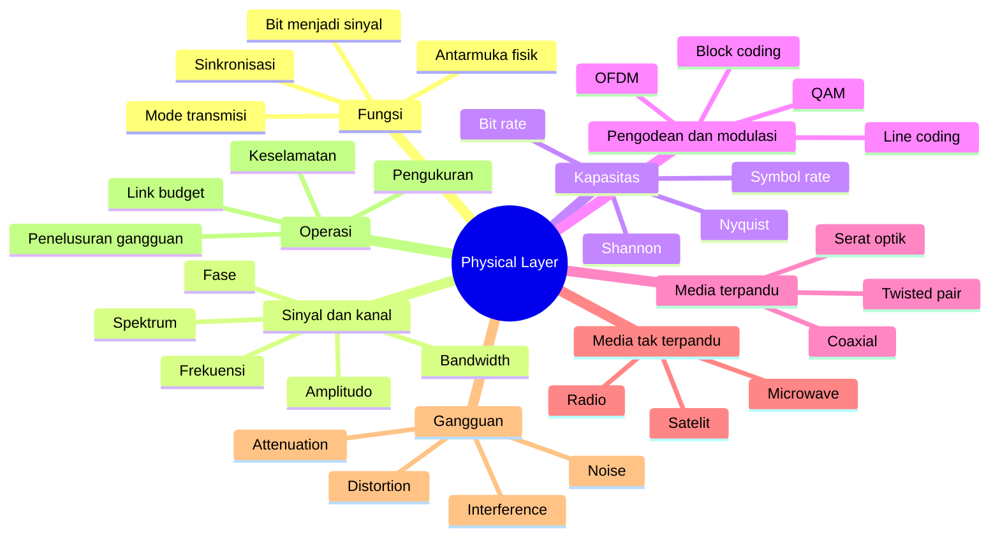

# Bab 3 — Physical Layer

| Pemetaan | Keterangan |
|---|---|
| **CPMK** | CPMK-1 (memahami fungsi setiap lapisan dalam model OSI dan TCP/IP) |
| **Sub-CPMK** | Sub-CPMK-3 (menjelaskan fungsi dan cara kerja Physical Layer dan Data Link Layer) |
| **Kemampuan akhir (RPS Minggu 3)** | Menjelaskan fungsi Physical Layer, proses pengodean dan pensinyalan, karakteristik kanal, serta berbagai media transmisi; mengenali hubungan media fisik dengan desain jaringan |
| **Rujukan inti** | Forouzan, *Data Communications and Networking*; Tanenbaum, Feamster, dan Wetherall, *Computer Networks*, Bab 2; materi sistem komunikasi digital; serta standar IEEE, ISO/IEC, dan ITU yang relevan |

---

## Peta Konsep

---

## 3.1 Kedudukan dan Fungsi Physical Layer

Physical Layer merupakan lapisan paling bawah dalam model OSI. Tugas utamanya adalah menyediakan sarana untuk memindahkan bit melalui media fisik. Bit yang berasal dari Data Link Layer tidak dapat merambat dengan sendirinya. Bit harus direpresentasikan sebagai perubahan tegangan listrik, pulsa cahaya, atau karakteristik gelombang elektromagnetik. Pada penerima, sinyal tersebut dideteksi dan dipetakan kembali menjadi urutan bit.

Lapisan ini tidak memahami apakah bit yang dibawa merupakan alamat, teks, citra, perintah kendali, atau bagian dari malware. Makna data ditentukan oleh lapisan di atasnya. Namun, kualitas keputusan pada Physical Layer sangat memengaruhi seluruh layanan. Kabel yang tidak sesuai, sinyal radio yang lemah, transceiver yang tidak kompatibel, atau sinkronisasi yang buruk dapat muncul sebagai kehilangan frame, retransmisi, throughput rendah, dan gangguan aplikasi.

Tanggung jawab Physical Layer dapat diringkas sebagai berikut.

1. **Representasi bit.** Menentukan bagaimana nilai biner dipetakan menjadi sinyal atau simbol.
2. **Karakteristik media.** Menentukan jenis konduktor, serat, spektrum radio, konektor, panjang gelombang, dan batas jarak.
3. **Laju transmisi.** Menetapkan symbol rate, bit rate, dan parameter waktu.
4. **Sinkronisasi.** Memungkinkan penerima menentukan batas simbol atau bit dengan tepat.
5. **Antarmuka mekanis dan elektrik/optik.** Menentukan pin, bentuk konektor, level daya, polaritas, serta karakteristik transceiver.
6. **Mode komunikasi.** Mendukung simplex, half-duplex, atau full-duplex sesuai teknologi.
7. **Aktivasi dan penghentian tautan.** Meliputi negosiasi kemampuan, pelatihan kanal, dan deteksi keberadaan sinyal pada beberapa teknologi.

Physical Layer tidak identik dengan kabel. Radio, antena, modul optik, laser, fotodetektor, konektor, pengodean, dan pemrosesan sinyal juga berada dalam lingkupnya. Bahkan tautan virtual pada akhirnya bergantung pada satu atau lebih infrastruktur fisik. Awan tidak menghilangkan kebutuhan terhadap pusat data, serat, spektrum, listrik, dan pendinginan; ia hanya mengubah siapa yang mengoperasikannya.

Hubungan dengan Data Link Layer perlu dipahami sejak awal. Physical Layer membawa bit, sedangkan Data Link Layer membentuk frame dan mengatur komunikasi pada tautan. Dalam standar nyata, batas tersebut dapat berada dalam satu perangkat atau dokumen yang sama. Ethernet dan Wi-Fi memiliki komponen PHY serta MAC. Model memisahkan fungsi untuk analisis, bukan menyatakan bahwa implementasinya harus berupa perangkat terpisah.

## 3.2 Data dan Sinyal

**Data** merupakan representasi informasi, sedangkan **sinyal** adalah fenomena fisik yang membawa representasi tersebut. Data dapat bersifat analog atau digital. Suara manusia pada sumbernya bersifat kontinu, tetapi sistem komunikasi modern dapat mengambil sampel dan mengubahnya menjadi data digital. Sebaliknya, data digital tetap memerlukan sinyal fisik yang berubah terhadap waktu untuk dikirim.

Sinyal dapat dikategorikan sebagai analog atau digital. Sinyal analog berubah secara kontinu dalam rentang nilai. Sinyal digital menggunakan sejumlah tingkat diskret untuk merepresentasikan simbol. Pembagian ini berguna, tetapi perangkat nyata selalu berhadapan dengan fenomena fisik kontinu dan toleransi. Tegangan “tinggi” tidak harus memiliki nilai identik pada setiap saat; penerima menggunakan ambang dan teknik deteksi untuk memutuskan simbol yang paling mungkin.

Sinyal juga dapat bersifat periodik atau aperiodik. Sinyal periodik mengulangi pola setelah interval tertentu. Sinyal sinusoidal merupakan bentuk dasar yang sangat penting karena sinyal kompleks dapat dianalisis sebagai gabungan komponen sinusoidal melalui analisis Fourier. Lalu lintas data nyata umumnya tidak periodik, tetapi pemahaman komponen frekuensi membantu menjelaskan bandwidth, filter, distorsi, dan respons media.

Sistem komunikasi tidak hanya mengirim nilai; ia mengirim perubahan yang harus dapat dibedakan di tengah noise. Penerima memperkirakan simbol berdasarkan sinyal yang telah mengalami redaman, distorsi, interferensi, dan keterbatasan perangkat. Karena itu, Physical Layer merupakan persoalan pengambilan keputusan probabilistik selain persoalan kabel dan konektor.

## 3.3 Parameter Sinyal: Amplitudo, Frekuensi, Fase, dan Panjang Gelombang

Gelombang sinus dapat ditulis secara sederhana sebagai:

$$
s(t)=A\sin(2\pi ft+\phi)
$$

dengan \(A\) sebagai amplitudo, \(f\) sebagai frekuensi dalam hertz, \(t\) sebagai waktu, dan \(\phi\) sebagai fase awal.

**Amplitudo** menunjukkan besar perubahan sinyal. Pada sistem listrik, amplitudo dapat berkaitan dengan tegangan atau arus; pada sistem optik, ia berkaitan dengan daya optik; pada radio, penerima mengamati tingkat daya setelah propagasi. Amplitudo yang terlalu kecil sulit dibedakan dari noise, sedangkan amplitudo yang terlalu besar dapat menimbulkan saturasi atau melanggar batas perangkat dan regulasi.

**Frekuensi** menunjukkan jumlah siklus per detik. Satuan hertz berarti satu siklus per detik. Kilohertz, megahertz, dan gigahertz masing-masing berarti ribuan, jutaan, dan miliaran siklus per detik. Frekuensi pembawa bukan bit rate. Sistem pada frekuensi pembawa tinggi tidak otomatis memiliki throughput tinggi; bandwidth kanal, modulasi, SNR, protokol, dan regulasi turut menentukan.

**Fase** menunjukkan posisi relatif gelombang dalam satu siklus. Perubahan fase dapat digunakan untuk membawa simbol, seperti pada Phase Shift Keying. Penerima memerlukan referensi atau teknik estimasi agar dapat membedakan keadaan fase dengan benar.

**Panjang gelombang** berhubungan dengan kecepatan rambat dan frekuensi:

$$
\lambda=\frac{v}{f}
$$

dengan \(\lambda\) sebagai panjang gelombang, \(v\) sebagai kecepatan rambat dalam media, dan \(f\) sebagai frekuensi. Hubungan ini penting dalam desain antena dan sistem optik. Kecepatan rambat dalam kabel atau serat lebih rendah daripada kecepatan cahaya di ruang hampa dan dinyatakan melalui faktor kecepatan atau indeks bias.

## 3.4 Spektrum dan Bandwidth

**Spektrum** adalah kumpulan komponen frekuensi yang membentuk sinyal. **Bandwidth dalam hertz** menunjukkan rentang frekuensi yang digunakan atau dapat dilewatkan kanal. Istilah bandwidth juga digunakan di jaringan untuk menyatakan laju bit per detik. Kedua penggunaan tersebut terkait, tetapi tidak identik.

Sebuah kanal dengan bandwidth frekuensi lebih lebar berpotensi membawa lebih banyak simbol per detik, tetapi kapasitas aktual bergantung pada kualitas kanal dan teknik modulasi. Menambah bandwidth radio juga berarti menggunakan spektrum yang merupakan sumber daya terbatas dan diatur. Pada kabel, respons kanal menentukan frekuensi yang dapat dilewatkan dengan distorsi yang masih dapat diterima.

Filter membatasi spektrum yang lewat. Filter diperlukan untuk memisahkan kanal, mengurangi noise di luar pita, dan memenuhi batas emisi. Filter yang tidak ideal dapat mengubah bentuk pulsa. Jika komponen frekuensi penting teredam berbeda-beda, sinyal mengalami distorsi.

Dalam komunikasi digital, bentuk pulsa tidak memiliki spektrum tak terbatas yang dapat dipakai tanpa konsekuensi. Laju simbol tinggi memerlukan kanal yang mendukung perubahan lebih cepat. Desain Physical Layer selalu menyeimbangkan efisiensi spektrum, ketahanan terhadap noise, kompleksitas, daya, dan biaya.

## 3.5 Bit Rate, Symbol Rate, dan Baud

**Bit rate** adalah jumlah bit informasi yang dikirim per detik. **Symbol rate** atau baud adalah jumlah simbol yang dikirim per detik. Satu simbol dapat merepresentasikan satu atau beberapa bit.

Jika terdapat \(M\) keadaan simbol yang dapat dibedakan dan seluruhnya digunakan secara ideal, jumlah bit per simbol adalah:

$$
k=\log_2 M
$$

Hubungan ideal antara bit rate \(R_b\) dan symbol rate \(R_s\) adalah:

$$
R_b=R_s\log_2 M
$$

Untuk empat keadaan simbol, satu simbol dapat membawa dua bit. Untuk 16 keadaan, satu simbol dapat membawa empat bit. Untuk 4096 keadaan, satu simbol secara teoritis memetakan 12 bit karena \(2^{12}=4096\).

Pernyataan tersebut belum memperhitungkan bit koreksi kesalahan, pilot, sinkronisasi, guard interval, dan overhead protokol. Oleh sebab itu, bit rate mentah berbeda dari throughput aplikasi. Modulasi berorde tinggi juga membuat titik simbol lebih berdekatan sehingga lebih mudah tertukar akibat noise. Kenaikan bit per simbol menuntut SNR dan linearitas yang lebih baik.

Istilah baud tidak boleh dipakai sebagai sinonim bit per detik kecuali satu simbol memang membawa satu bit. Pada modem dan sistem radio modern, perbedaannya signifikan. Pemahaman ini menjadi dasar untuk menganalisis QAM, PAM, Ethernet berkecepatan tinggi, dan Wi-Fi generasi baru.

## 3.6 Gangguan Kanal

Sinyal yang diterima tidak pernah persis sama dengan sinyal yang dikirim. Perubahan disebabkan oleh karakter media, lingkungan, perangkat, dan sinyal lain. Empat kategori penting adalah redaman, distorsi, noise, dan interferensi.

### 3.6.1 Redaman

**Redaman** (*attenuation*) adalah penurunan kekuatan sinyal sepanjang media. Pada kabel, energi hilang sebagai panas dan radiasi. Pada serat, daya berkurang akibat absorpsi, hamburan, sambungan, konektor, dan pembengkokan. Pada radio, daya menyebar di ruang dan dipengaruhi penghalang.

Redaman bergantung pada frekuensi dan jarak. Karena komponen frekuensi dapat mengalami redaman berbeda, dampaknya tidak selalu berupa penurunan amplitudo seragam. Repeater, amplifier, equalizer, atau regenerasi digital digunakan sesuai teknologi dan jarak.

### 3.6.2 Distorsi

**Distorsi** terjadi ketika bentuk sinyal berubah karena komponen frekuensinya mengalami redaman atau delay berbeda. Pulsa yang awalnya terpisah dapat melebar dan saling tumpang tindih, menghasilkan *intersymbol interference*. Equalization berupaya mengompensasi respons kanal.

Pada serat multimode, jalur cahaya yang berbeda dapat tiba pada waktu berbeda sehingga membatasi bandwidth-distance product. Pada kabel tembaga, karakteristik pasangan dan frekuensi memengaruhi delay serta redaman. Distorsi dapat terjadi walaupun daya rata-rata masih cukup tinggi.

### 3.6.3 Noise

**Noise** adalah energi acak yang tidak diinginkan. Derau termal muncul dari gerak elektron dan tidak dapat dihilangkan sepenuhnya. Impulse noise berasal dari kejadian singkat seperti switching listrik atau petir. Noise pada perangkat juga berasal dari komponen elektronik.

Penerima tidak hanya membutuhkan sinyal yang “ada”, tetapi sinyal yang cukup berbeda dari noise. Rasio signal-to-noise menjadi ukuran penting. Penguatan sinyal dan noise secara bersamaan tidak selalu meningkatkan kemampuan deteksi.

### 3.6.4 Interferensi dan crosstalk

**Interferensi** berasal dari sinyal lain yang memasuki kanal. Pada kabel berpasangan, crosstalk terjadi ketika sinyal pada satu pasangan memengaruhi pasangan lain. Pemilinan membantu membuat gangguan terinduksi lebih mudah dibatalkan secara diferensial. Pada radio, jaringan tetangga, perangkat non-Wi-Fi, pantulan, dan pemancar lain dapat menggunakan spektrum yang sama atau berdekatan.

Interferensi berbeda dari sekadar sinyal lemah. Menambah daya pancar tanpa koordinasi dapat memperburuk lingkungan bagi pengguna lain. Desain radio memerlukan perencanaan kanal, lokasi, daya, antena, dan kepadatan pengguna.

## 3.7 Desibel dan Signal-to-Noise Ratio

Rentang daya dalam komunikasi sangat lebar sehingga skala logaritmik desibel digunakan. Perbandingan dua daya dinyatakan sebagai:

$$
G_{dB}=10\log_{10}\left(\frac{P_2}{P_1}\right)
$$

Jika daya keluaran dua kali daya masukan, penguatannya sekitar 3 dB. Jika daya menjadi setengah, perubahannya sekitar −3 dB. Untuk rasio amplitudo seperti tegangan pada impedansi yang sama, digunakan faktor 20:

$$
G_{dB}=20\log_{10}\left(\frac{V_2}{V_1}\right)
$$

**dBm** menyatakan daya relatif terhadap 1 mW:

$$
P_{dBm}=10\log_{10}\left(\frac{P}{1\text{ mW}}\right)
$$

Dengan demikian, 0 dBm sama dengan 1 mW, 10 dBm sama dengan 10 mW, dan 20 dBm sama dengan 100 mW. dB adalah rasio, sedangkan dBm adalah nilai daya absolut relatif terhadap referensi tertentu.

Signal-to-noise ratio dalam desibel ditulis:

$$
SNR_{dB}=10\log_{10}\left(\frac{S}{N}\right)
$$

SNR 30 dB berarti rasio linear \(S/N=1000\). Kesalahan umum adalah memasukkan nilai 30 langsung ke rumus Shannon yang memerlukan rasio linear. Nilai harus dikonversi terlebih dahulu.

## 3.8 Batas Nyquist dan Shannon

Teorema Nyquist dan Shannon memberikan batas konseptual terhadap laju komunikasi. Keduanya memiliki asumsi berbeda dan tidak boleh dipakai sebagai janji kinerja perangkat.

### 3.8.1 Batas Nyquist

Untuk kanal ideal tanpa noise dengan bandwidth \(B\) hertz dan \(M\) tingkat simbol, laju data maksimum ideal dinyatakan sebagai:

$$
C=2B\log_2M
$$

Jika kanal memiliki bandwidth 3 kHz dan menggunakan empat tingkat simbol, maka:

$$
C=2(3000)\log_2(4)=12.000\text{ bit/s}
$$

Rumus ini menunjukkan bahwa memperlebar kanal atau menambah jumlah tingkat dapat meningkatkan laju. Namun, jumlah tingkat tidak dapat dinaikkan tanpa batas karena kanal nyata memiliki noise dan keterbatasan deteksi.

### 3.8.2 Kapasitas Shannon

Untuk kanal dengan noise, kapasitas teoretis maksimum adalah:

$$
C=B\log_2\left(1+\frac{S}{N}\right)
$$

Untuk \(B=3.000\) Hz dan SNR 30 dB, rasio linear \(S/N=10^{30/10}=1000\). Kapasitasnya:

$$
C=3000\log_2(1001)\approx29.900\text{ bit/s}
$$

Hasil tersebut merupakan batas teoretis pada asumsi model kanal tertentu, bukan throughput yang otomatis dapat dicapai. Sistem nyata membutuhkan skema kode, modulasi, sinkronisasi, margin, dan overhead. Mendekati kapasitas Shannon biasanya meningkatkan kompleksitas atau delay pengodean.

### 3.8.3 Makna rekayasa

Nyquist menyoroti hubungan bandwidth, symbol rate, dan jumlah tingkat pada kanal ideal. Shannon menyoroti keterbatasan gabungan bandwidth dan SNR. Pelajaran utamanya ialah bahwa kapasitas tidak dapat ditingkatkan tanpa batas hanya dengan menambah daya atau memperbanyak keadaan simbol.

Ketika SNR rendah, modulasi berorde tinggi menghasilkan banyak kesalahan. Sistem adaptif menurunkan modulation and coding scheme agar tautan tetap stabil. Akibatnya, perangkat yang terhubung dengan “kecepatan puncak” tertentu dapat menggunakan laju lebih rendah pada lingkungan buruk.

## 3.9 Line Coding

**Line coding** memetakan bit atau kelompok bit ke pola sinyal baseband. Skema yang baik mempertimbangkan sinkronisasi, komponen DC, penggunaan bandwidth, kemampuan deteksi kesalahan, dan kemudahan implementasi.

### 3.9.1 NRZ

Non-Return-to-Zero menggunakan level atau perubahan untuk mewakili bit. NRZ sederhana dan efisien dalam jumlah transisi, tetapi deretan bit sama yang panjang dapat menyulitkan pemulihan clock. Komponen DC juga dapat menjadi masalah pada media atau transformator tertentu.

NRZ-Level memetakan nilai bit ke level, sedangkan NRZ-Invert menggunakan perubahan atau ketiadaan perubahan. Penerima harus mengetahui aturan yang digunakan; gambar gelombang tanpa definisi tidak cukup untuk menentukan bit.

### 3.9.2 Manchester

Manchester memiliki transisi di tengah interval bit. Transisi tersebut membantu sinkronisasi, sehingga sering disebut *self-clocking*. Konsekuensinya, kebutuhan perubahan sinyal lebih tinggi daripada NRZ untuk bit rate yang sama. Ethernet 10 Mb/s klasik menggunakan pengodean Manchester.

### 3.9.3 Bipolar dan multilevel

Skema bipolar menggunakan level positif, nol, dan negatif menurut aturan tertentu. Pergantian polaritas dapat mengurangi komponen DC dan membantu mendeteksi pelanggaran. Skema multilevel menggunakan lebih banyak keadaan sehingga beberapa bit dapat dipetakan ke satu simbol.

PAM-4 menggunakan empat level amplitudo dan secara ideal membawa dua bit per simbol. Jarak antarlevel lebih kecil dibanding sinyal dua tingkat, sehingga membutuhkan kanal dan penerima berkualitas lebih tinggi. Teknologi Ethernet berkecepatan tinggi menggunakan PAM-4 pada sejumlah PHY, tetapi implementasi spesifik bergantung standar dan media.

## 3.10 Block Coding, Scrambling, dan Koreksi Kesalahan

**Block coding** memetakan kelompok \(m\) bit data ke kelompok \(n\) bit kode dengan \(n>m\). Redundansi digunakan untuk menjamin sifat tertentu, seperti jumlah transisi, batas run-length, atau deteksi pola tidak valid. Contoh pengantar yang umum adalah 4B/5B dan 8B/10B.

Redundansi menambah overhead, tetapi memungkinkan sinkronisasi dan kontrol yang lebih baik. Efisiensi kode 4B/5B adalah 80% sebelum overhead lain karena empat bit data direpresentasikan oleh lima bit kode. Penilaian efisiensi harus memperhitungkan keseluruhan stack, bukan hanya satu kode.

**Scrambling** mengubah pola bit agar tidak menghasilkan deretan konstan atau spektrum yang tidak diinginkan. Scrambling bukan enkripsi. Tujuannya memperbaiki sifat transmisi dan sinkronisasi, bukan merahasiakan data. Pola dapat dipulihkan oleh penerima yang menerapkan aturan yang sama.

**Forward Error Correction (FEC)** menambahkan redundansi agar penerima dapat memperbaiki sejumlah kesalahan tanpa meminta pengiriman ulang. FEC penting pada tautan dengan bit error tertentu atau round-trip delay tinggi. Keuntungannya adalah pengurangan retransmisi; biayanya berupa overhead, pemrosesan, dan delay. Kode yang lebih kuat tidak selalu terbaik jika latency atau daya menjadi batas utama.

## 3.11 Modulasi Digital

Ketika data baseband dibawa oleh gelombang pembawa, satu atau beberapa parameter pembawa diubah sesuai simbol.

### 3.11.1 ASK, FSK, dan PSK

Amplitude Shift Keying mengubah amplitudo. Frequency Shift Keying mengubah frekuensi. Phase Shift Keying mengubah fase. Setiap pendekatan memiliki ketahanan, efisiensi spektrum, dan kompleksitas berbeda.

BPSK menggunakan dua keadaan fase dan membawa satu bit per simbol. QPSK menggunakan empat keadaan dan secara ideal membawa dua bit per simbol. Meningkatkan jumlah keadaan fase menaikkan efisiensi, tetapi memperkecil jarak keputusan.

### 3.11.2 QAM

Quadrature Amplitude Modulation menggabungkan perubahan amplitudo dan fase. Simbol digambarkan sebagai titik pada diagram konstelasi. 16-QAM memiliki 16 titik dan memetakan empat bit per simbol; 256-QAM memetakan delapan; 4096-QAM memetakan dua belas secara ideal.

Konstelasi berorde tinggi memerlukan Error Vector Magnitude, SNR, linearitas penguat, dan estimasi kanal yang lebih baik. Perangkat dapat menurunkan orde modulasi ketika kondisi buruk. Oleh sebab itu, kemampuan 4096-QAM tidak berarti setiap client selalu menggunakannya.

### 3.11.3 OFDM

Orthogonal Frequency Division Multiplexing membagi kanal menjadi banyak subcarrier yang saling ortogonal. Data didistribusikan di antara subcarrier sehingga symbol duration lebih panjang dan sistem lebih tahan terhadap multipath tertentu. Guard interval atau cyclic prefix membantu mengurangi intersymbol interference, dengan biaya overhead.

OFDM digunakan pada berbagai sistem broadband kabel dan nirkabel. Ia tidak menghilangkan noise atau interferensi. Sistem tetap memerlukan estimasi kanal, sinkronisasi frekuensi, alokasi subcarrier, FEC, dan kontrol daya.

## 3.12 Multiplexing

Multiplexing memungkinkan banyak aliran berbagi media fisik.

**Frequency Division Multiplexing (FDM)** membagi spektrum menjadi pita frekuensi. Setiap aliran menggunakan pita berbeda dengan guard band untuk membatasi interferensi. Sistem radio dan televisi menggunakan prinsip ini.

**Time Division Multiplexing (TDM)** membagi waktu menjadi slot. Pada synchronous TDM, slot dapat dialokasikan tetap; pada statistical multiplexing, alokasi mengikuti kebutuhan. Sinkronisasi sangat penting agar penerima mengetahui batas slot.

**Wavelength Division Multiplexing (WDM)** merupakan bentuk multiplexing optik yang menggunakan beberapa panjang gelombang dalam satu serat. CWDM dan DWDM berbeda dalam jarak antarkanal, jumlah kanal, biaya, dan kebutuhan optik. WDM meningkatkan kapasitas serat tanpa memasang jalur fisik baru, tetapi memerlukan komponen optik serta pengelolaan daya yang sesuai.

**Code Division** memungkinkan sinyal berbagi waktu dan spektrum melalui kode yang dapat dibedakan. Prinsip penyebaran spektrum juga dapat meningkatkan ketahanan tertentu. Tidak satu pun teknik “menciptakan” kapasitas dari ketiadaan; semuanya mengatur penggunaan sumber daya berdasarkan batas kanal.

## 3.13 Mode Transmisi dan Sinkronisasi

Pada **simplex**, data mengalir satu arah. Pada **half-duplex**, kedua arah dimungkinkan tetapi tidak bersamaan. Pada **full-duplex**, kedua pihak dapat mengirim secara bersamaan melalui jalur atau teknik pemisahan yang sesuai.

Ethernet modern melalui switch umumnya full-duplex. Wi-Fi menggunakan media radio bersama dan tidak beroperasi seperti full-duplex Ethernet pada satu kanal yang sama. Client harus mengoordinasikan akses media, sehingga kecepatan PHY tidak sama dengan kapasitas aplikasi simultan bagi seluruh pengguna.

Transmisi juga dapat bersifat serial atau paralel. Transmisi serial mengirim bit atau simbol melalui jalur berurutan. Pada laju tinggi dan jarak berarti, serial sering lebih praktis karena menghindari skew antarbanyak jalur paralel. Beberapa teknologi membentuk beberapa lane serial secara paralel untuk mencapai laju agregat tinggi, tetapi setiap lane tetap memerlukan sinkronisasi dan alignment.

Sinkronisasi dapat diperoleh dari transisi sinyal, clock terpisah, pola pelatihan, atau mekanisme clock recovery. Penyimpangan frekuensi dan fase clock dapat menyebabkan sampling pada waktu yang salah. Jitter waktu berbeda dari jitter delay paket pada bab jaringan, meskipun keduanya menggunakan istilah yang sama.

## 3.14 Media Terpandu: Twisted Pair

Kabel twisted pair terdiri atas pasangan konduktor yang dipilin. Pensinyalan diferensial mengirim informasi berdasarkan perbedaan tegangan antara dua konduktor. Pilinan membantu mengurangi pancaran dan gangguan karena pengaruh eksternal cenderung mengenai kedua konduktor secara serupa.

**Unshielded Twisted Pair (UTP)** tidak memiliki pelindung tambahan pada setiap pasangan, sedangkan kabel berpelindung menggunakan foil atau braid pada konfigurasi tertentu. Pelindung bukan jaminan otomatis; terminasi dan grounding yang salah dapat mengurangi manfaat atau menimbulkan masalah.

Kategori kabel menggambarkan persyaratan performa, bukan sekadar “versi kabel”. Kemampuan link ditentukan oleh kategori komponen, panjang, kualitas terminasi, patch cord, konektor, lingkungan, dan standar PHY yang digunakan. Menyatakan bahwa semua Cat6 selalu memberikan 10 Gb/s hingga 100 meter adalah penyederhanaan yang dapat menyesatkan; jarak dan kondisi harus diperiksa terhadap standar cabling serta aplikasi yang relevan.

Pada structured cabling, panjang channel tidak sama dengan panjang permanent link. Patch cord dan konektor menambah loss. Instalasi harus menjaga radius tekuk, tarikan, pemisahan dari sumber elektromagnetik, dan panjang pelepasan pilinan pada terminasi.

Power over Ethernet menyalurkan daya bersama data melalui pasangan kabel. Anggaran daya, kelas perangkat, panas dalam bundle, kualitas kabel, dan kemampuan switch harus diperhitungkan. PoE memudahkan access point, kamera, dan telepon IP, tetapi dapat meningkatkan beban listrik serta termal pada infrastruktur kabel.

## 3.15 Media Terpandu: Coaxial

Kabel coaxial memiliki konduktor pusat, dielektrik, pelindung konduktif, dan jaket. Struktur konsentris memberikan perlindungan interferensi yang baik dan impedansi terkontrol. Coaxial digunakan dalam jaringan akses kabel, distribusi video, sistem antena, dan aplikasi radio.

Coaxial tidak tepat disebut telah sepenuhnya ditinggalkan. Perannya berkurang pada LAN Ethernet modern, tetapi tetap penting pada Hybrid Fiber-Coaxial, RF, laboratorium, dan koneksi antena. Evaluasi media harus berdasarkan aplikasi, bukan usia teknologinya.

Karakteristik penting meliputi impedansi, attenuation per frequency, jenis konektor, shielding effectiveness, dan batas daya. Menggunakan kabel atau konektor dengan impedansi tidak sesuai dapat menyebabkan refleksi. Pada frekuensi tinggi, kualitas terminasi dan panjang kabel sangat memengaruhi hasil.

## 3.16 Media Terpandu: Serat Optik

Serat optik memandu cahaya melalui inti dan cladding yang memiliki indeks bias berbeda. Total internal reflection menjadi intuisi dasar, meskipun propagasi mode secara lengkap memerlukan teori gelombang. Serat tidak terpengaruh interferensi elektromagnetik seperti kabel tembaga dan menyediakan kapasitas tinggi dengan redaman rendah.

### 3.16.1 Multimode dan single-mode

Serat **multimode** memiliki inti lebih besar dan mendukung beberapa mode propagasi. Modal dispersion membatasi bandwidth terhadap jarak. Multimode lazim digunakan pada jarak lebih pendek di gedung atau pusat data dengan transceiver yang sesuai.

Serat **single-mode** mendukung mode dominan dengan inti lebih kecil dan digunakan untuk jarak lebih jauh serta kapasitas tinggi. Istilah single-mode tidak berarti satu panjang gelombang atau satu kanal; WDM dapat membawa banyak panjang gelombang dalam satu serat single-mode.

### 3.16.2 Komponen link optik

Link optik terdiri atas transceiver, fiber, konektor, splice, patch panel, dan kadang splitter atau komponen WDM. Setiap komponen menambah loss dan kemungkinan refleksi. Kebersihan konektor sangat penting; partikel kecil dapat menimbulkan loss atau kerusakan pada daya tinggi.

Transceiver harus kompatibel dalam laju, panjang gelombang, jenis serat, jangkauan, konektor, serta kemampuan perangkat. Bentuk modul yang cocok secara mekanis belum menjamin interoperabilitas. Vendor coding, FEC, lane, dan standar optik juga perlu diperiksa.

### 3.16.3 Dispersion dan nonlinearity

Chromatic dispersion terjadi karena komponen panjang gelombang merambat dengan kecepatan berbeda. Polarization mode dispersion dan efek nonlinear menjadi relevan pada laju, jarak, serta daya tertentu. Sistem koheren dan digital signal processing membantu mengatasi keterbatasan, tetapi menambah kompleksitas.

## 3.17 Media Tak Terpandu dan Propagasi Radio

Media tak terpandu menggunakan gelombang elektromagnetik melalui ruang. Karakteristik propagasi dipengaruhi frekuensi, antena, jarak, penghalang, atmosfer, dan lingkungan.

Gelombang dapat menempuh jalur langsung, dipantulkan, didifraksikan, atau dihamburkan. Beberapa salinan sinyal dapat tiba dengan delay dan fase berbeda, menghasilkan multipath. Multipath dapat menyebabkan fading, tetapi sistem MIMO dan OFDM juga dapat memanfaatkan keragaman jalur.

Frekuensi lebih tinggi sering memungkinkan kanal lebar dan antena lebih kecil, tetapi cenderung mengalami penetrasi serta propagasi berbeda. Pernyataan “frekuensi tinggi selalu lebih cepat” tidak tepat. Kecepatan gelombang di udara hampir sama; yang berubah adalah ketersediaan bandwidth, loss, desain antena, regulasi, dan teknik sistem.

### 3.17.1 Radio lokal dan Wi-Fi

Wi-Fi menggunakan pita yang diizinkan sesuai regulasi setempat dan generasi teknologi. Kanal dibagi di antara banyak perangkat. Throughput dipengaruhi channel width, modulation and coding scheme, spatial streams, guard interval, kondisi radio, airtime contention, dan overhead MAC.

Lebar kanal yang lebih besar dapat meningkatkan laju puncak, tetapi menggunakan spektrum lebih banyak dan dapat mengurangi peluang reuse pada area padat. Desain kampus sering lebih membutuhkan kapasitas agregat serta reuse yang baik daripada satu kanal sangat lebar.

### 3.17.2 Microwave point-to-point

Tautan microwave terarah dapat menghubungkan gedung atau lokasi tanpa penarikan serat. Line of sight dan clearance zona Fresnel perlu diperhatikan. Vegetasi, bangunan, kelengkungan bumi pada jarak jauh, hujan pada frekuensi tertentu, serta goyangan antena dapat memengaruhi link.

### 3.17.3 Satelit

Satelit menyediakan cakupan luas dan akses bagi wilayah sulit dijangkau. Satelit geostasioner memiliki propagation delay besar karena jarak, sedangkan konstelasi orbit lebih rendah dapat menguranginya. Kinerja tetap dipengaruhi link radio, gateway, routing, kepadatan, cuaca, dan kebijakan layanan.

Satelit bukan media “tanpa infrastruktur darat”. Terminal, gateway, pusat operasi, spektrum, dan interkoneksi Internet tetap diperlukan. Keunggulannya harus dinilai bersama biaya, kapasitas, ketergantungan penyedia, serta kondisi lokasi.

## 3.18 Antena, MIMO, dan Beamforming

Antena mengubah sinyal listrik menjadi gelombang elektromagnetik dan sebaliknya. **Gain** antena menggambarkan pengarahan energi relatif terhadap referensi, bukan penciptaan daya. Antena omnidirectional menyebarkan energi pada pola luas tertentu, sedangkan antena directional memusatkannya ke arah tertentu.

Polarization harus diperhatikan karena ketidaksesuaian dapat menurunkan daya yang diterima. Penempatan antena dekat logam, dinding, atau perangkat lain mengubah pola radiasi. Spesifikasi gain tidak cukup tanpa memahami pola, orientasi, dan lingkungan.

Multiple-Input Multiple-Output menggunakan beberapa antena dan pemrosesan sinyal. MIMO dapat menyediakan spatial diversity atau spatial multiplexing. Diversity meningkatkan ketahanan, sedangkan multiplexing dapat mengirim beberapa aliran spasial untuk menaikkan laju. Jumlah antena tidak selalu sama dengan jumlah spatial stream yang efektif.

Beamforming mengatur fase dan amplitudo antarelemen untuk membentuk pola arah. Teknik ini dapat meningkatkan SNR dan mengurangi interferensi tertentu. Ia tidak menghasilkan jalur bebas penghalang secara ajaib dan tetap tunduk pada regulasi serta kondisi propagasi.

## 3.19 Link Budget

Link budget menghitung daya dari pemancar hingga penerima dengan menjumlahkan gain dan mengurangi loss dalam dB:

$$
P_{rx}=P_{tx}+G_{tx}+G_{rx}-L_{path}-L_{cable}-L_{connector}-L_{misc}
$$

Semua nilai dinyatakan dalam satuan logaritmik yang konsisten. Pada link radio, path loss, gain antena, loss kabel, dan margin fading diperhitungkan. Pada link optik, daya transmit, loss serat, splice, konektor, splitter, serta receiver sensitivity diperhitungkan.

**Margin** adalah selisih antara daya terima yang diperkirakan dan ambang minimum penerima. Link yang hanya tepat pada ambang tidak memiliki ruang untuk penuaan, suhu, kotoran, hujan, pergerakan, atau ketidakpastian model. Margin yang dibutuhkan bergantung pada target availability dan lingkungan.

Contoh optik sederhana: transceiver mengirim 0 dBm, total loss jalur 8 dB, dan receiver sensitivity −12 dBm. Perkiraan daya terima adalah −8 dBm sehingga margin terhadap sensitivitas 4 dB. Hasil tersebut belum tentu cukup tanpa mempertimbangkan batas overload, variasi transceiver, dan kebijakan desain.

Menerima daya terlalu tinggi juga dapat bermasalah. Receiver memiliki rentang operasi dan batas overload. Attenuator mungkin diperlukan pada link optik sangat pendek dengan pemancar berdaya tinggi.

## 3.20 Propagation Delay dan Bandwidth-Delay Product

Propagation delay adalah waktu yang diperlukan sinyal untuk menempuh jarak:

$$
d_{prop}=\frac{d}{v}
$$

Untuk serat sepanjang 1.000 km dengan kecepatan rambat mendekati \(2\times10^8\) m/s, delay satu arah ideal sekitar:

$$
\frac{1.000.000}{2\times10^8}=0{,}005\text{ s}=5\text{ ms}
$$

Nilai nyata lebih besar karena jalur tidak lurus, perangkat, antrean, dan pemrosesan. Penambahan bit rate tidak mengurangi propagation delay.

**Bandwidth-delay product** memperkirakan jumlah bit yang dapat “berada di dalam jalur”:

$$
BDP=R\times RTT
$$

Pada link 1 Gb/s dengan RTT 20 ms, BDP adalah 20 Mb atau sekitar 2,5 MB. Protokol yang menunggu acknowledgment perlu memiliki cukup data dalam penerbangan untuk memanfaatkan link. Hubungan ini menjembatani Physical Layer dengan kontrol aliran dan kemacetan pada Transport Layer.

## 3.21 Perangkat dan Komponen Physical Layer

**Repeater** menerima sinyal dan meregenerasi atau meneruskannya agar dapat menjangkau jarak lebih jauh. Repeater digital berupaya memulihkan keputusan simbol, bukan sekadar memperkuat semua komponen termasuk noise.

**Amplifier** menaikkan daya sinyal, tetapi juga dapat menambah atau memperkuat noise. Dalam sistem optik, optical amplifier digunakan pada konteks tertentu. Pemilihan amplifier memerlukan analisis gain, noise figure, bandwidth, dan linearitas.

**Transceiver** menggabungkan fungsi transmitter dan receiver. Modul seperti SFP dan turunannya menyediakan bentuk modular, tetapi label bentuk fisik tidak menentukan seluruh kemampuan. Data rate, lane, media, reach, wavelength, power budget, FEC, dan kompatibilitas host harus diperiksa.

**Media converter** mengubah media, misalnya tembaga ke optik. Perangkat ini dapat memecahkan kebutuhan jarak, tetapi menambah titik daya, kegagalan, dan observability. Penggunaannya perlu didokumentasikan agar tidak menjadi komponen tersembunyi.

**Patch panel** dan distribution frame membantu terminasi serta pengelolaan. Komponen pasif tetap memengaruhi performa. Konektor kotor, splice buruk, atau patch cord tidak sesuai dapat menyebabkan link flapping dan error.

## 3.22 Structured Cabling dan Praktik Instalasi

Structured cabling memisahkan infrastruktur permanen dari perangkat aktif agar perubahan dapat dikelola. Desain mencakup entrance facility, equipment room, backbone cabling, telecommunications room, horizontal cabling, work area, jalur, rak, pelabelan, dan dokumentasi.

Prinsip penting meliputi:

- menggunakan komponen yang memenuhi kategori dan standar yang sama;
- mematuhi batas panjang dan jumlah sambungan;
- menjaga radius tekuk serta gaya tarik;
- memisahkan jalur data dari sumber gangguan dan daya sesuai aturan;
- menyediakan manajemen kabel dan ventilasi;
- melabeli kedua ujung secara konsisten;
- menyimpan hasil pengujian serta pemetaan port;
- mempertimbangkan pertumbuhan, redundansi, dan akses pemeliharaan.

Kerapian bukan sekadar estetika. Kabel tanpa label memperpanjang pemulihan gangguan dan meningkatkan risiko mencabut jalur yang salah. Bundle terlalu rapat dapat memerangkap panas pada PoE. Serat dengan radius tekuk terlalu kecil mengalami loss. Patch cord panjang yang tidak tercatat dapat melanggar channel budget.

Dokumentasi harus membedakan desain, kondisi terpasang, dan hasil sertifikasi. Gambar rancangan tidak membuktikan instalasi mengikuti desain. Audit berkala diperlukan setelah perubahan bertahun-tahun.

## 3.23 Pengukuran dan Pengujian

Pengukuran Physical Layer harus menggunakan alat serta metode sesuai media.

### 3.23.1 Kabel tembaga

Wiremap memeriksa kontinuitas, pasangan terbalik, short, open, dan split pair. Qualification memperkirakan kemampuan mendukung aplikasi tertentu. Certification membandingkan parameter terhadap batas standar, seperti insertion loss, return loss, NEXT, dan delay skew. Ketiga tingkat pengujian tidak sama.

Link yang “tersambung” belum tentu memenuhi kategori. Split pair dapat lolos uji kontinuitas sederhana tetapi memiliki crosstalk buruk. Sertifikasi memerlukan konfigurasi pengujian, adapter, kalibrasi, dan batas yang benar.

### 3.23.2 Serat optik

Optical power meter dan light source mengukur insertion loss end-to-end. OTDR mengirim pulsa dan menganalisis backscatter untuk memperkirakan lokasi event, loss, refleksi, dan panjang. OTDR bukan pengganti otomatis pengukuran loss dua arah; metode dipilih sesuai tujuan serta standar penerimaan.

Mikroskop inspeksi digunakan untuk memeriksa end-face konektor. Prinsip pentingnya adalah *inspect, clean, inspect*. Jangan melihat langsung ke serat yang mungkin aktif. Cahaya inframerah dapat tidak terlihat tetapi tetap berbahaya.

### 3.23.3 Radio

Pengukuran radio mencakup RSSI, lantai derau, SNR, utilisasi kanal, pengiriman ulang, *modulation and coding scheme*, spektrum, dan perekaman paket nirkabel. RSSI tinggi tidak menjamin throughput baik jika interferensi dan utilisasi tinggi. Survei pasif, aktif, dan spektrum menjawab pertanyaan berbeda.

### 3.23.4 Counter antarmuka

Perangkat jaringan menyediakan counter seperti CRC error, symbol error, alignment error, drops, dan flaps. Nilai harus dibaca sebagai perubahan terhadap waktu, bukan hanya angka kumulatif. Counter juga perlu ditafsirkan berdasarkan vendor dan posisi pengukuran.

## 3.24 Bit Error Rate dan Eye Diagram

**Bit Error Rate (BER)** adalah rasio bit salah terhadap total bit yang diterima selama pengukuran. BER sangat kecil tetap dapat menghasilkan banyak kesalahan pada link berkecepatan tinggi jika volume bit sangat besar. Pengukuran harus menyebut durasi, pola uji, confidence, FEC, dan titik observasi.

FEC dapat menurunkan post-FEC BER walaupun raw BER lebih tinggi. Karena itu, “tidak ada frame error” tidak membuktikan kanal memiliki margin besar; FEC mungkin bekerja keras. Telemetri pre-FEC error dapat memberi peringatan dini.

**Eye diagram** menumpuk banyak interval simbol untuk melihat kualitas sinyal. Bukaan vertikal berkaitan dengan margin amplitudo, sedangkan bukaan horizontal berkaitan dengan margin waktu. Eye yang menutup menunjukkan noise, jitter, atau intersymbol interference meningkat. Pada sistem multilevel, analisis lebih kompleks karena terdapat beberapa eye.

BER dan eye diagram umum di laboratorium serta validasi perangkat. Dalam operasi kampus, pengelola lebih sering menggunakan counter, sertifikasi kabel, daya optik, dan survei radio. Pemilihan metrik harus sesuai kemampuan alat dan dampak layanan.

## 3.25 Keselamatan Kerja dan Kepatuhan

Pekerjaan Physical Layer memiliki risiko nyata. Instalasi kabel melibatkan tangga, ruang plafon, tepi tajam, debu, listrik, bahan kimia pembersih, dan jalur kebakaran. Pekerjaan serat menghasilkan serpihan kecil yang dapat melukai kulit atau mata. Laser atau cahaya inframerah dapat berbahaya meski tidak terlihat.

Prinsip umum keselamatan meliputi:

1. mematuhi prosedur keselamatan institusi dan peraturan lokal;
2. menggunakan alat pelindung sesuai pekerjaan;
3. tidak melihat langsung ke ujung serat atau transceiver;
4. memastikan sumber optik dinonaktifkan sebelum inspeksi yang memerlukan;
5. mengumpulkan serpihan serat pada wadah khusus;
6. menjaga jalur kabel agar tidak menghalangi evakuasi atau melanggar fire stopping;
7. memperhatikan grounding, bonding, dan jarak dari sistem tenaga;
8. menggunakan teknisi berkualifikasi untuk pekerjaan yang memerlukan sertifikasi.

Spektrum radio dan daya pancar juga diatur. Kemampuan perangkat memancarkan pada kanal tertentu tidak berarti pengguna boleh mengoperasikannya tanpa mematuhi domain regulasi. Konfigurasi negara yang salah dapat menimbulkan interferensi dan pelanggaran.

## 3.26 Keamanan Physical Layer

Keamanan fisik adalah fondasi pertahanan jaringan. Penyerang yang memperoleh akses ke ruang perangkat, patch panel, kabel, console port, atau catu daya dapat melewati banyak kontrol logis.

Kontrol mencakup pembatasan akses ruang, pencatatan, kamera, segel, rak terkunci, manajemen kunci, pemisahan jalur, sensor lingkungan, dan inspeksi berkala. Port tidak terpakai dapat dinonaktifkan pada lapisan logis, tetapi outlet fisik juga perlu dikelola.

Penyadapan media memiliki karakter berbeda. Tembaga dapat memancarkan atau disadap secara konduktif; serat tidak kebal mutlak karena dapat ditap dengan teknik tertentu; radio secara alami dipancarkan ke ruang. Enkripsi pada lapisan yang sesuai tetap diperlukan untuk data sensitif.

Jamming menyerang ketersediaan nirkabel dengan meningkatkan energi atau menggunakan protokol secara mengganggu. Deteksi memerlukan korelasi spektrum, perilaku jaringan, waktu, dan lokasi. Tindakan respons harus mematuhi kewenangan; membalas dengan pemancar pengganggu bukan solusi yang sah.

## 3.27 Efisiensi Energi dan Keberlanjutan

Physical Layer mengonsumsi energi melalui transceiver, switch, access point, amplifier, pendinginan, dan perangkat endpoint. Laju tinggi serta jangkauan panjang dapat meningkatkan kebutuhan daya. Desain harus membandingkan kebutuhan aktual dengan kemampuan, bukan selalu memilih port tercepat.

Serat dapat memberikan jarak dan kapasitas tinggi dengan karakter energi yang baik pada konteks tertentu, tetapi transceiver optik tetap mengonsumsi daya dan memerlukan produksi material. PoE memusatkan distribusi daya dan memudahkan pengelolaan, tetapi konversi, loss kabel, serta panas harus diperhitungkan.

Keberlanjutan juga berkaitan dengan umur pakai dan interoperabilitas. Structured cabling yang dirancang baik dapat bertahan melewati beberapa generasi perangkat aktif. Modul yang dapat diganti mengurangi kebutuhan mengganti seluruh perangkat, tetapi kompatibilitas dan dukungan harus dikelola.

Penghematan energi tidak boleh mengorbankan availability tanpa analisis. Menonaktifkan link cadangan dapat mengurangi daya tetapi memperlambat pemulihan. Keputusan memerlukan data beban, target layanan, dan evaluasi risiko.

## 3.28 Hubungan Physical Layer dengan VLAN

RPS menautkan pembahasan Physical Layer dengan konsep dan desain VLAN. Secara arsitektural, **VLAN merupakan fungsi Data Link Layer**, bukan Physical Layer. VLAN memisahkan broadcast domain secara logis pada infrastruktur switch, sedangkan Physical Layer menyediakan port, media, dan sinyal yang membawa frame.

Hubungan keduanya tetap penting. Satu port fisik dapat menjadi access port untuk satu VLAN atau trunk yang membawa beberapa VLAN dengan tagging. Namun, perubahan VLAN tidak mengubah karakter elektrik kabel. Sebaliknya, link fisik yang gagal dapat memutus seluruh VLAN yang melewati trunk tersebut.

Pemisahan fisik dan logis menimbulkan konsekuensi redundansi. Dua VLAN yang berbeda tidak independen secara fisik apabila menggunakan switch, uplink, serat, jalur ducting, atau catu daya yang sama. Desain harus mendokumentasikan ketergantungan lintas lapisan agar segmentasi logis tidak disalahartikan sebagai ketahanan fisik.

Pembahasan VLAN secara mendalam ditempatkan pada Bab 4. Pada Bab 3, poin utamanya ialah bahwa konektivitas logis selalu memiliki ketergantungan fisik yang perlu diidentifikasi.

## 3.29 Penelusuran Gangguan Physical Layer

Penelusuran gangguan harus dimulai dari ruang lingkup dan bukti, bukan langsung mengganti kabel atau perangkat.

### 3.29.1 Gejala umum

- link tidak aktif;
- link flapping;
- negosiasi turun ke laju lebih rendah;
- CRC atau symbol error meningkat;
- optical power di luar rentang;
- retransmisi dan throughput buruk;
- koneksi nirkabel memiliki SNR rendah atau retry tinggi;
- gangguan hanya terjadi pada waktu, cuaca, atau beban tertentu.

### 3.29.2 Prosedur dasar

1. Tentukan perangkat, port, media, waktu, dan pengguna terdampak.
2. Bandingkan dengan baseline serta link yang sehat.
3. Periksa daya, status, alarm, transceiver, dan counter kedua ujung.
4. Validasi konfigurasi kemampuan, autonegotiation, FEC, dan jenis modul.
5. Inspeksi fisik sesuai prosedur keselamatan.
6. Uji kabel, loss optik, atau spektrum radio dengan alat yang sesuai.
7. Ganti satu komponen atau jalur pada satu waktu untuk mengisolasi penyebab.
8. Dokumentasikan hasil dan kembalikan konfigurasi sementara.

### 3.29.3 Perangkap diagnosis

LED hijau tidak membuktikan link bebas error. Mengganti patch cord tanpa memeriksa permanent link dapat hanya memindahkan gejala. Membersihkan fiber tanpa alat dan prosedur yang benar dapat memperburuk konektor. Menambah daya radio dapat meningkatkan interferensi. Menghapus FEC untuk mengurangi latency dapat membuat BER tidak dapat diterima.

Diagnosis juga perlu mempertimbangkan lapisan atas. Drops dapat terjadi karena antrean, bukan kesalahan fisik. Throughput rendah dapat berasal dari TCP window atau server. Bukti Physical Layer harus dikorelasikan dengan Data Link, Network, dan aplikasi.

## 3.30 Studi Kasus: Memilih Backbone Antargedung Kampus

Sebuah kampus akan menghubungkan tiga gedung dengan pusat data. Jarak terjauh 800 meter. Setiap gedung memerlukan kapasitas awal 10 Gb/s, jalur cadangan, dukungan pertumbuhan, dan segmentasi beberapa VLAN. Pilihan yang dipertimbangkan adalah twisted pair, fiber, dan radio point-to-point.

Twisted pair standar LAN tidak cocok untuk jarak 800 meter tanpa perangkat regenerasi berulang. Penambahan banyak converter atau switch di tengah meningkatkan titik daya, keamanan, dan kegagalan. Coaxial juga bukan pilihan umum untuk backbone Ethernet kampus baru pada kebutuhan tersebut.

Fiber single-mode menawarkan jarak dan jalur peningkatan yang baik. Desain tetap harus menentukan jumlah core, topologi, rute ducting, transceiver, connector, splice, link budget, proteksi fisik, dan pengujian. Dua pasang serat dalam kabel yang sama tidak memberikan keragaman jalur terhadap putusnya kabel.

Radio point-to-point dapat menjadi jalur cadangan yang cepat dipasang atau solusi ketika penggalian sulit. Site survey harus memeriksa line of sight, zona Fresnel, interferensi, regulasi, kapasitas saat cuaca buruk, grounding, mounting, dan ketersediaan daya. Throughput radio agregat dan pola duplex harus dibandingkan dengan kebutuhan, bukan hanya PHY rate pemasaran.

Rancangan yang masuk akal dapat menggunakan fiber sebagai jalur utama dan radio melalui rute kegagalan berbeda sebagai cadangan, jika target availability dan biaya mendukung. Jalur fiber utama dan cadangan sebaiknya menggunakan ducting berbeda bila risiko penggalian dominan. Perangkat ujung perlu catu daya cadangan dan monitoring.

VLAN dapat melewati backbone, tetapi desain Layer 2/Layer 3 harus membatasi domain kegagalan. Backbone fisik berkapasitas tinggi bukan alasan memperluas satu broadcast domain tanpa batas. Studi ini menunjukkan bahwa keputusan media tidak dapat dipisahkan dari routing, redundansi, keamanan, operasi, dan biaya.

## 3.31 Perkembangan Teknologi Physical Layer

### 3.31.1 Wi-Fi 7

IEEE 802.11be-2024 dikenal industri sebagai Wi-Fi 7. Laman resmi IEEE 802.11 menyatakan standar tersebut telah dipublikasikan. Fitur Physical dan MAC yang banyak dibahas mencakup kanal hingga 320 MHz pada spektrum yang mendukung, 4096-QAM, serta Multi-Link Operation.

4096-QAM menunjukkan hubungan langsung antara orde modulasi dan bit per simbol. Dua belas bit per simbol merupakan pemetaan ideal, tetapi keberhasilan penggunaannya memerlukan kualitas kanal tinggi. Multi-Link Operation memungkinkan perangkat menggunakan atau mengelola lebih dari satu link, tetapi perilaku dan keuntungan aktual bergantung kemampuan client, access point, spektrum, serta implementasi.

Kanal 320 MHz tidak selalu menjadi pilihan terbaik pada kampus padat. Kanal lebar meningkatkan laju puncak tetapi mengurangi jumlah kanal non-overlap dan dapat memperburuk reuse. Perencanaan harus berbasis kapasitas, kepadatan, regulasi lokal, dan survei.

### 3.31.2 Ethernet 800 Gb/s dan arah 1,6 Tb/s

[IEEE 802.3df-2024](https://standards.ieee.org/ieee/802.3df/11107/) menambahkan parameter MAC dan Physical Layer untuk operasi Ethernet 400 Gb/s dan 800 Gb/s. Standar tersebut menunjukkan bahwa peningkatan laju tidak hanya dicapai dengan menaikkan clock tunggal. Arsitektur lane, modulasi, FEC, serat atau tembaga, transceiver, dan signal integrity dirancang sebagai satu sistem.

Pengembangan Ethernet menuju 1,6 Tb/s harus dirujuk pada proyek dan standar IEEE yang benar-benar berlaku pada saat implementasi. Jadwal proyek dapat berubah, sehingga buku ini tidak menjadikan target penyelesaian sebagai fakta tetap. Bagi mahasiswa, pelajaran utamanya adalah bahwa laju agregat sangat tinggi diperoleh melalui kombinasi beberapa lane dan teknik pensinyalan, bukan pelanggaran terhadap batas Shannon.

### 3.31.3 IMT-2030 atau 6G

ITU menggunakan nama **IMT-2030** untuk pengembangan sistem seluler generasi menuju 2030 dan seterusnya. Kerangka resminya diterbitkan sebagai [Recommendation ITU-R M.2160](https://www.itu.int/rec/R-REC-M.2160/en). Pada Agustus 2026, IMT-2030 masih merupakan proses pengembangan persyaratan dan evaluasi, bukan layanan komersial matang yang memiliki satu spesifikasi radio final.

Riset mencakup spektrum baru, integrasi sensing dan komunikasi, kecerdasan jaringan, cakupan, positioning, serta keberlanjutan. Klaim kecepatan atau tanggal komersial harus diperlakukan sebagai target atau proyeksi sampai standar, regulasi, perangkat, dan layanan nyata tersedia.

### 3.31.4 Optik koheren dan integrasi fotonik

Sistem optik modern menggunakan modulasi kompleks, coherent detection, digital signal processing, dan FEC untuk meningkatkan kapasitas serta jarak. Integrated photonics dan pendekatan optik yang lebih dekat dengan switch silicon dikembangkan untuk mengatasi tantangan daya serta density.

Istilah seperti coherent pluggable, linear pluggable optics, dan co-packaged optics menggambarkan pilihan arsitektur dengan kompromi berbeda dalam daya, reach, serviceability, dan interoperabilitas. Tidak satu pendekatan otomatis unggul untuk semua pusat data atau jaringan operator.

## 3.32 Miskonsepsi yang Perlu Dihindari

1. **“Physical Layer hanya membahas kabel.”** Radio, optik, modulasi, sinkronisasi, konektor, dan pengukuran juga termasuk.
2. **“Sinyal digital memiliki bentuk persegi sempurna.”** Media nyata membatasi bandwidth dan mengubah bentuk sinyal.
3. **“Bandwidth hertz sama dengan bit per detik.”** Keduanya terkait tetapi merupakan besaran berbeda.
4. **“Baud selalu sama dengan bit per detik.”** Satu simbol dapat membawa beberapa bit.
5. **“Modulasi lebih tinggi selalu lebih baik.”** Orde tinggi membutuhkan SNR dan linearitas lebih baik.
6. **“Menambah daya selalu memperbaiki Wi-Fi.”** Daya berlebihan dapat meningkatkan interferensi dan menciptakan link asimetris.
7. **“Fiber kebal terhadap semua gangguan dan penyadapan.”** Fiber tahan EMI, tetapi tetap mengalami loss, dispersion, kerusakan, dan risiko tapping.
8. **“Semua modul dengan bentuk SFP pasti kompatibel.”** Form factor bukan spesifikasi laju, wavelength, reach, atau protokol lengkap.
9. **“Link up berarti kabel sehat.”** Link dapat aktif sambil menghasilkan error atau negosiasi turun.
10. **“Kategori kabel menjamin laju tanpa syarat.”** Channel, panjang, terminasi, lingkungan, dan PHY ikut menentukan.
11. **“Wi-Fi PHY rate adalah throughput pengguna.”** Overhead, contention, arah, kondisi radio, dan banyak client mengurangi throughput.
12. **“Dua fiber dalam kabel yang sama berarti jalur redundan.”** Kegagalan kabel atau ducting tetap memutus keduanya.
13. **“Scrambling adalah enkripsi.”** Scrambling memperbaiki sifat sinyal, bukan kerahasiaan.
14. **“VLAN merupakan fitur Physical Layer.”** VLAN adalah fungsi Data Link yang menggunakan infrastruktur fisik.
15. **“Teknologi baru mengalahkan hukum Shannon.”** Teknologi mendekati batas dengan kode, modulasi, bandwidth, dan pemrosesan yang lebih baik.

## 3.33 Kerangka Pemilihan Media dan Teknologi

Pemilihan media sebaiknya mengikuti pertanyaan terstruktur.

1. **Berapa kebutuhan kapasitas sekarang dan pertumbuhannya?** Bedakan throughput agregat, laju puncak, dan PHY rate.
2. **Berapa jarak dan bagaimana jalur fisiknya?** Pertimbangkan rute aktual, bukan jarak garis lurus.
3. **Bagaimana lingkungan?** EMI, suhu, air, debu, getaran, petir, cuaca, dan risiko mekanis.
4. **Berapa target availability?** Tentukan margin, redundansi, jalur berbeda, dan waktu pemulihan.
5. **Apakah media dan spektrum diizinkan?** Periksa standar, sertifikasi, dan regulasi lokal.
6. **Bagaimana daya disediakan?** Evaluasi UPS, PoE, grounding, panas, dan konsumsi.
7. **Bagaimana pengujian dan monitoring dilakukan?** Pastikan alat, telemetri, dan kompetensi tersedia.
8. **Apa risiko keamanan dan keselamatan?** Pertimbangkan akses fisik, penyadapan, laser, ketinggian, dan kelistrikan.
9. **Berapa total biaya kepemilikan?** Masukkan instalasi, modul, lisensi, energi, suku cadang, serta waktu teknisi.
10. **Apakah solusi dapat dipelihara dan ditingkatkan?** Dokumentasi, interoperabilitas, ketersediaan komponen, dan umur cabling menjadi faktor.

Kerangka ini mencegah keputusan yang hanya didasarkan pada angka kecepatan tertinggi. Media terbaik adalah media yang memenuhi kebutuhan dan risiko dengan biaya siklus hidup yang dapat diterima.

---

## Ringkasan

- Physical Layer merepresentasikan bit sebagai sinyal dan menentukan media, sinkronisasi, laju, antarmuka, serta mode komunikasi.
- Data adalah informasi yang direpresentasikan, sedangkan sinyal merupakan fenomena fisik yang membawanya.
- Parameter sinyal mencakup amplitudo, frekuensi, fase, spektrum, dan panjang gelombang.
- Bandwidth dalam hertz berbeda dari bit rate. Symbol rate atau baud juga tidak selalu sama dengan bit rate.
- Redaman, distorsi, noise, dan interferensi menurunkan kemampuan penerima membedakan simbol.
- Desibel memudahkan perhitungan gain dan loss; dBm menyatakan daya relatif terhadap 1 mW.
- Batas Nyquist menjelaskan hubungan bandwidth dan tingkat simbol pada kanal ideal, sedangkan kapasitas Shannon memasukkan SNR.
- Line coding, block coding, scrambling, modulasi, dan FEC digunakan untuk membentuk sinyal yang efisien serta andal.
- Twisted pair, coaxial, dan serat optik mempunyai karakteristik serta konteks penggunaan berbeda.
- Propagasi radio dipengaruhi multipath, fading, interferensi, antena, spektrum, dan lingkungan.
- Link budget, margin, BER, loss, counter, serta survei merupakan dasar validasi, bukan sekadar spesifikasi pemasaran.
- Structured cabling, keselamatan, keamanan fisik, dokumentasi, dan efisiensi energi merupakan bagian dari rekayasa Physical Layer.
- VLAN berada pada Data Link Layer, meskipun selalu bergantung pada port, media, perangkat, dan daya fisik.
- Wi-Fi 7, Ethernet 800 Gb/s, IMT-2030, dan optik koheren menerapkan prinsip fisika yang sama dengan teknik lebih maju.

## Istilah Kunci

| Istilah | Definisi ringkas |
|---|---|
| **Signal** | Perubahan fisik yang membawa data |
| **Amplitude** | Besar sinyal terhadap referensi |
| **Frequency** | Jumlah siklus per detik |
| **Phase** | Posisi relatif gelombang dalam satu siklus |
| **Spectrum** | Komponen frekuensi pembentuk sinyal |
| **Bandwidth (Hz)** | Rentang frekuensi kanal atau sinyal |
| **Bit rate** | Jumlah bit per detik |
| **Symbol rate/baud** | Jumlah simbol per detik |
| **Attenuation** | Penurunan kekuatan sinyal |
| **Distortion** | Perubahan bentuk sinyal |
| **Noise** | Energi acak yang tidak diinginkan |
| **Interference** | Gangguan dari sinyal lain |
| **SNR** | Perbandingan daya sinyal terhadap noise |
| **Line coding** | Pemetaan bit ke pola sinyal baseband |
| **Modulation** | Perubahan parameter pembawa berdasarkan simbol |
| **FEC** | Redundansi untuk memperbaiki kesalahan tanpa retransmisi |
| **Multiplexing** | Penggunaan bersama media oleh beberapa aliran |
| **Link budget** | Perhitungan gain dan loss dari pemancar ke penerima |
| **BER** | Rasio bit salah terhadap bit yang diterima |
| **PHY rate** | Laju mentah pada Physical Layer, bukan throughput aplikasi |

## Latihan

### Level A — Ingatan dan Pemahaman

1. Jelaskan fungsi utama Physical Layer dan hubungannya dengan Data Link Layer.
2. Bedakan data analog, data digital, sinyal analog, dan sinyal digital.
3. Jelaskan amplitudo, frekuensi, fase, dan panjang gelombang.
4. Apa perbedaan bandwidth dalam hertz dengan laju bit?
5. Bedakan bit rate dan symbol rate.
6. Jelaskan redaman, distorsi, noise, dan interferensi.
7. Apa perbedaan dB dan dBm?
8. Mengapa Manchester disebut self-clocking?
9. Bedakan block coding, scrambling, dan enkripsi.
10. Sebutkan karakteristik utama twisted pair, coaxial, multimode fiber, dan single-mode fiber.

### Level B — Penerapan dan Analisis

11. Satu simbol memiliki delapan keadaan. Berapa bit ideal yang dibawa setiap simbol? Berapa bit rate pada 10 Mbaud?
12. Kanal ideal memiliki bandwidth 5 kHz dan delapan tingkat sinyal. Hitung batas Nyquist.
13. Kanal memiliki bandwidth 3 kHz dan SNR 30 dB. Konversikan SNR ke rasio linear dan hitung kapasitas Shannon.
14. Daya turun dari 100 mW menjadi 25 mW. Hitung perubahan dalam dB.
15. Pemancar radio 20 dBm menggunakan antena gain 6 dBi. Total path dan cable loss 92 dB, sedangkan antena penerima 3 dBi. Hitung daya terima.
16. Link optik memiliki daya kirim −1 dBm, loss serat 3 dB, empat konektor masing-masing 0,5 dB, dan dua splice masing-masing 0,2 dB. Hitung daya terima sebelum margin lain.
17. Jelaskan mengapa 4096-QAM tidak selalu dapat digunakan meskipun access point mendukungnya.
18. Bandingkan dampak memperlebar kanal Wi-Fi dengan menambah jumlah access point pada lingkungan kampus padat.
19. Jelaskan mengapa split pair dapat lolos continuity test tetapi gagal mendukung Ethernet dengan baik.
20. Sebuah link fiber sering flapping setelah pekerjaan di patch panel. Susun hipotesis dan urutan pengujian yang aman.

### Level C — Evaluasi dan Sintesis

21. Evaluasi pemilihan UTP, single-mode fiber, dan radio point-to-point untuk menghubungkan dua gedung berjarak 600 meter.
22. Rancang link budget konseptual untuk tautan radio kampus. Sebutkan seluruh gain, loss, dan margin yang perlu diteliti.
23. Jelaskan hubungan Nyquist, Shannon, QAM, FEC, dan adaptive modulation sebagai satu sistem.
24. Susun prosedur survei dan validasi Wi-Fi untuk ruang kuliah berkapasitas 100 mahasiswa.
25. Bandingkan WDM dengan penambahan serat baru dari sisi kapasitas, biaya, failure domain, dan operasional.
26. Analisis dampak PoE berdaya tinggi terhadap cabling bundle, UPS, switch, dan keselamatan.
27. Buat rancangan redundansi backbone yang benar-benar memisahkan jalur fisik, catu daya, perangkat, dan risiko penggalian.
28. Evaluasi klaim vendor “throughput Wi-Fi setara PHY rate”. Jelaskan seluruh sumber overhead dan contention.
29. Jelaskan mengapa IMT-2030 pada 2026 harus diajarkan sebagai proses standardisasi, bukan produk final.
30. Rancang praktikum yang menunjukkan hubungan jarak, SNR, modulation order, dan throughput tanpa melanggar aturan spektrum atau privasi.

## Kegiatan Pembelajaran yang Disarankan

1. **Visualisasi sinyal.** Gunakan generator atau simulasi untuk membandingkan NRZ, Manchester, PAM-4, dan konstelasi QAM pada beberapa tingkat noise.
2. **Perhitungan kanal.** Mahasiswa menghitung Nyquist, Shannon, SNR, dB, link budget, propagation delay, dan bandwidth-delay product.
3. **Pengujian kabel.** Bandingkan continuity tester, qualification tester, dan certification tester pada kabel yang sengaja diberi kesalahan terkontrol.
4. **Inspeksi fiber yang aman.** Demonstrasikan inspeksi, pembersihan, power measurement, dan OTDR dengan prosedur keselamatan serta sumber yang diizinkan.
5. **Survei radio.** Lakukan pengukuran RSSI, noise floor, SNR, channel utilization, dan retry di beberapa lokasi tanpa mengumpulkan isi komunikasi pengguna.
6. **Audit jalur fisik.** Petakan satu link laboratorium dari perangkat hingga patch panel dan catu daya, kemudian identifikasi single point of failure.
7. **Studi desain.** Bandingkan fiber dan radio sebagai backbone kampus menggunakan matriks kebutuhan, risiko, dan total biaya kepemilikan.

## Rujukan Bab 3

### Buku teks

- Forouzan, B. A. *Data Communications and Networking*. Gunakan edisi yang ditetapkan dalam RPS atau edisi terbaru yang tersedia secara sah.
- Kurose, J. F., dan Ross, K. W. *Computer Networking: A Top-Down Approach*. Bagian pengantar delay, throughput, dan akses jaringan.
- Tanenbaum, A. S., Feamster, N., dan Wetherall, D. J. *Computer Networks*. Edisi ke-6. Pearson, 2021, Bab 2.

### Standar dan sumber primer

- [IEEE 802 LAN/MAN Standards Committee](https://www.ieee802.org/), portal resmi standar keluarga IEEE 802.
- [IEEE 802.11 Working Group](https://www.ieee802.org/11/), termasuk informasi IEEE Std 802.11be-2024.
- [IEEE 802.3df-2024](https://standards.ieee.org/ieee/802.3df/11107/), Ethernet 400 Gb/s dan 800 Gb/s.
- [Recommendation ITU-R M.2160](https://www.itu.int/rec/R-REC-M.2160/en), kerangka dan tujuan IMT-2030.
- ISO/IEC 11801, *Information technology — Generic cabling for customer premises*. Periksa bagian dan edisi yang berlaku sebelum digunakan sebagai persyaratan proyek.
- ANSI/TIA-568 dan standar cabling terkait. Gunakan dokumen resmi berlisensi dan revisi yang berlaku pada lokasi proyek.
- Materi komunikasi digital pada MIT OpenCourseWare atau sumber perguruan tinggi yang sah untuk penguatan teori sinyal, pengodean, dan kanal.

---

> **Catatan akademik:** Nilai jarak, laju, loss, daya, dan kompatibilitas harus ditelusuri ke standar serta datasheet perangkat yang benar-benar digunakan. Angka pemasaran tidak dapat menggantikan link budget, survei, sertifikasi cabling, dan pengukuran lapangan. Jadwal teknologi yang masih dikembangkan harus ditulis sebagai proyeksi, bukan fakta final.
