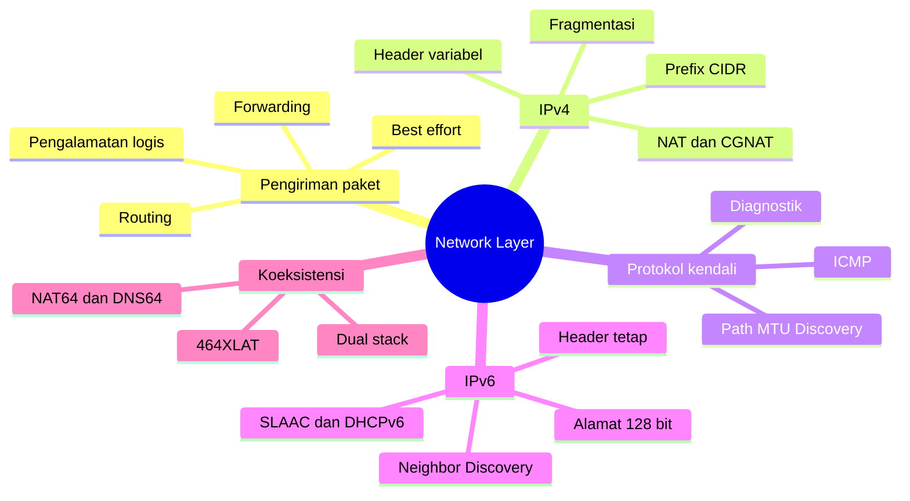
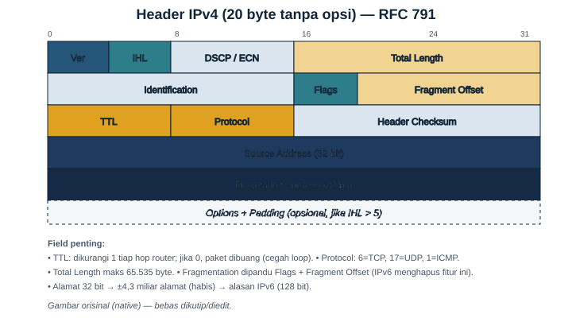
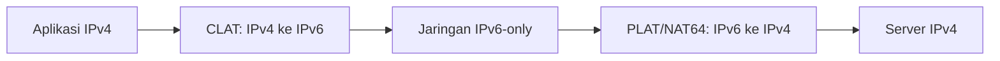

# Bab 5 — Network Layer dan Pengalamatan Internet Protocol

| Pemetaan | Keterangan |
|---|---|
| **CPMK** | CPMK-1: menjelaskan fungsi setiap lapisan jaringan; CPMK-2: merancang dan mengevaluasi jaringan berdasarkan kebutuhan teknis |
| **Sub-CPMK** | Sub-CPMK-4: menjelaskan fungsi *Network Layer* serta menerapkan konsep dasar pengalamatan IPv4 dan IPv6 |
| **Kemampuan akhir** | Mahasiswa mampu menjelaskan pengiriman paket lintas jaringan, membaca struktur alamat dan header IP, membedakan alamat khusus, menganalisis keputusan *forwarding*, serta mengevaluasi penggunaan IPv4, IPv6, dan mekanisme transisi |
| **Prasyarat** | Bab 2 tentang model OSI/TCP-IP dan Bab 4 tentang *Data Link Layer* |
| **Rujukan inti** | RFC 791, RFC 792, RFC 1918, RFC 4291, RFC 4632, RFC 4861, RFC 4862, RFC 6146, RFC 6598, RFC 6877, dan RFC 8200 |

---

## Peta Konsep



---

## 5.1 Mengapa Diperlukan Network Layer?

Pada Bab 4 telah dijelaskan bahwa *Data Link Layer* mengirimkan frame melalui satu tautan atau satu segmen jaringan. Kemampuan tersebut sangat penting, tetapi belum cukup untuk membangun Internet. Sebuah frame Ethernet, misalnya, pada dasarnya dirancang untuk mencapai perangkat lain yang berada pada domain lokal yang dapat dijangkau melalui mekanisme lapisan tautan. Ketika sumber dan tujuan terletak pada jaringan yang berbeda, diperlukan mekanisme yang mampu mempertahankan identitas tujuan sepanjang perjalanan, memilih perangkat perantara, dan meneruskan data melewati rangkaian jaringan yang teknologinya dapat berbeda-beda.

Kebutuhan itulah yang dipenuhi oleh *Network Layer* pada model OSI, yang berpadanan secara konseptual dengan *Internet Layer* pada model TCP/IP. Unit data pada lapisan ini lazim disebut **paket IP** atau **datagram IP**. Paket membawa alamat logis sumber dan tujuan. Berbeda dari alamat MAC yang terutama bermakna pada suatu tautan, alamat IP disusun secara hierarkis agar dapat digunakan untuk mengidentifikasi jaringan sekaligus antarmuka dalam jaringan tersebut. Struktur hierarkis ini memungkinkan router mengelompokkan banyak alamat ke dalam satu prefiks sehingga tabel rute tetap dapat dikelola.

Lima fungsi pokok lapisan jaringan adalah sebagai berikut.

1. **Pengalamatan logis.** IP menyediakan alamat yang tidak bergantung secara langsung pada jenis media fisik. Perangkat yang berpindah ke jaringan lain umumnya perlu memperoleh alamat IP yang sesuai dengan prefiks jaringan barunya, meskipun alamat perangkat kerasnya tidak berubah.
2. **Pengiriman lintas jaringan.** Router meneruskan paket dari satu jaringan ke jaringan berikutnya sampai mendekati tujuan. Setiap perpindahan melalui router disebut satu *hop*.
3. **Pemilihan jalur.** Protokol routing membangun pengetahuan tentang jalur yang tersedia. Pengetahuan tersebut kemudian digunakan proses *forwarding* untuk menentukan antarmuka keluar dan *next hop* bagi setiap paket.
4. **Penanganan perbedaan ukuran paket.** IPv4 dapat menggunakan fragmentasi ketika paket tidak sesuai dengan MTU tautan. IPv6 menggunakan pendekatan berbeda: router tidak melakukan fragmentasi dan sumber perlu menyesuaikan ukuran paket.
5. **Pelaporan kondisi jaringan.** ICMP menyampaikan pesan kesalahan dan informasi diagnostik, misalnya tujuan tidak dapat dicapai, batas hop terlampaui, atau paket terlalu besar.

IP memberikan layanan **tanpa koneksi** dan **best effort**. Tanpa koneksi berarti router tidak perlu membangun sesi khusus sebelum meneruskan setiap datagram. *Best effort* berarti jaringan berusaha mengirimkan paket, tetapi IP tidak menjamin bahwa paket akan tiba, tiba tepat waktu, tiba hanya sekali, atau tiba sesuai urutan. Paket dapat hilang akibat kemacetan, kerusakan, perubahan rute, atau kebijakan keamanan. Apabila aplikasi membutuhkan keandalan, fungsi tersebut harus disediakan oleh lapisan lain, misalnya TCP pada lapisan transportasi atau mekanisme khusus pada aplikasi.

## 5.2 Pengiriman Lokal dan Pengiriman ke Jaringan Lain

Ketika sebuah host hendak mengirimkan paket, keputusan pertama bukanlah “router mana yang terbaik di Internet”, melainkan “apakah alamat tujuan berada pada jaringan lokal?” Host membandingkan alamat tujuan dengan prefiks yang terkonfigurasi pada antarmukanya. Pada IPv4, perbandingan ini secara sederhana dapat dipahami sebagai operasi AND antara alamat dan netmask. Pada IPv6, logikanya tetap berbasis prefiks meskipun representasi alamatnya berbeda.

Jika tujuan berada pada prefiks lokal, host mengirimkan paket secara langsung melalui tautan. Host perlu mengetahui alamat lapisan tautan milik tujuan, misalnya melalui ARP untuk IPv4 atau *Neighbor Discovery* untuk IPv6. Jika tujuan tidak lokal, host menyerahkan paket kepada **gateway bawaan** atau router lain yang cocok dengan tabel rutenya. Alamat IP tujuan di dalam paket tetap menunjuk kepada host akhir, sedangkan alamat lapisan tautan pada frame menunjuk kepada router berikutnya.

Perbedaan tersebut penting. Sepanjang perjalanan, alamat MAC sumber dan tujuan dapat berubah pada setiap tautan karena paket dibungkus ulang ke dalam frame baru. Sebaliknya, alamat IP sumber dan tujuan pada umumnya tetap dari ujung ke ujung, kecuali paket melewati perangkat translasi seperti NAT. Dengan demikian, satu paket dapat menyeberangi Ethernet, serat optik, jaringan nirkabel, atau media lain tanpa kehilangan identitas logis tujuan.

Sebagai ilustrasi, komputer `192.168.10.25/24` ingin mengakses server `203.0.113.20`. Komputer menghitung bahwa tujuan tidak termasuk jaringan `192.168.10.0/24`. Paket IP kemudian diserahkan kepada gateway, misalnya `192.168.10.1`. Pada frame pertama, alamat MAC tujuan adalah MAC gateway, bukan MAC server. Router membuka frame, memeriksa header IP, menentukan *next hop*, lalu membuat frame baru pada antarmuka keluar. Proses tersebut berulang sampai paket mencapai jaringan server.

## 5.3 Forwarding, Routing, dan Switching

Istilah *forwarding*, *routing*, dan *switching* sering dipertukarkan dalam percakapan sehari-hari, padahal ketiganya menyoroti proses yang berbeda. **Forwarding** adalah keputusan cepat untuk satu paket: paket yang masuk melalui antarmuka tertentu harus dikeluarkan melalui antarmuka mana? **Routing** adalah proses membangun informasi jalur yang menjadi dasar keputusan itu. **Switching** pada konteks Ethernet umumnya merujuk pada penerusan frame berdasarkan alamat MAC di dalam satu lingkungan lapisan tautan.

Router modern dapat dipahami melalui tiga bidang kerja.

| Bidang | Fungsi utama | Contoh |
|---|---|---|
| *Data plane* | Memproses dan meneruskan paket dengan kecepatan tinggi | Pencarian prefiks, pengurangan TTL, penerapan ACL |
| *Control plane* | Mempelajari dan memilih jalur | OSPF, IS-IS, BGP, rute statis |
| *Management plane* | Mengelola, memantau, dan mengonfigurasi perangkat | SSH, API, telemetri, SNMP |

Pembedaan ini membantu analisis gangguan. Tabel routing dapat benar, tetapi paket tetap gagal karena ACL pada *data plane*. Sebaliknya, antarmuka fisik dapat aktif, tetapi *control plane* belum mempelajari rute. Dengan memisahkan ketiganya, teknisi tidak terburu-buru menyimpulkan bahwa semua gangguan konektivitas adalah “masalah routing”.

## 5.4 Struktur Header IPv4



*Gambar 5.1 — Struktur umum header IPv4. Header minimum berukuran 20 byte dan dapat bertambah hingga 60 byte apabila memuat opsi.*

IPv4 didefinisikan dengan alamat sepanjang 32 bit. Header-nya memiliki panjang variabel karena bagian opsi tidak selalu ada. Pemahaman terhadap setiap field membantu menjelaskan perilaku paket di jaringan.

| Field | Panjang | Fungsi |
|---|---:|---|
| Version | 4 bit | Menunjukkan versi IP; nilai untuk IPv4 adalah 4 |
| IHL | 4 bit | Panjang header dalam satuan kata 32 bit; nilai minimum 5 berarti 20 byte |
| DSCP dan ECN | 8 bit | Penandaan kelas layanan dan pemberitahuan kemacetan eksplisit |
| Total Length | 16 bit | Ukuran seluruh datagram, termasuk header dan payload, maksimum 65.535 byte |
| Identification | 16 bit | Membantu mengelompokkan fragmen yang berasal dari datagram yang sama |
| Flags | 3 bit | Termasuk bit DF (*Don't Fragment*) dan MF (*More Fragments*) |
| Fragment Offset | 13 bit | Posisi fragmen terhadap datagram semula dalam satuan delapan byte |
| TTL | 8 bit | Batas umur berdasarkan hop; dikurangi ketika paket diteruskan router |
| Protocol | 8 bit | Mengidentifikasi protokol payload, misalnya ICMP=1, TCP=6, dan UDP=17 |
| Header Checksum | 16 bit | Memeriksa integritas header IPv4, bukan seluruh payload |
| Source Address | 32 bit | Alamat IPv4 sumber |
| Destination Address | 32 bit | Alamat IPv4 tujuan |
| Options dan Padding | Variabel | Informasi tambahan; jarang digunakan pada jalur umum |

Field TTL mencegah paket beredar tanpa akhir ketika terjadi loop routing. Setiap router mengurangi TTL sekurang-kurangnya satu. Jika nilainya menjadi nol, router membuang paket dan lazimnya mengirim ICMP *Time Exceeded* kepada sumber. Nama *Time to Live* merupakan warisan rancangan awal, tetapi dalam operasi modern nilainya terutama diperlakukan sebagai batas hop.

Karena TTL berubah pada setiap hop, *Header Checksum* IPv4 perlu dihitung ulang. Hal ini menambah pekerjaan router. IPv6 menghilangkan checksum header karena deteksi kesalahan telah tersedia pada lapisan lain dan karena penyederhanaan pemrosesan dianggap lebih bermanfaat. Penghilangan checksum IPv6 bukan berarti paket tidak memiliki perlindungan kesalahan; frame dan protokol transportasi tetap dapat menyediakan pemeriksaan integritas sesuai kebutuhannya.

Field DSCP dapat digunakan untuk mengklasifikasikan lalu lintas, tetapi penandaan tidak otomatis menjamin kualitas layanan. Jaminan hanya mungkin muncul jika perangkat di sepanjang jalur menerapkan kebijakan yang konsisten. ECN memungkinkan titik kemacetan memberi tanda tanpa selalu membuang paket, dengan syarat kedua ujung dan perangkat jaringan mendukung mekanismenya.

## 5.5 Membaca Alamat IPv4 dan Prefiks

Ruang alamat IPv4 terdiri atas \(2^{32}\), yaitu 4.294.967.296 kemungkinan nilai. Angka ini tidak sama dengan jumlah alamat publik yang dapat digunakan karena sebagian ruang dicadangkan untuk fungsi khusus, sebagian tidak diumumkan secara global, dan sebagian telah dialokasikan untuk organisasi tertentu.

IPv4 ditulis dalam notasi desimal bertitik. Setiap oktet mewakili delapan bit dengan rentang nilai 0–255. Alamat `192.168.10.25` adalah bentuk ringkas dari pola biner berikut:

| Oktet | Desimal | Biner |
|---|---:|---|
| 1 | 192 | `11000000` |
| 2 | 168 | `10101000` |
| 3 | 10 | `00001010` |
| 4 | 25 | `00011001` |

Alamat IP belum bermakna lengkap tanpa panjang prefiks. Notasi `192.168.10.25/24` menyatakan bahwa 24 bit pertama merupakan bagian prefiks jaringan, sedangkan delapan bit sisanya tersedia untuk penomoran di dalam subnet. Prefiks `/24` setara dengan netmask `255.255.255.0`.

Untuk menentukan alamat jaringan, alamat host di-AND-kan dengan netmask:

```text
Alamat : 192.168.10.25  = 11000000.10101000.00001010.00011001
Netmask: 255.255.255.0  = 11111111.11111111.11111111.00000000
Hasil  : 192.168.10.0   = 11000000.10101000.00001010.00000000
```

Pada subnet IPv4 tradisional, alamat dengan seluruh bit host bernilai 0 adalah **alamat jaringan**, sedangkan alamat dengan seluruh bit host bernilai 1 adalah **alamat broadcast terarah**. Untuk `192.168.10.0/24`, alamat jaringan adalah `192.168.10.0`, broadcast adalah `192.168.10.255`, dan rentang host lazimnya `192.168.10.1`–`192.168.10.254`. Rumus jumlah host yang sering diajarkan adalah \(2^h-2\), dengan \(h\) sebagai jumlah bit host. Rumus ini memiliki pengecualian penting, terutama prefiks `/31` untuk tautan titik-ke-titik dan `/32` untuk satu alamat. Pengecualian tersebut dibahas lebih lanjut pada Bab 6.

## 5.6 Dari Sistem Kelas ke CIDR

Pada masa awal IPv4, alamat unicast dibagi menjadi kelas A, B, dan C dengan batas prefiks baku. Kelas D digunakan untuk multicast, sedangkan sebagian ruang yang dahulu disebut kelas E dicadangkan. Sistem ini memudahkan implementasi awal, tetapi alokasinya tidak lentur. Organisasi yang membutuhkan sedikit lebih banyak dari 254 host dapat menerima jaringan kelas B dengan puluhan ribu kemungkinan alamat, sehingga terjadi pemborosan besar.

CIDR (*Classless Inter-Domain Routing*) menggantikan ketergantungan pada kelas dengan panjang prefiks eksplisit. Prefiks dapat berukuran `/20`, `/23`, `/27`, atau panjang lain sesuai kebutuhan dan kebijakan alokasi. CIDR juga mendukung agregasi rute. Sebagai contoh, beberapa jaringan yang berurutan dapat diumumkan sebagai satu prefiks ringkas apabila batas binernya memungkinkan. Agregasi mengurangi jumlah entri yang harus dipertahankan router.

| Konsep historis | Rentang awal | Prefiks baku lama | Status operasional |
|---|---|---:|---|
| Kelas A | 0–127 pada oktet pertama | `/8` | Bahan sejarah; bukan dasar alokasi modern |
| Kelas B | 128–191 | `/16` | Bahan sejarah; bukan dasar alokasi modern |
| Kelas C | 192–223 | `/24` | Bahan sejarah; bukan dasar alokasi modern |
| Kelas D | 224–239 | Tidak berlaku sebagai subnet unicast | Ruang multicast IPv4 |
| Kelas E | 240–255 | Tidak berlaku sebagai subnet unicast biasa | Ruang khusus/cadangan menurut registri |

Pernyataan “alamat kelas C selalu memakai `/24`” karena itu tidak tepat untuk jaringan modern. Alamat `192.0.2.1/27`, misalnya, harus dianalisis berdasarkan `/27`, bukan berdasarkan oktet pertamanya. Istilah kelas masih dapat dipakai untuk menjelaskan sejarah, tetapi rancangan dan troubleshooting harus menggunakan prefiks CIDR yang benar-benar terkonfigurasi.

## 5.7 Alamat IPv4 untuk Tujuan Khusus

Tidak setiap alamat IPv4 boleh diperlakukan sebagai alamat publik biasa. IANA memelihara registri alamat untuk tujuan khusus, dan sifat tiap blok tidak boleh disimpulkan hanya dari tampilannya.

| Blok | Nama/fungsi | Implikasi operasional |
|---|---|---|
| `10.0.0.0/8` | Alamat privat | Digunakan dalam domain privat; tidak dirutekan secara global |
| `172.16.0.0/12` | Alamat privat | Rentang tepatnya `172.16.0.0`–`172.31.255.255`, bukan seluruh `172/8` |
| `192.168.0.0/16` | Alamat privat | Umum pada LAN rumah dan kantor |
| `100.64.0.0/10` | *Shared Address Space* | Ditujukan terutama untuk jaringan penyedia layanan dan CGNAT |
| `127.0.0.0/8` | Loopback | Paket kembali ke host lokal dan tidak diteruskan router |
| `169.254.0.0/16` | Link-local | Berlaku pada satu link dan tidak dirutekan ke jaringan lain |
| `0.0.0.0` | Alamat tidak ditentukan | Dapat berarti host belum mengetahui alamatnya; bukan alamat tujuan host biasa |
| `255.255.255.255` | *Limited broadcast* | Broadcast pada jaringan lokal dan tidak diteruskan router |
| `224.0.0.0/4` | Multicast | Mengidentifikasi kelompok penerima, bukan satu host |
| `192.0.2.0/24` | TEST-NET-1 | Dokumentasi dan contoh; bukan alamat produksi publik |
| `198.51.100.0/24` | TEST-NET-2 | Dokumentasi dan contoh |
| `203.0.113.0/24` | TEST-NET-3 | Dokumentasi dan contoh |

Tiga blok privat RFC 1918 dapat dipakai kembali oleh banyak organisasi. Akibatnya, alamat `192.168.1.10` tidak unik secara global. Agar host privat dapat mengakses Internet IPv4, jaringan sering menggunakan NAT. Akan tetapi, alamat privat tidak identik dengan keamanan. Host privat masih dapat diserang oleh perangkat lain dalam jaringan, oleh koneksi yang diizinkan keluar, atau melalui konfigurasi translasi yang keliru.

Alamat `169.254.x.x` sering muncul ketika konfigurasi otomatis IPv4 tidak memperoleh alamat dari DHCP, tetapi istilah yang lebih tepat adalah alamat link-local. Kehadirannya merupakan gejala bahwa host masih dapat berkomunikasi secara terbatas pada tautan yang sama, bukan bukti tunggal bahwa server DHCP rusak. Penyebab dapat berupa kabel terputus, VLAN salah, relai DHCP tidak berfungsi, respons diblokir, atau server kehabisan alamat.

## 5.8 Tabel Forwarding dan Longest Prefix Match

Router menyimpan informasi tujuan dalam tabel routing dan membentuk tabel forwarding yang efisien untuk *data plane*. Setiap entri pada dasarnya berisi prefiks tujuan, informasi *next hop* atau antarmuka keluar, serta atribut lain. Ketika paket datang, router membandingkan alamat tujuan dengan prefiks yang tersedia dan memilih **prefiks cocok terpanjang** (*longest prefix match*). Prefiks yang lebih panjang berarti pilihan yang lebih spesifik.

Misalkan sebuah router memiliki entri berikut.

| Prefiks tujuan | Tindakan |
|---|---|
| `10.0.0.0/8` | Kirim melalui Router A |
| `10.20.0.0/16` | Kirim melalui Router B |
| `10.20.30.0/24` | Kirim melalui Router C |
| `0.0.0.0/0` | Kirim melalui Router D |

Paket menuju `10.20.30.45` cocok dengan tiga prefiks pertama, tetapi `/24` dipilih karena paling panjang. Paket menuju `10.20.99.4` menggunakan `/16`, sedangkan paket menuju `8.8.8.8` menggunakan rute bawaan `/0`. Rute bawaan cocok dengan semua alamat, tetapi selalu kalah dari setiap rute yang lebih spesifik.

Pemilihan prefiks terpanjang berbeda dari pemilihan rute terbaik di antara beberapa rute menuju prefiks yang sama. Jika dua protokol menawarkan jalur ke prefiks identik, router dapat mempertimbangkan preferensi sumber rute dan metrik. Detail mekanisme tersebut dibahas pada Bab 7 dan Bab 8.

## 5.9 Apa yang Dilakukan Router terhadap Paket?

Secara konseptual, router IPv4 melakukan urutan berikut ketika menerima frame:

1. Memverifikasi frame pada lapisan tautan dan melepaskan header serta trailernya.
2. Memeriksa keabsahan dasar header IP, termasuk panjang dan checksum header IPv4.
3. Mengurangi TTL. Jika TTL habis, paket dibuang dan ICMP *Time Exceeded* dapat dikirim.
4. Menerapkan kebijakan seperti ACL, klasifikasi layanan, atau pemeriksaan lain.
5. Mencari alamat tujuan dalam tabel forwarding dengan prinsip prefiks cocok terpanjang.
6. Menentukan antarmuka keluar dan *next hop*. Jika tidak ada rute, paket dibuang dan ICMP *Destination Unreachable* dapat dihasilkan.
7. Menangani persoalan MTU sesuai versi IP dan nilai field terkait.
8. Membungkus paket dalam frame baru yang sesuai dengan tautan keluar.

Urutan aktual pada perangkat keras dapat dioptimalkan dan beberapa fungsi diproses secara paralel. Namun model konseptual tersebut cukup untuk analisis. Perlu pula dipahami bahwa router biasa mengambil keputusan terutama berdasarkan alamat tujuan, tetapi kebijakan tertentu dapat mempertimbangkan sumber, kelas layanan, tanda koneksi, atau parameter lain melalui *policy-based routing*.

## 5.10 Best Effort dan Konsekuensinya

Layanan *best effort* sering disalahartikan sebagai layanan berkualitas rendah. Maksudnya bukan bahwa IP bekerja sembarangan, melainkan bahwa kontrak dasar protokol tidak menjanjikan keberhasilan tertentu. Router tetap menerapkan algoritma, antrean, dan kebijakan untuk mengirimkan paket sebaik mungkin dengan sumber daya yang tersedia.

Ketika paket datang lebih cepat daripada kapasitas antarmuka keluar, router menempatkannya dalam antrean. Jika antrean penuh, sebagian paket dibuang. Paket juga dapat tiba tidak berurutan ketika rute berubah atau ketika aliran didistribusikan melalui beberapa jalur. Duplikasi jarang terjadi, tetapi tidak dilarang oleh model layanan IP. Lapisan transportasi dan aplikasi harus menentukan apakah kehilangan, pengurutan ulang, atau duplikasi dapat diterima.

Model sederhana ini merupakan salah satu kekuatan Internet. Router inti tidak harus menyimpan keadaan lengkap setiap percakapan. Namun perangkat perantara modern seperti NAT, firewall berkeadaan, dan *load balancer* sering menambahkan keadaan. Penambahan tersebut berguna, tetapi juga dapat mempersulit pemulihan ketika jalur berubah secara asimetris.

## 5.11 MTU dan Fragmentasi IPv4

Setiap teknologi tautan memiliki **Maximum Transmission Unit** (MTU), yaitu ukuran maksimum paket lapisan jaringan yang dapat dibawa dalam satu frame tanpa fragmentasi pada tautan tersebut. Ethernet lazim menggunakan MTU IP 1.500 byte, tetapi nilai lain mungkin muncul pada terowongan, VPN, PPPoE, jaringan pusat data, atau *jumbo frame*.

Jika router IPv4 menerima datagram yang lebih besar daripada MTU antarmuka keluar, terdapat dua kemungkinan. Bila bit DF tidak aktif, router dapat memecah datagram menjadi fragmen. Setiap fragmen memperoleh header IPv4 sendiri, membawa nilai *Identification* yang terkait, nilai *Fragment Offset*, dan bit MF yang menunjukkan apakah masih ada fragmen berikutnya. Hanya host tujuan yang melakukan perakitan ulang; router di tengah tidak menyatukan fragmen.

Sebagai contoh konseptual, datagram berukuran 4.000 byte melewati tautan dengan MTU 1.500 byte. Dengan header minimum 20 byte, muatan tiap fragmen nonterakhir perlu merupakan kelipatan delapan byte karena *offset* dinyatakan dalam satuan delapan byte. Router dapat menghasilkan beberapa fragmen dengan payload yang sesuai. Jika satu fragmen hilang, datagram semula tidak dapat dipulihkan secara lengkap meskipun fragmen lain tiba.

Fragmentasi membawa biaya. Header tambahan mengurangi efisiensi, kehilangan satu fragmen menggagalkan seluruh datagram, dan perangkat keamanan harus menangani kemungkinan fragmen tumpang tindih atau fragmen kecil yang menyulitkan inspeksi. Oleh sebab itu, jaringan modern berusaha menghindari fragmentasi di tengah jalur.

Jika bit DF aktif, router tidak boleh memfragmentasi. Paket dibuang dan router seharusnya mengirim ICMP *Destination Unreachable—Fragmentation Needed* dengan informasi MTU yang sesuai. Sumber kemudian menurunkan ukuran paket. Mekanisme inilah yang mendasari Path MTU Discovery pada IPv4.

## 5.12 Path MTU Discovery dan Gejala Black Hole

**Path MTU** adalah MTU terkecil di antara seluruh tautan pada jalur dari sumber ke tujuan. Path MTU Discovery (PMTUD) berusaha menemukan batas tersebut sehingga sumber mengirimkan paket yang cukup kecil tanpa meminta router memfragmentasi.

Pada IPv4, PMTUD klasik mengandalkan paket dengan DF dan pesan ICMP *Fragmentation Needed*. Pada IPv6, router sama sekali tidak melakukan fragmentasi. Jika paket terlalu besar, router membuangnya dan mengirim ICMPv6 *Packet Too Big*. Sumber harus menyesuaikan ukuran paket atau melakukan fragmentasi sendiri dengan *Fragment Extension Header*.

Masalah muncul ketika firewall memblokir seluruh ICMP tanpa mempertimbangkan fungsi tiap tipe pesan. Paket kecil seperti *handshake* TCP dapat berhasil, tetapi transfer berhenti ketika segmen lebih besar dikirim. Pengguna melihat situs “mulai terbuka lalu macet”, VPN yang hanya bekerja untuk sebagian aplikasi, atau koneksi yang berulang kali melakukan retransmisi. Kondisi ini dikenal sebagai **PMTUD black hole**.

Pemecahan masalah harus memeriksa MTU antarmuka, overhead terowongan, pesan ICMP yang relevan, dan ukuran paket yang benar-benar lewat. Mengizinkan ICMP secara terukur lebih tepat daripada memblokir semua ICMP. Pendekatan berbasis probing pada lapisan transportasi, seperti Packetization Layer PMTUD, dapat meningkatkan ketahanan ketika sinyal ICMP tidak dapat diandalkan.

## 5.13 ICMPv4: Pesan Kendali, Bukan Pengantar Data Aplikasi

ICMPv4 berjalan sebagai bagian pendukung IPv4. Protokol ini tidak memperbaiki paket yang rusak dan tidak menjamin bahwa setiap kesalahan selalu dilaporkan. ICMP menyediakan pesan yang membantu sumber atau operator memahami kondisi jaringan.

| Pesan ICMPv4 | Makna umum | Contoh penggunaan |
|---|---|---|
| Echo Request / Echo Reply | Uji respons IP | `ping` |
| Destination Unreachable | Tujuan, protokol, port, atau jalur tertentu tidak dapat dicapai | Diagnostik dan PMTUD |
| Time Exceeded | TTL habis atau waktu perakitan fragmen habis | `traceroute` |
| Redirect | Router menyarankan gateway yang lebih tepat pada jaringan lokal | Jarang dipercaya pada jaringan yang diamankan |
| Parameter Problem | Masalah pada field header IP | Diagnostik implementasi atau paket tidak sah |

ICMP dapat dibatasi karena alasan keamanan dan pengendalian beban. Router juga dapat menerapkan *rate limiting*. Karena itu, tidak adanya Echo Reply tidak membuktikan host mati. Host mungkin aktif tetapi memblokir echo; jalur balik mungkin gagal; atau perangkat perantara mungkin membatasi respons. Sebaliknya, respons `ping` hanya membuktikan bahwa pertukaran ICMP tertentu berhasil pada saat pengujian, bukan bahwa DNS, TCP, TLS, atau aplikasi bekerja.

## 5.14 Memahami Ping dan Traceroute secara Kritis

`ping` biasanya mengirim ICMP Echo Request dan mengukur waktu sampai Echo Reply diterima. Hasilnya membantu memeriksa keterjangkauan, latensi bolak-balik, dan kehilangan menurut sampel pengujian. Nilai latensi bukan hanya waktu propagasi; di dalamnya terdapat antrean, pemrosesan, dan kemungkinan perbedaan jalur pergi-pulang.

`traceroute` memanfaatkan batas hop. Probe pertama dikirim dengan TTL 1, probe berikutnya TTL 2, lalu meningkat. Router tempat TTL habis mengirim ICMP *Time Exceeded*, sehingga alamat hop dapat dicatat. Probe akhirnya mencapai tujuan dan memicu respons yang berbeda sesuai varian alat: UDP menuju port tinggi dapat menghasilkan ICMP *Port Unreachable*, varian ICMP menggunakan Echo Reply, dan varian TCP mengamati respons TCP.

Output traceroute harus dibaca hati-hati. Tanda bintang tidak selalu berarti paket data biasa gagal; router dapat memilih untuk tidak menjawab probe. Alamat hop tidak selalu menunjukkan lokasi fisik. Jalur balik pesan ICMP dapat berbeda dari jalur probe, dan *load balancing* dapat menyebabkan probe dalam satu pengujian mengikuti jalur berbeda. Traceroute adalah bukti diagnostik, bukan peta absolut Internet.

## 5.15 Konfigurasi IPv4: Statis dan DHCP

Sebuah host IPv4 setidaknya membutuhkan alamat, panjang prefiks atau netmask, dan—untuk komunikasi di luar subnet—gateway. DNS bukan bagian dari fungsi forwarding IP, tetapi hampir selalu diperlukan agar pengguna dapat memakai nama layanan.

Konfigurasi statis cocok untuk infrastruktur yang membutuhkan alamat stabil dan dikelola dengan dokumentasi ketat. Risiko utamanya adalah salah ketik, alamat ganda, gateway salah, atau perubahan jaringan yang tidak diterapkan merata. DHCP mengurangi pekerjaan manual dengan menyewakan konfigurasi secara terpusat.

Pertukaran DHCPv4 awal sering diringkas sebagai DORA:

1. **Discover:** klien yang belum memiliki alamat mencari server.
2. **Offer:** server menawarkan alamat dan parameter.
3. **Request:** klien meminta salah satu penawaran.
4. **Acknowledgment:** server mengonfirmasi sewa.

Karena broadcast awal tidak melewati router, jaringan dengan server DHCP terpusat menggunakan *DHCP relay*. Relai menerima permintaan pada subnet klien dan meneruskannya kepada server dengan informasi yang membantu server memilih kelompok alamat yang sesuai. Ketika host memperoleh alamat link-local `169.254/16`, troubleshooting seharusnya menelusuri seluruh lintasan: status antarmuka, VLAN, keamanan port, relai, rute menuju server, layanan DHCP, dan ketersediaan alamat.

## 5.16 NAT dan PAT pada IPv4

**Network Address Translation** (NAT) mengubah informasi alamat IP ketika paket melewati perangkat translasi. Bentuk yang paling umum pada jaringan rumah dan kantor kecil mengubah banyak alamat privat menjadi satu atau beberapa alamat publik. Karena beberapa koneksi berbagi alamat publik yang sama, perangkat biasanya juga menerjemahkan nomor port. Mekanisme ini sering disebut PAT, NAPT, atau NAT overload.

Misalkan host `192.168.1.10:51500` membuka koneksi ke `203.0.113.80:443`. Router NAT dapat mengganti identitas sumber menjadi `198.51.100.7:40001` dan menyimpan entri keadaan:

| Sisi privat | Sisi publik hasil translasi | Tujuan |
|---|---|---|
| `192.168.1.10:51500` | `198.51.100.7:40001` | `203.0.113.80:443` |

Ketika balasan tiba untuk `198.51.100.7:40001`, router menggunakan tabel translasi untuk mengembalikannya ke `192.168.1.10:51500`. Pembeda port memungkinkan banyak koneksi berbagi satu alamat publik. Entri memiliki batas waktu dan dapat terhapus ketika koneksi selesai atau tidak aktif.

Istilah NAT mencakup beberapa arah dan tujuan. **Source NAT** mengubah alamat sumber, lazim pada trafik keluar. **Destination NAT** mengubah alamat tujuan, misalnya *port forwarding* menuju server internal. NAT statis memetakan alamat secara tetap, sedangkan NAT dinamis menggunakan kumpulan alamat. Detail implementasi berbeda antarperangkat, sehingga dokumentasi vendor perlu diperiksa ketika membangun kebijakan produksi.

NAT membantu memperpanjang umur IPv4, tetapi tidak gratis. Translasi mengubah identitas ujung, menambahkan keadaan pada jalur, mempersulit koneksi masuk, dan dapat mengganggu protokol yang menanamkan alamat IP di dalam payload. Aplikasi *peer-to-peer*, VoIP, permainan daring, dan sebagian VPN mungkin memerlukan teknik penembusan NAT atau relai.

NAT juga bukan sinonim firewall. Efek bahwa koneksi masuk tanpa pemetaan sering gagal memang memberi penghalang praktis, tetapi fungsi keamanan berasal dari kebijakan penyaringan dan pemeliharaan keadaan, bukan dari perubahan alamat itu sendiri. Firewall perlu dikonfigurasi secara eksplisit sesuai prinsip hak akses minimum.

## 5.17 CGNAT dan Dampaknya bagi Pengguna

Ketika satu alamat publik dibagi bukan hanya oleh perangkat dalam satu rumah, melainkan oleh banyak pelanggan penyedia layanan, mekanismenya disebut **Carrier-Grade NAT** atau CGNAT. RFC 6598 menetapkan `100.64.0.0/10` sebagai *Shared Address Space* untuk konteks ini. Ruang tersebut berbeda dari alamat privat RFC 1918 dan tidak boleh diasumsikan sebagai alamat publik global.

CGNAT memungkinkan penyedia mempertahankan layanan IPv4 ketika alamat publik terbatas. Namun dampaknya lebih besar daripada NAT tunggal di rumah. Pelanggan dapat mengalami translasi berlapis, koneksi masuk semakin sulit, keterbatasan port, dan masalah geolokasi atau reputasi ketika banyak pengguna terlihat memakai alamat publik yang sama. Penelusuran insiden juga memerlukan log yang mengaitkan alamat publik, port, waktu, dan identitas pelanggan secara akurat.

Seorang teknisi dapat mencurigai CGNAT ketika alamat WAN pada router pelanggan berada di `100.64.0.0/10` atau berbeda dari alamat yang terlihat oleh layanan eksternal. Namun diagnosis tidak boleh hanya bertumpu pada satu indikator; penyedia dapat memakai ruang dan arsitektur lain. Jika layanan membutuhkan koneksi masuk, pilihan yang mungkin mencakup alamat publik khusus, IPv6 global dengan firewall tepat, VPN dengan titik akhir publik, atau relai aplikasi.

## 5.18 Mengapa IPv6 Dikembangkan?

Keterbatasan 32 bit membuat ruang IPv4 tidak mampu menyediakan alamat global unik bagi pertumbuhan perangkat Internet dalam jangka panjang. CIDR, NAT, dan pasar transfer alamat memperlambat tekanan, tetapi tidak menambah ruang alamat dasar. IPv6 menggunakan alamat 128 bit, menyediakan \(2^{128}\) kemungkinan nilai—sekitar \(3{,}4 \times 10^{38}\).

Tujuan IPv6 bukan hanya memperbesar alamat. Desainnya menyederhanakan header dasar, memindahkan opsi ke *extension header*, menghilangkan fragmentasi oleh router, mengintegrasikan Neighbor Discovery, serta mendukung konfigurasi otomatis. Meski demikian, IPv6 bukan “Internet baru” yang bebas persoalan. Jaringan tetap memerlukan routing, DNS, firewall, pemantauan, pengelolaan alamat, dan disiplin operasional.

Ruang yang besar memungkinkan setiap jaringan memperoleh prefiks yang memadai tanpa pemakaian ulang alamat privat sebagai kebutuhan utama. Hal ini memudahkan pemulihan konektivitas ujung-ke-ujung, tetapi bukan berarti semua perangkat harus terbuka dari Internet. Alamat global dan izin akses adalah dua hal berbeda. Firewall IPv6 tetap harus membatasi koneksi sesuai kebijakan.

## 5.19 Notasi dan Pemendekan Alamat IPv6

Alamat IPv6 terdiri atas 128 bit dan ditulis sebagai delapan kelompok heksadesimal, masing-masing 16 bit. Contoh lengkapnya:

`2001:0db8:0000:0000:0210:5aff:fe12:3456`

Terdapat dua aturan pemendekan utama.

1. Nol di depan setiap kelompok boleh dihilangkan. `0db8` menjadi `db8`, sedangkan `0000` menjadi `0`.
2. Satu rangkaian kelompok nol yang berurutan boleh diganti dengan `::`. Penggantian ini hanya boleh dilakukan satu kali dalam satu alamat agar hasilnya tidak ambigu.

Alamat di atas dapat ditulis sebagai `2001:db8::210:5aff:fe12:3456`. Alamat `2001:db8:0:1:0:0:0:1` dapat dipendekkan menjadi `2001:db8:0:1::1`. Penulisan `2001:db8::1::5` tidak sah karena memakai `::` dua kali.

Seperti IPv4, alamat IPv6 perlu disertai panjang prefiks. `2001:db8:10:20::25/64` menyatakan 64 bit pertama sebagai prefiks subnet. `/64` sangat umum pada LAN IPv6 karena sejumlah mekanisme konfigurasi host dirancang dengan batas tersebut, tetapi bukan berarti semua rute IPv6 harus `/64`. Tautan, loopback, agregat, dan kebijakan routing dapat memakai panjang lain sesuai standar dan rancangan.

Jika alamat IPv6 ditulis bersama port dalam URL, alamat harus diberi kurung siku agar tanda titik dua port tidak ambigu, misalnya `https://[2001:db8::10]:8443/`.

## 5.20 Jenis dan Lingkup Alamat IPv6

IPv6 mengenal unicast, anycast, dan multicast. Tidak ada alamat broadcast; fungsi yang dahulu memakai broadcast dirancang ulang dengan multicast.

| Prefiks/contoh | Jenis | Keterangan |
|---|---|---|
| `2000::/3` | Global unicast | Ruang utama alamat global yang saat ini dialokasikan untuk Internet umum |
| `fe80::/10` | Link-local unicast | Hanya berlaku pada satu link; router tidak meneruskannya ke link lain |
| `fc00::/7` | Unique local | Untuk komunikasi lokal; bagian yang umum dibuat secara lokal berada pada `fd00::/8` |
| `::1/128` | Loopback | Menunjuk host lokal |
| `::/128` | Unspecified | Menyatakan alamat belum ditentukan |
| `ff00::/8` | Multicast | Menunjuk kelompok penerima dengan lingkup tertentu |
| `2001:db8::/32` | Dokumentasi | Digunakan untuk contoh, bukan produksi publik |

**Global unicast** secara konseptual dapat dirutekan secara global, tetapi keterjangkauannya tetap bergantung pada alokasi, pengumuman rute, dan kebijakan. **Link-local** dibuat pada setiap antarmuka IPv6 dan dipakai untuk fungsi seperti Neighbor Discovery serta komunikasi dengan router pada link. Karena alamat link-local yang sama dapat muncul pada beberapa antarmuka, sistem operasi terkadang memerlukan *zone identifier*, misalnya `fe80::1%eth0`.

**Unique Local Address** (ULA) tidak dimaksudkan untuk routing global. ULA berguna bagi layanan internal yang memerlukan ruang stabil, tetapi tidak otomatis menggantikan kebutuhan alamat global. Penggunaan prefiks acak yang memadai membantu mengurangi benturan ketika dua organisasi menggabungkan jaringan.

**Anycast** menggunakan format alamat unicast yang sama, tetapi alamat tersebut dikonfigurasi pada beberapa antarmuka. Routing mengantarkan paket ke salah satu instans yang dianggap terdekat menurut metrik jaringan. Karena tidak ada penanda sintaksis khusus, makna anycast lahir dari konfigurasi dan pengumuman rute. **Multicast** mengirimkan paket kepada anggota kelompok yang sesuai dan menggantikan berbagai fungsi broadcast IPv4.

## 5.21 Struktur Header Dasar IPv6

Header dasar IPv6 selalu berukuran 40 byte. Ukuran tetap memudahkan pemrosesan, sementara informasi opsional ditempatkan pada *extension header* di antara header dasar dan protokol lapisan atas.

| Field | Panjang | Fungsi |
|---|---:|---|
| Version | 4 bit | Bernilai 6 |
| Traffic Class | 8 bit | Klasifikasi trafik, berkaitan dengan DSCP dan ECN |
| Flow Label | 20 bit | Menandai paket dalam suatu aliran untuk perlakuan konsisten |
| Payload Length | 16 bit | Panjang data setelah header dasar IPv6 |
| Next Header | 8 bit | Menunjuk extension header berikutnya atau protokol lapisan atas |
| Hop Limit | 8 bit | Padanan operasional TTL; dikurangi setiap router |
| Source Address | 128 bit | Alamat sumber |
| Destination Address | 128 bit | Alamat tujuan |

IPv6 tidak memiliki IHL karena header dasar tetap. Header ini juga tidak memuat checksum, field fragmentasi, atau opsi variabel. Desain tersebut mengurangi field yang harus diubah oleh router. Namun pernyataan “header IPv6 selalu lebih efisien” perlu diberi konteks: header dasarnya dua kali lebih besar daripada header minimum IPv4, tetapi strukturnya lebih sederhana dan tetap. Efisiensi nyata bergantung pada ukuran payload, perangkat, dan pola trafik.

Field *Next Header* membentuk rantai. Nilainya dapat menunjuk TCP, UDP, ICMPv6, atau extension header lain. Perangkat keamanan dan alat analisis harus menelusuri rantai ini secara benar agar tidak salah mengidentifikasi payload.

## 5.22 Extension Header dan Fragmentasi IPv6

Extension header memuat fungsi yang tidak perlu ditempatkan pada setiap paket. Contohnya mencakup Hop-by-Hop Options, Routing, Fragment, Destination Options, serta header yang berkaitan dengan IPsec. Pendekatan ini menjaga header dasar tetap ringkas secara struktur, tetapi rantai header yang tidak biasa dapat menimbulkan tantangan bagi perangkat perantara.

Router IPv6 tidak memfragmentasi paket. Jika paket melampaui MTU tautan keluar, router membuangnya dan mengirim ICMPv6 *Packet Too Big*. Sumber dapat menurunkan ukuran paket atau, bila diperlukan, memfragmentasi menggunakan Fragment Header. Host tujuan melakukan perakitan ulang. Setiap link yang membawa IPv6 harus mampu menangani MTU IPv6 minimum 1.280 byte, baik secara langsung maupun melalui mekanisme pada lapisan di bawahnya.

Kebijakan yang secara membabi buta membuang semua paket dengan extension header dapat merusak fungsi yang sah. Sebaliknya, menerima seluruh rantai tanpa batas membuka peluang pengelakan inspeksi atau konsumsi sumber daya. Kebijakan produksi perlu menetapkan header yang diizinkan, kedalaman pemeriksaan, penanganan fragmen, dan perilaku terhadap rantai tidak sah berdasarkan kebutuhan nyata.

## 5.23 Neighbor Discovery dan ICMPv6

IPv6 tidak memakai ARP. Fungsi penemuan tetangga dan router dijalankan oleh **Neighbor Discovery Protocol** (NDP), yang menggunakan pesan ICMPv6. NDP mencakup beberapa tugas: menemukan alamat lapisan tautan tetangga, mendeteksi keterjangkauan tetangga, menemukan router, menerima informasi prefiks, dan mendeteksi alamat ganda.

Pesan penting meliputi Router Solicitation, Router Advertisement, Neighbor Solicitation, Neighbor Advertisement, dan Redirect. Host dapat mengirim Router Solicitation untuk meminta informasi, sedangkan router mengirim Router Advertisement (RA) secara berkala atau sebagai respons. Neighbor Solicitation dan Neighbor Advertisement memainkan peran yang sebanding dengan resolusi tetangga serta verifikasi keterjangkauan.

ICMPv6 bukan tambahan opsional yang aman untuk diblokir seluruhnya. Selain echo dan pesan kesalahan, ICMPv6 menopang NDP dan PMTUD. Pemblokiran menyeluruh dapat menyebabkan alamat tidak terbentuk, gateway tidak ditemukan, atau paket besar gagal. Firewall seharusnya mengizinkan tipe ICMPv6 yang diperlukan sesuai lingkup dan arah, sambil menerapkan pembatasan untuk pesan yang tidak relevan.

## 5.24 SLAAC, Router Advertisement, dan DHCPv6

IPv6 menyediakan beberapa cara konfigurasi yang dapat digunakan bersama. Host pertama-tama membentuk alamat link-local dan menjalankan Duplicate Address Detection (DAD) untuk memeriksa keunikannya pada link. Melalui RA, router dapat mengumumkan prefiks, masa berlaku, rute bawaan, dan parameter lain.

Pada **Stateless Address Autoconfiguration** (SLAAC), host menggabungkan prefiks yang diiklankan dengan *interface identifier* untuk membentuk alamat. Identifer tidak harus berasal dari MAC. Sistem modern dapat menggunakan alamat stabil yang tidak mengungkap MAC dan alamat sementara untuk mengurangi korelasi aktivitas pengguna.

DHCPv6 dapat memberikan alamat secara *stateful* atau hanya parameter tambahan. Perbedaan penting dengan DHCPv4 adalah bahwa gateway bawaan IPv6 dipelajari melalui RA, bukan melalui opsi DHCPv6. Karena itu, jaringan yang memblokir RA sambil berharap DHCPv6 menyediakan seluruh konfigurasi dapat menghasilkan host yang mempunyai alamat tetapi tidak memiliki rute bawaan.

RA memuat flag M dan O sebagai petunjuk mengenai penggunaan layanan konfigurasi terkelola atau informasi lain. Perilaku akhir juga bergantung pada sistem operasi dan kebijakan jaringan. Perancang harus menguji klien yang benar-benar digunakan, terutama dalam lingkungan yang memadukan komputer, telepon, perangkat IoT, dan sistem tertanam.

## 5.25 Membandingkan IPv4 dan IPv6

| Aspek | IPv4 | IPv6 |
|---|---|---|
| Panjang alamat | 32 bit | 128 bit |
| Notasi | Desimal bertitik | Heksadesimal bertitik dua |
| Header dasar | 20–60 byte | 40 byte tetap |
| Checksum header | Ada | Tidak ada |
| Fragmentasi | Dapat dilakukan sumber dan router jika DF tidak aktif | Hanya dilakukan sumber; router mengirim *Packet Too Big* |
| Batas hop | TTL | Hop Limit |
| Broadcast | Ada | Tidak ada; menggunakan multicast |
| Resolusi tetangga | ARP | NDP melalui ICMPv6 |
| Konfigurasi dinamis | DHCPv4 | SLAAC, RA, dan/atau DHCPv6 |
| Penggunaan NAT | Sangat umum akibat keterbatasan alamat | Tidak diperlukan untuk konservasi alamat, tetapi translasi tetap mungkin |
| Alamat lokal | RFC 1918 dan link-local | Link-local dan ULA |

IPv6 tidak kompatibel langsung pada level paket dengan IPv4. Router IPv4 murni tidak dapat meneruskan paket IPv6 hanya karena alamatnya dapat ditulis. Demikian pula, host IPv6-only tidak dapat berbicara langsung dengan server IPv4-only tanpa mekanisme translasi, proksi, atau aplikasi perantara. Karena Internet berisi kedua ekosistem, migrasi terjadi melalui koeksistensi jangka panjang.

## 5.26 Dual-Stack sebagai Pola Koeksistensi

Pada jaringan **dual-stack**, host dan router menjalankan IPv4 serta IPv6 secara bersamaan. DNS dapat mengembalikan record A untuk IPv4 dan AAAA untuk IPv6. Aplikasi memilih alamat yang akan dicoba, sering melalui algoritma yang mengurangi keterlambatan apabila salah satu keluarga alamat bermasalah.

Dual-stack mudah dipahami karena setiap protokol berkomunikasi secara native dengan keluarga yang sama. Namun biaya operasionalnya cukup besar: dua rencana alamat, dua himpunan aturan firewall, dua proses routing, dua jalur monitoring, dan dua kelompok potensi gangguan. IPv6 yang “diaktifkan” tetapi tidak diawasi dapat menjadi jalur yang luput dari kebijakan keamanan.

Keberhasilan dual-stack tidak cukup dinilai dari kemampuan `ping`. Organisasi perlu menguji DNS, aplikasi, autentikasi, telemetri, akses keluar-masuk, PMTUD, dan konsistensi kebijakan. Log juga perlu merekam alamat IPv6 secara utuh dan alat inventaris harus mampu mengaitkan beberapa alamat dengan satu perangkat.

## 5.27 NAT64, DNS64, dan 464XLAT

Jaringan IPv6-only tetap perlu mengakses layanan IPv4 selama masa transisi. **NAT64** menerjemahkan paket antara IPv6 dan IPv4. Pada model stateful, perangkat translasi mempertahankan keadaan koneksi dan berbagi alamat IPv4 dengan banyak klien IPv6. **DNS64** dapat menyintesis record AAAA dari record A sehingga aplikasi yang meminta alamat IPv6 memperoleh tujuan dalam prefiks translasi NAT64.

Skema NAT64/DNS64 efektif untuk aplikasi yang menggunakan nama DNS dan protokol yang dapat ditranslasikan. Kendala muncul ketika aplikasi menggunakan literal IPv4, melakukan validasi tertentu, atau memakai protokol yang membawa alamat dalam payload.

**464XLAT** melengkapi kondisi tersebut dengan dua komponen. CLAT pada perangkat atau jaringan pelanggan menerjemahkan trafik IPv4 aplikasi menjadi IPv6 secara stateless. PLAT pada jaringan penyedia, yang pada praktiknya berupa NAT64 stateful, menerjemahkan trafik itu menuju Internet IPv4. Dengan demikian, aplikasi yang masih membuka soket IPv4 dapat berjalan di atas akses yang secara inti bersifat IPv6-only.



464XLAT tidak berarti setiap operator seluler pasti memakai arsitektur identik. Pilihan transisi dipengaruhi perangkat, kebutuhan pelanggan, regulasi, jaringan akses, dan warisan sistem. Pernyataan tentang tingkat adopsi harus selalu menyebut populasi, sumber pengukuran, dan tanggal.

## 5.28 Keamanan pada Lapisan IP

Ruang alamat yang besar tidak menghapus ancaman. Risiko pada lapisan IP meliputi pemalsuan alamat sumber, manipulasi fragmentasi, pemindaian, rute palsu, penyalahgunaan pesan kendali, dan kesalahan kebijakan antarprotokol.

**Source address validation** pada batas jaringan membantu mencegah paket keluar atau masuk dengan sumber yang tidak masuk akal. Teknik ini penting untuk mengurangi pemalsuan yang digunakan pada serangan refleksi. Filter harus mempertimbangkan routing asimetris dan multihoming agar tidak membuang trafik sah.

Pada IPv6, serangan lokal dapat menargetkan RA atau NDP. Router palsu dapat mengiklankan diri sebagai gateway, sedangkan banjir pesan tetangga dapat menghabiskan sumber daya. Mitigasi dapat melibatkan segmentasi, fitur pengamanan RA pada switch, pembatasan, autentikasi jaringan, dan monitoring. Fitur vendor harus dipahami batasnya; tidak semua perlindungan bekerja pada semua topologi.

IPsec merupakan bagian dari ekosistem standar IP dan dapat menyediakan autentikasi serta kerahasiaan, tetapi keberadaan dukungan IPsec pada IPv6 tidak membuat seluruh trafik IPv6 otomatis terenkripsi. Penggunaan IPsec membutuhkan konfigurasi, pengelolaan kunci, kebijakan, dan interoperabilitas.

Prinsip pentingnya adalah **kesetaraan kebijakan**. Jika organisasi mengizinkan web keluar pada IPv4 tetapi lupa menerapkan kontrol yang setara pada IPv6, aplikasi dapat melewati jalur yang tidak dimonitor. Inventaris, DNS, firewall, deteksi intrusi, dan prosedur respons insiden harus mencakup kedua protokol.

## 5.29 Kerangka Troubleshooting Konektivitas IP

Troubleshooting yang baik bergerak dari bukti lokal menuju jalur yang lebih luas. Urutan berikut dapat disesuaikan dengan situasi.

1. **Tentukan gejala dan ruang lingkup.** Apakah satu aplikasi, satu host, satu subnet, satu keluarga alamat, atau seluruh lokasi terdampak?
2. **Periksa status antarmuka.** Pastikan link aktif, VLAN benar, dan tidak ada kesalahan fisik mencolok.
3. **Validasi alamat.** Periksa alamat, panjang prefiks, sumber konfigurasi, masa sewa, dan kemungkinan duplikasi.
4. **Periksa tabel rute host.** Pastikan rute lokal dan gateway bawaan masuk akal untuk IPv4 maupun IPv6.
5. **Uji bertahap.** Uji loopback, alamat lokal, tetangga/gateway, alamat jauh, kemudian nama DNS dan port aplikasi.
6. **Periksa resolusi tetangga.** Gunakan tabel ARP atau neighbor cache untuk melihat apakah next hop dapat dipetakan ke alamat lapisan tautan.
7. **Amati jalur.** Gunakan traceroute secara kritis dan bandingkan IPv4 dengan IPv6.
8. **Periksa MTU dan kebijakan.** Cari tanda PMTUD black hole, ACL, firewall, NAT, atau rate limiting.
9. **Tangkap paket bila perlu.** Verifikasi apa yang benar-benar dikirim dan diterima, bukan hanya apa yang diasumsikan aplikasi.

| Gejala | Hipotesis awal | Bukti yang dicari |
|---|---|---|
| Alamat `169.254/16` | DHCPv4 tidak tercapai atau gagal | DORA, VLAN, relai, ketersediaan pool |
| Ada alamat IPv6 tetapi tidak ada Internet | RA/rute bawaan/DNS/firewall bermasalah | Default route, RA, AAAA, ICMPv6 |
| Ping kecil berhasil, transfer besar macet | PMTUD atau MTU | ICMP PTB/Fragmentation Needed, retransmisi |
| IPv4 berhasil, IPv6 lambat | Jalur IPv6 parsial atau salah kebijakan | DNS, traceroute v6, firewall, routing |
| Koneksi masuk IPv4 gagal | NAT/CGNAT/firewall | Pemetaan port, alamat WAN, log keadaan |
| Tujuan tertentu salah jalur | Rute lebih spesifik mengalahkan rute umum | Tabel rute dan longest prefix match |

## 5.30 Studi Kasus: Kampus Dual-Stack

Sebuah kampus mengaktifkan IPv6 pada jaringan laboratorium. Mahasiswa menerima alamat IPv4 melalui DHCPv4 dan alamat IPv6 melalui SLAAC. Situs internal dapat diakses melalui IPv4, tetapi akses IPv6 ke Internet kadang berhenti ketika mengunduh berkas besar. Administrator awalnya memblokir hampir semua ICMPv6 karena menganggapnya setara dengan `ping`.

Analisis dimulai dengan memisahkan fakta. Host memiliki alamat global, alamat link-local, dan rute bawaan, sehingga RA berfungsi. DNS mengembalikan record AAAA dan koneksi awal berhasil, sehingga routing dasar juga berfungsi. Gangguan muncul pada paket besar, sedangkan paket kecil lewat. Pola ini mengarah pada dugaan PMTUD.

Hasil tangkapan paket menunjukkan router tepi mengirim ICMPv6 *Packet Too Big*, tetapi firewall di depan klien membuang pesan tersebut. Sumber terus mengirim paket yang melebihi Path MTU sehingga transfer melakukan retransmisi tanpa kemajuan. Solusinya adalah memperbaiki kebijakan agar pesan ICMPv6 yang diperlukan diizinkan, lalu memvalidasi MTU terowongan pada jalur.

Kasus ini mengajarkan tiga hal. Pertama, keberhasilan koneksi awal tidak membuktikan seluruh jalur sehat. Kedua, ICMPv6 merupakan bagian fungsional IPv6, bukan sekadar alat ping. Ketiga, kebijakan keamanan yang tampak ketat dapat justru menurunkan ketersediaan tanpa memberi perlindungan bermakna.

## 5.31 Perkembangan Terkini dan Cara Membaca Statistik

Adopsi IPv6 terus tumbuh, tetapi satu angka global tidak boleh diperlakukan sebagai kebenaran universal. Google, misalnya, mengukur persentase pengguna yang mengakses layanannya melalui IPv6. Pada cuplikan bertanggal 7 Juli 2026, indikator tersebut menunjukkan 46,69%. Nilai dapat berubah setiap hari dan tidak langsung menyatakan persentase seluruh perangkat, seluruh trafik, atau seluruh jaringan di dunia.

Perbedaan pengukuran dapat timbul karena populasi pengguna, wilayah, hari kerja versus akhir pekan, metode deteksi, dan jenis trafik. Laporan adopsi seharusnya selalu mencantumkan sumber, tanggal, metrik, dan batas interpretasi. Pernyataan “IPv6 telah mencapai separuh Internet” terlalu luas jika bukti hanya berasal dari proporsi akses menuju satu penyedia.

Pola arsitektur yang semakin relevan adalah menjadikan IPv6 sebagai protokol utama jaringan baru, sedangkan IPv4 diberikan sebagai layanan kompatibilitas melalui dual-stack, CGNAT, NAT64/DNS64, atau 464XLAT. Namun tidak ada satu pola yang cocok untuk semua organisasi. Kampus dengan banyak perangkat lama dapat memilih dual-stack lebih lama, sedangkan operator akses dengan perangkat terkendali dapat mengurangi ketergantungan pada IPv4 lebih agresif.

Evaluasi migrasi perlu mengukur kesiapan aplikasi, DNS, keamanan, observabilitas, keterampilan tim, dukungan vendor, dan kebutuhan pelanggan. Keberhasilan bukan sekadar persentase antarmuka yang memiliki alamat IPv6, melainkan kemampuan menyediakan layanan yang andal dan aman tanpa ketergantungan tersembunyi pada IPv4.

## 5.32 Miskonsepsi yang Perlu Dihindari

1. **“Network Layer menjamin paket tiba.”** IP menggunakan model best effort. Keandalan harus disediakan oleh lapisan lain bila diperlukan.
2. **“Alamat yang diawali 172 pasti privat.”** Hanya `172.16.0.0/12`, yaitu rentang oktet kedua 16–31, yang termasuk RFC 1918.
3. **“Kelas C selalu `/24`.”** Sistem modern memakai CIDR; panjang prefiks eksplisit menentukan batas jaringan.
4. **“NAT adalah firewall.”** NAT menerjemahkan alamat. Keamanan bergantung pada kebijakan penyaringan dan pengelolaan keadaan.
5. **“Alamat privat tidak dapat diserang.”** Ancaman dapat berasal dari jaringan internal, koneksi keluar, salah konfigurasi, atau perangkat yang telah dikuasai.
6. **“Ping gagal berarti host mati.”** Echo dapat diblokir atau dibatasi walaupun layanan lain aktif.
7. **“Traceroute menunjukkan jalur fisik yang pasti.”** Respons dapat dibatasi, jalur balik berbeda, dan load balancing mengubah hasil.
8. **“IPv6 menghapus kebutuhan firewall.”** Banyak alamat tidak sama dengan kontrol akses. Firewall tetap diperlukan.
9. **“IPv6 otomatis aman karena IPsec.”** IPsec tidak otomatis digunakan untuk seluruh trafik.
10. **“Semua ICMP aman diblokir.”** Beberapa fungsi PMTUD, NDP, dan pelaporan kesalahan bergantung pada ICMP.
11. **“IPv6 tidak pernah mengalami fragmentasi.”** Router tidak memfragmentasi, tetapi sumber dapat menggunakan Fragment Header.
12. **“DHCPv6 memberikan gateway bawaan.”** Gateway IPv6 dipelajari dari Router Advertisement.
13. **“Alamat IPv6 selalu satu alamat per perangkat.”** Satu antarmuka dapat memiliki beberapa alamat dengan lingkup dan masa berlaku berbeda.
14. **“Adopsi IPv6 50% berarti setengah seluruh paket Internet adalah IPv6.”** Kesimpulan bergantung pada metrik dan populasi pengukuran.

## 5.33 Kerangka Analisis Alamat dan Jalur

Ketika menghadapi soal atau kasus nyata, gunakan pertanyaan berikut secara berurutan:

- Versi IP apa yang digunakan?
- Berapa alamat dan panjang prefiksnya?
- Apakah tujuan lokal atau harus melalui gateway?
- Rute mana yang cocok paling spesifik?
- Siapa *next hop* dan bagaimana alamat lapisan tautannya ditemukan?
- Adakah NAT atau translasi keluarga alamat?
- Berapa Path MTU dan apakah pesan ICMP yang diperlukan dapat lewat?
- Apakah jalur pergi dan pulang tersedia serta diizinkan?
- Apakah kegagalan terjadi pada IP, DNS, transportasi, TLS, atau aplikasi?

Kerangka ini mencegah diagnosis berdasarkan satu alat. Misalnya, nama yang gagal di-*resolve* bukan bukti routing rusak. Sebaliknya, DNS yang berhasil tidak menjamin port aplikasi dapat dijangkau. Analisis berlapis harus mempertahankan hubungan antarprotokol tanpa mencampur fungsi masing-masing.

---

## Ringkasan

- *Network Layer* menyediakan pengalamatan logis dan pengiriman paket lintas jaringan melalui model tanpa koneksi dan best effort.
- Host mengirim langsung kepada tujuan lokal atau menyerahkan paket kepada gateway ketika tujuan berada di prefiks lain.
- Routing membangun pengetahuan jalur, sedangkan forwarding menerapkan keputusan untuk setiap paket dengan prinsip prefiks cocok terpanjang.
- Header IPv4 berukuran 20–60 byte dan memuat TTL, protocol, checksum, serta field fragmentasi.
- CIDR menggantikan sistem kelas. Analisis jaringan modern harus selalu menggunakan panjang prefiks yang terkonfigurasi.
- IPv4 memiliki blok khusus untuk alamat privat, loopback, link-local, multicast, dokumentasi, dan *Shared Address Space* CGNAT.
- Fragmentasi IPv4 dapat dilakukan router bila diizinkan, sedangkan router IPv6 tidak melakukan fragmentasi.
- ICMP dan ICMPv6 mendukung diagnostik serta fungsi penting seperti PMTUD. Pemblokiran menyeluruh dapat merusak konektivitas.
- NAT/PAT menghemat alamat IPv4, tetapi menambah keadaan dan mengurangi keterhubungan langsung. NAT tidak sama dengan firewall.
- IPv6 menggunakan alamat 128 bit, header dasar 40 byte, multicast sebagai pengganti broadcast, NDP, RA, SLAAC, dan/atau DHCPv6.
- Dual-stack, NAT64/DNS64, dan 464XLAT memungkinkan koeksistensi IPv4–IPv6 dengan konsekuensi operasional yang berbeda.
- Keamanan, monitoring, dan troubleshooting harus mencakup IPv4 serta IPv6 secara setara.

## Glosarium

| Istilah | Definisi ringkas |
|---|---|
| Anycast | Satu alamat yang ditempatkan pada beberapa antarmuka; routing memilih salah satu instans |
| Best effort | Model layanan tanpa jaminan pengiriman, urutan, atau waktu tiba |
| Broadcast | Pengiriman kepada semua host dalam lingkup broadcast IPv4 tertentu |
| CGNAT | Translasi IPv4 berskala penyedia yang membagi alamat publik antarpelanggan |
| CIDR | Pengalamatan dan routing tanpa kelas dengan panjang prefiks eksplisit |
| CLAT | Komponen 464XLAT yang menerjemahkan IPv4 aplikasi menjadi IPv6 secara stateless |
| Default route | Rute paling umum, `/0`, yang dipakai ketika tidak ada prefiks lebih spesifik |
| DHCP | Protokol pemberian konfigurasi jaringan secara dinamis |
| DNS64 | Mekanisme sintesis record AAAA untuk mengarahkan klien IPv6 menuju NAT64 |
| Dual-stack | Pengoperasian IPv4 dan IPv6 secara bersamaan |
| Forwarding | Penerusan paket berdasarkan tabel forwarding |
| Gateway | Router yang menjadi jalan keluar host menuju jaringan lain |
| Hop | Satu perpindahan paket melalui router |
| ICMP | Protokol pesan kendali dan pelaporan kondisi untuk IP |
| Link-local | Alamat yang hanya berlaku pada satu tautan |
| Longest prefix match | Pemilihan entri rute cocok yang memiliki prefiks terpanjang |
| MTU | Ukuran maksimum paket lapisan jaringan yang dapat dibawa satu frame tanpa fragmentasi |
| Multicast | Pengiriman kepada sekelompok antarmuka yang bergabung pada grup tertentu |
| NAT | Translasi informasi alamat IP ketika paket melewati perangkat perantara |
| NDP | Mekanisme IPv6 untuk penemuan tetangga, router, prefiks, dan keterjangkauan |
| Network ID | Alamat yang merepresentasikan suatu jaringan IPv4 |
| Next hop | Router atau tujuan berikutnya pada jalur penerusan |
| PAT | Translasi alamat sekaligus port agar banyak koneksi berbagi alamat publik |
| Path MTU | MTU terkecil sepanjang jalur sumber–tujuan |
| PLAT | Komponen translasi sisi penyedia pada 464XLAT, umumnya NAT64 stateful |
| Prefix | Sekumpulan bit awal alamat yang mengidentifikasi jaringan atau agregat |
| Router Advertisement | Pesan ICMPv6 dari router yang mengiklankan prefiks dan parameter link |
| SLAAC | Konfigurasi alamat IPv6 secara stateless berdasarkan informasi lokal dan RA |
| TTL/Hop Limit | Batas jumlah penerusan router sebelum paket dibuang |
| ULA | Ruang unicast lokal unik IPv6 yang tidak dimaksudkan untuk routing global |

## Latihan

### Level A — Pemahaman Dasar

1. Jelaskan perbedaan jangkauan kerja *Data Link Layer* dan *Network Layer*.
2. Mengapa alamat IP disebut alamat logis dan hierarkis?
3. Sebutkan lima fungsi utama *Network Layer*.
4. Apa arti layanan best effort?
5. Bedakan routing dan forwarding.
6. Jelaskan fungsi TTL pada IPv4 dan Hop Limit pada IPv6.
7. Berapa ukuran minimum dan maksimum header IPv4?
8. Mengapa checksum header IPv4 dihitung ulang pada setiap hop?
9. Untuk `192.168.10.25/24`, tentukan Network ID, broadcast, dan rentang host lazim.
10. Sebutkan tiga blok alamat privat RFC 1918.
11. Apa perbedaan alamat loopback dan link-local?
12. Mengapa IPv6 tidak menggunakan broadcast?

### Level B — Penerapan Konsep

13. Sebuah tabel memuat `10.0.0.0/8`, `10.20.0.0/16`, dan `0.0.0.0/0`. Rute mana yang dipakai untuk `10.20.8.9`? Jelaskan.
14. Host `172.40.10.5` disebut memakai alamat privat karena diawali 172. Evaluasi pernyataan tersebut.
15. Jelaskan perubahan header lapisan tautan dan header IP ketika paket melewati tiga router.
16. Sebuah host mendapat `169.254.20.8/16`. Susun empat hipotesis penyebab dan bukti yang perlu diperiksa.
17. Mengapa fragmentasi meningkatkan dampak kehilangan satu paket?
18. Bandingkan peran router pada fragmentasi IPv4 dan IPv6.
19. Jelaskan bagaimana traceroute menemukan hop tanpa memiliki akses ke konfigurasi setiap router.
20. Mengapa kegagalan ping belum cukup untuk menyatakan server mati?
21. Bedakan Source NAT, Destination NAT, dan PAT melalui contoh.
22. Jelaskan mengapa NAT tidak boleh disamakan dengan firewall.
23. Tulis bentuk lengkap dari `2001:db8::5` dan pendekkan `2001:0db8:0000:0000:0000:00aa:0000:0001`.
24. Mengapa satu antarmuka IPv6 dapat memiliki alamat link-local, global, dan sementara secara bersamaan?
25. Jelaskan mengapa DHCPv6 saja belum tentu menghasilkan rute bawaan.

### Level C — Analisis dan Evaluasi

26. Sebuah VPN menambah overhead 80 byte pada jalur Ethernet MTU 1.500. Analisis risiko terhadap paket IP berukuran 1.500 byte dan usulkan penanganan.
27. Situs dapat membuka halaman awal, tetapi unduhan berhenti. Ping kecil berhasil. Susun alur diagnosis yang berfokus pada PMTUD.
28. Evaluasi keuntungan dan kerugian CGNAT dari perspektif penyedia, pelanggan, dan penyelidik insiden.
29. Bandingkan dual-stack dengan IPv6-only + NAT64 untuk jaringan kampus baru.
30. Aplikasi memakai literal IPv4 dan harus berjalan pada akses IPv6-only. Jelaskan bagaimana 464XLAT dapat membantu.
31. Susun kebijakan ICMPv6 yang mempertahankan fungsi NDP dan PMTUD tanpa menerima semua trafik secara tidak terbatas.
32. Sebuah organisasi telah menerapkan firewall ketat pada IPv4 tetapi membiarkan IPv6. Jelaskan risiko dan rencana remediasi.
33. Dua laporan menyebut adopsi IPv6 masing-masing 47% dan 55%. Sebutkan informasi metodologis yang harus diperiksa sebelum menyimpulkan salah satunya keliru.
34. Analisis bagaimana rute `/24` yang keliru dapat mengalahkan agregat `/16` yang benar.
35. Rancang bukti minimum untuk membedakan gangguan DNS, routing, firewall, dan aplikasi pada kasus “situs tidak dapat dibuka”.

## Aktivitas Praktikum dan Diskusi

1. **Analisis header.** Tangkap trafik `ping` IPv4 dan IPv6. Identifikasi Version, TTL/Hop Limit, Protocol/Next Header, alamat sumber, alamat tujuan, dan pesan ICMP.
2. **Uji keputusan lokal.** Gunakan dua host dalam prefiks sama dan satu host pada prefiks berbeda. Bandingkan entri ARP/neighbor cache serta alamat MAC tujuan pada frame.
3. **Eksperimen traceroute.** Jalankan varian ICMP, UDP, atau TCP jika tersedia. Bandingkan hasil dan jelaskan tanda bintang tanpa langsung menyimpulkan kegagalan hop.
4. **Audit dual-stack.** Periksa alamat, rute, DNS, dan aturan firewall IPv4/IPv6 pada sistem laboratorium. Catat ketidaksejajaran kebijakan.
5. **Diskusi etika dan operasi.** Bahas kebutuhan log CGNAT untuk penelusuran insiden dengan tetap mempertimbangkan minimisasi data dan masa retensi.

## Rujukan Bab 5

- Forouzan, B. A. *TCP/IP Protocol Suite*. Bagian pengalamatan IP, IP, dan ICMP.
- Kurose, J. F., & Ross, K. W. *Computer Networking: A Top-Down Approach*. Bagian *network layer data plane*.
- Tanenbaum, A. S., & Wetherall, D. J. *Computer Networks*. Bagian *Network Layer*.
- IANA. *IPv4 Special-Purpose Address Space* dan *IPv6 Special-Purpose Address Space*.
- RFC 791. *Internet Protocol*.
- RFC 792. *Internet Control Message Protocol*.
- RFC 1918. *Address Allocation for Private Internets*.
- RFC 1191. *Path MTU Discovery*.
- RFC 3021. *Using 31-Bit Prefixes on IPv4 Point-to-Point Links*.
- RFC 4291. *IP Version 6 Addressing Architecture*.
- RFC 4443. *Internet Control Message Protocol (ICMPv6) for IPv6*.
- RFC 4632. *Classless Inter-domain Routing (CIDR): The Internet Address Assignment and Aggregation Plan*.
- RFC 4861. *Neighbor Discovery for IP version 6 (IPv6)*.
- RFC 4862. *IPv6 Stateless Address Autoconfiguration*.
- RFC 6146. *Stateful NAT64: Network Address and Protocol Translation from IPv6 Clients to IPv4 Servers*.
- RFC 6598. *IANA-Reserved IPv4 Prefix for Shared Address Space*.
- RFC 6877. *464XLAT: Combination of Stateful and Stateless Translation*.
- RFC 8200. *Internet Protocol, Version 6 (IPv6) Specification*.
- RFC 8201. *Path MTU Discovery for IP version 6*.
- Google. *IPv6 Adoption Statistics*. Statistik bergerak; tanggal dan metode pengukuran harus dicantumkan ketika digunakan.
