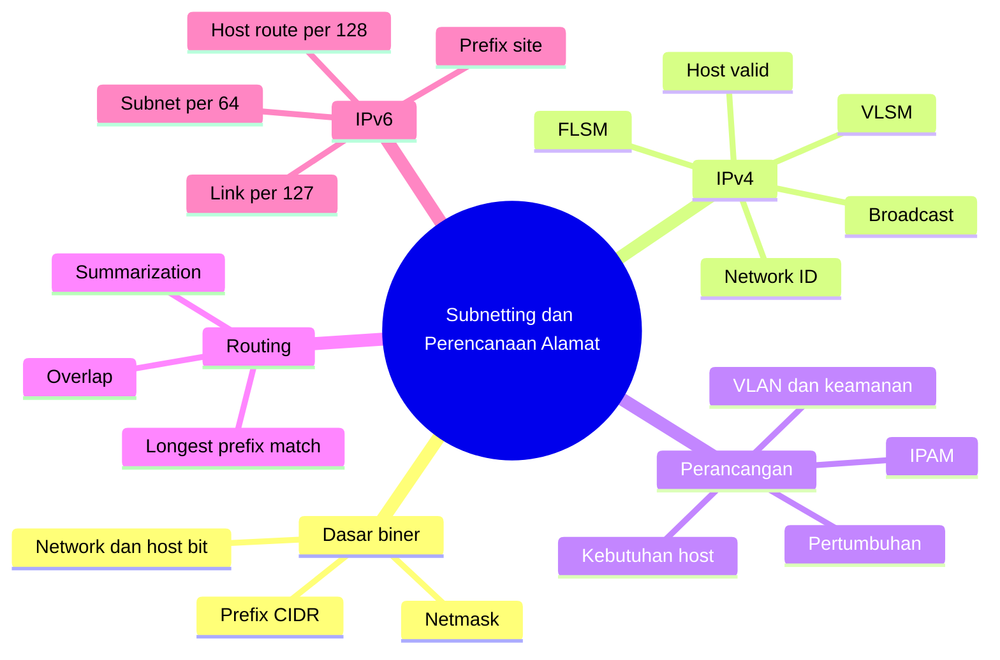
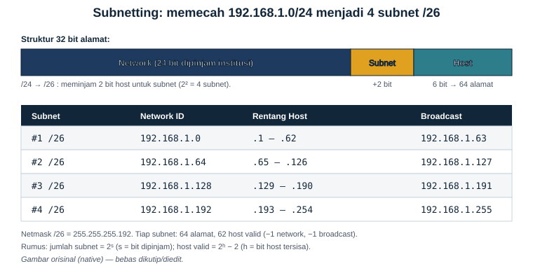

# Bab 6 — Subnetting IPv4, VLSM, dan Perencanaan Alamat IPv6

| Pemetaan | Keterangan |
|---|---|
| **CPMK** | CPMK-2: merancang dan mengevaluasi jaringan berdasarkan kebutuhan teknis |
| **Sub-CPMK** | Sub-CPMK-5: menerapkan subnetting untuk membagi blok alamat serta mengevaluasi efisiensi dan kelayakan rancangan |
| **Kemampuan akhir** | Mahasiswa mampu menentukan prefiks, Network ID, broadcast, rentang host, menerapkan FLSM dan VLSM, mencegah overlap, merangkum rute, serta menyusun rencana alamat IPv4–IPv6 yang terdokumentasi |
| **Prasyarat** | Bab 4 tentang broadcast domain dan VLAN; Bab 5 tentang IPv4, IPv6, prefiks, routing, dan longest prefix match |
| **Rujukan inti** | RFC 1918, RFC 3021, RFC 4291, RFC 4632, RFC 6177, RFC 6598, RFC 7421, dan RFC 950 |

---

## Peta Konsep



---

## 6.1 Subnetting sebagai Keputusan Arsitektural

Subnetting sering diperkenalkan sebagai latihan aritmetika biner: meminjam bit host, menghitung ukuran blok, kemudian menuliskan alamat jaringan dan broadcast. Keterampilan tersebut memang diperlukan, tetapi sudut pandang yang hanya berfokus pada perhitungan dapat menutupi tujuan sebenarnya. **Subnetting adalah proses membagi ruang alamat logis menjadi sejumlah domain jaringan yang sesuai dengan topologi, kebutuhan layanan, kebijakan keamanan, dan rencana pertumbuhan.**

Sebuah organisasi tidak membagi jaringan hanya agar memperoleh lebih banyak angka prefiks. Setiap subnet biasanya berkaitan dengan satu segmen Layer 3, misalnya VLAN mahasiswa, VLAN dosen, jaringan server, jaringan manajemen, jaringan kamera, jaringan tamu, atau tautan antarrouter. Pemisahan ini membatasi broadcast Layer 2, menyediakan batas penerapan kebijakan, memperjelas sumber gangguan, dan memungkinkan routing dilakukan secara terstruktur.

Namun, semakin banyak subnet tidak selalu semakin baik. Setiap subnet menambah objek yang harus dikonfigurasi, didokumentasikan, diamankan, dipantau, dan dirutekan. Subnet yang terlalu kecil cepat kehabisan alamat, sedangkan subnet yang terlalu besar memperluas domain broadcast dan dapat menyulitkan isolasi insiden. Rancangan yang baik mencari keseimbangan antara efisiensi alamat, kesederhanaan operasi, kebutuhan keamanan, dan ruang ekspansi.

Dalam konteks IPv4, konservasi alamat masih penting karena ruang alamat terbatas. Dalam konteks IPv6, fokus bergeser dari menghemat alamat host menuju pembentukan hierarki yang konsisten dan mudah diagregasi. Oleh sebab itu, bab ini tidak hanya mengajarkan “cara mendapatkan jawaban”, tetapi juga cara mempertanggungjawabkan sebuah rencana alamat.

## 6.2 Prasyarat: Alamat, Prefiks, dan Bit

Alamat IPv4 terdiri atas 32 bit yang ditulis sebagai empat oktet desimal. Prefiks `/n` menyatakan bahwa `n` bit paling kiri merupakan bagian jaringan, sedangkan `32 − n` bit sisanya tersedia sebagai bagian host. Sebagai contoh, `192.168.10.25/24` mempunyai 24 bit jaringan dan delapan bit host.

Netmask merupakan bentuk desimal dari pola bit yang berisi deretan `1` pada bagian jaringan dan `0` pada bagian host. Karena bit `1` harus berurutan dari kiri, nilai oktet netmask yang sah terbatas pada delapan kemungkinan berikut.

| Jumlah bit jaringan dalam oktet | Pola biner | Nilai desimal |
|---:|---|---:|
| 0 | `00000000` | 0 |
| 1 | `10000000` | 128 |
| 2 | `11000000` | 192 |
| 3 | `11100000` | 224 |
| 4 | `11110000` | 240 |
| 5 | `11111000` | 248 |
| 6 | `11111100` | 252 |
| 7 | `11111110` | 254 |
| 8 | `11111111` | 255 |

Tabel tersebut perlu dipahami, bukan sekadar dihafal. Setiap tambahan satu bit jaringan mengurangi jumlah kombinasi host menjadi setengah, tetapi menggandakan jumlah blok yang dapat dibentuk dari ruang induknya. Hubungan inilah yang melandasi semua perhitungan subnetting.

## 6.3 Istilah yang Harus Dibedakan

Beberapa istilah terlihat serupa tetapi memiliki fungsi berbeda.

| Istilah | Makna |
|---|---|
| **Blok alamat/prefix** | Sekumpulan alamat berurutan yang ditentukan oleh alamat awal dan panjang prefiks |
| **Subnet** | Blok alamat yang digunakan sebagai satu jaringan Layer 3 tertentu |
| **Network ID** | Alamat pertama pada subnet IPv4 konvensional, dengan seluruh host bit bernilai 0 |
| **Broadcast** | Alamat terakhir pada subnet IPv4 konvensional, dengan seluruh host bit bernilai 1 |
| **Host address** | Alamat yang dapat diberikan kepada antarmuka sesuai aturan subnet dan konteks penggunaannya |
| **Netmask** | Representasi desimal bertitik dari panjang prefiks IPv4 |
| **Wildcard mask** | Kebalikan bit netmask, lazim digunakan pada beberapa konfigurasi ACL dan routing |
| **Parent prefix** | Blok induk yang akan dibagi menjadi blok lebih kecil |
| **Child prefix** | Blok hasil pembagian dari parent prefix |

Subnetting selalu menghasilkan child prefix yang **lebih panjang** daripada parent prefix. Membagi `/24` menjadi `/26` berarti menambah dua bit jaringan. Sebaliknya, menggabungkan beberapa prefiks menjadi satu prefiks yang lebih pendek disebut agregasi atau route summarization, bukan subnetting.

## 6.4 Empat Besaran Dasar Subnetting IPv4

Jika sebuah parent prefix `/p` dibagi menjadi child prefix `/q`, dengan `q > p`, maka:

- bit yang dipinjam untuk subnet adalah \(s=q-p\);
- jumlah child subnet berukuran sama adalah \(2^s\);
- jumlah bit host pada setiap child subnet adalah \(h=32-q\);
- jumlah seluruh alamat dalam setiap child subnet adalah \(2^h\).

Untuk subnet IPv4 konvensional yang mendukung broadcast, jumlah host yang lazim digunakan adalah:

\[
H = 2^h - 2
\]

Dua alamat dikeluarkan karena alamat pertama merepresentasikan Network ID dan alamat terakhir merepresentasikan broadcast. Rumus ini sangat berguna, tetapi bukan hukum universal. Pada tautan point-to-point `/31`, kedua alamat digunakan sebagai alamat endpoint berdasarkan RFC 3021. Prefiks `/32` merepresentasikan tepat satu alamat dan umum untuk host route atau loopback. Karena itu, penyelesaian soal harus selalu menyebut konteks.

Sebagai contoh, `/24` dibagi menjadi `/26`:

- bit dipinjam: \(26-24=2\);
- jumlah subnet: \(2^2=4\);
- bit host: \(32-26=6\);
- alamat per subnet: \(2^6=64\);
- host konvensional per subnet: \(64-2=62\).

## 6.5 Konversi Prefix Length dan Netmask

Konversi cepat dilakukan dengan membagi panjang prefiks ke dalam kelompok delapan bit. Untuk `/20`, dua oktet pertama penuh karena memuat 16 bit. Empat bit berikutnya berada pada oktet ketiga dan bernilai `11110000` atau 240. Oktet terakhir bernilai 0. Jadi `/20` setara dengan `255.255.240.0`.

| Prefiks | Netmask | Bit host | Alamat per subnet | Host konvensional |
|---:|---|---:|---:|---:|
| `/16` | `255.255.0.0` | 16 | 65.536 | 65.534 |
| `/20` | `255.255.240.0` | 12 | 4.096 | 4.094 |
| `/22` | `255.255.252.0` | 10 | 1.024 | 1.022 |
| `/24` | `255.255.255.0` | 8 | 256 | 254 |
| `/25` | `255.255.255.128` | 7 | 128 | 126 |
| `/26` | `255.255.255.192` | 6 | 64 | 62 |
| `/27` | `255.255.255.224` | 5 | 32 | 30 |
| `/28` | `255.255.255.240` | 4 | 16 | 14 |
| `/29` | `255.255.255.248` | 3 | 8 | 6 |
| `/30` | `255.255.255.252` | 2 | 4 | 2 |
| `/31` | `255.255.255.254` | 1 | 2 | 2 endpoint point-to-point |
| `/32` | `255.255.255.255` | 0 | 1 | 1 alamat tunggal |

Tabel tidak menggantikan pemahaman. Seorang perancang perlu dapat menjelaskan mengapa `/27` mempunyai blok 32 alamat: lima bit host menghasilkan \(2^5=32\). Jika hanya menghafal, kesalahan mudah terjadi ketika prefiks melewati batas oktet seperti `/19`, `/21`, atau `/23`.

## 6.6 Menentukan Network ID dengan Operasi AND

Metode paling mendasar untuk menemukan Network ID adalah operasi AND bit demi bit antara alamat IP dan netmask. Aturan AND menghasilkan `1` hanya apabila kedua bit bernilai `1`.

Contoh: tentukan subnet bagi `192.168.10.77/26`.

```text
Alamat : 192.168.10.77  = 11000000.10101000.00001010.01001101
Netmask: 255.255.255.192 = 11111111.11111111.11111111.11000000
AND    : 192.168.10.64  = 11000000.10101000.00001010.01000000
```

Hasilnya adalah `192.168.10.64/26`. Karena ukuran blok `/26` adalah 64 alamat, subnet berikutnya dimulai pada `192.168.10.128`. Dengan demikian:

- Network ID: `192.168.10.64`;
- host pertama: `192.168.10.65`;
- host terakhir: `192.168.10.126`;
- broadcast: `192.168.10.127`.

Operasi AND selalu dapat digunakan dan tidak bergantung pada tebakan. Metode ini sangat penting untuk validasi, pemrograman, dan memahami apa yang dilakukan sistem operasi ketika membandingkan prefiks.

## 6.7 Metode Ukuran Blok

Untuk perhitungan manual, metode ukuran blok lebih cepat. Tentukan **oktet menarik**, yaitu oktet netmask yang tidak bernilai 255 dan tidak bernilai 0. Ukuran blok dihitung dengan:

\[
\text{ukuran blok}=256-\text{nilai oktet mask}
\]

Pada `/26`, netmask adalah `255.255.255.192`. Oktet menarik bernilai 192, sehingga ukuran blok `256 − 192 = 64`. Batas subnet pada oktet keempat adalah 0, 64, 128, dan 192.

Untuk alamat `192.168.10.77`, nilai 77 berada di antara 64 dan 127. Maka Network ID adalah `.64` dan broadcast `.127`. Cara cepat untuk menemukan kelipatan bawah adalah membagi nilai oktet alamat dengan ukuran blok, mengambil bilangan bulat ke bawah, lalu mengalikannya kembali:

\[
\lfloor 77/64 \rfloor \times 64 = 64
\]

Metode ini juga berlaku ketika oktet menarik bukan oktet keempat. Pada `/20`, ukuran blok pada oktet ketiga adalah `256 − 240 = 16`, sehingga batas subnet adalah `0, 16, 32, 48, ... 240` pada oktet ketiga.

## 6.8 FLSM: Semua Subnet Berukuran Sama

**Fixed Length Subnet Mask** (FLSM) menggunakan panjang prefiks yang sama untuk semua child subnet. Pendekatan ini sederhana, mudah didokumentasikan, dan menghasilkan pola yang konsisten. FLSM cocok ketika setiap segmen memiliki kebutuhan host yang relatif seragam atau ketika kesederhanaan lebih penting daripada efisiensi maksimum.



*Gambar 6.1 — Blok `192.168.1.0/24` dibagi menjadi empat subnet `/26`. Dua bit host menjadi bit subnet.*

Contoh: empat laboratorium masing-masing membutuhkan paling banyak 60 alamat host dan tersedia parent prefix `192.168.1.0/24`. Kebutuhan empat subnet memerlukan dua bit karena \(2^2=4\). Prefiks berubah dari `/24` menjadi `/26`. Enam bit host tersisa menyediakan 62 alamat host konvensional, sehingga kebutuhan terpenuhi.

| Subnet | Network ID | Rentang host | Broadcast |
|---:|---|---|---|
| 1 | `192.168.1.0/26` | `192.168.1.1`–`192.168.1.62` | `192.168.1.63` |
| 2 | `192.168.1.64/26` | `192.168.1.65`–`192.168.1.126` | `192.168.1.127` |
| 3 | `192.168.1.128/26` | `192.168.1.129`–`192.168.1.190` | `192.168.1.191` |
| 4 | `192.168.1.192/26` | `192.168.1.193`–`192.168.1.254` | `192.168.1.255` |

Rancangan ini valid, tetapi belum tentu paling fleksibel. Jika satu laboratorium akan tumbuh menjadi 90 host, `/26` tidak lagi cukup. Perancang harus memasukkan proyeksi pertumbuhan, bukan hanya jumlah perangkat saat ini.

## 6.9 Menentukan Prefiks dari Kebutuhan Host

Masalah perancangan sering dimulai dari jumlah host, bukan dari prefiks. Langkahnya adalah mencari nilai `h` terkecil yang dapat memenuhi kebutuhan:

\[
2^h-2 \geq H_{kebutuhan}
\]

Setelah `h` ditemukan, prefiks adalah `32 − h`. Sebuah VLAN membutuhkan 100 alamat host. Enam bit host hanya menyediakan 62, sehingga tidak cukup. Tujuh bit host menyediakan 126, maka prefiks terkecil yang memenuhi kebutuhan adalah `/25`.

| Kebutuhan host | Bit host minimum | Kapasitas konvensional | Prefiks minimum |
|---:|---:|---:|---:|
| 2 | 2 | 2 | `/30` atau `/31` khusus point-to-point |
| 6 | 3 | 6 | `/29` |
| 14 | 4 | 14 | `/28` |
| 30 | 5 | 30 | `/27` |
| 62 | 6 | 62 | `/26` |
| 126 | 7 | 126 | `/25` |
| 254 | 8 | 254 | `/24` |
| 500 | 9 tidak cukup; 10 diperlukan | 1.022 | `/22` |

Kebutuhan operasional biasanya lebih besar daripada jumlah perangkat. Alamat juga dapat diperlukan untuk gateway, antarmuka manajemen, load balancer, high availability, printer, perangkat sementara, dan ekspansi. Perhitungan harus menyatakan apakah angka kebutuhan sudah mencakup cadangan.

## 6.10 Menentukan Prefiks dari Kebutuhan Jumlah Subnet

Jika parent prefix `/p` harus menghasilkan setidaknya `N` subnet berukuran sama, carilah `s` terkecil sehingga:

\[
2^s \geq N
\]

Child prefix menjadi `/p+s`. Misalnya `172.16.0.0/16` perlu dibagi menjadi sedikitnya 10 subnet sama besar. Tiga bit hanya menghasilkan delapan subnet. Empat bit menghasilkan 16, sehingga child prefix adalah `/20`.

Setiap `/20` memuat 4.096 alamat atau 4.094 host konvensional. Ukuran blok pada oktet ketiga adalah 16. Network ID berturut-turut adalah `172.16.0.0/20`, `172.16.16.0/20`, `172.16.32.0/20`, dan seterusnya sampai `172.16.240.0/20`.

Hasil 16 subnet berarti enam subnet belum dipakai. Ruang tersebut bukan kesalahan; dapat dicadangkan untuk pertumbuhan. Namun penempatan cadangan perlu direncanakan agar agregasi rute tetap mungkin.

## 6.11 Perhitungan yang Melintasi Batas Oktet

Kesalahan umum muncul ketika ukuran subnet lebih besar dari 256 alamat. Contoh: tentukan Network ID dan broadcast `10.20.77.130/20`. Netmask `/20` adalah `255.255.240.0`, sehingga oktet menarik adalah oktet ketiga dengan blok 16.

Nilai oktet ketiga adalah 77. Kelipatan 16 terdekat yang tidak melebihi 77 adalah 64. Batas berikutnya adalah 80. Karena seluruh oktet keempat termasuk bagian host, diperoleh:

- Network ID: `10.20.64.0/20`;
- host pertama: `10.20.64.1`;
- host terakhir: `10.20.79.254`;
- broadcast: `10.20.79.255`.

Perhatikan bahwa broadcast tidak diperoleh dengan sekadar mengubah oktet terakhir menjadi 255. Batas pada oktet ketiga harus dihitung lebih dahulu. Operasi AND memberikan hasil yang sama dan dapat dipakai untuk memverifikasi metode blok.

## 6.12 VLSM: Ukuran Subnet Sesuai Kebutuhan

**Variable Length Subnet Mask** (VLSM) memungkinkan satu parent prefix dibagi menjadi child prefix dengan ukuran berbeda. VLSM meningkatkan efisiensi ketika kebutuhan segmen bervariasi, tetapi membutuhkan disiplin penempatan agar blok tidak overlap dan ruang sisa tidak terfragmentasi.

Prosedur yang aman adalah:

1. inventarisasi kebutuhan host, gateway, layanan, dan pertumbuhan setiap segmen;
2. urutkan kebutuhan dari terbesar ke terkecil;
3. tentukan prefiks minimum yang memenuhi setiap kebutuhan;
4. alokasikan blok terbesar lebih dahulu pada batas alamat yang sah;
5. lanjutkan ke blok berikutnya dari alamat bebas terendah yang sesuai;
6. catat Network ID, rentang host, broadcast, gateway, dan status reservasi;
7. validasi bahwa semua blok berada di dalam parent prefix dan tidak overlap.

Aturan “terbesar dahulu” bukan hukum protokol, tetapi strategi alokasi yang mengurangi fragmentasi. Jika blok kecil ditempatkan secara acak terlebih dahulu, mungkin tidak tersisa ruang kontigu yang cukup untuk blok besar walaupun jumlah alamat bebas secara total masih mencukupi.

## 6.13 Contoh Lengkap VLSM

Sebuah kampus memiliki `192.168.10.0/24` untuk empat segmen:

- Laboratorium A: 100 host;
- Laboratorium B: 50 host;
- Administrasi: 25 host;
- tautan point-to-point: 2 endpoint.

Kebutuhan telah urut dari terbesar. Laboratorium A membutuhkan `/25` (126 host), Laboratorium B `/26` (62), Administrasi `/27` (30), dan tautan dapat menggunakan `/30` secara konvensional atau `/31` jika perangkat mendukung RFC 3021.

| Segmen | Kebutuhan | Prefiks | Network ID | Rentang host/endpoint | Broadcast |
|---|---:|---:|---|---|---|
| Lab A | 100 | `/25` | `192.168.10.0` | `.1`–`.126` | `.127` |
| Lab B | 50 | `/26` | `192.168.10.128` | `.129`–`.190` | `.191` |
| Administrasi | 25 | `/27` | `192.168.10.192` | `.193`–`.222` | `.223` |
| WAN | 2 | `/30` | `192.168.10.224` | `.225`–`.226` | `.227` |

Alamat `192.168.10.228`–`192.168.10.255` masih bebas, tetapi bukan satu blok sembarang. Ruang tersebut dapat dipandang sebagai `/30` pada `.228`, `/28` pada `.240`, dan blok lain sesuai alignment. Jika organisasi memperkirakan segmen baru membutuhkan `/27`, sisa `.224`–`.255` sebenarnya membentuk satu `/27`; penggunaan `/30` di awal ruang itu telah memecahnya. Alternatifnya, tautan dapat ditempatkan pada ujung lain berdasarkan rencana pertumbuhan. Inilah alasan VLSM perlu dipandang sebagai desain, bukan hanya pengisian tabel.

## 6.14 Alignment: Mengapa Network ID Tidak Boleh Sembarangan

Sebuah prefiks harus dimulai pada kelipatan ukuran bloknya. `/26` berukuran 64 alamat, sehingga batas sah dalam `/24` adalah `.0`, `.64`, `.128`, dan `.192`. Notasi `192.168.1.96/26` secara sintaksis menempelkan `/26` pada sebuah alamat, tetapi network sebenarnya tetap `192.168.1.64/26`; `192.168.1.96` adalah alamat di dalam blok tersebut.

Alignment dapat diperiksa melalui operasi AND. Jika alamat calon Network ID di-AND dengan netmask dan hasilnya berubah, alamat itu bukan batas network yang sah. Ketidakpahaman terhadap alignment sering menyebabkan dua entri yang tampak berbeda ternyata merujuk blok sama.

Sebagai contoh, `10.0.4.0/22` tidak aligned karena `/22` mempunyai ukuran blok empat pada oktet ketiga dan justru `.4` memang kelipatan empat—jadi contoh ini sah. Sebaliknya `10.0.5.0/22` tidak sah sebagai Network ID; network yang sebenarnya adalah `10.0.4.0/22`.

## 6.15 Overlap dan Dampak Operasionalnya

Dua subnet overlap apabila memiliki setidaknya satu alamat yang sama. Misalnya `10.10.0.0/24` sepenuhnya berada di dalam `10.10.0.0/23`. Menggunakan keduanya pada lokasi berbeda tanpa mekanisme khusus dapat menimbulkan ambiguitas routing, terutama saat jaringan dihubungkan melalui VPN atau merger organisasi.

Overlap tidak selalu terlihat sebagai kegagalan total. Longest prefix match dapat membuat trafik tertentu memilih `/24`, sedangkan trafik lain mengikuti `/23`. Hasilnya tampak tidak konsisten dan sulit ditelusuri. NAT dapat dipakai sebagai jalan keluar sementara untuk menghubungkan ruang alamat tumpang tindih, tetapi menambah kompleksitas dan bukan pengganti rencana alamat yang baik.

Validasi overlap dapat dilakukan dengan membandingkan interval alamat awal dan akhir. Dua blok A dan B overlap jika awal A tidak lebih besar dari akhir B dan awal B tidak lebih besar dari akhir A. Alat IPAM seharusnya menolak alokasi yang bertabrakan atau setidaknya memberi peringatan.

## 6.16 Prefix `/31` dan `/32`

Pada subnet IPv4 konvensional, `/30` menyediakan empat alamat: Network ID, dua host, dan broadcast. Untuk tautan point-to-point yang hanya memiliki dua endpoint dan tidak memerlukan broadcast terarah, separuh ruang tersebut terbuang. RFC 3021 menetapkan bahwa kedua alamat pada `/31` diperlakukan sebagai alamat endpoint.

Sebagai contoh, `10.0.0.0/31` menggunakan `10.0.0.0` dan `10.0.0.1` sebagai dua endpoint. Pasangan berikutnya adalah `10.0.0.2/31`, dengan endpoint `.2` dan `.3`. Penggunaan `/31` perlu didukung oleh kedua perangkat dan diterapkan hanya pada tipe link yang sesuai.

Prefiks `/32` merepresentasikan satu alamat IPv4. Ia tidak menyediakan subnet multi-host. `/32` umum digunakan sebagai host route, alamat loopback router, identitas routing, atau objek kebijakan. Karena tidak ada host bit, konsep broadcast dan rentang host konvensional tidak diterapkan dengan cara yang sama.

## 6.17 Memilih Ruang Alamat yang Tepat

Perhitungan subnet tidak dapat dipisahkan dari status ruang alamat. Tiga blok RFC 1918—`10.0.0.0/8`, `172.16.0.0/12`, dan `192.168.0.0/16`—ditujukan untuk jaringan privat dan tidak dirutekan secara global. Pemilihan salah satu blok bukan sekadar persoalan ukuran. Organisasi perlu mempertimbangkan kemungkinan merger, koneksi VPN dengan mitra, kebiasaan alamat perangkat bawaan, serta kebutuhan agregasi antarlokasi.

Rentang `100.64.0.0/10` adalah *Shared Address Space* untuk konteks penyedia layanan dan CGNAT. Ia bukan blok privat tambahan yang bebas dipakai sebagai pengganti RFC 1918 pada LAN perusahaan. Penggunaan tanpa memahami tujuan standarnya dapat menimbulkan konflik dengan layanan ISP.

Blok dokumentasi seperti `192.0.2.0/24`, `198.51.100.0/24`, dan `203.0.113.0/24` tepat digunakan dalam buku, slide, dan laboratorium yang tidak terhubung sebagai jaringan produksi. Alamat publik milik pihak lain tidak boleh digunakan secara sembarangan pada jaringan internal karena konektivitas menuju pemilik sah dapat terganggu.

Rencana alamat yang matang mencatat sumber otoritas setiap prefix: alokasi RIR/ISP, RFC 1918, delegasi internal, atau ruang dokumentasi. Catatan ini mencegah anggapan bahwa setiap blok yang “tidak sedang dipakai” boleh dialokasikan.

## 6.18 Gateway, Reservasi, dan DHCP Pool

Kapasitas subnet tidak identik dengan ukuran DHCP pool. Dari 62 host valid pada `/26`, organisasi mungkin menyisihkan alamat untuk gateway, perangkat jaringan, server, printer, access point, dan mekanisme high availability. DHCP hanya membagikan bagian yang ditentukan sebagai pool dinamis.

Tidak ada aturan protokol yang mewajibkan gateway memakai alamat pertama atau terakhir. Konvensi seperti `.1`, `.254`, atau alamat pertama yang dapat dipakai membantu konsistensi, tetapi harus didokumentasikan. Pada high availability, dua router fisik dan satu alamat virtual dapat membutuhkan tiga alamat dari subnet yang sama.

Contoh rencana `192.168.20.0/26`:

| Rentang/alamat | Penggunaan |
|---|---|
| `192.168.20.0` | Network ID |
| `192.168.20.1` | Gateway virtual |
| `192.168.20.2`–`.3` | Router fisik |
| `192.168.20.4`–`.9` | Infrastruktur statis |
| `192.168.20.10`–`.55` | DHCP pool |
| `192.168.20.56`–`.62` | Cadangan |
| `192.168.20.63` | Broadcast |

Subnet ini secara matematis menyediakan 62 host, tetapi pool DHCP hanya 46 alamat. Jika perancang hanya membandingkan jumlah klien dengan angka 62, layanan dapat kehabisan lease lebih cepat dari perkiraan.

## 6.19 Hubungan Subnet, VLAN, dan Broadcast Domain

Dalam desain kampus atau perusahaan, satu VLAN biasanya dipetakan ke satu subnet IP. Switch Layer 2 memisahkan broadcast domain berdasarkan VLAN, sedangkan router atau switch Layer 3 menyediakan gateway dan routing antar-VLAN. Pemetaan satu-ke-satu memudahkan operasi dan troubleshooting.

Subnet dan VLAN bukan konsep yang sama. VLAN adalah segmentasi Layer 2; subnet adalah struktur pengalamatan Layer 3. Secara teknis beberapa subnet dapat ditempatkan pada satu VLAN, atau satu subnet dapat diregangkan melintasi beberapa switch, tetapi desain semacam itu memerlukan alasan yang kuat. Penggunaan yang tidak disiplin membuat ARP, gateway, failure domain, dan kebijakan keamanan lebih sulit dipahami.

Ukuran subnet menentukan besarnya populasi yang berpotensi berbagi broadcast domain, tetapi tingkat broadcast aktual bergantung pada jumlah dan perilaku perangkat. Membagi `/24` menjadi empat `/26` tidak otomatis meningkatkan bandwidth link. Manfaatnya muncul karena broadcast dibatasi dan kebijakan antarsegmen dapat diterapkan pada perangkat Layer 3.

## 6.20 Subnetting dan Keamanan

Segmentasi alamat memberi **batas kebijakan**, bukan keamanan otomatis. Dua VLAN berbeda dapat tetap saling berkomunikasi jika router mengizinkannya. Sebaliknya, host dalam subnet sama sering berkomunikasi langsung tanpa melewati firewall pusat, sehingga ancaman lateral pada satu subnet perlu dipertimbangkan.

Rencana alamat dapat membantu keamanan melalui beberapa cara:

- memisahkan pengguna, server, manajemen, tamu, IoT, dan teknologi operasional;
- memungkinkan ACL atau firewall ditulis berdasarkan kelompok yang bermakna;
- memudahkan korelasi log antara prefix, lokasi, dan fungsi;
- membatasi ruang dampak kesalahan atau infeksi;
- mendukung kebijakan *default deny* antarsegmen sensitif.

Namun pengelompokan terlalu luas mencampurkan aset dengan tingkat kepercayaan berbeda. Pengelompokan terlalu granular menambah aturan, interface virtual, rute, dan beban dokumentasi. Keputusan segmentasi sebaiknya mengikuti risiko, aliran data, kepemilikan layanan, dan kemampuan operasi—bukan sekadar struktur organisasi di atas kertas.

Subnet juga bukan batas identitas yang kuat. Alamat dapat dipalsukan pada kondisi tertentu, berubah melalui DHCP, atau diterjemahkan oleh NAT. Kebijakan penting sebaiknya memadukan kontrol jaringan dengan autentikasi, inventaris aset, dan telemetri.

## 6.21 Subnetting dan Route Summarization

Subnetting memecah blok besar menjadi blok kecil. **Route summarization** melakukan arah konseptual sebaliknya: beberapa prefix berurutan diringkas menjadi prefix yang lebih pendek untuk mengurangi jumlah rute. CIDR dirancang bukan hanya untuk konservasi alamat IPv4, tetapi juga membatasi pertumbuhan keadaan routing.

Empat jaringan berikut dapat diringkas:

- `10.20.0.0/24`;
- `10.20.1.0/24`;
- `10.20.2.0/24`;
- `10.20.3.0/24`.

Keempatnya berurutan, berjumlah pangkat dua, dan dimulai pada batas yang sesuai. Ringkasannya adalah `10.20.0.0/22`. Prefix `/22` mencakup oktet ketiga 0–3.

Tidak semua kumpulan rute boleh diringkas. `10.20.1.0/24` hingga `10.20.4.0/24` terdiri atas empat blok, tetapi tidak aligned sebagai satu `/22`. Prefix `/22` yang mencakup `.1` akan dimulai pada `.0` dan berakhir pada `.3`, sehingga `.4` berada di luar. Ringkasan yang terlalu luas dapat mengiklankan ruang yang sebenarnya tidak dapat dicapai dan menghasilkan black hole.

## 6.22 Syarat Ringkasan yang Aman

Ringkasan rute yang baik memenuhi syarat matematis dan topologis:

1. prefix yang diringkas kontigu;
2. jumlah blok idealnya pangkat dua untuk satu ringkasan tunggal;
3. alamat awal aligned terhadap ukuran ringkasan;
4. router yang mengumumkan ringkasan benar-benar mempunyai jalur menuju seluruh ruang yang diumumkan;
5. tidak ada bagian prefix yang seharusnya dicapai melalui lokasi lain;
6. tersedia strategi discard/null route agar paket untuk bagian kosong tidak berputar.

Perencanaan alamat sebaiknya mengikuti topologi agar summarization mudah. Sebagai contoh, setiap gedung memperoleh satu `/20`, kemudian membaginya menjadi VLAN `/24`, `/25`, atau `/26`. Router distribusi gedung cukup mengumumkan `/20` ke core. Jika subnet tiap gedung tersebar acak di seluruh ruang perusahaan, tabel routing akan memuat banyak prefix spesifik dan migrasi menjadi lebih sulit.

## 6.23 Desain Hierarkis untuk Banyak Lokasi

Misalkan organisasi memiliki parent prefix privat `10.0.0.0/8`, delapan wilayah, dan hingga 16 lokasi per wilayah. Sebagian bit dapat dialokasikan secara hierarkis, misalnya:

```text
10 . RRRSSSSS . VVVVVVVV . HHHHHHHH
     wilayah      VLAN       host
```

Pola tersebut hanya ilustrasi; batas sebenarnya harus diterjemahkan ke prefix CIDR. Tujuannya ialah membuat alamat mengandung struktur yang berguna tanpa menjadikannya terlalu kaku. Wilayah dapat menerima agregat besar, lokasi menerima sub-agregat, dan VLAN memperoleh child prefix sesuai kebutuhan.

Rencana hierarkis memberi keuntungan:

- route summarization pada batas wilayah atau lokasi;
- delegasi administrasi yang jelas;
- identifikasi awal lokasi dari alamat;
- pengurangan risiko overlap;
- ekspansi yang lebih mudah apabila ruang cadangan disediakan.

Risikonya adalah struktur organisasi dapat berubah. Menanamkan terlalu banyak makna—nomor gedung, lantai, unit, jenis perangkat, tahun—ke dalam bit alamat membuat renumbering sulit. Alamat sebaiknya membawa struktur routing yang relatif stabil, sedangkan metadata rinci disimpan dalam IPAM.

## 6.24 Perencanaan Pertumbuhan dan Cadangan

Kebutuhan host hari ini bukan satu-satunya dasar ukuran subnet. Pertumbuhan dipengaruhi oleh perangkat pribadi, virtualisasi, container, IoT, redundancy, dan perubahan layanan. Akan tetapi, menambahkan persentase cadangan secara seragam juga dapat boros. Segmen server yang dikendalikan mungkin tumbuh berbeda dari Wi-Fi mahasiswa.

Pendekatan yang dapat diaudit adalah mencatat:

- jumlah alamat terpakai saat ini;
- jumlah maksimum perangkat serentak, bukan hanya inventaris total;
- pertumbuhan historis dan proyeksi periode desain;
- reservasi infrastruktur dan high availability;
- kebutuhan perangkat sementara;
- batas operasional DHCP atau Neighbor Discovery;
- opsi memperbesar subnet atau menambah subnet baru.

Kadang lebih baik menyediakan dua `/25` yang dapat dikelola terpisah daripada satu `/24` besar. Pada situasi lain, ruang kontigu untuk memperbesar prefix lebih bernilai. Tidak ada rasio cadangan universal; keputusan harus ditautkan pada risiko kehabisan alamat dan biaya perubahan.

## 6.25 Subnetting IPv6: Filosofi yang Berbeda

IPv6 tetap menggunakan prefix dan longest prefix match, tetapi kelimpahan alamat mengubah tujuan perencanaan. Pada LAN umum yang memakai SLAAC, prefix `/64` menjadi unit subnet yang dominan karena interface identifier berukuran 64 bit. Perancang tidak menghitung kapasitas host dengan `2^64 − 2` untuk menentukan apakah satu ruang kelas “cukup”. Fokusnya adalah jumlah subnet, hierarki, agregasi, dan konsistensi.

Jika sebuah site menerima `2001:db8:1200::/48`, terdapat 16 bit antara `/48` dan `/64`. Secara matematis tersedia \(2^{16}=65.536\) subnet `/64`. Bagian 16 bit tersebut dapat dibagi untuk lokasi, fungsi, atau zona.

Contoh struktur:

| Prefix | Fungsi |
|---|---|
| `2001:db8:1200:0000::/64` | Infrastruktur core |
| `2001:db8:1200:0100::/64` | Gedung A — pengguna |
| `2001:db8:1200:0101::/64` | Gedung A — perangkat laboratorium |
| `2001:db8:1200:0200::/64` | Gedung B — pengguna |
| `2001:db8:1200:0f00::/64` | Pusat data — aplikasi |

`2001:db8::/32` digunakan untuk dokumentasi. Prefix produksi harus berasal dari alokasi yang sah.

## 6.26 Delegasi IPv6 Tidak Selalu `/48`

Pernyataan bahwa “setiap institusi selalu memperoleh `/48`” terlalu mutlak. RFC 6177 menjelaskan bahwa satu ukuran untuk semua end site tidak cukup bernuansa. Besar delegasi merupakan keputusan operasional yang mempertimbangkan jumlah subnet, pertumbuhan, kebijakan penyedia, dan kebutuhan site.

Sebuah end site dapat memperoleh `/48`, `/52`, `/56`, atau ukuran lain. Yang penting, delegasi memungkinkan jumlah subnet yang wajar dan tidak memaksa penggunaan prefix lebih panjang dari `/64` pada LAN yang bergantung pada mekanisme standar tersebut.

Jumlah subnet `/64` yang tersedia dapat dihitung dengan:

\[
N = 2^{64-p}
\]

dengan `p` sebagai panjang prefix site. `/56` menyediakan \(2^8=256\) subnet `/64`; `/52` menyediakan 4.096; `/48` menyediakan 65.536. Perhitungan ini menghitung subnet, bukan host.

## 6.27 Prefix Khusus IPv6: `/64`, `/127`, dan `/128`

Untuk hampir semua LAN IPv6 konvensional, `/64` adalah pilihan yang kompatibel dengan SLAAC dan asumsi arsitektur interface identifier. RFC 7421 menganalisis manfaat batas 64 bit serta konsekuensi apabila batas tersebut diubah. Memakai `/80` atau `/96` pada LAN hanya karena jumlah host sedikit dapat merusak kompatibilitas dan tidak memberikan penghematan bermakna.

Tautan inter-router point-to-point dapat menggunakan `/127` sesuai RFC 6164. Seperti `/31` pada IPv4, dua alamat dipakai untuk dua endpoint. Penggunaan ini juga mengurangi masalah tertentu seperti *ping-pong* pada tautan router.

Prefix `/128` menunjuk satu alamat IPv6 dan umum untuk loopback atau host route. Routing masih dapat memproses prefix dengan panjang berbeda; `/64` bukan satu-satunya panjang rute. Pembedaan yang tepat adalah antara **prefix subnet pada link**, **delegasi site**, **agregat routing**, dan **host route**.

## 6.28 Menyelaraskan IPv4 dan IPv6 pada Dual-Stack

Pada jaringan dual-stack, satu VLAN biasanya mempunyai satu subnet IPv4 dan satu prefix IPv6. Keduanya melayani kelompok perangkat yang sama, tetapi ukuran numeriknya tidak harus sebanding. VLAN dengan IPv4 `/26` dapat memperoleh IPv6 `/64`.

Keselarasan sebaiknya dibuat pada identitas administratif. Jika VLAN 120 adalah laboratorium jaringan, IPAM dapat mencatat:

| Atribut | Nilai contoh |
|---|---|
| VLAN ID | 120 |
| Nama | LAB-JARINGAN |
| IPv4 | `10.20.120.0/24` |
| Gateway IPv4 | `10.20.120.1` |
| IPv6 | `2001:db8:1200:0120::/64` |
| Gateway IPv6 | alamat link-local router atau alamat yang ditetapkan |
| DHCP/DNS | referensi layanan terkait |
| Zona keamanan | Academic-Lab |

Menyamakan pola heksadesimal IPv6 dengan VLAN dapat membantu manusia, tetapi bukan kewajiban protokol. Hindari skema yang membuat agregasi routing rusak hanya demi pola visual.

## 6.29 IPAM sebagai Sumber Kebenaran

Spreadsheet cukup untuk latihan, tetapi jaringan besar memerlukan **IP Address Management** (IPAM). IPAM menyimpan prefix, alamat, status alokasi, VLAN, lokasi, VRF, tenant, DNS, DHCP, perangkat, dan riwayat perubahan. Nilai utamanya bukan tampilan daftar, melainkan pengendalian konflik dan keterlacakan keputusan.

Status alamat sebaiknya tidak hanya “dipakai” atau “kosong”. Contoh status yang berguna adalah *container*, *reserved*, *available*, *active*, *deprecated*, dan *retired*. Prefix container mewakili ruang yang didelegasikan, sedangkan child prefix mewakili subnet operasional.

IPAM modern dapat bertindak sebagai *source of truth* untuk otomasi. Konfigurasi DHCP, DNS, router, firewall, dan dokumentasi dapat diturunkan dari data yang sama. Namun otomatisasi mempercepat kesalahan jika data sumber tidak benar. Perubahan memerlukan validasi, persetujuan, audit trail, dan mekanisme rollback.

## 6.30 Dokumen Rencana Alamat Minimum

Setiap alokasi sebaiknya mencatat sekurang-kurangnya:

| Atribut | Tujuan |
|---|---|
| Prefix dan VRF | Mengidentifikasi ruang alamat secara unik dalam domain routing |
| Network/broadcast | Validasi batas IPv4 |
| Rentang DHCP | Mencegah benturan dengan alamat statis |
| Gateway | Menentukan pintu keluar subnet |
| VLAN dan interface | Menghubungkan Layer 2 dan Layer 3 |
| Lokasi dan pemilik | Menentukan tanggung jawab operasional |
| Fungsi/klasifikasi | Mendukung kebijakan keamanan |
| Sumber alokasi | Menjelaskan parent prefix dan otoritas |
| Status dan masa berlaku | Mengelola siklus hidup |
| Cadangan dan proyeksi | Menjelaskan alasan ukuran subnet |

Dokumentasi tanpa proses pemutakhiran cepat menjadi tidak dipercaya. Integrasi dengan proses perubahan lebih penting daripada membuat tabel yang indah hanya pada awal proyek.

## 6.31 Validasi Rancangan Secara Sistematis

Sebelum konfigurasi diterapkan, lakukan pemeriksaan berikut:

1. **Containment:** semua child prefix berada di dalam parent prefix yang sah.
2. **Alignment:** setiap Network ID berada pada batas yang sesuai dengan prefiksnya.
3. **Capacity:** alamat tersedia mencukupi kebutuhan termasuk reservasi dan pertumbuhan.
4. **Uniqueness:** tidak ada overlap dalam VRF atau domain yang akan saling terhubung.
5. **Completeness:** gateway, DHCP pool, DNS, VLAN, dan pemilik telah dicatat.
6. **Aggregation:** alokasi mengikuti topologi dan dapat diringkas bila diperlukan.
7. **Security:** zona dan aliran antarsegmen mempunyai kebijakan yang jelas.
8. **Dual-stack parity:** IPv4 dan IPv6 memperoleh kontrol serta observabilitas setara.
9. **Operational support:** perangkat mendukung `/31`, `/127`, atau fitur khusus yang dipilih.
10. **Recovery:** tersedia ruang dan prosedur untuk ekspansi atau renumbering.

Validasi harus menghasilkan bukti, misalnya laporan overlap, tabel penggunaan, hasil unit test otomasi, atau review sejawat. “Sudah diperiksa” tanpa artefak sulit diaudit.

## 6.32 Troubleshooting Kesalahan Subnet

Kesalahan netmask dapat menciptakan gejala yang membingungkan. Dua host mungkin menganggap satu sama lain berada pada link lokal, sementara gateway menganggapnya berada pada subnet berbeda. Host lalu mengirim ARP untuk tujuan yang seharusnya melalui router dan komunikasi gagal.

| Gejala | Kemungkinan penyebab | Bukti yang diperiksa |
|---|---|---|
| Sebagian alamat dapat diakses, sebagian tidak | Mask berbeda atau overlap rute | Konfigurasi prefix dan tabel routing kedua arah |
| Host melakukan ARP untuk alamat jauh | Prefix terlalu pendek/lebar pada host | Packet capture ARP dan tabel route host |
| DHCP berjalan tetapi gateway tidak terjangkau | Pool atau opsi mask/gateway salah | Lease yang diterima dan SVI router |
| Subnet baru mengganggu jaringan lama | Child prefix overlap | IPAM, konfigurasi router, VPN, dan firewall |
| Rute ringkasan menjadi black hole | Summary mencakup ruang tanpa child route | Tabel forwarding dan null route |
| Hanya satu arah yang berhasil | Rute balik atau ACL tidak sesuai prefix | Traceroute dua arah, firewall log, longest match |
| Alamat pertama/terakhir `/31` ditolak | Perangkat tidak mendukung RFC 3021 | Dokumentasi vendor dan status interface |

Troubleshooting sebaiknya dimulai dengan empat fakta: alamat lokal, prefix length, gateway, dan tabel rute. Setelah itu periksa neighbor table, packet capture, dan jalur balik. Jangan mengubah netmask secara acak sampai koneksi tampak berhasil; perubahan dapat memperluas subnet dan menyembunyikan konflik.

## 6.33 Studi Kasus: Perencanaan Alamat Kampus

Sebuah kampus memperoleh ruang privat `10.40.0.0/16` dan delegasi IPv6 dokumentasi `2001:db8:40::/48` untuk simulasi. Terdapat tiga gedung, pusat data, jaringan manajemen, dan koneksi antarrouter. Tujuan desain adalah memudahkan agregasi per gedung, menyediakan pertumbuhan lima tahun, dan menjaga pemisahan zona.

Setiap gedung memperoleh IPv4 `/20`, sehingga tersedia 4.096 alamat bruto yang dapat dibagi menjadi VLAN. Gedung A menerima `10.40.0.0/20`, Gedung B `10.40.16.0/20`, dan Gedung C `10.40.32.0/20`. Pusat data memperoleh `10.40.48.0/20`. Ruang lain disimpan untuk ekspansi. Router distribusi dapat mengumumkan satu `/20` per gedung ke core.

Di Gedung A, alokasi dilakukan sebagai berikut:

| VLAN | Kebutuhan | IPv4 | IPv6 | Zona |
|---|---:|---|---|---|
| Mahasiswa | 700 | `10.40.0.0/22` | `2001:db8:40:0100::/64` | User |
| Dosen | 180 | `10.40.4.0/24` | `2001:db8:40:0101::/64` | Staff |
| Laboratorium | 240 | `10.40.5.0/24` | `2001:db8:40:0102::/64` | Academic-Lab |
| IoT | 100 | `10.40.6.0/25` | `2001:db8:40:0103::/64` | Restricted-IoT |
| Manajemen perangkat | 60 | `10.40.6.128/26` | `2001:db8:40:0104::/64` | Management |

Masih terdapat ruang kontigu di dalam `/20` untuk pertumbuhan. Firewall menerapkan kebijakan antarzona; pemisahan prefix saja tidak dianggap cukup. Tautan IPv4 antarrouter menggunakan `/31`, sedangkan IPv6 memakai `/127` apabila seluruh perangkat mendukung. Loopback menggunakan `/32` dan `/128`.

Kasus ini memperlihatkan dua filosofi. IPv4 menggunakan VLSM berdasarkan kapasitas, sedangkan IPv6 memberikan `/64` seragam pada setiap LAN. Keduanya tetap mengikuti hierarki gedung agar routing dapat diagregasi.

## 6.34 Otomasi Perhitungan dan Batas Kepercayaannya

Kalkulator subnet, pustaka pemrograman, dan IPAM mengurangi kesalahan aritmetika. Namun alat tidak mengetahui maksud desain kecuali kebutuhan dimodelkan dengan benar. Sebuah skrip dapat membuktikan dua prefix tidak overlap, tetapi tidak dapat menyimpulkan apakah mahasiswa dan server administrasi pantas berada dalam zona sama tanpa konteks kebijakan.

Otomasi yang baik memisahkan tiga tahap:

- **input deklaratif:** parent prefix, kebutuhan, lokasi, zona, dan cadangan;
- **validasi:** containment, alignment, capacity, overlap, dan aturan organisasi;
- **generasi artefak:** tabel IPAM, konfigurasi, dokumentasi, serta pengujian.

Hasil harus dapat direproduksi. Versi sumber data dan aturan validasi disimpan, perubahan melalui review, dan konfigurasi yang dihasilkan dibandingkan sebelum diterapkan. Perhitungan manual tetap penting agar operator dapat mengenali output alat yang tidak masuk akal.

## 6.35 Perkembangan Praktik Subnetting Modern

CIDR dan VLSM tetap menjadi fondasi IPv4 karena mendukung konservasi alamat dan agregasi routing. Penggunaan CGNAT mempertahankan kebutuhan perencanaan IPv4 berskala besar pada penyedia layanan, termasuk pengelolaan `100.64.0.0/10`, kapasitas port, dan logging. Namun CGNAT bukan alasan untuk menunda pemahaman IPv6.

Pada IPv6, praktik yang sehat menghindari “subnetting seperti IPv4” dengan membuat LAN lebih panjang dari `/64` hanya untuk menghemat alamat. Ruang delegasi site perlu dirancang untuk jumlah subnet dan hierarki, bukan jumlah host per LAN. RFC 6177 juga mengingatkan bahwa `/48` bukan satu-satunya ukuran end-site yang wajib diterapkan pada semua situasi.

Tren otomasi dan *infrastructure as code* membuat kualitas data IPAM semakin penting. Prefix bukan lagi sekadar catatan spreadsheet, melainkan input bagi DHCP, DNS, firewall, routing, monitoring, dan inventaris. Kesalahan alokasi karena itu dapat menyebar lebih cepat; validasi sebelum penerapan menjadi kontrol utama.

## 6.36 Miskonsepsi yang Perlu Dihindari

1. **“Kelas C selalu `/24`.”** Jaringan modern menggunakan CIDR; prefiks eksplisit menentukan batas network.
2. **“Semua subnet kehilangan dua alamat.”** `/31` menggunakan kedua alamat pada tautan point-to-point, sedangkan `/32` menunjuk satu alamat.
3. **“Alamat pertama selalu gateway.”** Itu konvensi, bukan kewajiban protokol.
4. **“Subnetting meningkatkan kecepatan link.”** Subnetting dapat mengurangi domain broadcast dan memperbaiki pengelolaan, tetapi tidak mengubah kapasitas fisik link.
5. **“VLAN dan subnet adalah hal yang sama.”** VLAN bekerja pada Layer 2; subnet adalah struktur Layer 3.
6. **“Subnet berbeda otomatis aman.”** Routing dan kebijakan menentukan apakah komunikasi diizinkan.
7. **“Lebih banyak subnet selalu lebih baik.”** Granularitas menambah kompleksitas operasi.
8. **“Jika total alamat bebas cukup, blok besar pasti dapat dialokasikan.”** Fragmentasi dan alignment dapat mencegah tersedianya blok kontigu.
9. **“Empat `/24` selalu dapat diringkas menjadi `/22`.”** Alamat awal harus aligned dan prefix harus kontigu.
10. **“`172.x.x.x` pasti privat.”** Hanya `172.16.0.0/12` yang termasuk ruang privat RFC 1918.
11. **“`100.64.0.0/10` adalah ruang privat perusahaan.”** Blok tersebut ditujukan sebagai Shared Address Space untuk konteks CGNAT.
12. **“IPv6 tidak membutuhkan subnetting.”** IPv6 tetap memerlukan hierarki prefix dan pemisahan subnet, tetapi bukan untuk menghemat alamat host.
13. **“Setiap organisasi pasti menerima `/48`.”** Ukuran delegasi end-site ditentukan secara operasional dan tidak satu ukuran untuk semua.
14. **“Semua rute IPv6 harus `/64`.”** `/64` dominan untuk LAN; agregat, `/127`, dan `/128` mempunyai fungsi berbeda.
15. **“Kalkulator subnet menjamin desain benar.”** Alat menghitung, tetapi tujuan, keamanan, pertumbuhan, dan topologi tetap memerlukan penilaian manusia.

## 6.37 Kerangka Penyelesaian Soal dan Kasus Nyata

Gunakan urutan berikut agar analisis dapat diperiksa:

1. Tuliskan parent prefix dan pastikan sumber alokasinya sah.
2. Identifikasi apakah masalah meminta jumlah subnet, jumlah host, atau kebutuhan VLSM.
3. Masukkan reservasi dan proyeksi pertumbuhan.
4. Hitung bit subnet dan host; nyatakan pengecualian `/31` atau `/32` bila relevan.
5. Tentukan netmask dan ukuran blok pada oktet menarik.
6. Pastikan setiap Network ID aligned.
7. Susun Network ID, rentang host, dan broadcast secara lengkap.
8. Validasi containment serta overlap.
9. Periksa hubungan dengan VLAN, gateway, DHCP, routing, dan keamanan.
10. Evaluasi kemungkinan summarization dan ruang ekspansi.
11. Dokumentasikan asumsi agar hasil dapat direproduksi.

Kerangka ini juga dapat digunakan sebagai rubrik penilaian. Jawaban numerik yang benar tetapi tidak menjelaskan asumsi atau overlap belum menunjukkan kemampuan merancang jaringan.

---

## Ringkasan

- Subnetting adalah keputusan arsitektural untuk membagi ruang alamat sesuai topologi, kapasitas, keamanan, operasi, dan pertumbuhan.
- Prefix `/n` menyatakan `n` bit jaringan; bit host IPv4 berjumlah `32 − n`.
- FLSM memakai ukuran subnet seragam, sedangkan VLSM menyesuaikan ukuran dengan kebutuhan.
- Metode AND merupakan dasar matematis; metode ukuran blok mempercepat perhitungan manual.
- Rumus `2^h − 2` berlaku untuk subnet IPv4 konvensional, dengan pengecualian penting `/31` dan `/32`.
- Network ID harus aligned terhadap ukuran blok dan seluruh child prefix harus berada dalam parent prefix.
- Alokasi VLSM dilakukan dari kebutuhan terbesar untuk mengurangi fragmentasi, kemudian diverifikasi agar tidak overlap.
- Subnet, VLAN, dan zona keamanan saling berhubungan, tetapi bukan konsep yang identik.
- Route summarization memerlukan prefix kontigu, jumlah/alignment yang tepat, dan kesesuaian topologi.
- IPv6 berfokus pada jumlah subnet dan hierarki; `/64` dominan untuk LAN, `/127` untuk link inter-router tertentu, dan `/128` untuk satu alamat.
- Ukuran delegasi IPv6 end-site tidak selalu `/48`; kebutuhan site dan kebijakan operasional perlu dipertimbangkan.
- IPAM, validasi otomatis, audit trail, dan dokumentasi menjadikan rencana alamat dapat dikelola pada skala produksi.

## Glosarium

| Istilah | Definisi ringkas |
|---|---|
| Address pool | Sekumpulan alamat yang dapat dialokasikan oleh DHCP atau sistem lain |
| Aggregate prefix | Prefix ringkasan yang mewakili beberapa child prefix |
| Alignment | Kesesuaian alamat awal dengan kelipatan ukuran blok prefix |
| Broadcast address | Alamat seluruh host bit 1 pada subnet IPv4 konvensional |
| Child prefix | Prefix hasil pembagian dari parent prefix |
| CIDR | Sistem pengalamatan dan agregasi tanpa kelas dengan panjang prefiks eksplisit |
| Containment | Kondisi ketika child prefix sepenuhnya berada di dalam parent prefix |
| FLSM | Pembagian dengan panjang prefix sama untuk seluruh subnet |
| Host route | Rute menuju satu alamat, biasanya `/32` pada IPv4 atau `/128` pada IPv6 |
| IPAM | Sistem pengelolaan prefix, alamat, status, dan metadata jaringan |
| Network ID | Alamat awal subnet IPv4 konvensional |
| Oktet menarik | Oktet netmask yang tidak 255 dan tidak 0, tempat increment dihitung |
| Overlap | Kondisi dua prefix mencakup sebagian alamat yang sama |
| Parent prefix | Blok induk yang akan dibagi atau didelegasikan |
| Prefix length | Jumlah bit jaringan pada alamat IP |
| Route summarization | Penggabungan beberapa prefix menjadi pengumuman yang lebih ringkas |
| Shared Address Space | `100.64.0.0/10` untuk penggunaan terkait CGNAT penyedia layanan |
| Subnet | Satu blok prefix yang dipakai sebagai segmen Layer 3 |
| VLSM | Penggunaan panjang prefix berbeda dalam satu rancangan alamat |
| Wildcard mask | Kebalikan bit netmask yang digunakan pada konfigurasi tertentu |

## Latihan

### Level A — Pemahaman Dasar

1. Jelaskan perbedaan parent prefix, child prefix, dan subnet.
2. Konversikan `/19`, `/21`, `/27`, dan `/29` menjadi netmask desimal.
3. Berapa bit host, jumlah alamat, dan host konvensional pada `/23`?
4. Mengapa Network ID harus berada pada batas ukuran blok?
5. Tentukan ukuran blok `/26`, `/27`, dan `/28` pada oktet keempat.
6. Tentukan Network ID, broadcast, dan rentang host `192.168.5.173/27`.
7. Tentukan Network ID dan broadcast `172.16.77.9/20`.
8. Jelaskan mengapa rumus `2^h − 2` tidak diterapkan secara biasa pada `/31`.
9. Apa fungsi `/32` dalam routing IPv4?
10. Bedakan bandwidth DHCP pool dengan kapasitas host suatu subnet.
11. Mengapa VLAN tidak sama dengan subnet?
12. Sebutkan tiga blok alamat privat RFC 1918.

### Level B — Penerapan

13. Bagi `192.168.100.0/24` menjadi delapan subnet sama besar. Susun tabel lengkapnya.
14. Bagi `172.20.0.0/16` menjadi sedikitnya 20 subnet FLSM. Tentukan child prefix dan kapasitas host.
15. Sebuah VLAN memerlukan 210 host, 15 alamat reservasi, dan cadangan 20%. Tentukan prefix yang layak serta asumsi pembulatannya.
16. Tentukan apakah `10.1.8.0/21` aligned. Jika tidak, tuliskan Network ID yang benar.
17. Apakah `10.1.16.0/20` dan `10.1.24.0/21` overlap? Buktikan dengan interval alamat.
18. Susun VLSM untuk `192.168.50.0/24` dengan kebutuhan 110, 50, 20, 10, dan 2 host.
19. Bandingkan penggunaan `/30` dan `/31` pada 200 tautan point-to-point. Berapa alamat yang dihemat?
20. Buat pembagian DHCP pool untuk `10.10.8.0/23` dengan gateway, 20 alamat infrastruktur, dan 15% cadangan.
21. Ringkas `10.40.8.0/24` hingga `10.40.11.0/24`. Jelaskan syarat alignment.
22. Jelaskan mengapa `10.40.9.0/24` hingga `10.40.12.0/24` tidak dapat menjadi satu `/22` yang tepat.
23. Dari delegasi IPv6 `/56`, berapa subnet `/64` yang tersedia?
24. Buat enam prefix `/64` pertama dari `2001:db8:abcd:1200::/56`.
25. Jelaskan perbedaan fungsi `/64`, `/127`, dan `/128` pada IPv6.

### Level C — Analisis dan Evaluasi

26. Sebuah kampus menggunakan `10.0.0.0/8` tanpa hierarki. Susun strategi renumbering bertahap agar routing dapat diagregasi per gedung.
27. Dua perusahaan yang akan merger sama-sama menggunakan `10.10.0.0/16`. Analisis opsi jangka pendek dan jangka panjang beserta risikonya.
28. Evaluasi rancangan yang memberi satu `/20` kepada 30 perangkat IoT hanya karena ruang alamat tersedia.
29. Sebuah summary `/20` diumumkan, tetapi router hanya memiliki beberapa child `/24`. Jelaskan risiko dan peran null route.
30. Rancang skema dual-stack untuk empat gedung dengan parent IPv4 `/16` dan IPv6 `/48`. Tunjukkan agregat per gedung.
31. Susun daftar kontrol validasi yang dapat diotomasi sebelum perubahan IPAM diterapkan ke router dan DHCP.
32. Host A memakai `/24`, sedangkan host B dan gateway memakai `/26`. Prediksi gejala dan jelaskan paket ARP yang mungkin muncul.
33. Nilai apakah setiap end site harus selalu menerima IPv6 `/48`. Gunakan aspek jumlah subnet, pertumbuhan, dan kebijakan penyedia.
34. Rancang pembagian zona pengguna, server, tamu, IoT, dan manajemen. Jelaskan mengapa subnetting saja belum memenuhi tujuan keamanan.
35. Buat kriteria audit untuk menyatakan rencana alamat “layak produksi”, bukan sekadar benar secara matematis.

## Aktivitas Praktikum dan Diskusi

1. **Validasi manual dan alat.** Hitung lima alamat dengan operasi AND dan metode blok, lalu bandingkan dengan kalkulator subnet. Jelaskan setiap perbedaan.
2. **Perancangan VLSM.** Gunakan satu parent `/24` untuk kebutuhan yang diberikan dosen. Tukarkan rancangan dengan kelompok lain dan audit overlap serta ruang sisa.
3. **Simulasi salah netmask.** Konfigurasikan dua host dengan prefix berbeda pada segmen yang sama. Tangkap ARP dan jelaskan keputusan lokal versus gateway.
4. **Route summarization.** Bangun beberapa child route pada simulator, umumkan summary, lalu uji paket menuju ruang child yang tidak ada.
5. **Dual-stack IPAM.** Buat tabel yang menghubungkan VLAN, IPv4, IPv6, gateway, DHCP, DNS, zona, lokasi, dan pemilik.
6. **Review keamanan.** Rancang segmentasi untuk laboratorium, dosen, tamu, IoT, dan manajemen. Tambahkan matriks aliran yang diizinkan antarsegmen.

## Rujukan Bab 6

- Forouzan, B. A. *TCP/IP Protocol Suite*. Bagian pengalamatan classless dan subnetting.
- Kurose, J. F., & Ross, K. W. *Computer Networking: A Top-Down Approach*. Bagian pengalamatan IP dan CIDR.
- Tanenbaum, A. S., & Wetherall, D. J. *Computer Networks*. Bagian pengalamatan dan routing.
- Cisco Networking Academy. *Switching, Routing, and Wireless Essentials*. Materi subnetting dan VLSM.
- RFC 950. *Internet Standard Subnetting Procedure*.
- RFC 1918. *Address Allocation for Private Internets*.
- RFC 3021. *Using 31-Bit Prefixes on IPv4 Point-to-Point Links*.
- RFC 4291. *IP Version 6 Addressing Architecture*.
- RFC 4632. *Classless Inter-domain Routing: The Internet Address Assignment and Aggregation Plan*.
- RFC 6164. *Using 127-Bit IPv6 Prefixes on Inter-Router Links*.
- RFC 6177. *IPv6 Address Assignment to End Sites*.
- RFC 6598. *IANA-Reserved IPv4 Prefix for Shared Address Space*.
- RFC 7421. *Analysis of the 64-bit Boundary in IPv6 Addressing*.
